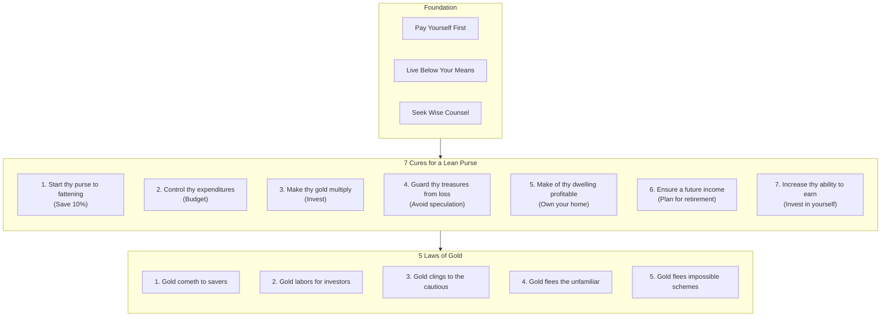
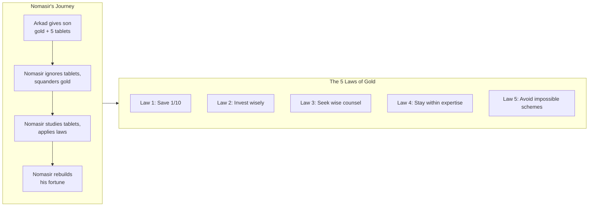
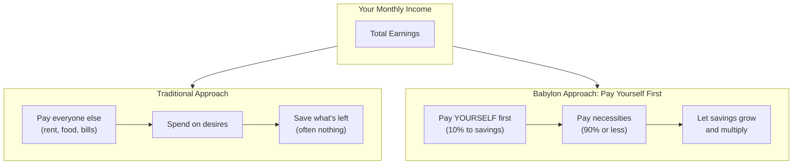

## The Babylonian Way

The parables are set in Babylon, 4,000 years ago — the wealthiest city of
the ancient world. Through the character of Arkad, a poor scribe who became
the richest man in Babylon, Clason delivers financial wisdom in narrative
form. The book never lectures. It tells stories.

---

## The Seven Cures

### Cure 1: Start Thy Purse to Fattening

Arkad's first and most famous principle: for every ten coins you earn,
spend only nine. The tenth is yours to keep. This is not optional — it is
the non-negotiable foundation.

> A part of all you earn is yours to keep.

Most people treat their earnings as belonging to everyone else — the
grocer, the landlord, the clothier. Arkad says: you are a slave if all
your earnings go to others. The moment you keep a tenth for yourself, you
begin the journey from slave to master.

**Modern application:** Automate a 10%+ transfer from checking to savings
or investments on payday. Do not wait to see what is left over. Pay
yourself first.

---

### Cure 2: Control Thy Expenditures

The second cure follows logically: having saved 10%, you must live on the
remaining 90%. This requires distinguishing necessities from desires.

> What each of us calls our 'necessary expenses' will always grow to equal
> our incomes unless we protest to the contrary.

Humans naturally expand spending as income rises. Clason calls this the
great enemy of wealth. The solution is a budget — not a restriction, but a
plan. Decide in advance where your 90% goes. Do not let the landlord and
grocer decide for you.

**Modern application:** Track spending for 30 days. Categorize every dollar.
Ask of each expense: would a Babylonian sage approve?

---

### Cure 3: Make Thy Gold Multiply

Saving alone does not build wealth. Hoarded gold does nothing. Gold must
be put to work earning more gold.

> The earnings it will make shall build our fortunes. Make it thy slave.
> Make its children and its children's children work for you.

This is the principle of compound growth. Every dollar you invest earns
returns. Those returns earn their own returns. Over time, the compound
effect dwarfs the original principal. Arkad illustrates by pointing out
that a man who invests a tenth of his earnings over many years ends up
with far more than the sum of his contributions.

**Modern application:** Invest savings in low-cost diversified assets
(index funds, bonds, real estate). Reinvest all dividends and interest.
Time is the investor's greatest ally.

---

### Cure 4: Guard Thy Treasures from Loss

The fourth cure is a warning: the same desire to multiply gold can lead to
its destruction.

> The penalty of risk is probable loss.

Arkad advises against get-rich-quick schemes, speculative bets, and
investments that promise impossible returns. Before investing, study the
safety of your principal. Seek advice from those skilled in the handling of
gold. A smaller but safe return is better than losing everything chasing a
larger one.

**Modern application:** Do not invest in anything you do not understand.
Avoid "too good to be true" opportunities. Diversify. Consult a fiduciary.

---

### Cure 5: Make of Thy Dwelling a Profitable Investment

Arkad recommends that every man own the roof that shelters him and his.
Rent is money spent and gone. Mortgage payments build an asset.

> I recommend that every man own the roof that sheltereth him and his.
> Nor is it beyond the ability of any well-intentioned man to own his
> home.

This is the most historically contingent of the seven cures. In Clason's
era, home ownership was a reliable wealth-building path. In modern
markets, it is more complicated — but the principle of converting a basic
expense into an appreciating asset remains sound.

**Modern application:** If you can afford to buy and plan to stay in one
place for 5+ years, buying is generally wealth-positive compared to
renting. But run the numbers for your specific market.

---

### Cure 6: Ensure a Future Income

The sixth cure addresses the most vulnerable period of life: old age.
Every person must prepare for the day when they can no longer work.

> Therefore do I say that it behooves a man to make preparations for a
> suitable income in the days to come, when he is no longer young, and to
> make preparations for his family should he be no longer with them.

Arkad advises building multiple income streams — rental properties, loan
interest, business ownership — that will continue flowing whether or not
you are working. He also advises setting aside funds for one's family.

**Modern application:** Maximize retirement accounts (401k, IRA). Build
passive income streams. Maintain an emergency fund. Buy term life
insurance if others depend on your income.

---

### Cure 7: Increase Thy Ability to Earn

The final cure is the most personal: invest in yourself. Your earning
power is your greatest asset.

> The more of wisdom we know, the more we may earn. That man who seeks to
> learn more of his craft shall be richly rewarded.

A more skilled worker commands higher wages. A wiser investor makes better
decisions. Knowledge compounds just as money does. The person who
continuously learns and grows will always have more opportunity than one
who stagnates.

**Modern application:** Read, take courses, develop skills that increase
your market value. The best investment is often not a stock but a skill.

---

## The Five Laws of Gold

The Five Laws are presented through the story of Kalabab, a camel trader,
who tells a campfire tale about Arkad's son Nomasir. When Nomasir left
home, Arkad gave him a bag of gold and five clay tablets — the Laws of
Gold. Nomasir squandered the gold, then returned to study the tablets.

### Law 1

> Gold cometh gladly and in increasing quantity to any man who will put by
> not less than one-tenth of his earnings to create an estate for his
> future and that of his family.

This restates the First Cure. Saving is the entry requirement for all
wealth building.

### Law 2

> Gold laboreth diligently and contentedly for the wise owner who finds
> for it profitable employment, multiplying even as the flocks of the
> field.

This restates the Third Cure. Idle gold does nothing. Working gold
compounds.

### Law 3

> Gold clingeth to the protection of the cautious owner who invests it
> under the advice of men wise in its handling.

This restates the Fourth Cure. Even a good investment can be ruined by
ignorance. Expert counsel is not weakness — it is wisdom.

### Law 4

> Gold slippeth away from the man who invests it in businesses or purposes
> with which he is not familiar or which are not approved by those skilled
> in its keep.

A direct warning against investing outside your circle of competence. If
you would not buy a horse before learning about horses, do not invest in a
business before learning about that business.

### Law 5

> Gold flees the man who would force it to impossible earnings or who
> followeth the alluring advice of tricksters and schemers or who trusts it
> to his own inexperience and romantic desires in investment.

The final law condemns greed — the desire for "impossible earnings." Such
desire leads people into the arms of schemers. The wish to get rich quick
is the fastest path to losing everything.

---

## Pay Yourself First

The single most famous concept to emerge from the book. It is deceptively
simple and profoundly difficult to practice.

The traditional approach — earn, spend, save what is left — reliably
produces nothing. The Babylon approach — save first, then spend what
remains — reliably produces wealth. The difference is not arithmetic but
psychological. When you prioritize saving, you force yourself to live on
less. When you save what is left, you never save at all.

---

## The Parables in Detail

### The Man Who Desired Gold (Bansir and Kobbi)

Bansir, a chariot builder, and Kobbi, a musician, are friends who work
hard but remain poor. Bansir dreams of owning fine things but has empty
pockets. They decide to visit their childhood friend Arkad, now the
richest man in Babylon, and ask his secret.

Arkad tells them he found the road to wealth when he decided that a part
of all he earned was his to keep. He was once a poor scribe earning copper
coins. He began saving one of every ten. Over time, those savings grew. He
then learned to invest them. The secret was not magic or luck but a
decision and a habit.

### The Gold Lender of Babylon (Rodan and Mathon)

Rodan, a spear maker, receives a windfall of 50 gold pieces from the king.
His sister asks him to lend the money to her husband for a business.
Rodan, unsure, seeks advice from Mathon, a gold lender.

Mathon tells the parable of the ox and the donkey. The ox complains of
hard labor. The donkey advises him to feign illness. The ox does so and
gets rest — but the farmer then puts the donkey to work in the ox's place.
The donkey learns: when you give advice, you may end up carrying the
burden.

Mathon's lesson: before lending, know the borrower's character, their
capacity to repay, and the purpose of the loan. Never lend based on
sentiment.

### The Camel Trader (Kalabab and Nomasir)

Kalabab, a wealthy camel trader, was once a servant to Arkad's son
Nomasir. He tells the campfire story of how Nomasir received the Five Laws
of Gold from his father.

Nomasir, eager and proud, ignored the clay tablets and spent his gold
foolishly. Reduced to poverty, he returned to the tablets, studied them,
and applied their lessons. He slowly rebuilt his fortune. The tablets were
not a map to quick wealth but a guide to lifelong discipline.

### The Clay Tablets of Wisdom

The book's final section presents five ancient clay tablets, supposedly
excavated from Babylon, that contain financial wisdom. Each tablet expands
on one of the seven cures. The device reinforces the book's central claim:
these principles are not new — they are as old as civilization itself.

---

## Key Lessons

- **The habit of saving matters more than the amount saved.** Ten percent
  of a small income, consistently saved, will eventually surpass a large
  income that is entirely consumed.
- **Wealth is not about what you earn but what you keep.** A high earner
  who spends everything is poorer than a low earner who saves diligently.
- **Compound growth is the eighth wonder of the world.** Small amounts,
  invested over long periods, produce astonishing results.
- **Safety of principal comes before yield.** Losing money is worse than
  earning a low return.
- **Wisdom is the best insurance.** Education protects against bad
  investments and lost opportunities better than any policy.
- **Debt is a form of slavery.** The borrower is servant to the lender.
  Freedom requires living on less than you earn.
- **Action without knowledge is dangerous; knowledge without action is
  useless.** Both learning and doing are required.

---

## Practical Applications

### For Saving
- Automate 10%+ of every paycheck into a separate account before any other
  spending. This is a non-negotiable first step.
- Increase your savings rate with every raise. If you earned more in
  Babylon, you would save more. Do the same.

### For Budgeting
- Distinguish needs from wants ruthlessly. The book argues that most
  "necessities" are actually desires we have rationalized.
- If you cannot save 10% of your income, you are spending money on things
  you do not truly need.

### For Investing
- Never invest in anything you do not understand — Law 4.
- Seek advice from people who have already succeeded at what you are
  trying to do — Law 3.
- Be suspicious of any opportunity that promises returns far above the
  market — Law 5.

### For Career
- Invest in your skills. A more capable worker earns more. The Seventh
  Cure is the only one that increases your income at the source.
- Look for opportunities to increase your earning power. The book values
  active income improvement as highly as passive investment.

### For Home
- If you rent, calculate how much you pay over a decade. Consider whether
  buying would convert that expense into equity.
- But do not overextend. The book's cautions about guarding against loss
  apply to housing too.
