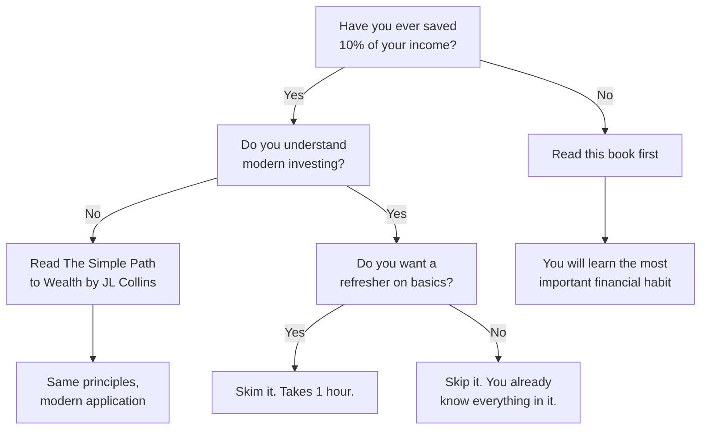

## Introduction

Welcome to BookAtlas. Today: *The Richest Man in Babylon: The Success
Secrets of the Ancients* by George S. Clason. Published 1926. 160 pages.
Never out of print. Nearly a century of continuous readership.

This is the oldest personal finance book that people still actually read.
Not a historical curiosity studied by scholars — a book you will find on
nightstands and Kindle libraries today. Someone you know is reading it
right now.

What makes a 100-year-old finance book still relevant? Let's find out.

---

## The Origin Story

George S. Clason was not a financier. He was a map publisher. In 1926, he
wrote a series of pamphlets for banks and insurance companies to give away
to customers. The pamphlets used parables set in ancient Babylon to teach
basic financial principles. They were so popular that he compiled them
into a book.

Clason's own map company failed during the Great Depression. The man who
wrote the book on wealth preservation lost his business. This is not
discussed in the book, but it matters. It means the book was written by
someone who had seen both success and failure — and chose to emphasize
caution.

The Babylonian setting was not random. Babylon was the wealthiest city of
the ancient world. By setting his parables there, Clason made his advice
feel ancient and proven. Clever trick. It worked.

---

## The Frame Story: Arkad and the Curious Citizens

The book opens in Babylon. Bansir, a chariot builder, sits glumly in his
workshop. He has been building chariots his whole life but has nothing to
show for it. His friend Kobbi, a musician, is in the same position. They
decide to visit their childhood friend Arkad — now the richest man in
Babylon — and demand to know his secret.

Arkad does not get defensive. He gathers a crowd and begins to teach. Over
seven days, he delivers the Seven Cures for a Lean Purse. This is the
basic frame.

Why does this work? Because Bansir and Kobbi are relatable. They work
hard. They are not lazy. They just do not know the rules of the game.
That's the audience. If you have ever wondered why you work hard but stay
broke, Bansir is you.

---

## The First Cure: Pay Yourself First

This is the single most famous piece of financial advice in the English
language.

Arkad says: for every ten coins you earn, spend only nine. The tenth is
yours. Not the grocer's. Not the landlord's. Yours.

He calls this "paying yourself first." It sounds selfish. It is supposed
to. Most people treat their paycheck as belonging to everyone else. They
pay the rent, the utilities, the credit card — and save what is left.
Nothing is left.

Arkad inverts this. Save first. Then pay everyone else with what remains.
It is a small mechanical change with enormous consequences. You find you
can live on 90% just as well as 100%. The 10% accumulates. The
accumulation becomes capital. The capital generates income. The income
generates more capital.

Every single person who has built wealth from nothing started here.

---

## The Second Cure: Control Thy Expenditures

This is the hard one. People will say they *need* things they simply
*want*. Arkad puts it memorably: "What each of us calls our 'necessary
expenses' will always grow to equal our incomes unless we protest to the
contrary."

Lifestyle inflation. You get a raise. Your spending rises to match. You
are no richer than before. The only way out is conscious budgeting — not
deprivation but deliberate choice.

Arkad does not say "live like a monk." He says: spend on what you truly
need and a few things you truly enjoy. But stop pretending every desire is
a necessity.

---

## The Third Cure: Make Thy Gold Multiply

This is the principle of compound growth. Idle gold does nothing. Gold put
to work earns more gold. That gold earns more gold.

Arkad does not use the word "compound" — he uses the metaphor of a slave
army. Your gold is a slave that works for you. Its earnings are its
children. Those children work for you too. A man with many gold-children
never needs to work again.

The modern version: invest in low-cost diversified assets. Let time do the
heavy lifting. The S&P 500 has returned about 10% annually over the long
term. A dollar invested in 1926 — the year this book was published — would
be worth thousands today. That is the Third Cure in action.

---

## The Fourth Cure: Guard Thy Treasures from Loss

Now the warning. The same desire to multiply gold can also destroy it.

Arkad says: "The penalty of risk is probable loss." Do not chase high
returns without understanding the risk. Do not invest in things you do not
understand. Do not take advice from people who are not successful at what
they advise.

This predates Warren Buffett's two rules by fifty years: Rule 1: Never
lose money. Rule 2: Never forget Rule 1.

---

## The Fifth Cure: Own Your Home

Arkad says: buy the roof over your head. Rent is money spent and gone. A
mortgage builds equity. Over time, you own an asset instead of having only
receipts.

This advice has aged less well than the others. In some markets, renting
is financially superior. The principle — convert a basic expense into an
asset — is still sound. But the specific advice to buy a home regardless
of circumstances is too broad.

Still: the core idea is worth keeping. If you pay rent for thirty years,
you have nothing. If you pay a mortgage for thirty years, you have a
house. That difference matters.

---

## The Sixth Cure: Insure a Future Income

Plan for the day you cannot work. Build income streams that will continue
without your labor. Provide for your family if you die early.

Arkad is talking about retirement planning and life insurance — before
either was common. The specific products have changed. The principle has
not. Every working person must prepare for the future. The young think
they have time. They do. That is exactly when they should start.

---

## The Seventh Cure: Increase Thy Ability to Earn

This is the most personal cure and the easiest to ignore.

Arkad says: your earning power is your greatest asset. Invest in yourself.
Learn more. Become more skilled. A more capable person earns more.

This is not about working harder. It is about working smarter — acquiring
wisdom, developing expertise, becoming someone who can command higher pay
and better opportunities.

People spend hours researching a $50 stock purchase but zero hours
improving their own earning potential. Arkad says: you are your own best
investment.

---

## The Five Laws of Gold

After the Seven Cures, the book presents the Five Laws through the story
of Kalabab, a camel trader, and Nomasir, Arkad's son.

Nomasir received a bag of gold and five clay tablets from his father. He
ignored the tablets and squandered the gold. Destitute, he returned to the
tablets, studied them, rebuilt his fortune. The message is obvious: the
knowledge matters more than the money.

The Five Laws are:

One: Gold comes to those who save. Same as Cure 1.

Two: Gold multiplies for those who invest it wisely. Same as Cure 3.

Three: Gold stays with those who seek wise counsel. Same as Cure 4.

Four: Gold leaves those who invest in unfamiliar things. A new warning.

Five: Gold flees from those who chase impossible returns. Another warning.

Laws 4 and 5 are the real contribution here. They are warnings about
greed and ignorance — the two forces that destroy more wealth than any
market crash.

---

## The Parable of the Gold Lender

One of the book's best stories. Rodan, a spear maker, receives a bonus of
fifty gold pieces from the king. His sister asks him to lend the money to
her husband. Rodan goes to Mathon, a gold lender, for advice.

Mathon tells the story of the ox and the donkey. The ox complains of hard
labor. The donkey advises him to pretend to be sick. The ox does so. The
farmer puts the donkey to work in the ox's place. The donkey learns: when
you give advice, you may end up carrying the burden.

Mathon's point: lending money to friends and family is dangerous. Before
lending, ask: does the borrower have a track record of repayment? Do they
have a plan? Can they actually pay you back? If the answer to any of these
is unclear, the answer to "should I lend?" is no.

This is still the best advice about lending to family ever written.

---

## What the Book Gets Wrong

Let us be fair to critics.

The book has no investment strategy. It predates stocks, bonds, mutual
funds, index funds, and retirement accounts. A reader who only reads this
book will not know what to actually do with their money.

The home ownership advice is outdated. In 1926, homes were affordable. In
many markets today, buying is not clearly better than renting.

The book is repetitive. The Seven Cures and Five Laws overlap
significantly. The same ideas appear in multiple parables. You could read
three chapters and get the whole book.

The Babylonian framing is charming but unnecessary. The advice would be
the same without the archaic language and ancient setting. Some readers
find the "thee" and "thou" tiresome.

And most importantly: the book treats financial success as entirely a
matter of personal virtue. Save, work hard, be disciplined — and you will
succeed. This ignores systemic barriers, economic shocks, and plain bad
luck.

But here is the thing: the book is not wrong. It is incomplete. Saving
10% of your income is not sufficient for wealth, but it is necessary. You
cannot build wealth without it. The book tells you the first step. Then
you must read other books for the rest.

---

## The Verdict

The Richest Man in Babylon is the best *first* finance book ever written.
It is not the best finance book. It is not the only finance book you will
ever need. But it is the best place to begin.

It will teach you a single habit — saving 10% of everything you earn —
that matters more than any investment strategy, any portfolio allocation,
any tax optimization. Everything else in personal finance depends on that
habit. Without it, nothing else works.

Read it in one sitting. Then put it down and read JL Collins or Ramit
Sethi to learn what to do with the money you have saved.

---

## Final Thoughts

There is a reason this book has survived for a century. It is not because
Clason was a brilliant financial theorist. He was not. It is because he
found the single most important financial truth — a part of all you earn
is yours to keep — and told it in a story that anyone can remember.

The book is simple. Almost embarrassingly simple. But the most important
things often are. You do not need complex strategies to build wealth. You
need one decision, made daily: save first, spend later.

That is the whole book. That is the whole secret. That is why it is still
in print.

This has been a BookAtlas narration of *The Richest Man in Babylon* by
George S. Clason. Thanks for listening.
