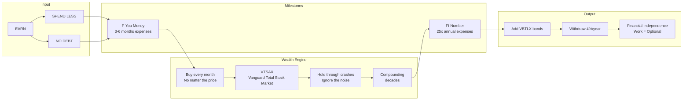
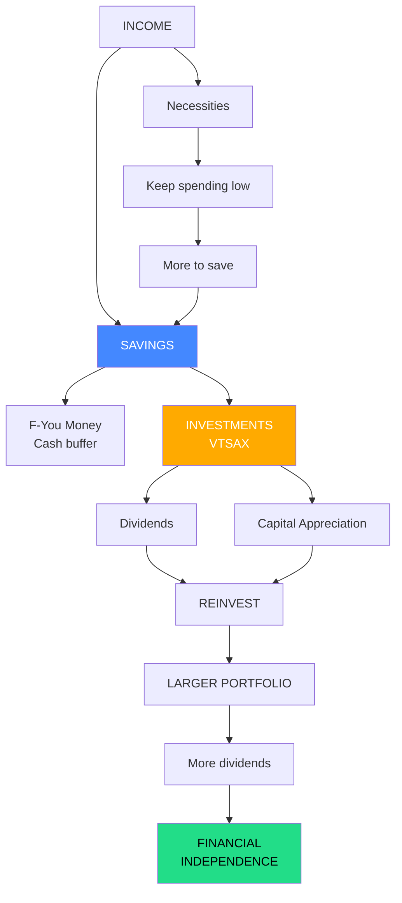
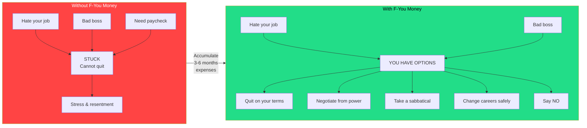
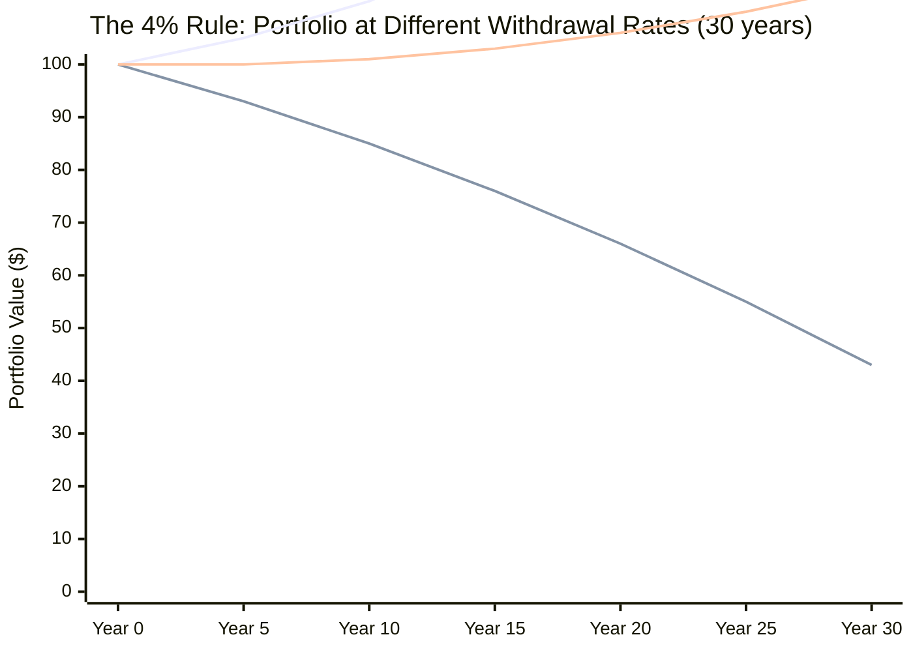
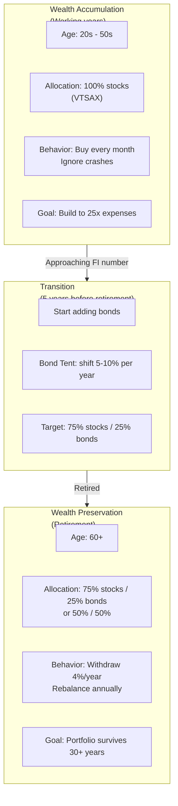
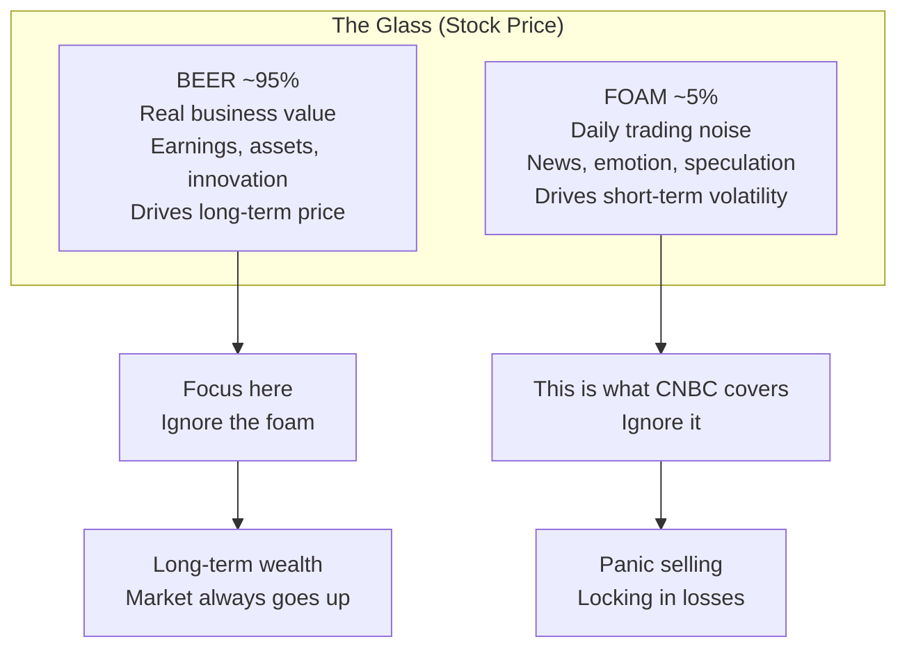
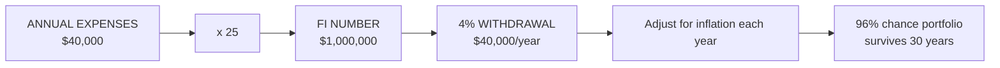

## Mermaid Diagrams

### The Simple Path — Detailed Flowchart

### The Wealth Building Cycle

### F-You Money Concept

### 4% Rule Visualization

### Asset Allocation by Life Stage

---

## Chapter Breakdown

Part I — The Philosophy: Why Financial Independence Matters

The opening establishes the most important concept of the book:
**F-You Money**. Collins recounts his own journey to financial
independence and why "enough money to walk away" changes everything
about how you live. The goal is not luxury or status — it is freedom.
He introduces the simple three-step formula that the rest of the book
unpacks: spend less than you earn, avoid debt, invest the surplus in
low-cost index funds. This section also covers why the financial industry
works against you and why you cannot trust financial advisors to act in
your best interest.

Chapter 1 — The Market and You

Collins explains his "beer and foam" metaphor for the stock market. The
beer is the underlying value of businesses — productive assets that make
money, innovate, and grow. The foam is the daily price volatility driven
by traders, news, and emotion. Over the long term, only the beer matters.
The market has risen 11.9% per year on average since the 1950s with
dividends reinvested. Over any 20-year period in history, stocks have
produced positive returns. Collins argues that the stock market is the
most effective wealth-building tool ever created, and your money should
be in it working for you as soon as possible.

Chapter 2 — The Nature of the Beast

A deeper look at market volatility. Crashes (drops of 20% or more) happen
about every 25 years. Corrections (10% drops) happen every few years.
Bull markets follow every crash. Collins emphasizes that these downturns
are not bugs — they are features. They are the price of admission for the
long-term returns that equities deliver. The worst thing you can do is
panic-sell during a crash, which "locks in" losses and causes you to miss
the recovery. The key is mental discipline: accept volatility as normal,
ignore the news, and keep buying.

Chapter 3 — How the Market Works

A primer on stocks, bonds, and how securities markets function. Collins
explains initial public offerings, dividends, earnings, and why share
prices move. He distinguishes between the primary market (companies
issuing new shares) and the secondary market (investors trading existing
shares). This chapter establishes the foundational knowledge needed to
understand why index funds work — you do not need to pick winning stocks
when you can own all of them.

Chapter 4 — The Role of Bonds

Bonds are introduced as the stabilizing force in a portfolio. Collins
explains what bonds are, how they generate income, and why they are less
volatile than stocks. He recommends VBTLX (Vanguard Total Bond Market
Index Fund) for its diversification across ~8,000 US bonds. The key
insight: during the wealth accumulation phase, bonds are unnecessary
because you have decades to recover from downturns. During the wealth
preservation phase (retirement), bonds protect you from
sequence-of-returns risk — the danger of selling stocks during a
downturn to fund living expenses.

Chapter 5 — The Power of Index Funds

This is the heart of the book. Collins makes the case that index funds
are superior to actively managed funds for three reasons: lower fees,
broader diversification, and the mathematical impossibility of most
active managers beating the market consistently. He cites the SPIVA
study showing that 82% of actively managed funds underperform their
benchmark over 15 years. He recommends VTSAX (Vanguard Total Stock
Market Index Fund, expense ratio 0.04%) as the single fund that owns
the entire US stock market. For those who cannot access VTSAX, he
recommends VTI (the ETF equivalent) or any low-cost S&P 500 index fund.

Chapter 6 — The Two Portfolios: Wealth Accumulation and Wealth Preservation

Collins introduces the two phases of the investing lifecycle. In the
accumulation phase (working years), the portfolio is 100% stocks — all
VTSAX. No bonds. No international. No real estate. Just the total US
stock market. Regular contributions are automated, and the investor
ignores all market noise. In the preservation phase (retirement), the
portfolio shifts to 75% stocks / 25% bonds, using VBTLX for the bond
portion. The transition happens when your portfolio reaches ~25x your
annual expenses. Collins explains the "bond tent" — increasing bond
allocation in the 5 years before and after retirement to protect against
a market crash at the worst possible time.

Chapter 7 — The 4% Rule: How Much Do You Need?

Collins explains the Trinity Study (1998), which tested withdrawal rates
across different stock/bond allocations over every 30-year period in US
history. The finding: a 4% initial withdrawal rate, adjusted for inflation,
survived 96% of historical scenarios. This means your FI number is 25x
your annual expenses. If you spend $40,000/year, you need $1,000,000.
Collins provides practical guidance on adjusting the rate for different
risk tolerances — 3% for conservative, 5% for aggressive. He also
addresses common objections: what if future returns are lower? What about
healthcare costs? His answer: flexibility is the key. You do not have to
spend exactly 4% every year. Cut back during downturns.

Chapter 8 — Where to Invest: The Accounts

A guide to US tax-advantaged accounts: 401(k), 403(b), TSP, Traditional
IRA, and Roth IRA. Collins explains the tax mechanics of each, when to
prioritize one over another, and the importance of the employer match
(free money). He recommends contributing enough to capture the full
employer match first, then maxing out a Roth IRA, then returning to the
401(k). The order matters because of tax treatment and flexibility.

Chapter 9 — Social Security and Other Safety Nets

Collins is skeptical about Social Security's future for younger readers.
He advises planning as if you will receive nothing, then being pleasantly
surprised if you do. He also covers disability insurance, life insurance,
and why term life insurance is usually the right choice over whole life.
The message: build your own safety net through savings and investments
rather than relying on government programs or expensive insurance products.

Chapter 10 — The Psychology of Investing

Collins addresses the emotional challenges of following his plan. The
hardest part is not the math — it is staying the course when everyone
around you is panicking. He covers recency bias (assuming recent trends
will continue), loss aversion (the pain of losses exceeding the pleasure
of gains), and the danger of checking your portfolio too often. His
advice: automate everything so you do not have to make emotional
decisions. Set up automatic monthly investments and do not look at your
account more than once per quarter.

Chapter 11 — On Debt

Collins's most passionate chapter. He argues that debt is the single
biggest obstacle to building wealth. Consumer debt (credit cards, car
loans, personal loans) is catastrophic — interest rates of 15-25% make
it impossible to get ahead. Even "good debt" (student loans, mortgages)
should be minimized. He advises paying off all debt above 4-5% interest
before investing. For mortgages, he recommends the least house you need
rather than the most house you can afford. His motto: "Carrying debt is
as appealing as being covered with leeches and has much the same effect."

Chapter 12 — Real Estate and Other Alternatives

Collins devotes a single chapter to real estate and dismisses it as
unnecessary complexity. He acknowledges that real estate investing can
work but argues that it requires active management, carries concentration
risk, and has no structural advantage over index funds when you account
for the effort involved. He briefly discusses REITs as a passive real
estate alternative but does not recommend them over VTSAX. This chapter
is often criticized as the book's weakest — Collins does not engage with
the leverage, tax benefits, or inflation-hedging properties of real
estate.

Chapter 13 — How to Start: A Simple Action Plan

A practical step-by-step guide:
1. Open a Vanguard account (or equivalent low-cost broker)
2. Choose your allocation: 100% VTSAX during accumulation
3. Set up automatic monthly contributions
4. Maximize your 401(k) to get the employer match
5. Pay off all high-interest debt
6. Build your F-You Money cash buffer
7. Ignore the noise and stay the course
Collins emphasizes that the first step is the hardest and that
automation removes emotion from the process.

Chapter 14 — Q&A: Common Objections

Collins answers the most frequent questions from his blog readers: What
if I am starting late? What if the market crashes right after I retire?
What about international diversification? Should I use dollar-cost
averaging or invest a lump sum? His answers are direct: start now anyway,
use the bond tent for crash protection, US companies are global enough,
and lump sum beats dollar-cost averaging in two-thirds of historical
periods.

Chapter 15 — Final Words to My Daughter

The book closes with Collins addressing his daughter directly, tying
together all the lessons into a personal message. He reiterates that
money is a tool, not an end in itself. The goal is a rich, free life —
which means different things to different people. He encourages her to
travel, take risks, and live fully once the financial foundation is in
place. This chapter gives the entire book its emotional resonance: this
is not abstract financial advice. It is a father's love letter to his
daughter, sharing what he learned over a lifetime so she could avoid his
mistakes.

---

## Key Concepts Explained

### The Beer and Foam Metaphor

Collins's central metaphor for understanding the stock market:

Collins argues that the foam (daily price fluctuations) gets all the media
attention, but it is the beer (underlying business performance) that
compounds wealth over decades. The more attention you pay to price
volatility, the worse your investment results are likely to be.

### F-You Money vs. Emergency Fund

| Aspect | Emergency Fund | F-You Money |
|---|---|---|
| Purpose | Survive unexpected expenses | Buy your freedom |
| Size | 3-6 months of expenses | 3-6 months of expenses |
| Psychology | Fear-based: "What if something bad happens?" | Power-based: "What choice would I make?" |
| When to use | Job loss, medical bill, car repair | Toxic boss, bad job, want a break |
| Mental effect | Reduces anxiety | Gives confidence and leverage |

### The Two Portfolios Framework

| Phase | Allocation | Duration | Behavior |
|---|---|---|---|
| Wealth Accumulation | 100% VTSAX (stocks) | 10-40 years | Buy every month, ignore crashes, reinvest dividends |
| Wealth Preservation | 75% VTSAX / 25% VBTLX | 30+ years | Withdraw 4%/year, rebalance annually, maintain bond tent |

### The 4% Rule: How the Math Works

Collins's FI formula:
- **Annual expenses** x 25 = Your FI number
- Example: $40,000/year → need $1,000,000
- At 4% withdrawal = $40,000 year one, adjusted for inflation each year
- At 7% average market return, the portfolio continues growing

---

## Principles

1. **F-You Money first.** Save 3-6 months of expenses before investing a
   dime. This money buys you freedom, not just security.

2. **One fund is enough.** VTSAX owns the entire US stock market. You do
   not need international stocks, REITs, small-cap value, or any other
   tilts. Complexity is the enemy of execution.

3. **Ignore the foam.** Daily price movements are noise. The underlying
   businesses are what drive long-term returns. Checking your portfolio
   less often improves your returns.

4. **Debt is a leech.** Pay off all debt above 4-5% interest before
   investing. Consumer debt at 20%+ interest makes investing futile.

5. **You are the most important factor.** Your savings rate, your
   discipline during crashes, and your time horizon matter infinitely
   more than your investment choices.

6. **Do not pay for advice.** Financial advisors charge fees that
   compound against you. By the time you can select a good one, you
   already know enough to do it yourself.

7. **Stay the course.** The market will crash. It will recover. It will
   crash again. It will recover again. Staying invested through all of
   it is the only strategy that has ever worked.

---

## Real World Examples

**Collins himself:** Invested since 1975. Built his F-You Money,
eventually left corporate life, started a blog for his daughter, and
accidentally became the Godfather of FI. He maintains an 80/15/5 split
(stocks/bonds/cash) even in his 70s — more aggressive than conventional
advice, but he has the discipline to hold.

**The Trinity Study (1998):** Three professors tested withdrawal rates
across 50/50, 75/25, and 100% stock portfolios over every 30-year period
from 1926. The 4% rate survived every scenario except the worst (the
1929 retiree). Later research (Bengen, Pfau) has confirmed the rule
holds with modifications.

**Warren Buffett's bet on index funds:** In 2008, Buffett bet $1 million
that a simple S&P 500 index fund would outperform a basket of hedge
funds over 10 years. He won. The index fund returned 7.1% compounded
annually; the hedge funds returned 2.2%. This validates Collins's central
thesis: low-cost index investing beats active management.

**The lost decade (2000-2009):** The S&P 500 returned ~0% over this
period. An investor who panic-sold in 2008-2009 locked in losses. An
investor who kept buying through the crash saw their portfolio soar
during the 2010s bull market. Staying the course during the painful
decade was the difference.
