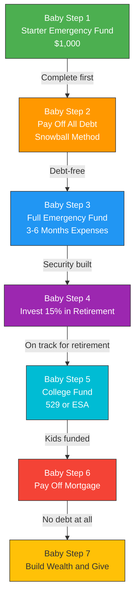
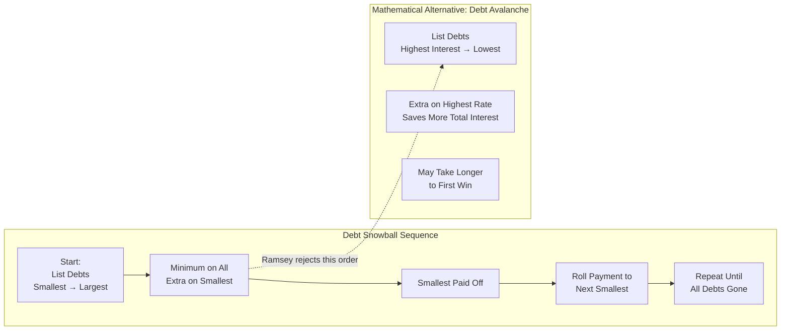
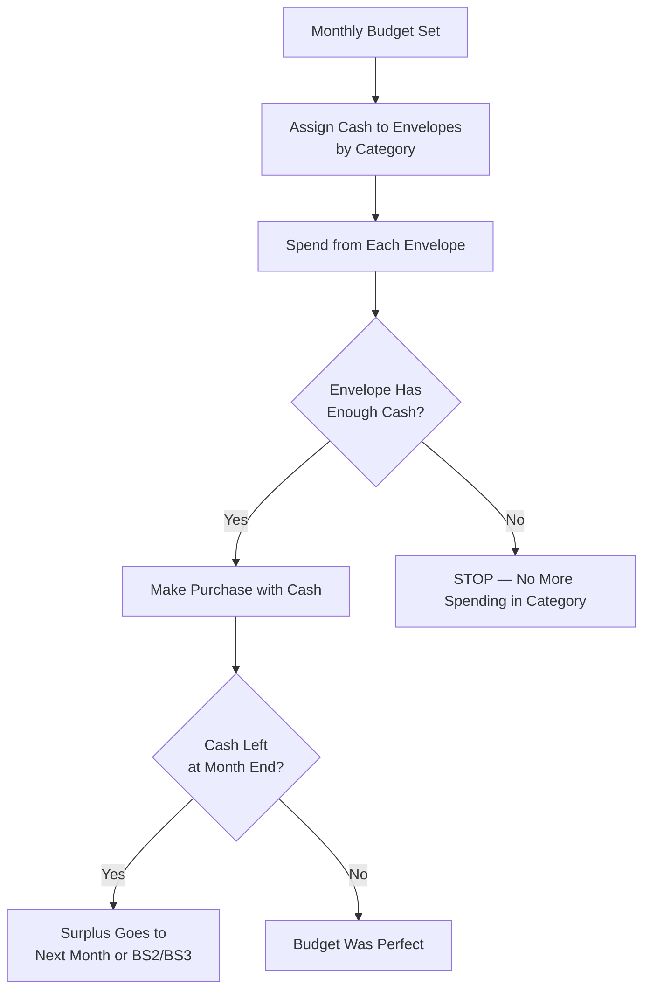
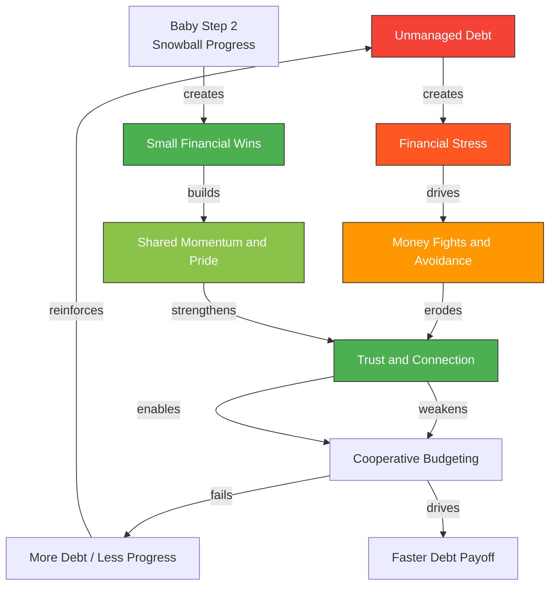

Ramsey's framework is built on two pillars: a **sequential ladder** (the 7
Baby Steps) and a **behavioral engine** (the debt snowball, envelope system,
and gazelle intensity). Both are designed to overcome the emotional
barriers — shame, overwhelm, and false hope — that keep people trapped in
debt cycles.

---

## The 7 Baby Steps: A Progression Ladder

The Baby Steps are a deliberately sequential plan. You cannot skip steps
forward. You also cannot save for retirement (Step 4) while carrying
$15,000 in credit card debt. Momentum is the design constraint.

### Quick Reference: Each Step in Detail

| Step | What | Why This Order |
|------|------|----------------|
| **BS1** | Save $1,000 as fast as possible | Creates a buffer so no new debt is created when life breaks |
| **BS2** | Pay off all debt except mortgage | Debt payments are a tax on your future. Eliminating them frees cash for everything else |
| **BS3** | Save 3–6 months of expenses | Full insulation against job loss, medical bills, major repairs |
| **BS4** | 15% into retirement accounts | Compound interest works in your favor only if you have no monthly debt payments dragging you back |
| **BS5** | Fund college (optional) | Education is valuable, but never at the expense of your own retirement security |
| **BS6** | Pay off the home mortgage | The final consumer debt. Every extra payment is a guaranteed, risk-free return on investment |
| **BS7** | Build wealth with no restrictions and give generously | Now money has no masters. The goal is stewardship, not accumulation |

---

## The Debt Snowball Method: Behavioral Debt Elimination

The **debt snowball** is Ramsey's most debated and most empirically
effective tool. The method:

1. List all debts from smallest balance to largest balance.
2. Make minimum payments on everything except the smallest.
3. Throw every available extra dollar at the smallest debt.
4. When it is gone, redirect its full payment to the next smallest.
5. Repeat until all debts are eliminated.

### Why Smallest First, Not Highest Interest?

The debt avalanche saves money mathematically. Ramsey embraces the snowball
for behavioral reasons:

- **Motivation is finite.** If the highest-interest debt also has the largest
  balance, it might take 18 months to close it. Many people quit before
  seeing their first zero. The snowball guarantees a win every few months,
  building belief.
- **Winning breeds winning.** Each closed account creates a psychological
  shift: "I am the kind of person who gets rid of debt." Identity change
  sustains the next round.
- **Emotional ROI > financial ROI.** The extra interest paid fighting a
  large, high-rate debt first is a small cost compared to the catastrophic
  cost of dropping out of the program entirely.

Ramsey's data — from over a decade of *The Ramsey Show* callers — shows
snowball completers outperform avalanche starters on completion rates, even
though the avalanche is mathematically superior on paper.

---

## The Envelope System: Restoring Friction to Spending

Credit cards remove the pain of paying. A swipe feels free. The **envelope
system** forces you to feel the cost of every decision before you make it.

### Envelope Categories (Common Examples)

| Category | Example Allocation | Rationale |
|----------|-------------------|-----------|
| Groceries | $600–$900/mo | Frequent, controllable, variable |
| Gas | $150–$250/mo | Necessary but finite |
| Entertainment | $50–$150/mo | Discretionary — easiest to cut |
| Eating Out | $0–$100/mo | High leakage category for many households |
| Clothing | $30–$100/mo | Planned purchases only |
| Medical/Personal | $75–$200/mo | Irregular but predictable |
| Gifts | $20–$50/mo | Planned generosity, not impulse |

### Envelope Rules

- **Rule 1:** When an envelope hits zero, you stop spending in that category
  for the month. No borrowing from next month.
- **Rule 2:** Cash does not carry over indefinitely. If you consistently
  have surplus in a category, your budget is too high — reallocate.
- **Rule 3:** Irregular expenses (car registration, holidays, insurance
  premiums) get their own envelope funded monthly from income.
- **Rule 4:** The envelope system requires a written budget before the month
  begins. You cannot manage what you have not named.

---

## Gazelle Intensity: The Speed Mindset

Ramsey borrows from the Old Testament story of Israel's Exodus: when God
told Moses to flee Egypt, the Israelites did not meander. They traveled with
urgent speed — like gazelles fleeing a cheetah.

**Gazelle intensity** means attacking your financial turnaround with unusual
focus and speed. It is not the default American approach to debt, which is
typically measured in decades. Ramsey argues that:

- A 2-year intense payoff beats a 10-year comfortable minimum-payment plan
- Lifestyle cuts are temporary — freedom is permanent
- The emotional cost of remaining in debt is far higher than the sacrifice
  required to escape it
- A focused household can accomplish in 24 months what a scattered
  household takes 10 years to achieve

Gazelle intensity is not sustainable forever. It is a sprint to a finish
line — the debt-free scream — after which the lifestyle stabilizes.

---

## The Relationship Cycle: Debt, Stress, and Marriage

Ramsey is unusually candid about the relational cost of financial stress.
His argument: money fights are rarely about money. They are about control,
trust, and fear — and debt amplifies all three.

Ramsey's prescription for couples: do a budget together, every month, before
the month begins. The "budget meeting" becomes a weekly conversation, not
a monthly fight. When both spouses own the plan, the accountability is
shared — and the snowball rolls faster.

---

## Why People Stay in Debt: The Emotional Barriers

Ramsey identifies the emotional patterns that keep people trapped despite
knowing better:

| Barrier | Description | Ramsey's Cure |
|---------|-------------|---------------|
| **Denial** | "It's not that bad" | Count every dollar. Face the total. |
| **Shame** | "I'm a failure with money" | Baby Steps are sequential, not judgmental. Everyone starts at BS1. |
| **False Hope** | "I'll get a raise / windfall" | Stop waiting. Act on current income. |
| **Comfort** | "Life is too short to be miserable" | Temporary sacrifice for permanent freedom. Comfort today costs more than discipline tomorrow. |
| **Peer Comparison** | "Everyone has a car payment" | Stop watching the Joneses. They are broke too. |
| **Impatience** | "Snowball will take too long" | Gazelle intensity. 24 months of intensity beats 10 years of minimum payments. |
| **Identity** | "I'm just bad with money" | Every action is a vote for who you want to become. Paying off debt is how you become a new person. |

---

## The Role of Income: Earning More vs. Spending Less

Ramsey insists that both are necessary, but the book often emphasizes
spending cuts as the primary lever. This becomes a structural limitation
for low-income households.

| Strategy | How It Helps | Limitation |
|----------|-------------|------------|
| **Cut expenses** | Frees up the margin for snowball payments | Has a floor — you cannot cut below zero |
| **Increase income** | Expands the margin linearly | Requires skills, opportunities, or willingness to take on more work |
| **Both together** | Maximum acceleration of BS2 completion | Combined effort needed for fastest results |

Ramsey's position: "You can live like no one else now, or you can live
like no one else later." His framework assumes agency to earn more, which
is not equally available to all households. He does address this in
Financial Peace University, but *The Total Money Makeover* itself stays
within the agency-respecting paradigm.

---

## Financial Peace: What Does It Actually Feel Like?

Ramsey defines **financial peace** not as wealth — it is not about having
a lot of money — but as the absence of anxiety about money. Characteristics
of a financially peaceful person:

- They sleep through the night without financial worry
- They can say "no" to purchases without guilt
- They give generously without calculation
- They are not controlled by the calendar (Bills Due) or the mailbox
  (Collection Letters)
- Their identity is not tied to their possessions or income level
- They have options — real options — for how to spend their time

This reorientation from accumulation to freedom is the book's emotional
core. Ramsey is not selling luxury. He is selling quiet.

---

## Comparing the Baby Steps to Traditional Financial Planning

Conventional financial planning often starts with investment allocation
before debt is resolved. Ramsey inverts this: security first, growth last.

| Traditional Approach | Ramsey's Baby Steps Approach |
|---------------------|------------------------------|
| Invest early, carry low-interest debt | Eliminate all non-mortgage debt before serious investing |
| Focus on net worth growth rate | Focus on sequential behavior completion |
| Diversification, asset allocation | Cash, then debt-free, then simple index funds |
| Debt as a tool (mortgage, student loans) | Debt as a risk to be eliminated |
| Long-term compound growth | Short-term behavioral wins that unlock long-term growth |
| Math-optimal (avalanche) | Behavior-optimal (snowball) |

The result: Ramsey's plan is slower on paper in early years but produces
a household that is structurally incapable of regressing into debt —
because the psychological and behavioral infrastructure of debt-free living
has been built before investing really begins.
