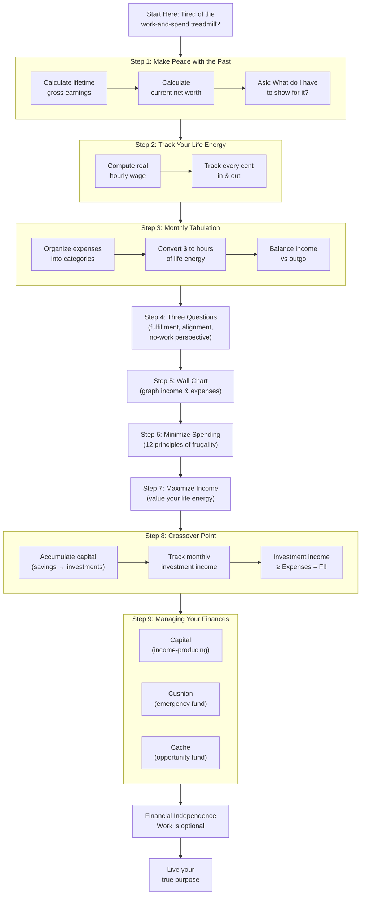
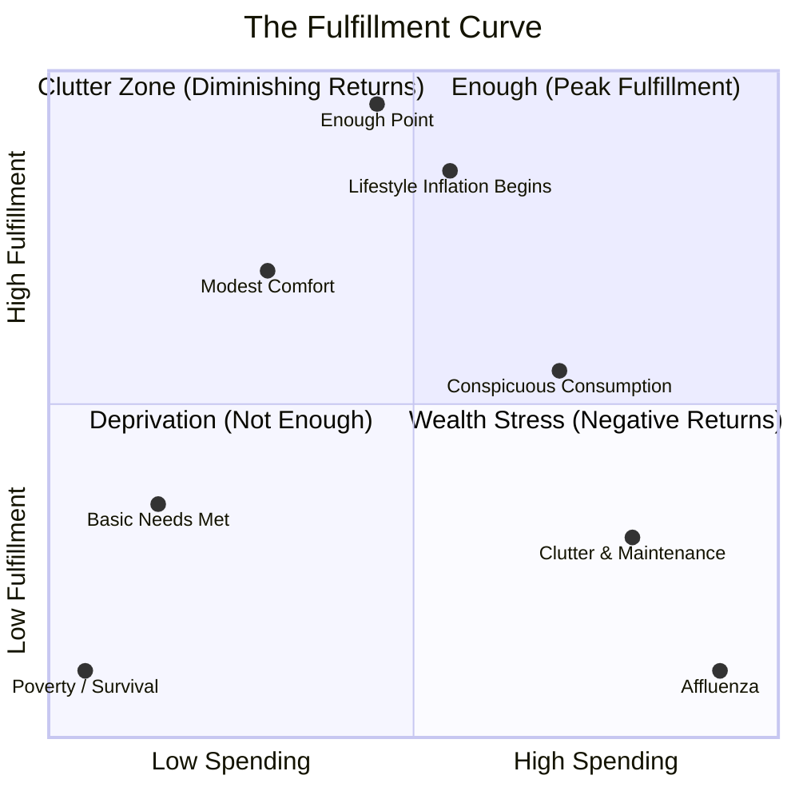
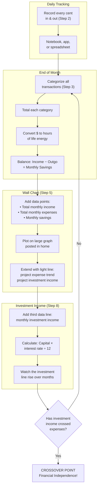

## Mermaid Diagrams

### The 9-Step Program — Complete Flowchart



---

### The Real Hourly Wage Calculation

```mermaid
flowchart LR
    subgraph Nominal["Nominal Wage"]
        Nom1["Gross Salary: $1,000/week"]
        Nom2["Hours at work: 40"]
        Nom3["Nominal rate: $25/hour"]
    end

    subgraph Deductions["Deduct Job Costs ($)"]
        D1["Commuting: −$60"]
        D2["Work clothes: −$25"]
        D3["Work meals: −$40"]
        D4["Decompression spending: −$35"]
        D5["Escape entertainment: −$30"]
        D6["Job-related illness: −$20"]
        D7["Vacation from work: −$40"]
    end

    subgraph Additions["Add Job Time (hours)"]
        T1["Commuting: +7.5 hrs"]
        T2["Dressing/prepping: +2 hrs"]
        T3["Work meals/breaks: +5 hrs"]
        T4["Decompression: +5 hrs"]
        T5["Escape entertainment: +5 hrs"]
        T6["Vacation time: +5 hrs"]
        T7["Illness/recovery: +2 hrs"]
    end

    Nominal --> Deductions
    Nominal --> Additions
    Deductions --> Real["Real weekly income: $750"]
    Additions --> RealTotal["Real weekly hours: 71.5"]
    Real --> Calc["÷"]
    RealTotal --> Calc
    Calc --> Result["Real Hourly Wage: $10.50/hr<br/>(vs nominal $25/hr)"]
```



The table below illustrates the transformation for a typical salaried
professional earning a nominal $25/hour:

| | Hours/Week | Dollars/Week | $/Hour |
|---|---|---|---|
| **Nominal (before adjustments)** | 40 | $1,000 | $25.00 |
| Commuting | +7.5 | −$60 | |
| Work costuming | +2.0 | −$25 | |
| Work meals | +5.0 | −$40 | |
| Decompression at home | +5.0 | −$35 | |
| Escape entertainment | +5.0 | −$30 | |
| Job-related illness | +2.0 | −$20 | |
| Vacation from work stress | +5.0 | −$40 | |
| **Adjusted total** | **71.5** | **$750** | **$10.50** |

Every $10 purchase now represents **one hour of life** — not 24 minutes.
A $50 dinner out costs **nearly 5 hours**. A $40,000 car costs **3,810 hours
— nearly 2 years of full-time life energy** at the real hourly wage.

---

### The Fulfillment Curve



The Fulfillment Curve is the book's most important conceptual contribution
to the conversation about money and happiness:

- **Left section (Deprivation):** Not enough money for basic needs.
  Every additional dollar produces large gains in fulfillment.
- **Peak (Enough):** All genuine needs met, comfortable, secure.
  The optimal point — maximum fulfillment per dollar.
- **Right descending (Clutter):** Beyond enough, more spending produces
  diminishing returns. Things require maintenance, storage, insurance,
  anxiety.
- **Far right (Affluenza):** Active negative returns. Wealth becomes a
  burden — managing it, protecting it, worrying about it. More money
  produces *less* happiness.

The book's central question: **What is your enough?**

---

### The Crossover Point

```mermaid
xyChart
    title The Crossover Point — Financial Independence
    x-axis "Time (Years)" --> 20
    y-axis "Monthly Amount ($)" 0 --> 10000
    line [5000, 4900, 4800, 4700, 4600, 4500, 4400, 4300, 4200, 4100, 4000, 3900, 3800, 3700, 3600, 3500, 3400, 3300, 3200, 3100]
    line [0, 100, 250, 450, 700, 1000, 1350, 1750, 2200, 2700, 3100, 3600, 4100, 4650, 5200, 5800, 6500, 7200, 8000, 8900]
```

| Year | Monthly Expenses | Monthly Investment Income | Gap |
|------|-----------------|--------------------------|-----|
| 0 | $5,000 | $0 | −$5,000 |
| 2 | $4,800 | $250 | −$4,550 |
| 4 | $4,600 | $700 | −$3,900 |
| 6 | $4,400 | $1,350 | −$3,050 |
| 8 | $4,200 | $2,200 | −$2,000 |
| 10 | $4,000 | $3,100 | −$900 |
| **11** | **$3,900** | **$3,600** | **−$300** |
| **~12** | **~$3,800** | **~$3,850** | **~+$50 ← Crossover!** |
| 14 | $3,600 | $5,200 | +$1,600 |
| 16 | $3,400 | $6,500 | +$3,100 |
| 18 | $3,200 | $8,000 | +$4,800 |
| 20 | $3,000 | $8,900 | +$5,900 |

The Crossover Point is the moment when the **monthly investment income
line crosses above the monthly expenses line**. At this point, you are
financially independent — you no longer need to trade life energy for
money. Work becomes optional.

The formula used in Step 8:

> **Monthly Investment Income = Total Capital × (Current Long-Term
> Interest Rate ÷ 12)**

Example: $300,000 capital × (5% ÷ 12) = $1,250/month.

---

### The Wall Chart — Monthly Tracking System



---

## Deep Per-Step Coverage

### Step 1: Make Peace with the Past

Calculate the total gross income you have earned in your lifetime. Go back
to your first paycheck. Add it all up. Then calculate your net worth:
everything you own minus everything you owe. Compare the two numbers.

The gap between lifetime earnings and current net worth represents the
life energy you have spent — not just on things, but on debt interest,
fees, depreciation, and waste. This exercise is designed to produce a
visceral, not just intellectual, understanding of where your energy went.

**Key insight:** Most people discover they have earned far more than they
imagined and have far less to show for it than they expected.

---

### Step 2: Track Your Life Energy

Two-part exercise:

**Part A — Real Hourly Wage:** Add all job-related time (commute, prep,
decompression, etc.) to your nominal hours. Subtract all job-related costs
(commuting, clothes, meals, decompression spending, etc.) from your
nominal pay. Divide the adjusted pay by the adjusted hours. The result is
your true hourly wage — what you actually trade one hour of finite life
for.

**Part B — Complete Tracking:** Record every cent that enters or leaves
your life. Every coffee, every bill, every paycheck. The tracking itself
is the intervention — it creates awareness that automatically moderates
spending. No judgment, just observation.

---

### Step 3: Monthly Tabulation

Organize tracked expenses into personalized categories (not generic budget
buckets). Total each category. Balance income against outgo. Then convert
every dollar figure into hours of life energy by dividing by your real
hourly wage.

**Example:** If your real hourly wage is $10.50, a $210 restaurant
category means you spent 20 hours of your life eating out that month.
This reframing makes abstract dollars viscerally real.

---

### Step 4: Three Questions

For every expense category on your monthly tabulation, ask:

1. **Fulfillment:** Did I receive fulfillment, satisfaction, and value in
   proportion to the life energy I spent?
2. **Alignment:** Is this expenditure of life energy in alignment with my
   values and life purpose?
3. **No-work perspective:** How might this expenditure change if I did
   not have to work for money?

These questions transform budgeting from arithmetic into philosophy.
Categories that fail all three questions are candidates for elimination.
The goal is to maximize fulfillment per hour of life energy, not minimize
spending.

---

### Step 5: The Wall Chart

Create a large physical graph (poster size) showing:
- **X-axis:** Time (months, ideally 3–5 years)
- **Y-axis:** Dollars
- **Line 1:** Total monthly income
- **Line 2:** Total monthly expenses

Post it where you see it every day. The visual feedback loop is the
mechanism — watching the gap between income and expenses grow (or shrink)
motivates continued discipline. The line between "income" and "expenses"
is your progress toward FI.

---

### Step 6: Minimize Spending

Apply the 12 principles of frugality:

1. Do not shop — treat shopping as a last resort, not recreation
2. Live within your means
3. Take care of what you have — maintenance is cheaper than replacement
4. Wear it out — use things until they truly cannot be used
5. Do it yourself — learn basic repair and maintenance skills
6. Anticipate your needs — buy before you urgently need it
7. Research value, quality, durability, and multiple use
8. Get it for less — negotiate, wait for sales, buy secondhand
9. Buy used — depreciation is someone else's loss
10. Follow the 9 steps of this program — the system works as a whole
11. Cultivate the "enough" mindset
12. Remember: frugality is not deprivation — it is efficiency in
    harvesting happiness from life energy

---

### Step 7: Maximize Income

Treat your job as a transaction. You are selling your life energy. Get
the best price consistent with your health and integrity. This may mean:

- Negotiating a raise
- Changing employers
- Starting a side business
- Developing skills that command higher pay
- Switching to a career that values what you uniquely offer

The questions to ask: What would my dream job be? What is my life's work?
How can I double my income without selling my soul?

---

### Step 8: Capital and the Crossover Point

Redirect the gap between income and expenses into **capital** — money that
makes more money. Each month, calculate:

> **Monthly Investment Income = Total Capital × (Current Long-Term
> Interest Rate ÷ 12)**

Plot this as a third line on your Wall Chart. Due to compounding,
this line curves upward over time. The Crossover Point arrives when this
line crosses above your expense line.

The three pillars of FI security:
- **Capital:** Income-producing investments
- **Cushion:** Emergency fund (3–6 months expenses)
- **Cache:** Additional funds for opportunities or contingencies

---

### Step 9: Managing Your Finances

Invest your capital prudently. Dominguez's original approach was
ultra-conservative — 30-year US Treasury bonds, government agency
securities, and similar fixed-income instruments. This reflected his
experience during the high-interest-rate 1980s and his priority on
absolute safety over growth.

The book acknowledges other approaches (real estate, stocks, mutual funds)
but emphasizes: understand any investment before putting money in it.
Cut out middlemen and high fees. Diversify. Know your risk tolerance.

The three forms of wealth beyond money:
- **Abilities:** Your skills, knowledge, and creativity
- **Belonging:** Your relationships, family, and community
- **Community:** The natural and social world you live in
