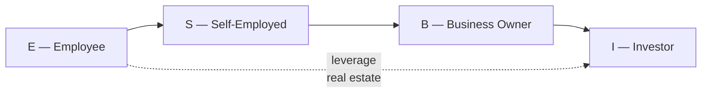

## The Circle of Wealth: Kiyosaki's Model

Kiyosaki's framework for understanding why people stay broke begins with the distinction between earned income and passive income. An employee or self-employed person trades time for money — when time stops, money stops. A business owner or investor owns systems or assets that generate income continuously. Real estate investing is Kiyosaki's recommended entry into the Investor quadrant because it requires relatively low cash to start, borrows heavily from banks (using OPM), produces monthly cash flow from tenants, and appreciates without active labor.

The book formalizes this using the Cashflow Quadrant diagram, which places four financial identities on a spectrum from controlled-by-others to controlling-systems:

The arrow from E directly to I via real estate investing is the book's central message. Most financial education tells people to work harder, save more, and invest in mutual funds. Kiyosaki says this keeps them trapped in the E and S quadrants where income is limited by time and effort. The fast lane is to buy income-producing assets — specifically real estate — and let the asset's cash flow fund the investor's lifestyle while the asset grows in value.

---

## Chapter-by-Chapter Summary

### Introduction: Investing in Your Future

Kiyosaki and Lechter open by establishing what the book will deliver and what it will not. The book is not a beginner's guide to opening a brokerage account. It is specifically about real estate as an asset class. It addresses the reader who already believes in financial education — who has read *Rich Dad Poor Dad* or is familiar with the basic premise that the rich do not work for money — and wants the next level of specificity on how to execute real estate transactions.

The authors explain that real estate is the ultimate low-risk, high-return investment for the informed investor, but that it looks extremely risky from the outside. The difference between risk and control is the core distinction. Professional real estate investors reduce risk through education, due diligence, and team-building; amateur investors increase risk through ignorance of how markets, financing, and property management work. The entire book is an argument that anyone can become a professional-level investor if they are willing to do the homework before writing a check.

---

### Chapter 1: The Major Benefits of Real Estate

This chapter establishes why real estate outperforms stocks, bonds, and mutual funds for most middle-class investors. Four advantages receive detailed treatment:

1. **Control.** A stock investor holds a certificate and is entirely at the mercy of management decisions, economic conditions, and market sentiment. A real estate investor can influence the asset directly: renovate to increase rents, replace management to improve cash flow, renegotiate leases, or convert a property to a higher-value use. You can see, touch, and directly improve a building.

2. **Leverage.** When you buy a stock, you pay 100% of the purchase price. When you buy a $200,000 duplex with 20% down, the bank provides the other $80,000. Any appreciation and any rental income is amplified because only your equity stake is at risk. Kiyosaki emphasizes that the rich use good debt to build wealth while the middle class uses bad debt (credit cards, car loans) to consume.

3. **Cash flow.** A properly selected rental property generates positive monthly cash flow from day one of ownership (once tenants are in place). This passive income continues regardless of whether the property appreciates. Stocks pay dividends; bonds pay coupons; only real estate provides a physical asset that pays for itself while someone else (the tenant) pays down the mortgage.

4. **Tax advantages.** Depreciation allows a real estate investor to shelter rental income from taxes even while the property is appreciating. The 1031 exchange (in the US) enables the sale of a property without capital gains tax if the proceeds are reinvested in a like-kind property, allowing wealth to compound tax-free across an entire investment career. Kiyosaki argues that the IRS has written the tax code specifically to encourage real estate investment and that failure to use these provisions is voluntarily paying more tax than required.

---

### Chapter 2: A Market Full of Opportunities

This chapter surveys the diversity of real estate investment options and explains why no single strategy is appropriate for every investor. The authors introduce the four main property types:

1. **Residential single-family.** The easiest entry point. Requires the least specialized knowledge, has the widest buyer pool when you eventually sell, and is the property type most lending institutions want to finance. Cash flows tend to be modest; appreciation is the primary upside.

2. **Multifamily (2–4 units, 5+ units).** Provides economies of scale. With five or more units, a property is classified as commercial rather than residential for financing purposes, which changes the underwriting standards but also opens access to different loan products. The cash flow tends to be larger per property.

3. **Commercial retail/office/industrial.** Higher entry costs, more specialized knowledge required, but also larger potential returns. The investor must understand commercial lease structures, CAM (common area maintenance) charges, and vacancy risk that is specific to business tenants.

4. **Land, raw deals, and distressed properties.** The highest upside per investment but also the highest risk and the most work. Kiyosaki presents these as appropriate for investors who have built experience but are not the recommended starting point.

Each property type requires a different skill set and temperament. The chapter emphasizes that beginning investors should start where they are comfortable and only expand as they gain experience. The concept of "beginning at the beginning" — buying within your sphere of knowledge — is a recurring theme.

---

### Chapter 3: How to Choose the Right Property

The authors transition from why to what. This chapter focuses on deal evaluation using tools that Kiyosaki and Lechter have developed for investors at the Rich Dad Education workshops. The core metrics taught here are:

- **Capitalization rate (cap rate):** Net Operating Income ÷ Purchase Price. This gives a rate-of-return snapshot before financing.

- **Cash-on-cash return:** Annual cash flow ÷ Total cash invested (down payment + closing costs + initial repairs). This tells you how hard your personal cash is working.

- **Debt service coverage ratio (DSCR):** NOI ÷ Annual debt service. Lenders look at this before approving commercial loans; investors should use it as a stress test before making an offer.

- **Gross Rent Multiplier (GRM):** Purchase Price ÷ Gross Annual Rental Income. Quick-screening tool for comparison properties in the same market.

The chapter teaches how to run these calculations on a deal before making an offer, using a real estate investment analysis worksheet that appears in the book. The authors stress that the analysis is not about being precise to the dollar — it is about establishing that a deal is worth detailed underwriting. If the rough numbers fail, the detailed numbers will too.

An important conceptual point here is Kiyosaki's definition of a good deal versus a good market. You can buy in the wrong market and lose money; you can buy in the right market and still lose money if the individual property has structural problems, bad tenants, or unfavorable zoning. The book dispenses practical guidance on how to identify market-health indicators: employment trends, population growth, and rent-to-price ratios in a given metro area.

---

### Chapter 4: The Four Types of Real Estate Deals

One of the most distinctive contributions of this book is Kiyosaki's four-deal-type taxonomy, which appears explicitly here for the first time in the Rich Dad series:

1. **The Deal of a Lifetime.** A property so obviously mispriced relative to its fundamental value that risk is near zero. These deals appear primarily in distressed markets or foreclosure situations, and require fast action and cash readiness.

2. **The Good Deal.** A property that passes financial analysis and cash-flow targets but does not present exceptional upside. These are the bread-and-butter investments that make up most of a portfolio.

3. **The So-So Deal.** A property that technically works at current numbers but does not have a margin of safety. If vacancy increases by 10% or a major repair occurs, cash flow goes negative. The authors counsel passing on these unless there is a specific plan to upgrade the property.

4. **The Nightmare Deal.** Properties with structural problems, environmental contamination, messy title, or unresolvable tenant issues. These look cheap but destroy capital over time.

Understanding deal type is important not only for acquisition decisions but also for exit strategy. A Deal of a Lifetime is held long-term; a Good Deal can be sold or 1031-exchanged as market conditions change; a So-So Deal should be improved or exited; a Nightmare Deal should never be bought in the first place.

---

### Chapter 5: Finding Deals

Kiyosaki's approach to deal-finding runs counter to most real estate advice. Rather than systematically searching MLS listings — where competition is highest and margins are thinnest — he recommends source-market strategies:

- **Driving for dollars.** Physically driving through target neighborhoods identifying properties with signs of distress (overgrown yards, boarded windows, accumulated mail, utility shutoff notices).

- **Foreclosure and pre-foreclosure lists.** These are publicly available, free sources of motivated sellers. The chapter explains the three phases of foreclosure (pre-foreclosure/notice of default, auction/trustee sale, bank-owned/REO) and the investor's role at each stage.

- **Expired listings.** Properties that failed to sell after 90–120 days on the MLS. The seller has already demonstrated willingness to sell and has typically replaced an agent who could not deliver. These conversations are softer and produce motivated sellers at prices below market.

- **Wholesalers and bird-dog networks.** Investors who locate deals without the intent to buy themselves sell the contract to someone else for an assignment fee. Kiyosaki explains how to build a network of wholesalers who will bring you off-market deals.

- **Advertising to motivated sellers.** Direct mail campaigns targeting absentee owners, probate properties, and owners of properties in pre-foreclosure. The expected response rate is low (1–3%) but the deals that come through are often significantly below market.

The chapter is infused with Kiyosaki's emphasis on creativity over competition. The idea that "expensive homes have expensive mortgages" is recast as a guide to finding lower-priced properties in weaker neighborhoods where you can use creative financing (seller financing, lease options, wrap mortgages) to control the deal with little or no money down.

---

### Chapter 6: Financing — The Real Secret of Real Estate Wealth

This is arguably the book's most practically important chapter. Kiyosaki's central financial insight, repeated throughout his work, is that the investor's ability to use leverage dramatically outperforms any equity investment. A stock investor buying $100,000 worth of stock puts up $100,000; if the stock doubles, they make $100,000 (100% return on capital). The real estate investor who puts 20% down ($40,000) on a $200,000 property that appreciates to $240,000 realizes a $40,000 value increase on a $40,000 investment — a 100% return on equity — while also having paid down $3,000–5,000 of mortgage principal and earned rent over the same period.

The chapter surveys financing options:

- **Conventional bank financing** (20–25% down cash-out refinance for investment properties)
- **FHA loans** (3.5% down for owner-occupants; "house hacking" strategy of living in one unit and renting others)
- **Seller financing** (the seller carries a note; no bank approval needed)
- **Land trusts** (title held in trust for privacy; avoids traditional underwriting)
- **Creative wrap/deal structuring** (wrapping an existing low-interest loan into a new higher-interest seller carry)

Kiyosaki also introduces the concept of the **Circle of Wealth** in financial context: the investor's goal is to shift from earned income to passive income via property cash flow. Every dollar of passive income brings you one dollar closer to financial independence and one step further from the necessity of trading time for money.

---

### Chapter 7: Understanding Numbers — The Language of Real Estate

A common criticism of Kiyosaki's earlier work is that it is motivational without mechanics. This chapter is his response. It is the most technically dense section of the book, teaching the reader how to read and interpret real estate financial statements: the operating statement (income minus expenses), the balance sheet (assets, liabilities, equity), and the cash flow statement (inflow minus outflow).

Key metrics taught here:
- **Net Operating Income (NOI):** Gross rents minus all operating expenses (property management, maintenance, insurance, property taxes, vacancy allowance) — but BEFORE mortgage payments.
- **Cash flow:** NOI minus debt service. This is the figure that matters for monthly income.
- **Return on Investment (ROI):** Annual cash flow divided by total invested cash.
- **Cap rate comparison:** Comps in your market to determine whether your deal is priced competitively.
- **Appreciation projections:** Historical appreciation rates in your target market and conservative projections going forward.

The chapter includes a worked example of a fourplex in a Midwest market, walking through purchase price, rent roll, expense estimates, loan terms, and the resulting cash flow. This is the book's most valuable hands-on section and the one that changes it from a motivational book into a practical guide.

---

### Chapter 8: Profiting by Controlling Property: Lease Options

One of Kiyosaki's signature strategies, the lease option is introduced here with substantial detail. A lease option gives the tenant-buyer the right (but not the obligation) to purchase the property at a predetermined price within a specified time period. For the seller, it converts a non-performing property into a revenue stream. For the investor, it provides control of the property with minimal or zero down payment.

The chapter teaches:
- How to structure the option consideration (a non-refundable fee, typically $5,000–25,000)
- How to set the purchase price above market to capture appreciation in the option term
- How to screen tenant-buyers for those who are genuinely motivated to purchase vs. those who will never qualify
- Exit strategies: assign the contract to another buyer for a fee, or close on the property yourself after occupying it with the tenant

Kiyosaki's example of a lease option on a $120,000 property with a $5,000 option fee and $1,000/month rent credit is illustrative: over a two-year term, the tenant accumulates $29,000 in equity, has strong motivation to close, and the investor can collect $24,000 in rent minus $12,000 in mortgage payments (net $12,000) while holding the option.

---

### Chapter 9: Becoming a Problem Solver: Foreclosures

Foreclosure investing requires different skills, faster timelines, and different risk tolerances than buy-and-hold. This chapter introduces the foreclosure process, the three phases, and the investor's role at each:

- **Pre-foreclosure (Notice of Default):** Owner is typically 90+ days behind, wants to avoid foreclosure on their credit, and is motivated to sell. These deals are negotiated directly with owners — often for much less than market value — before the property reaches auction. The investor must move quickly, understand state-specific foreclosure timelines, and be clear on what equitable rights the owner retains.

- **Trustee sale / auction:** The property is sold at a public auction. Bidders must have cash or cash-equivalent financing (hard money or proof of funds). Auctions demand significant preparation: title research to identify liens, understanding junior lien survival rules, and knowing that most auction properties have tenants who may need to be evicted.

- **Bank-owned (REO):** After the foreclosure is complete and no auction buyer stepped up, the bank owns the property. Banks sell REO through listing agents and sometimes through private sales. Compared to auctions, REO has more predictable timelines, more negotiation room, and a clearer title, but margins are tighter because the bank has already priced the property for the broader market.

The chapter is realistic about foreclosure pitfalls: title problems, eviction costs, relationship with tenants, and the risk of buying a property with damage from former owners. Kiyosaki's key advice: always run your standard financial analysis even on foreclosure deals; distress does not automatically mean a good deal.

---

### Chapter 10: Your Team and Your Exit Strategy

The final substantive chapter covers two topics that separate amateur investors from professionals: building a professional team and planning your exit before you enter.

**Your team** should include:
- A real estate attorney who understands investment property (not just residential transactions)
- A CPA familiar with real estate tax, not just individual income tax
- A property manager who invests in the same markets (Kiyosaki's litmus test: "Do you invest in your own management company?")
- A contractor who can provide honest repair estimates before you offer
- A mortgage broker who specializes in investment property
- An insurance agent who understands umbrella policies and landlord coverage

**Exit strategy** means knowing before you buy how and when you will exit every investment:
- Hold-and-cash-flow: 30+ year horizon; exit through sale to fund retirement
- Fix-and-flip: 6–18 month horizon; exit through retail sale
- 1031 exchange: defer capital gains; exit through reinvestment into a larger property
- Wholesale assignment: exit immediately by assigning the contract

Kiyosaki's opinion, consistent throughout the book, is that beginners should start with hold-and-cash-flow properties in good markets — the slow, boring path. Flipping and wholesaling require more skill and generate income closer to self-employment (S quadrant) than passive investing (I quadrant).

---

## Reading Guide

### Recommended Path for Beginners

Read in full. The book is deliberately structured for a progressive reader: Part 1 (Chapters 1–4) builds the conceptual and analytical framework; Part 2 (Chapters 5–10) teaches practical execution. Skipping Part 1 and going directly to the tactics will leave a reader who can identify a lease option but cannot tell whether it is actually a good deal. Reading Part 1 without applying it also leaves no improvement in financial outcomes.

**Core chapters to read carefully (everyone):**
- Chapter 1 (Major Benefits): the conceptual foundation
- Chapter 3 (How to Choose): the analytical toolkit
- Chapter 6 (Financing): the strategic insight on leverage
- Chapter 7 (Numbers): the mechanics every investor needs
- Chapter 10 (Team + Exit): the operational backbone

**Chapters to read for context but return to when relevant:**
- Chapter 4 (Deal Types): read once to internalize the framework; revisit when evaluating specific deals
- Chapter 8 (Lease Options): advance topic; return when you are ready to structure your first lease option deal
- Chapter 9 (Foreclosures): advanced topic; return when you have capital and want to pursue distressed acquisition

### Estimated Reading Time

Approximately 8 hours for the full book (384 pages, moderate density in chapters 6–7). Chapters 1–2 read quickly (motivational and conceptual). Chapters 6–7 are the slowest because they require working through the sample calculations to internalize the math.

### Complementary Reading

- *Rich Dad Poor Dad* (1997) — read first for the foundational mindset
- *ABCs of Real Estate Investing* by Ken McElroy — more advanced deal-level mechanics
- *The Millionaire Real Estate Investor* by Gary Keller — alternative framework (no leverage emphasis)
- *What Every Real Estate Investor Needs to Know About Cash Flow* by Frank Gallinelli — deeper analytical tools

---

## Key Concepts Summary

| Concept | Definition | Chapter |
|---------|-----------|---------|
| Cashflow Quadrant | E/S/B/I framework for financial identity | Intro/Ch 1 |
| Net Operating Income (NOI) | Gross rents minus all operating expenses, before debt service | Ch 7 |
| Cap Rate | NOI ÷ Purchase Price; annual return at purchase price | Ch 3 |
| Cash-on-Cash Return | Annual cash flow ÷ Total cash invested | Ch 3 |
| Debt Service Coverage Ratio (DSCR) | NOI ÷ Annual debt service; lender stress test | Ch 3 |
| House Hacking | Live in one unit, rent others; access FHA 3.5% down financing | Ch 6 |
| Lease Option | Rent with purchase right; minimal-down entry to ownership | Ch 8 |
| 1031 Exchange | Tax-deferred exchange; continue compounding without capital gains hit | Ch 1 |
| Four Deal Types | Lifetime / Good / So-So / Nightmare framework | Ch 4 |
| Circle of Wealth | Shift earned income to passive income via real estate | Ch 6 |
