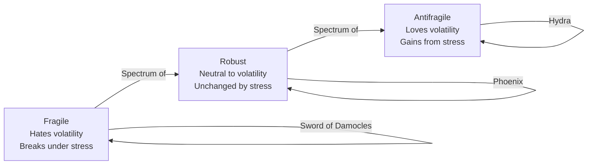
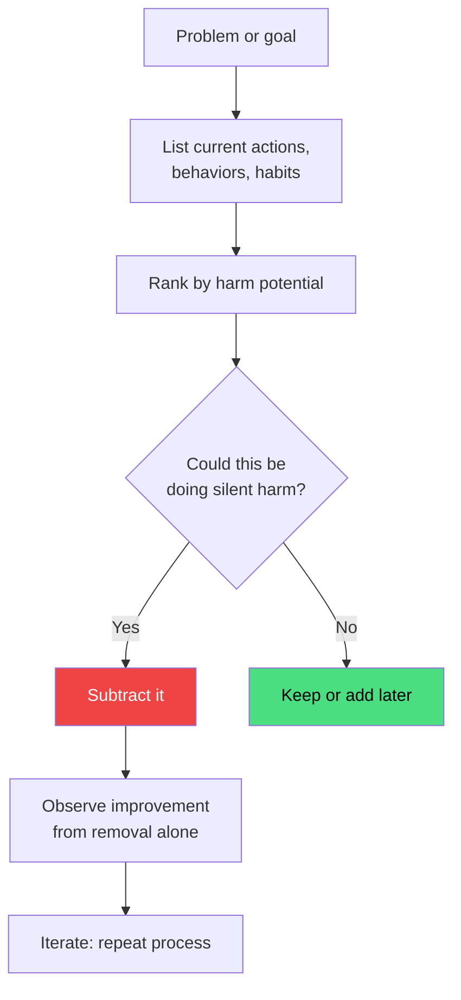
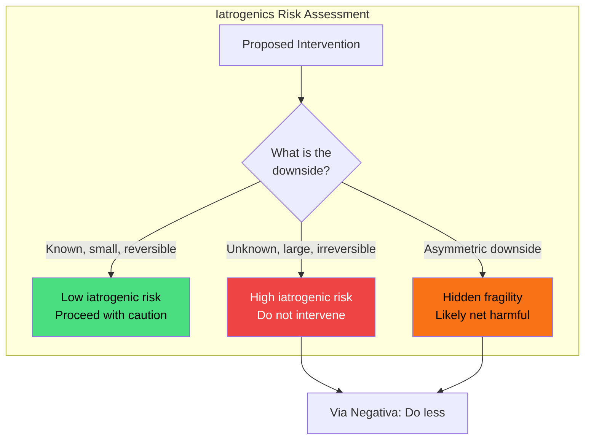
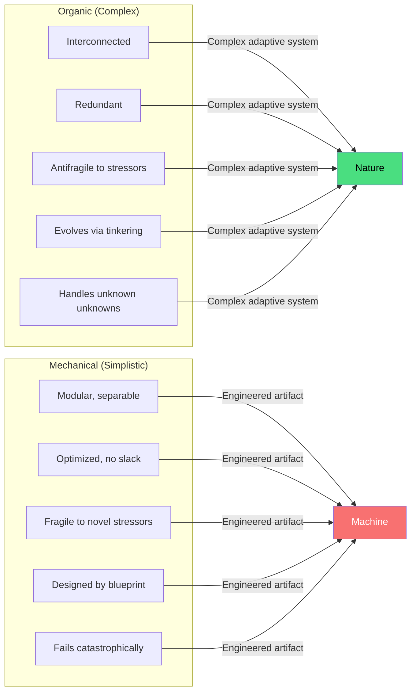

## The Triad



The Triad is the book's foundational framework. Taleb uses three
mythological avatars to illustrate the categories:
- **Damocles**: sits at a banquet with a sword suspended over his
  head by a single horsehair — a tiny perturbation kills him
- **Phoenix**: burned to ashes and reborn exactly as before —
  destruction does not change it
- **Hydra**: cut off one head and two grow back — injury makes it
  stronger

Every system, strategy, policy, or entity can be classified on this
spectrum. The practical value: once you classify a system as fragile,
you know to reduce its exposure to volatility. Once you identify an
antifragile system, you know to expose it to stressors.

### The Triad Applied

| Domain | Fragile | Robust | Antifragile |
|---|---|---|---|
| **Finance** | Leveraged bank, debt-heavy company | Diversified index fund | Tail-hedged portfolio, venture capital |
| **Health** | Sedentary lifestyle, overmedicated patient | Moderate exercise, balanced diet | Bones (Wolff's Law), immune system, vaccines |
| **Technology** | Monolithic single-point-of-failure system | Redundant distributed system | Open-source, trial-and-error innovation |
| **Business** | Single-client consultancy, high-fixed-cost | Diversified enterprise | Restaurant industry, venture-backed startups |
| **Urban planning** | Centralized nation-state | Federal system | City-states, decentralized communes |
| **Knowledge** | Single theory, dogmatic framework | Peer-reviewed consensus | Antifragile: trial and error, evolution of ideas |

## The Barbell Strategy

```mermaid
graph TD
    subgraph "The Barbell Strategy"
        direction LR
        S[90% Hyper-Safe<br/>Cash, T-bills, stable job] --- M[|-- AVOID THE MIDDLE --|]
        M --- R[10% Hyper-Aggressive<br/>Moonshots, venture, side projects]
    end
    
    S -->|Protects| D[Survival in any scenario]
    R -->|Enables| U[Unlimited upside optionality]
    
    style S fill:#4ade80,color:#000
    style M fill:#f87171,color:#fff
    style R fill:#60a5fa,color:#000
```

The barbell strategy is Taleb's practical prescription for
transforming fragile positions into antifragile ones. It consists of
holding two extremes with nothing in between — the exact opposite of
the "moderate" or "balanced" approach that conventional wisdom
recommends.

The logic: medium-risk positions carry hidden tail risk — they can
still blow up, but they do not offer enough upside to compensate.
By concentrating all downside protection on one end and all upside
optionality on the other, you ensure that no single shock can wipe
you out while you retain the potential for positive Black Swans.

### Applications

- **Investing**: 90% in cash, T-bills, or inflation-protected
  securities; 10% in highly speculative, convex bets (options,
  venture capital, distressed assets)
- **Career**: A stable salary (safe) plus aggressive side projects
  or writing (speculative) — never a single "balanced" corporate
  track
- **Health**: Routine low-intervention baseline (good sleep, no
  smoking) plus occasional intense stressors (fasting, high-intensity
  training, cold exposure)
- **Business**: Core revenue-generating product line + speculative
  R&D moonshots — no moderate "safe innovation"

## The Lindy Effect

```mermaid
---
config:
  xyChart:
    xAxis:
      label:
        fontSize: 12
      title:
        fontSize: 14
    yAxis:
      label:
        fontSize: 12
      title:
        fontSize: 14
---
xychart-beta
    title "Lindy Effect: Expected Remaining Life vs Current Age"
    x-axis "Current Age (years)" [0, 10, 50, 100, 500, 1000, 2000]
    y-axis "Expected Remaining Life (years)" 0 --> 2000
    line [NaN, 10, 50, 100, 500, 1000, 2000]
```

Named after a New York deli where actors gathered and observed that
the longer a show had run, the longer it would continue to run, the
Lindy Effect states that for non-perishable things (ideas,
technologies, books, institutions), the expected future lifetime is
proportional to the current age.

**Mathematically**: For a non-perishable item that has survived
*t* years, the expected additional survival time is proportional
to *t*.

**Corollary**: When evaluating a new technology, business model, or
idea, prefer the one that has already survived longer — it has
demonstrated robustness to the shocks that kill fragile novelties.

**Why Lindy works**: Survival through time is a filter. Anything
that has survived a long time has already weathered many stressors
and uncertainties. The things that were fragile have already been
weeded out. The survivors are, by revealed preference, more robust
or antifragile.

### The Neomania Trap

Modern culture suffers from **neomania** — a love of the new for its
own sake. The Lindy Effect is an antidote: before adopting a new
framework, technology, or investment, ask whether it has survived
any real-world stress. Most innovations fail the Lindy test because
they are optimized for conditions that will not last.

## Via Negativa



Via Negativa (the negative path) is the practice of improving
systems through removal rather than addition. Taleb argues it is
the most reliable form of intervention in complex systems.

**Why removal works**: In complex systems, we understand what is
harmful far better than we understand what is beneficial. Removing
a known toxin is straightforward; adding a novel supplement carries
unknown interaction effects. Subtraction is more robust to model
error.

### Practical Applications

- **Diet**: Remove sugar, processed foods, and excessive carbs
  before adding any supplement or diet protocol
- **Medicine**: Stop smoking, stop unnecessary medications, avoid
  elective surgeries before seeking new treatments
- **Productivity**: Identify and eliminate the 20% of activities
  causing 80% of wasted time before adding new productivity systems
- **Portfolio**: Sell the positions that keep you up at night before
  adding new investments
- **Relationships**: Subtract toxic people before seeking new
  connections
- **Business**: Remove bad products, bad customers, and bad
  processes before launching new initiatives

### The One-Reason Rule

Taleb's heuristic for via negativa: "If you have more than one
reason to do something, do not do it." Obvious decisions require
only one justification. Multiple reasons are a sign of
rationalization — you are trying to convince yourself of something
your instincts already doubt.

## Iatrogenics



Iatrogenics is the term for harm caused by the healer. Taleb
extends it beyond medicine to any intervention — economic policy,
corporate strategy, parenting, technology deployment — where the
intervener's actions cause more harm than the original problem.

**The iatrogenics heuristic**: In any complex system, the default
position should be non-intervention unless the benefit is both clear
and large relative to the unknown downside risk.

### Examples

- **Medicine**: Unnecessary surgeries, aggressive cancer screening
  that finds harmless tumors leading to invasive treatment, overuse
  of antibiotics
- **Economics**: Central bank interventions that smooth cycles in
  the short term but create larger boom-bust dynamics
- **Parenting**: Overprotection that prevents children from
  developing resilience through small failures
- **Education**: Standardized testing that optimizes for test scores
  at the expense of genuine learning

## Organic vs Mechanical



Taleb draws a sharp distinction between organic (complex) systems
and mechanical (simplistic) ones. The error of modernity, he argues,
is treating organic systems as if they were mechanical.

| Property | Organic (Complex) | Mechanical (Simplistic) |
|---|---|---|
| **Response to stress** | Strengthens (antifragile) | Weakens or breaks (fragile) |
| **Redundancy** | Essential, abundant | Waste to be eliminated |
| **Intervention outcome** | Often iatrogenic | Predictable, linear |
| **Knowledge requirement** | Cannot be fully understood top-down | Fully describable by blueprint |
| **Error handling** | Small errors strengthen the whole | Single error can destroy the whole |
| **Examples** | Body, ecosystem, economy, city | Washing machine, bridge, spreadsheet model |

The "cat and the washing machine" chapter drives this home: a cat is
organic, complex, and antifragile — it benefits from small stressors
and can handle novel situations. A washing machine is mechanical —
it performs its function perfectly until something breaks, then it
stops entirely.

## Additional Concepts

### Optionality

Optionality is the value of having choices without the obligation to
exercise them. An option has convex payoff: limited downside (the
premium paid) and unlimited upside. Taleb argues that optionality is
the operational engine of antifragility.

Thales of Miletus provides the archetype: he purchased options on
olive presses before harvest. If the harvest was poor, his loss was
limited to the option premium. If bountiful, he controlled all the
presses at a fixed price and made a fortune.

### Convexity and Nonlinearity

The mathematical foundation of antifragility is convexity. A system
with convex payoffs benefits from increased volatility (variance is
your friend). A system with concave payoffs is harmed by increased
volatility.

**Jensen's Inequality** provides the formal test: if the average of
the outcomes under different shocks is better than the outcome under
the average shock, the system is convex (antifragile). If worse, it
is concave (fragile).

### The Turkey Problem

A turkey is fed for 1000 days. Every day reinforces the belief that
humans are kind and life is good. On day 1001 — Thanksgiving — the
turkey is slaughtered. The turkey's confidence increased with every
day of past evidence, yet the evidence said nothing about the risk.

This illustrates the limits of induction and historical data in
predicting extreme events — the core problem *The Black Swan*
defined. Antifragility is the solution: instead of trying to predict
the slaughter, build a system that benefits if it arrives.

### Skin in the Game

Introduced in Book VII and expanded into its own volume, skin in the
game is the ethical requirement that decision-makers bear the
downside of their decisions. Without it, they have no incentive to
manage fragility and every incentive to offload risk onto others.

Taleb argues that the 2008 financial crisis was fundamentally an
ethics failure: bankers took risks whose downside was socialized
(bailouts) while upside was privatized (bonuses). The system was
fragile by design.
