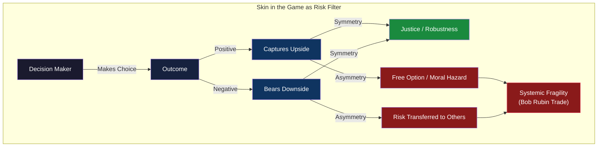
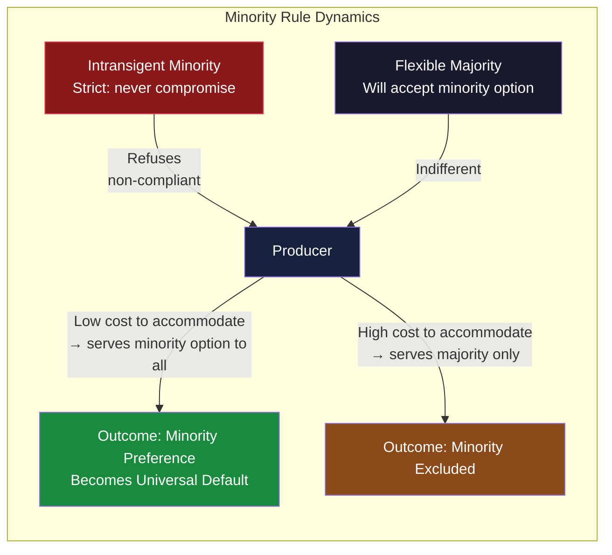
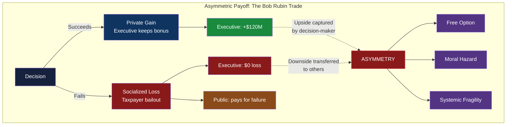
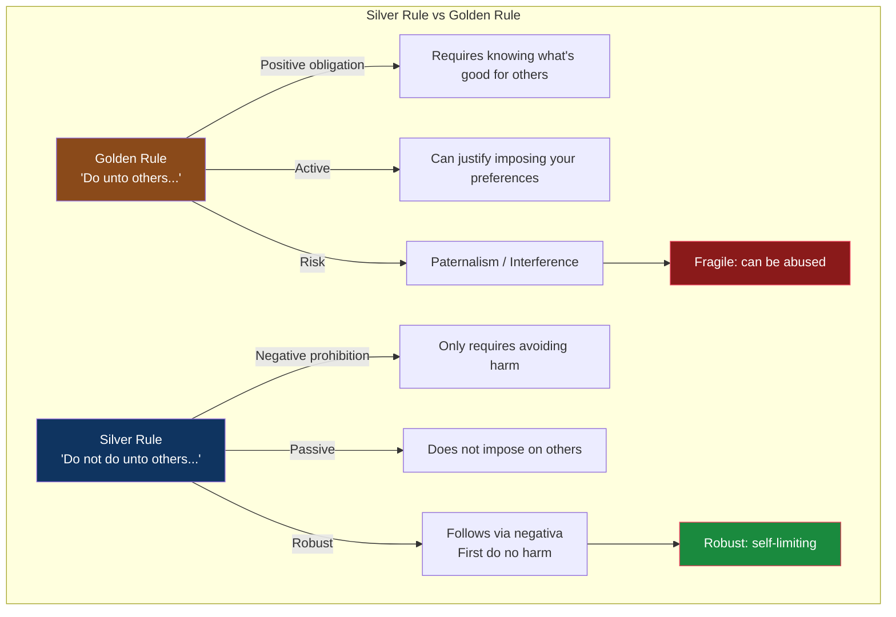
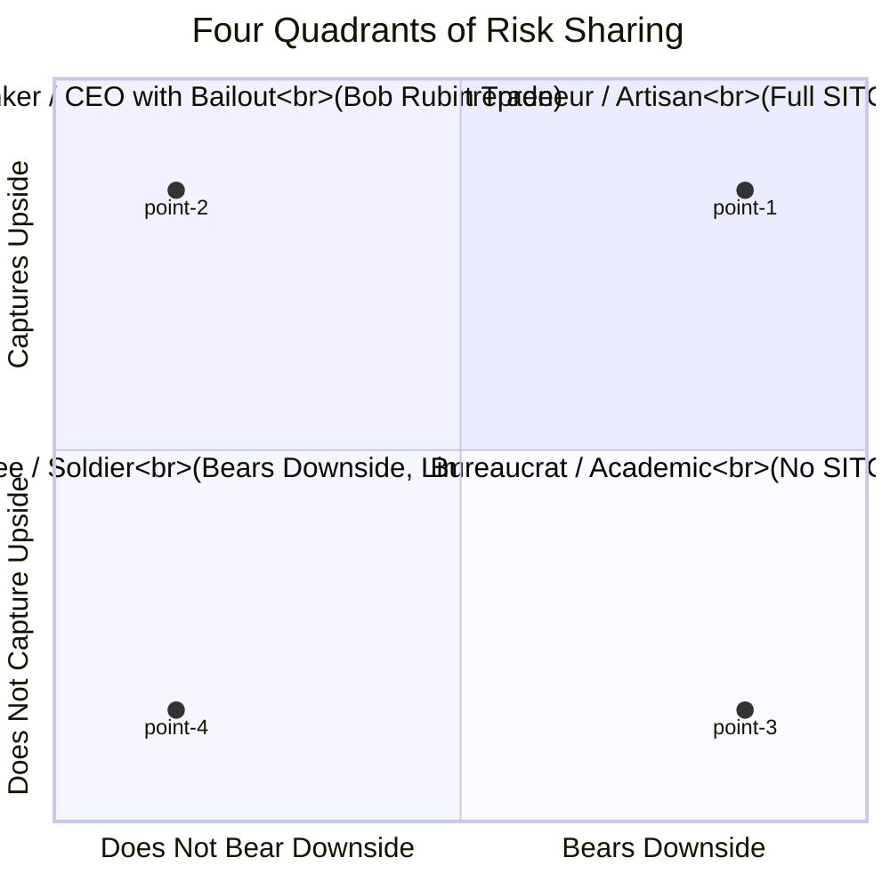

# Core Concepts

## The Principle of Symmetry

Skin in the game is fundamentally about **symmetry** — the balance between the upside an actor captures and the downside they must bear. Taleb argues this symmetry is the oldest and most universal principle of justice, traceable to the Code of Hammurabi (circa 1750 BC): "If a builder builds a house and it collapses and causes the death of the owner, the builder shall be put to death."

The builder shares the same risk as the homeowner. This is literal skin in the game. The principle ensured that builders thought twice before cutting corners and transferring hidden risk to their customers. Taleb contrasts this with the modern world, where executives, bankers, and bureaucrats routinely pocket rewards for success while transferring the costs of failure to taxpayers, employees, and the public.

The asymmetry is the root of systemic fragility. When decision-makers do not bear the consequences of their decisions, they have a **free option** — they benefit from upside without paying for downside. This distorts incentives, concentrates risk on the vulnerable, and eventually destroys the systems that enable the asymmetry.

---

## The Four Ways Skin in the Game Matters

Taleb identifies four distinct domains where the principle operates:

| Domain | Description | Example |
|--------|-------------|---------|
| **Epistemic** | Knowledge is only reliable when the knower bears the cost of being wrong | A surgeon who also operates on family members is more careful; a forecaster whose compensation is tied to accuracy |
| **Ethical** | Moral rules must be symmetric to be just | The Silver Rule: do not do to others what you would not want done to you |
| **Risk Management** | Decision-makers must share the downside to prevent reckless risk-taking | Hammurabi's builder; bank executives with clawback provisions |
| **Evolutionary** | Systems that survive are those where errors are punished at the source | The Lindy effect: practices that have survived have proven their robustness |

---

## The Minority Rule

One of the most counterintuitive and powerful concepts in the book: a small, intransigent minority can impose its preferences on the majority when two conditions hold — (1) the minority refuses to compromise, and (2) the cost of accommodation is low.

**Example**: Only ~4% of Americans eat kosher, yet nearly all industrially produced beverages are kosher-certified. Why? A kosher eater will never drink non-kosher, but a non-kosher eater has no objection to kosher. For a producer like Coca-Cola, the cost of certification is negligible, so they make all products kosher rather than maintaining separate production lines. The intransigent 4% dictates what the flexible 96% consumes.

The same dynamic applies to halal meat (70% of lamb imported into the UK from New Zealand is halal, despite Muslims being ~4% of the population), GMO labeling, smoking bans, and political correctness. A committed minority willing to pay a cost for its preferences will dominate a flexible majority that does not care enough to resist.

Taleb formalizes this using the **renormalization group** from physics — the idea that local interactions compound upward to produce emergent global behavior. If the minority's rule is strict (never yield) and the majority's rule is flexible (yield when it costs little), the system converges to the minority's preference.

---

## The Bob Rubin Trade

Named after Robert Rubin, former Treasury Secretary and senior director at Citigroup. Rubin collected over $120 million in compensation from Citibank in the decade before the 2008 financial crisis. When the bank was rescued by taxpayers, he paid nothing — invoking uncertainty as an excuse.

Taleb's summary: **Heads he wins, tails he shouts "Black Swan."**

This is the defining asymmetry of modern finance: privatized gains and socialized losses. Rubin's compensation structure gave him a free option — unlimited upside from risky bets, zero downside when those bets blew up. The downside was transferred to taxpayers, shareholders, and employees.

The Bob Rubin trade is not limited to banking. It appears wherever decision-makers can capture gains without bearing losses: CEOs with golden parachutes, fund managers with incentive fees but no clawbacks, politicians who start wars their children do not fight in, bureaucrats who impose regulations they do not comply with.

---

## The Silver Rule vs The Golden Rule

The **Golden Rule** — "Do unto others as you would have them do unto you" — is the most famous ethical maxim in the Western world. Taleb argues it is dangerously incomplete. It allows you to impose your preferences on others under the guise of benevolence. It is an *active* rule that justifies interference.

The **Silver Rule** — "Do not do unto others what you would not want done unto you" — is more robust. It is a *negative* rule: it prohibits harmful action without prescribing positive action. It does not require you to know what others want. It only requires you to avoid what you know you would not want.

Taleb traces the Silver Rule to Confucius, Isocrates, and the ancient Mediterranean ethical traditions. It aligns with the *via negativa* (the negative path) that he develops in *Antifragile* — the idea that removing harmful things is more reliable than adding beneficial ones.

---

## The Four Quadrants of Risk Sharing

Taleb maps actors onto a 2x2 matrix based on whether they bear the upside and downside of their decisions:

- **Quadrant I (Entrepreneur/Artisan)**: Bears both upside and downside. Full skin in the game. Their survival depends on the quality of their work.
- **Quadrant II (Banker/CEO with bailout)**: Captures upside but does not bear downside. The Bob Rubin trade. This is the most dangerous quadrant because the actor has a free option and no accountability.
- **Quadrant III (Employee/Soldier)**: Bears downside (job loss, injury, death) but captures limited upside. They have skin in the game but not the full rewards.
- **Quadrant IV (Bureaucrat/Academic)**: Bears neither upside nor downside. They make decisions that affect others but face no personal consequences. The IYI — Intellectual Yet Idiot.

---

## Ethics vs Rules

Taleb distinguishes sharply between **ethics** (personal, internal, grounded in tradition and honor) and **rules** (external, codified, bureaucratic). Ethics require skin in the game; rules can be followed without any personal stake.

The Lindy effect applies to ethics: moral principles that have survived for centuries — reciprocity, hospitality, courage — have demonstrated their robustness through time. Modern regulatory frameworks, by contrast, are untested innovations. Taleb argues that the proliferation of rules and regulations has displaced ethical judgment rather than reinforced it.

A person with ethics does not need rules. A person without ethics will find ways around them. The regulatory response to every scandal — more rules, more oversight, more bureaucracy — is itself a symptom of the problem: it further separates action from consequence by diffusing responsibility across layers of procedure.

---

## The IYI (Intellectual Yet Idiot)

Taleb's most polemical concept: the Intellectual Yet Idiot is the well-credentialed, well-compensated elite — academics, policy makers, journalists, technocrats — who believe their abstract knowledge qualifies them to make decisions for everyone else. They are "idiots" not because they are unintelligent, but because they lack skin in the game.

The IYI pathologizes what they do not understand. They call the people who voted for Brexit "uneducated." They dismiss the practical knowledge of plumbers, farmers, and soldiers as unsophisticated. They produce theories that look elegant on paper but fail in the real world — and they never pay the price for those failures.

Taleb's critique of academia is central here: the peer-review system, publication incentives, and career progression all reward complicated scholarship and signaling rather than real-world usefulness. Academics can publish theories that cause harm and never face consequences.

---

## Ergodicity and the Absorbing State

One of the most technically sophisticated concepts in the book: **ergodicity** distinguishes between the average outcome across a population (ensemble probability) and the outcome an individual experiences over time (time probability).

If a gamble offers 50% chance of doubling your money and 50% chance of losing everything, the ensemble expected value is positive. But if you play it repeatedly, eventual ruin is guaranteed. The "average" masks the absorbing state — the point where you are eliminated from the game entirely.

Taleb's rule: **Never cross a river that is on average four feet deep.** The average depth is meaningless if you drown at the five-foot mark. Cost-benefit analysis collapses when ruin is possible.

Rationality, for Taleb, means avoiding ruin — not maximizing expected value. This is why pilots follow checklists, mountaineers turn back, and responsible investors diversify. They refuse to take risks that, even with positive expectation, can eliminate them permanently.

---

## Risk Sharing vs Risk Transfer

The deepest distinction in the book: modern institutions have perfected **risk transfer** — finding ways to push the downside of decisions onto someone else. Ancient societies practiced **risk sharing** — spreading the consequences across all participants.

Taleb reaches back to the **Lex Rhodia** (Rhodian Law), incorporated into Justinian's Code, which governed maritime commerce. If cargo was jettisoned during a storm to save the ship, all merchants shared the loss proportionally — not just the one whose goods were thrown overboard. This principle, called *symkyndineo* (Greek for "risk together"), embodies true skin in the game: everyone's fate is in the same boat.

The modern alternative — credit default swaps, collateralized debt obligations, corporate bailouts, limited liability structures — allows one party to offload risk onto another who neither understands nor consented to it. This is not innovation. It is the destruction of the ancient principle that kept commerce honest.
