## The Black Swan Defined

A Black Swan is an event with three defining attributes:

1. **Outlier status**: It lies outside the realm of regular expectations
   because nothing in the past convincingly points to its possibility.
2. **Extreme impact**: It carries consequences that reshape systems, markets,
   or historical trajectories.
3. **Retrospective predictability**: After the fact, human nature makes us
   concoct explanations that make it seem explainable and predictable — "I
   knew it all along."

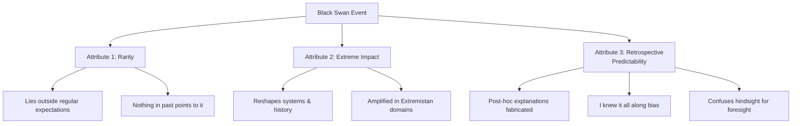

The term originates from the ancient Western belief that all swans are white.
Every observed swan confirmed this "truth" — until black swans were
discovered in Australia. A single observation falsified a certainty built on
thousands of years of evidence. This is the **problem of induction** in its
purest form: no accumulation of confirmatory evidence can definitively prove
a universal statement, but a single counterexample can destroy it.

Historical Black Swans cited by Taleb include the outbreak of WWI
(which bond markets did not predict), the rise of the internet, the 9/11
attacks, the 1987 stock market crash, and the 2008 financial crisis.
Positive Black Swans include the success of Google, the Harry Potter
phenomenon, and transformative inventions like the wheel or the printing press.

## The Problem of Induction (The Turkey Problem)

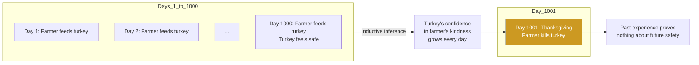

Taleb's Turkey problem illustrates the fatal flaw in using past data to
predict future safety. A turkey is fed every day for 1,000 days. Each feeding
increases its confidence that the farmer cares for it. On day 1,001 —
Thanksgiving — the farmer kills it. The turkey's past data said nothing about
its future.

The same logic applies to financial models that use decades of calm market
data to conclude that a crash is impossible. The 2008 crisis was the turkey's
day 1,001 for banks using Value-at-Risk models based on Gaussian
distributions.

Taleb draws on David Hume's formulation: no amount of observing white swans
proves all swans are white. And on Karl Popper's solution: the only rigorous
knowledge is negative knowledge — what we have falsified. Science progresses
not by confirming theories but by eliminating false ones.

## Mediocristan vs Extremistan

This is the book's most important conceptual contribution — a taxonomy of
randomness into two fundamentally different domains.

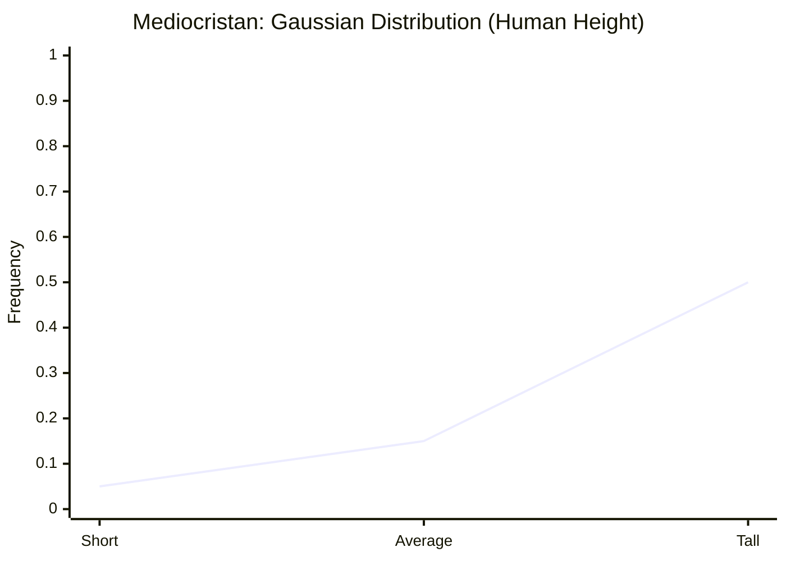

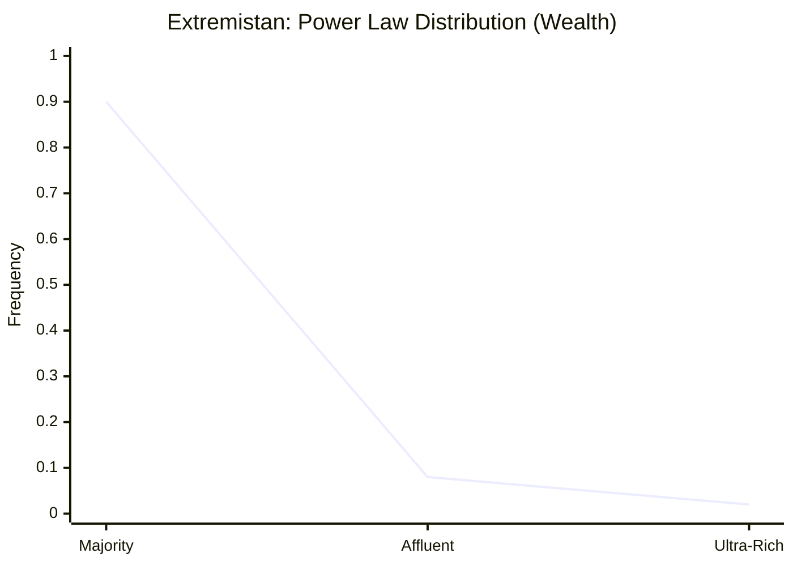

### Characteristics

| Property | Mediocristan | Extremistan |
|---|---|---|
| **Distribution type** | Thin-tailed (Gaussian, exponential) | Fat-tailed (power law, Mandelbrotian) |
| **Maximum observation** | Bounded by physical constraints | Effectively unbounded |
| **Mean stability** | Mean stabilizes with sample size | Mean is unstable; added extreme shifts it |
| **Typical event** | There is a "typical" extreme (7ft is the maximum for humans) | No typical extreme (a billionaire and a millionaire share the label "rich" but have nothing in common) |
| **Average representative?** | Yes — the average person is a meaningful summary | No — the average wealth is meaningless when Bill Gates walks into the room |
| **Law of large numbers** | Works | Does not work |
| **Examples** | Height, weight, IQ, mortality, restaurant income | Wealth, book sales, financial returns, city sizes, war casualties, pandemics |

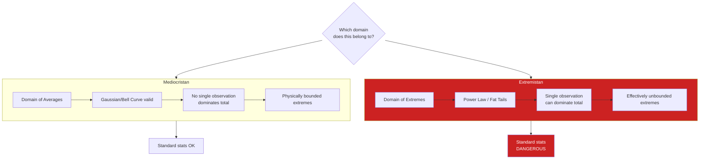

The critical practical insight: using Mediocristan tools (Gaussian, standard
deviation, correlation) in Extremistan domains is not a harmless
approximation — it is active malpractice that creates fragility. Taleb calls
this error "the great intellectual fraud."

## The Narrative Fallacy

Humans are storytelling animals. Our brains crave coherence and causal links.
When a sequence of events occurs, we automatically weave them into a
narrative with cause and effect — even when the connection is random.

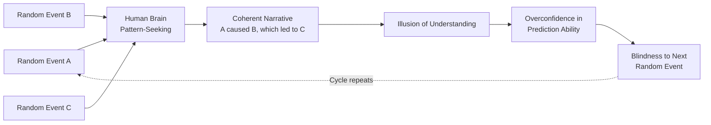

The narrative fallacy explains why we believe history is more predictable
than it actually was. After 9/11, experts produced detailed chains of
causality showing the attack was "inevitable" — yet none predicted it before.
After the 2008 crash, economists explained exactly why it had to happen —
after spending years declaring housing a safe asset.

Taleb's key insight: narratives compress information. A good story is
compact, memorable, and emotionally satisfying — but it achieves these
qualities by discarding complexity, nuance, and contradictory evidence. The
same compression that makes narratives useful also makes them dangerous.

The narrative fallacy is closely linked to **hindsight bias**: once an
outcome is known, our memory seamlessly integrates it into a revised story,
making it impossible to reconstruct our prior state of ignorance.

## The Ludic Fallacy

The ludic fallacy is the mistake of treating the structured randomness of
games (dice, coin flips, poker) as equivalent to the open-ended uncertainty
of real life.

In a casino, the rules are known, the probabilities are computable, and the
outcomes are bounded. In real life — markets, politics, war — none of these
conditions hold. The world does not come with a known probability
distribution. You don't know what game you're playing, let alone the odds.

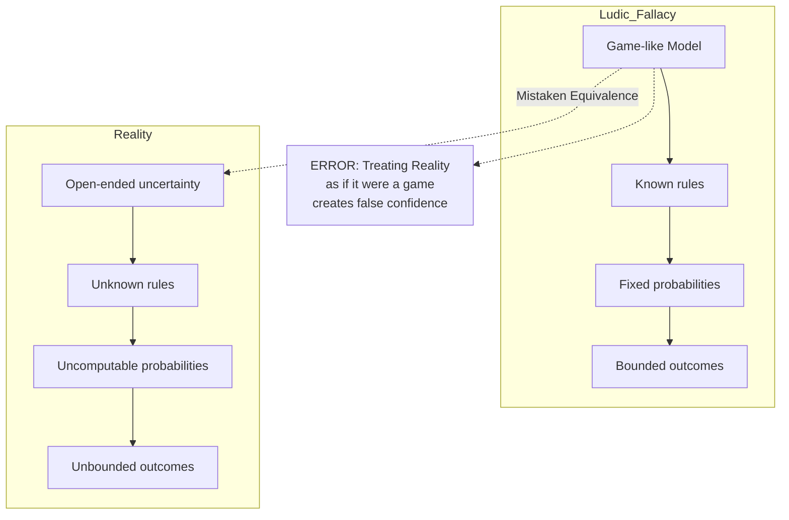

Taleb argues that much of academic economics and finance commits this
fallacy. Black-Scholes option pricing, Modern Portfolio Theory, and
Value-at-Risk all treat markets as though they follow known stochastic
processes with computable parameters. They don't. The models are
mathematically elegant and practically dangerous.

## Confirmation Bias and Silent Evidence

Two of the most powerful cognitive biases that maintain our blindness to
Black Swans:

**Confirmation bias** — we seek and overweight evidence that supports our
existing beliefs, and ignore, dismiss, or explain away evidence that
contradicts them.

**Silent evidence** — we only observe the survivors and successes. The
failures are invisible. This distorts every inference we make.

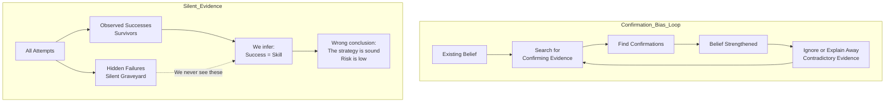

The classic example: we admire successful entrepreneurs and infer they must
have been skilled, visionary, or brave. We never see the thousands of equally
skilled, visionary entrepreneurs who failed — because they're invisible. This
is Cicero's riddle: a pagan shows Diagoras pictures of people who prayed and
survived shipwrecks, asking "don't you see how the gods reward prayer?"
Diagoras replies: "Yes, but where are the pictures of those who prayed and
drowned?"

Taleb extends this to finance: every bull market produces a cohort of "genius"
investors who are actually just lucky. When the bear market comes, they
vanish. But we only remember their names while they're winning.

## The Platonic Fold

The Platonic fold is the conflict between clean, formal models (Platonic
forms) and the messy, unpredictable real world. Taleb uses "Platonic" to
refer to our tendency to mistake the map for the territory — to fall in love
with the elegant theory and forget that reality doesn't conform to it.

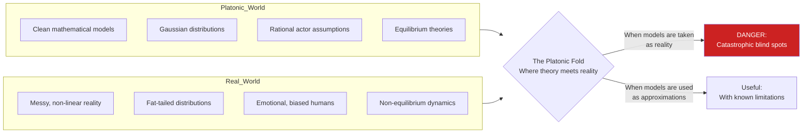

The bell curve is Taleb's archetypal Platonic construct. It is mathematically
beautiful, analytically tractable, and dangerously misleading in the domains
where it is most applied (finance, economics, social science). The Platonic
fold is the gap between the Gaussian world of our textbooks and the
Mandelbrotian world we actually inhabit.

Taleb's solution is not to abandon models — it's to be a **skeptical
empiricist**: use models as tools while remaining acutely aware of their
limitations. Never confuse the model with reality.

## How Prediction Fails

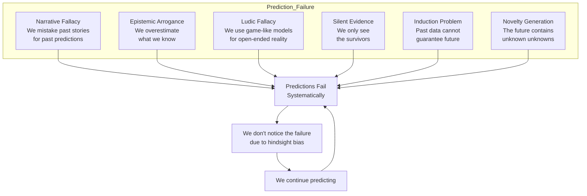

Taleb's argument that prediction fails is not empirical (though he offers
plenty of evidence) — it is logical. Certain things are fundamentally
unpredictable because the future contains knowledge and events that do not
yet exist. You cannot predict the invention of the wheel because to predict
it is to have already invented it.

The "scandal of prediction" is not that experts are wrong — it's that they
are wrong and nobody audits their record. The prediction industry (economic
forecasting, geopolitical risk analysis, stock market prognostication) has no
effective feedback mechanism. Forecasters are never held accountable for
their misses because they can always explain them away with a narrative.

## The Barbell Strategy

Given that prediction is futile, Taleb proposes a decision-making heuristic
for living in a world of Black Swans:

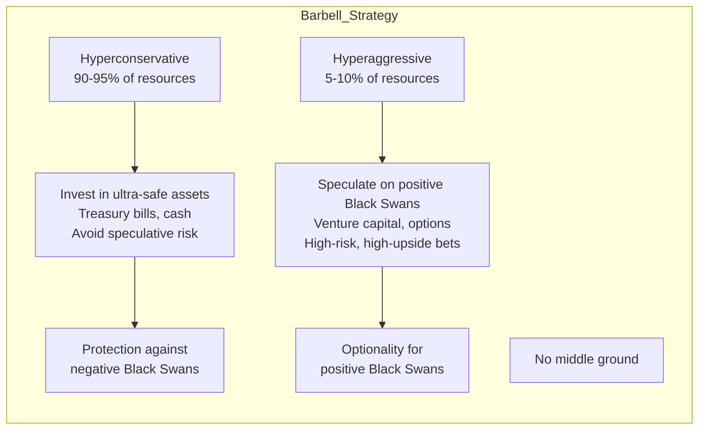

The barbell strategy avoids the middle — no "moderate risk" or "balanced"
portfolios. You put most of your resources into maximally safe instruments
and a small portion into maximally speculative bets with unlimited upside.
You cannot be "a little bit" exposed to negative Black Swans.

In career terms: have a stable job (Mediocristan income) while pursuing
speculative projects with Black Swan upside (Extremistan income). The
worst-case for the speculative part is losing the time invested; the
best-case is life-changing success.

## Living with Black Swans

Taleb's practical advice for navigating a Black Swan world:

1. **Distinguish positive from negative Black Swans** — Expose yourself to
   events that can only hurt a little but help a lot (venture capital,
   starting a company, writing a book). Protect against events that help a
   little but hurt a lot (insurance, cash reserves, avoiding debt).

2. **Avoid optimization** — Optimization produces fragility. Redundancy is
   a feature, not a bug. Nature builds with redundancy for a reason.

3. **Prefer the barbell** — Avoid the middle in everything from investing to
   career strategy. Be extreme at both ends.

4. **Don't cross the street for a penny** — Taleb's rule for whether to
   engage with a prediction: if the payoff is small and the risk is large,
   skip it regardless of the probability.

5. **Focus on consequences, not probabilities** — The probability of a
   nuclear meltdown may be very low, but the consequences are so extreme
   that the probability is irrelevant. Act on consequence, not chance.

6. **Be a skeptical empiricist** — Value negative knowledge (what is
   false) over positive knowledge (what is "true"). Knowledge grows by
   eliminating error, not by accumulating confirmations.

7. **Travel lightly** — Make your decisions reversible. The more a decision
   locks you in, the more vulnerable you are to Black Swans you didn't
   anticipate.

## Chapter Map

The book is organized into four main parts plus a prologue and epilogue:

| Part | Chapters | Focus |
|---|---|---|
| **Prologue** | — | Introduction to the Black Swan concept and the Turkey problem |
| **Part I: Umberto Eco's Antilibrary** | 1–4 | The impact of Black Swans, the problem of knowledge, Mediocristan vs Extremistan |
| **Part II: We Just Can't Predict** | 5–9 | The narrative fallacy, confirmation bias, the ludic fallacy, the scandal of prediction |
| **Part III: Those Gray Swans of Extremistan** | 10–12 | Mandelbrotian power laws, how Extremistan works, Bell Curve intellectual fraud |
| **Part IV: The End** | 13–16 | Epilogue and final prescriptions — the barbell strategy, living with Black Swans |
| **Postscript** | — | "On Robustness and Fragility" (added in 2nd edition) |
