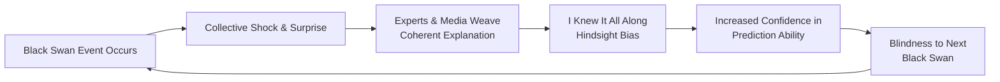

## Overview

*The Black Swan* is Nassim Nicholas Taleb's philosophical investigation into the
outsized role of rare, unpredictable, high-impact events in shaping history,
markets, and human affairs. Published in 2007 — just before the 2008 financial
crisis that became its most famous real-world demonstration — the book argues
that our institutions, models, and minds are systematically blind to the events
that matter most.

A Black Swan event has three attributes: it is an **outlier** (nothing in the
past convincingly points to it), it carries an **extreme impact**, and human
nature makes us conjure **retrospective explanations** that make it seem
predictable after the fact. Taleb's central claim is that almost every
significant historical change — the rise of the internet, WWI, 9/11, the 2008
collapse — comes from such events, yet our tools for understanding the world
(the bell curve, Gaussian statistics, economic forecasting) are designed to
ignore them.

The book is the second volume of the five-part **Incerto** series, following
*Fooled by Randomness* (2001) and preceding *The Bed of Procrustes* (2010),
*Antifragile* (2012), and *Skin in the Game* (2018).

## Executive Summary

### The Black Swan Triplet

| Attribute | Description |
|---|---|
| **Rarity** | Lies outside the realm of regular expectations; nothing in the past convincingly points to its possibility |
| **Extreme Impact** | The event carries consequences that reshape systems, markets, or history |
| **Retrospective Predictability** | After the fact, we concoct explanations that make it seem predictable — "I knew it all along" |

### Mediocristan vs Extremistan

| Domain | Characteristics | Examples | Statistical Behavior |
|---|---|---|---|
| **Mediocristan** | Mild randomness; no single observation can change the aggregate; thin-tailed distributions | Human height, weight, IQ, calorie intake, car accidents | Bell curve works; mean is representative; law of large numbers applies |
| **Extremistan** | Wild randomness; a single observation can dominate the total; fat-tailed distributions | Wealth, book sales, financial markets, war casualties, pandemics | Power laws rule; mean is meaningless; no "typical" event |

### The Narrative Fallacy Cycle

### Core Concepts

- **Black Swan**: Rare, high-impact, retrospectively predictable event
- **Mediocristan**: Domain where averages matter and extremes don't dominate
- **Extremistan**: Domain where extremes dominate and averages are meaningless
- **The Problem of Induction**: No amount of white swan observations proves no
  black swan exists (Hume's problem, illustrated by the turkey before
  Thanksgiving)
- **Narrative Fallacy**: Our compulsion to create causal stories from
  sequences of facts, making randomness seem orderly
- **Silent Evidence**: The graveyard of failures we never see — we only observe
  survivors
- **Confirmation Bias**: We seek evidence that confirms our beliefs and ignore
  what contradicts them
- **Ludic Fallacy**: Mistaking the constrained randomness of games for the
  open-ended uncertainty of real life
- **Platonic Fold**: The conflict between clean, crisp theoretical models and
  the messy, unpredictable real world
- **Epistemic Arrogance**: Overestimating what we know and underestimating
  uncertainty
- **Barbell Strategy**: Being hyperconservative in some areas (protecting
  against negative Black Swans) and hyperaggressive in others (exposing
  yourself to positive Black Swans)
- **Gray Swan**: A Black Swan that is somewhat predictable because it falls in
  a known extreme domain (e.g., "a big earthquake will eventually hit
  California")

## Key Takeaways

1. **History is dominated by outliers** — The most consequential events
   (wars, technologies, crises) are Black Swans, not predictable progressions.
2. **The bell curve is a fraud** — Applying Gaussian statistics to Extremistan
   (finance, wealth, social dynamics) creates an illusion of predictability
   and hides catastrophic risk.
3. **We are storytelling animals** — The narrative fallacy makes us believe we
   understand the past and can predict the future. We don't and can't.
4. **The turkey problem** — Noticing that the farmer feeds you every day does
   not mean the farmer loves you. Past data proves nothing about future
   safety, especially when the observer has a vested interest.
5. **Survivorship bias blinds us** — We see the winners and forget the silent
   graveyard of failures. This skews every inference we make about skill, luck,
   and causality.
6. **Prediction is a scandal** — Experts are worse at forecasting than they
   admit, yet we keep paying them. The scandal is not that they fail — it's
   that they fail and nobody talks about it.
7. **The ludic fallacy is everywhere** — Treating life like a casino (known
   odds, bounded outcomes) is a category error. Real uncertainty has unknown
   unknowns.
8. **Epistemic arrogance is dangerous** — Confidence in models is inversely
   correlated with the complexity of the domain. The most dangerous experts
   are those who don't know the limits of their knowledge.
9. **Stop predicting, start preparing** — Instead of forecasting which Black
   Swans will hit, build robustness against negative ones and exposure to
   positive ones. The barbell strategy is the practical answer.
10. **Not all uncertainty is equal** — Know whether you're in Mediocristan or
    Extremistan. The rules, tools, and strategies that work in one are
    dangerous in the other.

## Who Should Read

| Reader Profile | Why This Book |
|---|---|
| Investors and traders | Understand why standard risk models fail and how to build portfolios that survive crises |
| Entrepreneurs and innovators | Positive Black Swans are how fortunes are made — learn to position for them |
| Policy makers and regulators | Your Gaussian-based risk models create the very fragility they pretend to measure |
| Scientists and statisticians | The limits of induction and the danger of mistaking the map for the territory |
| Philosophers and epistemologists | A practical epistemology for living in a world you cannot fully understand |
| Anyone in a scalable profession (writer, musician, software developer) | Your field is Extremistan — understand the rules of the game |
| General readers who want to think better | The most lucid critique of prediction and certainty ever written |

## Who Should Avoid

| Reader Profile | Why Skip |
|---|---|
| Readers seeking a step-by-step investing playbook | The book diagnoses problems better than it prescribes solutions — *Antifragile* is the practical follow-up |
| Those put off by a combative, digressive style | Taleb is deliberately abrasive; the book reads like an argument, not a lecture |
| Beginners wanting a simple introduction to probability | The mathematical concepts are presented informally but require comfort with abstract ideas |

## Difficulty

**Medium-Hard**. The statistical concepts (power laws, fat tails, Mandelbrot
distributions) are explained without formulas, but the philosophy of knowledge
sections are dense. Taleb's digressive style — anecdotes, polemics, asides,
self-references — requires patience. Estimated reading time: **~9 hours**.

## Historical Context

Published in April 2007, *The Black Swan* arrived just months before the
subprime mortgage crisis triggered the global financial meltdown of 2008.
Taleb's critique of Gaussian-based risk models (Value at Risk, RiskMetrics,
Black-Scholes) and his warning that banks were sitting on "piles of
dynamite" looked prescient when the crisis hit. The book became a bestseller
not because Taleb predicted the crisis (he explicitly says he cannot predict
specific Black Swans) but because he described the *mechanism* by which such
crises arise and are ignored. The 2010 second edition added a lengthy
"On Robustness and Fragility" section responding to critics and extending the
argument.

## Related Books

| Book | Author(s) | Connection |
|---|---|---|
| *Fooled by Randomness* | Nassim Taleb | The first Incerto volume — luck, skill, and the illusion of success in markets |
| *Antifragile* | Nassim Taleb | The practical answer to Black Swans — how to build systems that benefit from disorder |
| *The Bed of Procrustes* | Nassim Taleb | Incerto volume 3 — aphorisms that distil Taleb's philosophy |
| *Skin in the Game* | Nassim Taleb | Incerto volume 5 — ethics and risk sharing in complex systems |
| *Superforecasting* | Philip Tetlock & Dan Gardner | The evidence-based counterpoint — some predictions can be made well under the right conditions |
| *The Signal and the Noise* | Nate Silver | A more measured take on prediction, forecasting, and statistical thinking |
| *How Not to Be Wrong* | Jordan Ellenberg | The power of mathematical thinking, including a fairer treatment of the Gaussian |
| *Fooled by Randomness* / *The Black Swan* | Nassim Taleb | Both cover overlapping territory; *The Black Swan* extends the critique to epistemology and history |
| *Black Box Thinking* | Matthew Syed | The role of failure in learning — complements Taleb on silent evidence |
| *The Logic of Failure* | Dietrich Dörner | Why complex systems defy prediction — grounding in cognitive science |
| *The Precipice* | Toby Ord | Existential risk through a Black Swan lens — the biggest negative Black Swans of all |

## Final Verdict

_** Rating: 9.0 / 10 ** _

*The Black Swan* is one of the most important books written in the 21st century.
Its central insight — that rare, high-impact events dominate history and our
tools are blind to them — is profound and durable. The 2008 crisis was an
uncomfortably perfect advertisement for the thesis.

The book has real flaws. Taleb's pugnacious style, while deliberate, becomes
exhausting. He overuses the Black Swan label until it risks meaning everything
and nothing. He is dismissive of quantitative methods to the point of
caricature. And the book's success created a paradox: Taleb's followers often
use his framework to do the very thing he warns against (retrospectively
explaining Black Swans as predictable).

Despite this, the book changed how an entire generation thinks about risk,
uncertainty, and knowledge. The distinction between Mediocristan and
Extremistan alone is worth the price of admission. The critique of Gaussian
hubris is devastating. And the practical message — build robustness, stop
predicting, embrace the unknown — is timeless.

Read it with the other Incerto volumes for the full picture: *Fooled by
Randomness* for the personal dimension, *Antifragile* for the constructive
program, and *Skin in the Game* for the ethical framework.
