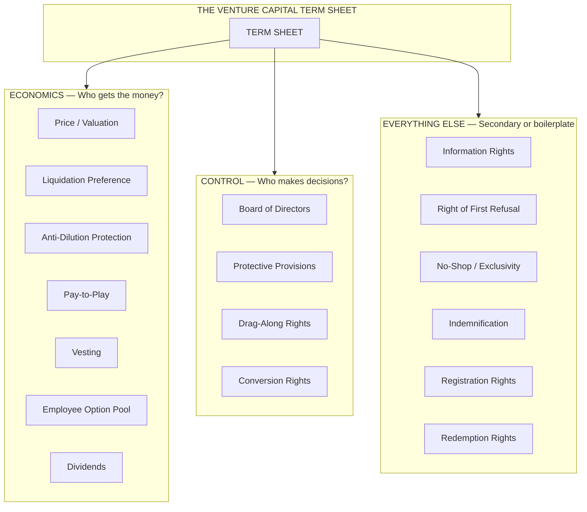
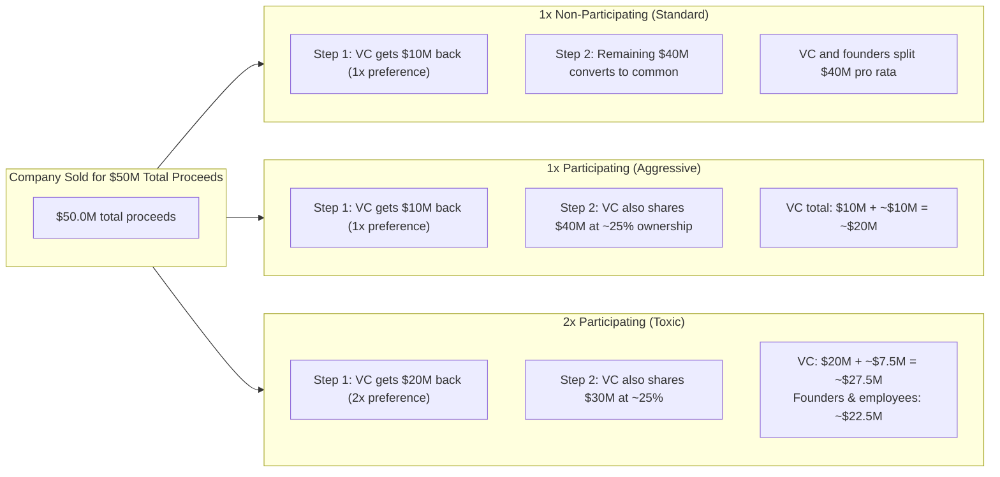
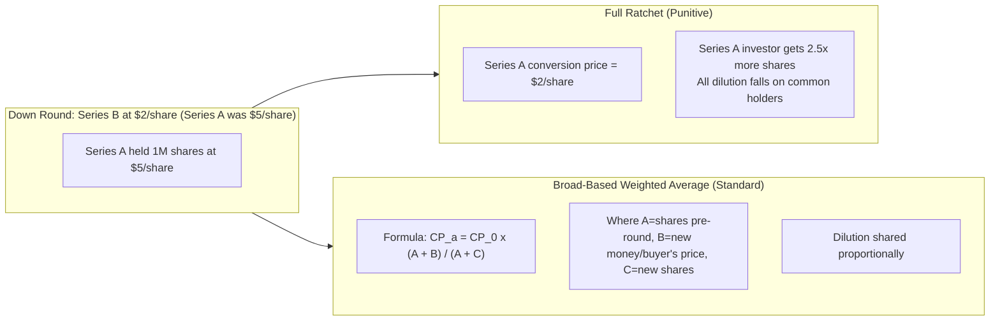
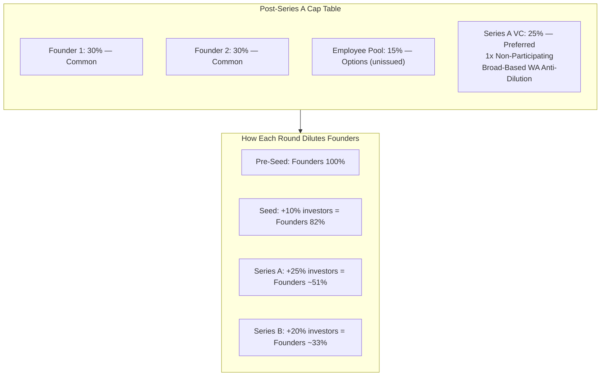
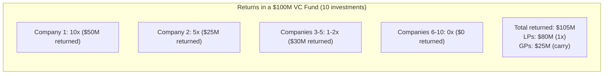

## The Two Axes: Economics vs. Control

Feld and Mendelson open with the framework that organizes every chapter that
follows: every provision in a venture capital term sheet belongs to one of two
categories. Economics answers "who gets the money?" — valuation, liquidation
preference, anti-dilution, pay-to-play, dividends, and the option pool all
determine who receives cash when the company is sold or liquidated. Control
answers "who makes decisions?" — board composition, protective provisions,
drag-along rights, and conversion rights determine who governs the company
between now and exit.

The practical consequence of this split is profound. First-time founders,
confronted by a dense 20-plus-page term sheet, tend to panic and defer to their
lawyer. Feld and Mendelson argue that lawyers are trained to think about legal
risk, not business risk. Entrepreneurs need to think about business outcomes.
Sorting every term into economics or control gives you a decision framework
without requiring legal expertise. If a term does not affect your payout or your
decision-making authority, it is almost certainly boilerplate — negotiate it only
if it is unusual or dangerous.

---

## Chapter 1: The Players

Before a term sheet exists, there are relationships to understand. Every
financing involves six categories of participant, each with distinct incentives:

**The Entrepreneur.** The person building the company and raising the money.
Their goal: maximize the probability and size of their exit. Their risk: dilution
of ownership and loss of control.

**The Venture Capitalist.** A professional investor who manages other people's
money (limited partners, or LPs). Their goal: generate returns that justify their
fund's existence. Their risk: making investments that fail to return capital. The
key nuance the authors introduce here is that not all VCs are the same. A seed-
stage micro-VC behaves differently from a $1 billion growth-stage fund. Understanding
which kind of VC you are talking to determines everything about negotiation
strategy.

**The Angel Investor.** An individual investing personal wealth. Angels can move
fast, accept higher risk, and bring personal networks. But they are not subject
to fiduciary duties to third parties, which means their motivations can be
mixed — some angels invest for ego, social connection, or tax loss harvesting in
addition to returns.

**The Syndicate.** When multiple investors participate in a single round, they
form a syndicate led by a lead investor. The lead negotiates the term sheet;
other investors usually sign it as-is. The book notes that the quality of your
lead investor matters enormously — a strong, fair lead protects you from other
investors pushing aggressive terms.

**The Lawyer.** Every company should have a lawyer who specializes in venture
capital. Not a general corporate lawyer, not a corporate finance lawyer who
does M&A — a venture capital lawyer. The difference matters: a VC-native lawyer
knows which terms are truly standard, which are regularly negotiated, and which
clauses in a first draft are red flags.

**The Mentor.** Experienced entrepreneurs who have been through the process.
The authors single out mentors as the most underutilized resource in fundraising.
A mentor who has raised multiple rounds can review a term sheet in fifteen minutes
and flag the three terms that matter — saving you weeks of lawyer time and
potentially millions of dollars in bad terms.

---

## Chapter 2: How to Raise Money

Chapter 2 is the practical how-to for the fundraising process itself. The
authors emphasize that raising venture capital is a process, not an event — and
that most founders who fail to raise money do so because of process failures,
not because of company quality.

### Do or Do Not; There Is No Try

The chapter opens with what might be its most memorable line: "Do or do not;
there is no try." Avoid the trap of "trying" to raise money as a bet — either
you are fully committed or you are not. Committed founders treat fundraising as
their primary job for the duration of the process.

### Determining How Much to Raise

The book pushes back against the instinct to raise as much as possible. A common
founder mistake: if a VC offers $5 million when I planned to raise $2 million,
I'll take it. The problem is that every dollar raised buys a certain amount of
runway. Raising too much at once means you will need fewer rounds, but each round
also usually comes with a higher valuation and more dilution. The authors suggest
raising enough for 18-24 months of runway — long enough to hit the milestones
that justify the next round, not so long that it creates complacency.

### Fundraising Materials

Two documents control the process. The pitch deck (10-15 slides) is a narrative
document — the story of the company, the market, the team, the product, traction,
and the ask. The data room is a structured repository of everything a VC might
need to see during due diligence: financial projections, cap table, legal
documents, customer contracts, IP assignments, resumes of key team members, and
product metrics. Most founders underprepare their data rooms — the book advises
building it *before* starting outreach, not after receiving the first serious
inquiry.

### Due Diligence Materials

VCs conduct due diligence across five areas: market (is the opportunity large?),
team (can these people execute?), product (is there product-market fit?),
financials (are the projections credible?), and legal (are there title issues,
contractual obligations, or IP disputes?). Founders who have not reviewed their
own cap table or IP assignments before due diligence begin are setting themselves
up for painful surprises.

### Finding the Right VC

The book advises extreme selectivity. A VC is not just a source of money — they
become a partial owner of your company and, if they take a board seat, a governor.
Miss the magazine articles and brand names. Study the firm's portfolio, talk to
their existing founders, and understand their fund size and stage focus. A seed-
stage VC with a $25 million fund cannot lead your $10 million Series A. A growth-
stage VC with a $500 million fund will not write a $500,000 seed check. Fit matters.

### Finding a Lead VC

Lead VCs negotiate the term sheet and anchor the syndicate. Non-lead investors
essentially sign the lead's term sheet. Choosing the right lead is the single
most important investor decision a founder makes. The book's criteria for a good
lead: relevant domain experience, active portfolio involvement (not just check-
writing), strong network for future rounds, and alignment on company direction.

### How VCs Decide to Invest

VCs evaluate investments along three dimensions simultaneously: team (60% of the
decision), market (30%), and product/traction (10%). This weighting surprises many
founders who spend 90% of their pitch on product features. The book recommends
allocating pitch time accordingly — more team story, more market sizing, less
feature walkthrough.

### Closing the Deal

From term sheet to wire transfer typically takes 4-8 weeks, largely driven by
legal review. The book's process step: sign the term sheet, engage specialist
lawyers on both sides, finalize definitive agreements, obtain board and shareholder
approvals, and receive the funds.

---

## Chapter 3: Overview of the Term Sheet

The term sheet is not a letter of intent. It is not a preliminary document that
"we'll figure out later." It is the blueprint for the entire investor-company
relationship — from the closing table through the next funding round, through the
exit. Every major point of disagreement should be resolved here, in the term
sheet, before lawyers bill hundreds of thousands of dollars on definitive
documents that essentially copy the term sheet.

Feld and Mendelson identify the key dimensions of any term sheet:

1. **Economics:** Price, preference, anti-dilution, pay-to-play, vesting, option
   pool, and dividends.
2. **Control:** Board seats, protective provisions, drag-along, conversion.
3. **Other terms:** Information rights, registration rights, right of first
   refusal (ROFR), co-sale rights, no-shop, and indemnification.

Each dimension is explored in its own chapter.

---

## Chapter 4: Economic Terms of the Term Sheet

### Price

Every term sheet states two numbers: **pre-money valuation** (the company's value
before the investment) and **post-money valuation** (pre-money plus the new cash).
The difference — the new shares issued — determines the dilution for all existing
shareholders.

Price per share (PPS) is the operative legal number. Valuation is a derived
concept. The PPS calculation works as follows: if pre-money is $8 million and
there are 8 million shares outstanding, PPS = $1.00. A $2 million investment at
$1.00 PPS creates 2 million new shares, and the post-money valuation is $10
million.

### Liquidation Preference

The most important economic term after price. Liquidation preference determines
which shareholders get paid first — and how much — when the company is sold or
liquidated. The standard is **1x non-participating**: preferred shareholders
receive back their original investment amount before any common stock holders
(employees, founders) receive anything. The critical clause: "non-participating"
means preferred holders choose either to take their preference OR to convert to
common and participate pro-rata. They take whichever yields more money.

The book's message is blunt: participating preferred (especially with multiples
above 1x) can leave founders and employees with nothing in a moderate exit. VCs
rarely ask for participating preferred at top-tier firms, but it appears
regularly in first-time fund and micro-VC term sheets. Founders should resist it
strongly.

### Pay-to-Play

If an investor cannot or will not participate in a future funding round, pay-to-
play clauses convert their preferred stock to common stock — stripping their
preference and anti-dilution rights. This aligns incentives: investors who do not
continue to back the company should not retain preferential rights that penalize
new (or existing) investors who do.

### Vesting

Founders typically receive stock that vests over four years, with a one-year
cliff (meaning no stock vests until the first year is complete). Without vesting,
a founder who leaves in month 13 still owns their full allocation — a significant
problem for investors. Accelerated vesting upon acquisition is a frequent point
of negotiation: single-trigger acceleration (full acceleration on sale) is almost
never granted by VCs; double-trigger acceleration (change of control + termination)
is standard in later rounds.

### Employee Pool

The option pool is almost always created from existing shareholders' capital —
meaning founders pay for it through dilution. The book highlights a "gotcha" that
consumes more founder ownership than most realize: a pre-money valuation of $8
million with a 20% option pool means the effective pre-money to founders is only
$6.4 million, not $8 million. The pool is set as a percentage of post-money, so
if you negotiate a higher pre-money but accept a larger pool, you may end up with
less founder ownership than a lower pre-money with a smaller pool.

### Anti-Dilution

Anti-dilution adjusts an investor's conversion price when the company issues
shares at a lower price in a future round (a "down round"). The standard form is
**broad-based weighted average**, which increases the investor's share count
proportionally. The punitive form is **full ratchet**, which resets the investor's
entire share count as if they had invested at the new, lower price.

Full ratchet anti-dilution is present in fewer than 5% of term sheets at
established firms, but it appears often in seed-stage deals where investors have
high leverage. It should never be accepted.

---

## Chapter 5: Control Terms of the Term Sheet

### Board of Directors

The board is the ultimate control mechanism. It hires and fires the CEO, approves
budgets, authorizes major transactions, and sets company strategy. A three-person
board with one founder, one VC, and one mutually agreed independent director is
the most common Series A compromise. As the company grows, boards expand — but
founders should resist letting VCs achieve a board majority (2 of 3, or 3 of 5)
before the company has strong product-market fit and revenue traction.

### Protective Provisions

These are veto rights held by preferred shareholders. They prevent the company
from taking major actions without the consent of a majority of preferred holders.
Standard provisions include: change of control, incurring debt above a threshold,
amending the charter to affect preferred rights, declaring dividends, and selling
substantially all company assets. The book advises founders to push back only on
*non-standard* protective provisions (such as a VC insisting on a veto over
hiring/firing specific executives) that give investors operational control.

### Drag-Along Rights

If a majority of preferred shareholders approve a sale, drag-along requires all
other shareholders — including founders holding common stock — to sell on the
same terms. This prevents a minority shareholder (a founder who disagrees with
the sale price, for example) from blocking a deal that benefits the majority.
From a founder's perspective, the critical negotiation point is the threshold:
require a super-majority of preferred holders (not a bare majority) to activate
drag-along, making it harder for a single large VC to force a sale.

### Conversion

Preferred shares are designed to convert to common stock at the holder's option
— typically in connection with a qualified IPO or when conversion yields a better
payout than taking the liquidation preference. Conversion is automatic upon an
IPO (usually defined as a $50M+ public offering or a $100M+ merger). Founders
should understand that in a successful exit, all preferred converts to common,
and everyone splits proceeds pro-rata — making the economics and control terms
during the private company phase the real determinants of economic outcome.

---

## Chapter 6: Other Terms of the Term Sheet

Chapter 6 rounds out the term sheet vocabulary with provisions that lawyers often
spend the most time drafting but that rarely, in practice, determine outcomes:

**Dividends.** Most VC term sheets include a 5-8% annual dividend on preferred
shares, compounding annually. In practice, dividends are almost never paid as
cash before an exit — they accrue and add to the preference stack at liquidation.
At 8% compounding for 5 years, this adds roughly 47% to the preference, which
matters in moderate exits.

**Redemption Rights.** Allow investors to demand that the company buy back their
shares after a specified period (typically 5-7 years). Rarely exercised (a company
that can afford to buy back investor shares usually doesn't need to), but provides
a stick for investors who want to pressure an exit as the fund nears its 10-year
life.

**Conditions Precedent.** Legal requirements that must be satisfied before
closing: board resolutions, shareholder consents, opinion letters from counsel.
These are standard; founders should ensure known issues (pending IP assignments,
unissued founder stock) are explicitly listed with clear timelines.

**Information Rights.** Preferred holders typically receive quarterly financials
and annual budgets. These are standard and reasonable. Founders should negotiate
for a threshold — above a certain ownership percentage, the default information
package should be reduced.

**Registration Rights.** When the company goes public, registration rights
determine when and how investors can sell their shares. S-3 registration (for
larger companies) allows "shelf" registrations; piggyback rights allow investors
to include shares in the company's IPO. The book advises founders to add a
standard 180-day lockup for all shareholders, including management, to signal
confidence to the market.

**Right of First Refusal (ROFR).** When a shareholder wants to sell their shares
(e.g., a founder leaving), the company or the investors get the right to buy those
shares before an outsider can. This prevents unwanted third-party shareholders
from entering the cap table.

**Voting Rights.** Preferred holders often vote as a separate class on matters
affecting their rights. Founders should ensure that ordinary course business
decisions do not require preferred shareholder approval.

**Restriction on Sales / Co-Sale Agreement.** Founders are typically restricted
from selling shares during the investment period. If they do sell (e.g., in a
secondary transaction), co-sale (tag-along) rights allow investors to sell a
proportional amount at the same price.

**Founders' Activities.** Non-compete clauses in the founders' stock purchase
agreements restrict founders from competing with the company while employed or
for a period after departure.

**Initial Public Offering.** The book notes that IPO provisions in term sheets
— thresholds, lockups, registration rights — should be treated as templates that
will be renegotiated at the IPO anyway, so founders should not spend excessive
political capital here.

**No-Shop Agreement.** Most term sheets include a no-shop clause preventing the
founders from soliciting offers from other investors for a period (typically
30-45 days). The book advises founders to keep this period short and to ensure
the no-shop is mutual — if the VC asks for a 30-day exclusivity window, the
founders should ask for matching language.

**Indemnification.** Standard provisions requiring the company to indemnify
directors and officers against claims arising from their service. Founders
negotiating their own indemnification from the company should ensure it is backed
by D&O insurance — directors without coverage are exposed to unlimited personal
liability.

---

## Chapter 7: The Capitalization Table

The cap table is the single source of truth about who owns what in the company.
Before reading this chapter, most founders think of ownership as a simple
percentage — "I own 50% of the company." After reading it, they understand that
ownership is a function of share class, share count, and the terms attached to
each class.

The book walks through a worked cap table example across four stages: pre-seed,
post-seed, post-Series A, and post-Series B. Each round illustrates how dilution
propagates and how option pool creation transfers value between shareholders.

Key insights from the chapter:

- Liquidate preferences (even at 1x non-participating) do not affect the cap
  table directly — they affect payouts at exit. The cap table shows share counts;
  the preference stack determines economic outcomes.
- A down round (new shares issued below the prior round price) triggers anti-
  dilution adjustments that increase the prior investor's share count, diluting
  everyone else. Founders rarely feel the full effect of their own anti-dilution
  protection because it is invisible in the cap table until the adjustment is
  calculated.
- Secondary sales (founders selling some shares to investors in a round) are
  increasingly common in later-stage deals. The book notes that secondary sales
  are good for founders (cash without selling the company) but can signal to new
  investors that founders may not be fully committed to the long term.

---

## Chapter 8: How Venture Capital Funds Work

This chapter is the book's deepest dive into investor behavior. The authors
explain that VCs are not monolithic players — they are professionals running
structured funds with complex incentives.

### Fund Structure

A typical VC fund is organized as a limited partnership: limited partners (LPs)
commit capital, general partners (GPs) manage the fund. LPs are pension funds,
endowments, foundations, and high-net-worth individuals. GPs are the VC firm.

### The Two Fees

VCs earn money two ways:

1. **Management fee:** 2% of committed capital per year, paid regardless of
   investment performance. This covers salaries, office, travel, and operations.
   On a $100 million fund, that is $2 million per year for 10 years = $20 million
   in fees before any investment returns. At smaller fund sizes, management fees
   are the primary income — the carry is speculative.

2. **Carried interest (carry):** 20% of profits after LPs have received back
   their capital (and sometimes a preferred return). Carry is where the big money
   is made — but only if the fund generates outsized returns. A $100 million fund
   that returns $300 million generates $200 million in profit; the GPs keep $40
   million (20% carry) and return $160 million to LPs.

### The Power Law

One venture investment concept shapes every other chapter in the book: the power
law of venture returns. In a typical $100 million fund, 2-3 companies generate
all the fund's returns. The next 5-10 return capital or make modest profits.
The remaining 10-15 are total losses.

This power law explains otherwise-strange VC behavior: why they push founders to
hire aggressively rather than profitably, why they want fast growth over slow
profitability, why they sometimes seem to prioritize portfolio wins over
individual company health. From the VC's perspective, every investment is either
a 10x or a failure. "Modest success" is not a goal — it is not enough to return
the fund.

### Fund Life and Timing

Funds are typically structured with a 10-year life: 3-5 years for investing,
5-7 years for harvesting (exits). This creates a timing pressure that founders
rarely understand. A VC who invested in your Series A in year 2 of their fund
needs an exit by year 7-8 — or their LPs will not give them another fund. This
means a VC may advocate for a sale at $50 million that founders think is too
cheap — because the VC needs to show returns to their LPs.

---

## Chapter 9: Negotiation Tactics

Chapter 9 is the strategic companion to the term-sheet literacy of chapters 4-6.
The authors assume you now understand the terms; this chapter teaches you how to
use that knowledge in the negotiation room.

### What Really Matters?

The book's hierarchy of importance:

1. **Valuation** is not the most important thing. Founders obsess over it;
   VCs know it is largely cosmetic. A $10 million valuation with a 20% option
   pool and 1x participating preferred is worse than an $8 million valuation
   with a 10% pool and 1x non-participating. Founders should optimize for
   economics + control, not the headline number.

2. **Board control** is more important than valuation. The person who controls
   the board controls the company. A VC board majority can fire the CEO, approve
   a sale the founders oppose, and change executive compensation.

3. **Liquidation preference** is the term most likely to leave you with nothing
   in an exit. This is the term you fight hardest on.

4. **Anti-dilution** determines how badly a down round hurts you. Accept broad-
   based weighted average; reject anything stronger.

5. **Everything else** is negotiable but secondary.

### Common Negotiation Tactics VCs Use

| Tactic | Description | Founder Response |
|--------|-------------|------------------|
| "This is standard" | Claims a term is non-negotiable | Ask: "Compared to what? Show me recent comparable deals." |
| Anchoring | Names an extreme first number | Counter with your own anchor derived from comparable companies. |
| The Nibble | Concedes on big terms, pushes on small ones | Push back consistently — death by a thousand cuts still kills you. |
| Delaying | Draws out process to weaken your position | Keep your process tight; set clear deadlines. |
| Good cop / bad cop | One partner is friendly, the other tough | Insist on negotiating with the decision-maker directly. |
| LP constraint | "My partners won't approve" | "What are their concerns? Let me address them directly." |

### The Single Most Important Negotiation Advice

Your leverage is your alternatives.

Every founder should run a simultaneous process: pitch 15-20 VCs over 2-3 weeks,
create competition, and generate multiple term sheets. The founder with one term
sheet negotiates from anxiety. The founder with three negotiates from confidence.
Multiple term sheets are not just bargaining chips — they give you information
about what terms are truly standard and what terms a single VC is trying to
extract because they think you won't know better.

---

## Reading Guide

### Sufficiency
For a first-time founder preparing to raise a priced equity round, this 288-page
first edition contains everything essential. Chapters 1-3 provide the preparation
and process guidance needed to manage the fundraising arc. Chapters 4-6 provide
term-sheet literacy — the core value of the book. Chapters 7-9 provide cap table
mechanics, investor economics, and negotiation strategy. No supplemental text is
required to understand a Series A term sheet after reading this book.

### Recommended Path
**First-time founders reading cover-to-cover:** Read chapters 1-6 in order.
These chapters build the mental model (economics vs. control) and then apply it
clause by clause. Then read chapters 8 and 9 together — understanding VC fund
economics first makes negotiation tactics more actionable. Chapter 7 (cap table)
can be read whenever it feels relevant; it is dense but worth a slow read.

**Experienced founders restudying before a later round:** Read chapters 4-6 as
a reference. Focus on chapters you have not negotiated before (e.g., if your
prior round involved only liquidation preference and price, spend extra time on
protective provisions and anti-dilution).

### Chapters to Skip (on first read)
- **Chapter 6 (Other Terms):** These are important but rarely the terms that
  make or break a deal. Review them with your lawyer rather than spending your
  initial reading time here.
- **Chapter 7 (Cap Table):** Read this early if you do not already maintain a
  cap table. If you use Carta or Pulley and understand dilution, read it as
  reference.

### Time Estimate
| Scenario | Time |
|----------|------|
| First read, cover-to-cover | 8-10 hours |
| Reference use (chapters 4-6) | 2-3 hours |
| Quick skim before next fundraise | 1-2 hours |