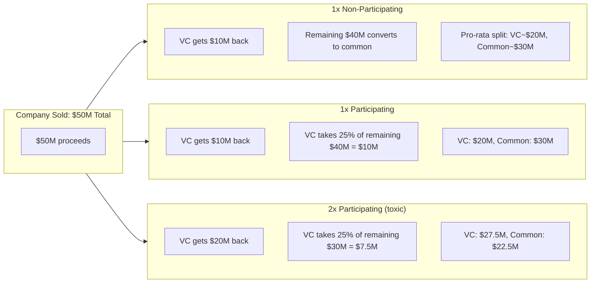
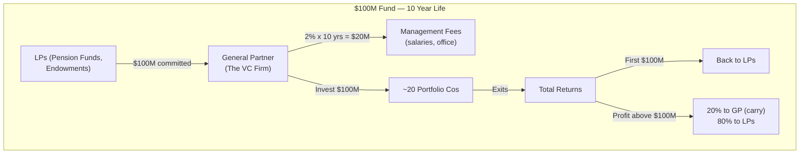

## Introduction

Welcome to BookAtlas. Today we're covering *Venture Deals: Be Smarter Than Your
Lawyer and Venture Capitalist* — the first edition, 2011, 288 pages, written by
Brad Feld and Jason Mendelson when they were managing directors at the Foundry
Group in Boulder, Colorado. This is the book that created a generation of term
sheet-literate founders.

We know the fourth edition (2019, 304 pages, Wiley). But the first edition
matters differently. It was narrower: 9 chapters covering the Series A term
sheet's economics, control provisions, the cap table, how VC funds work, and
negotiation. Before the SAFE. Before crowdfunding and rolling funds. Before the
seed-stage revolution. When the only path to institutional capital was the priced
equity round.

We're doing this differently from the usual two-voice narration. Today: one
first-time founder who read this book before her Series A in 2013, and one
operator who has been through six VC rounds including two exits. Both read the
2011 first edition specifically. Let's go.

---

## The Two Axes: How This Book Organizes Chaos

The book opens with what turned out to be its most important contribution:
splitting every term sheet clause into one of two buckets.

**Founder:** Before reading this, a term sheet felt like a legal document written
in a secret language. Every clause was equally terrifying. The economics-versus-
control split meant I could look at a 25-page term sheet and sort it in an hour:
these terms affect my payout, these affect who makes decisions, and these are
fill-in-the-blanks. That framework alone was worth the price of the book.

**Operator:** It's a useful heuristic. But founders I've worked with sometimes
over-simplify it. Vesting, for instance, is both economic and structural — it
affects your payout in an exit but also your control during the company's life.
Not everything cleanly splits. Still, as a first-pass framework? Unbeatable.

**Founder:** No first-pass framework is perfect. Before this book, my first-pass
was "call my lawyer." Now it's "call my lawyer on the terms that matter." That's
a huge difference — both in legal fees and in outcome quality.

---

## Term Sheets Are Blueprints, Not Letters of Intent

The book's most counterintuitive claim: a term sheet is binding in its most
important respects. Not fully legally binding — the definitive documents supersede
— but in the practices that actually matter. The no-shop clause, the exclusivity
period, the promise that the final documents will track the term sheet. Founders
who treat a term sheet as a "let's work out the details later" document are
making a strategic error.

**Founder:** I treated my first term sheet as a letter of intent. I thought the
real negotiation happened in the 60-page document that followed. The VC's lawyer
drafted it, and suddenly we had provisions we'd never discussed — a participation
feature on the liquidation preference, a full-ratchet anti-dilution clause
disguised as "standard." By then, I was exhausted from the fundraising process
and my lawyer advised signing. The book would have caught this at the term-sheet
stage, and I don't think that sentence is melodrama.

**Operator:** I've watched this happen repeatedly. The term sheet is where founders
have political capital. Two weeks later, with final documents in hand from the
VC's white-shoe firm and their lawyer running the clock at $600/hour, founders
fold. Get it right at the term sheet. Feld and Mendelson are emphatic about this,
and they're right.

---

## Valuation: The Number That's Not the Number

The option pool explanation is the book's most cited practical insight.

**Founder:** Here's the sentence that changed how I negotiate: "The employee
option pool is almost always included in the pre-money." So if you agree to a
$10M pre-money with a 20% pool, your effective pre-money is $8M. The pool is
priced into the valuation and you pay for it as the founder. I walked into a
follow-on negotiation knowing this and got my pool down from 15% to 10% — kept
an extra 5% of my company and never would have noticed without this chapter.

**Operator:** Now here's where I push back on the book. It tells you the pool
matters. It doesn't tell you how to figure out what the pool *should* be. The
right pool size depends on your hiring plan, your industry, and your expected
hiring timeline. A developer-heavy SaaS company at seed stage needs a different
pool than a biotech company at Series A. "Push back on the pool" is correct
advice, but you need a justification, not just a desire. The book mentions having
a hiring plan — one paragraph. It should be a whole section.

---

## Liquidation Preference: The Term That Can Leave You With Nothing

This is the book's strongest chapter. Not complicated — but devastating in its
implications.

**Founder:** Let me state this as clearly as the book does. If you have 1x
participating preferred and you sell your company for less than twice the total
VC investment, common shareholders — founders, employees — can receive *zero*.
Not less than they hoped. Zero. The math is in the book. I read it. Then I read
it again. Then I made sure my term sheet said non-participating.

**Operator:** And here is the reality the book doesn't say loudly enough: this
absolutely still happens. I've seen early-stage funds push participating preferred
at first draft and present it as "standard." The book says top-tier firms don't
do this. That's true — top-tier firms don't. But the startup ecosystem in 2011
was different from now, and there were hundreds of first-time funds and micro-VCs
who absolutely led with participating. The founders who didn't read this chapter
signed those term sheets. The book should be louder about how common the
aggressive terms are, not just about what the standard is.

---

## Anti-Dilution: Down Round Protection as Punishment

The distinction between **full ratchet** and **broad-based weighted average**
is the clearest example in the book of a "two-sentence explanation that prevents
a seven-figure mistake."

**Full ratchet:** If you raised at $5/share and later raise at $2/share, your
preferred share price is repriced to $2. You get 2.5x as many shares. All the
dilution falls on common holders.

**Broad-based weighted average:** The formula adjusts your price based on how
many new shares are issued relative to the total. You get some extra shares, but
dilution is shared proportionally.

**Operator:** Full ratchet is genuinely rare at reputable firms — the book says
"fewer than 5% of deals" and that's accurate for the 2011 era. But first-time
funds used it as leverage. Founders must recognize it when they see it.

**Founder:** I had a clause in my term sheet that my lawyer initially said was
"standard anti-dilution." When I asked whether it was broad-based weighted average
or ratchet, he had to call the VC's lawyer to check. The answer was full ratchet.
We pushed back. We got broad-based. But I wouldn't have known to ask without this
book.

---

## Board Control: Worth More Than Valuation

Feld and Mendelson's most important strategic claim in the book: the board matters
more than valuation. A $2M difference in valuation is a rounding error in an
acquisition. Loss of board control is not.

**Founder:** I used to think valuation was the scoreboard. Highest price = winner.
This chapter rewired me. After reading it, I realized I'd walk away from a $12M
valuation with a VC-majority board for $9M with a balanced one. The board owns
your destiny.

**Operator:** This is where the authors' VC bias shows most clearly, though.
They describe the three-person balanced board — founder, VC, independent — as
the standard compromise. And it is, at top-tier firms. But the independent
director is almost always drawn from the VC's network. The book says the
independent "often sides with the VC in practice" and they acknowledge this — but
they soften it. The board is not really balanced. Founders should be reading this
chapter and taking away: do everything in your power to propose and recruit your
own independent board member. The book mentions this. It needs a section on it.

---

## How VC Funds Work: Your Investor's Economics

This chapter is the book's secret weapon and the one thing founders genuinely
cannot learn from any other source.

**Founder:** Understanding this changed how I thought about everything my VCs
did. Why they pushed for aggressive growth and a quick sale even when I wanted
to build slowly? The fund has a 10-year lifecycle. Their LPs need exits by year
seven. Their math banked on one home run and three moderate successes. A "modest
success" that returns the fund but doesn't set it up for the next one is a
failure. Everything they asked for — the board seats, the growth targets, the
timeline — made sense once I understood the fund structure.

**Operator:** This is genuinely the best chapter in the book. No VC firm will
ever publish "here's how we make money and what it means for our behavior." Feld
and Mendelson are being transparent in a way that benefits the entire ecosystem,
even if it creates some distance between them and founders. It's the kind of
thing that builds long-term trust. And yes, they have an agenda — but the
information is real regardless.

---

## Negotiation: Leverage Is Everything

The book's single most actionable sentence: "Your leverage is your alternatives."
Founders with one term sheet negotiate from anxiety. Founders with three negotiate
from position.

**Operator:** This is the best advice in the book and the hardest to act on. How
does a first-time founder with 30 days of runway generate 15 warm intros and
three term sheets? The book tells you what to do — warm intros, a simultaneous
process, momentum — but not how to get the intro that gets the meeting. That part
is art, not process.

**Founder:** It helps to think about this before you need it. Build relationships
with investors before you need money. Six months of relationship-building before
your fundraise means those warm intros are already there when you need them.
The book mentions this in Chapter 2, but founders don't internalize it until
they've already waited too long.

---

## What the First Edition Contains That Later Editions Don't

Working from the actual table of contents of the 2011 first edition reveals its
narrower, more focused scope compared to what followed:

- 9 chapters, not 19+
- No SAFE instrument chapter (SAFE was released in 2013)
- No crowdfunding chapter (JOBS Act was 2012)
- No venture debt chapter
- No chapter on legal and procedural considerations (added in 4th edition)
- Original chapter list: introduction on the art of the term sheet; players;
  how to raise money; term sheet overview; economic terms; control terms; other
  terms; the capitalization table; how VC funds work; negotiation tactics

The 2011 edition is less comprehensive than its successors. It is also more
coherent. Every chapter serves the central thesis. There are no appendices on
bankers, no digressions into IPO mechanics, no coverage of later-stage rounds
beyond the M&A LOI comparison in Chapter 9. The book does one thing — it teaches
you the Series A term sheet — and it does it completely.

---

## Final Verdict

The 2011 first edition of *Venture Deals* is the definitive 288-page guide to a
specific transaction: the Series A venture capital financing. It is not a book
about building a company. It is not a book about being a CEO. It is a book about
reading and negotiating the contract that defines your relationship with your
investors — and that skill is a prerequisite for everything else that follows.

**Founder rating: 9/10.** Every founder who has read this before their first
round says the same thing: "I wish I'd read it six months earlier." The framework
sticks. The examples compound. The chapter on fund economics fundamentally changes
how you interpret investor behavior.

**Operator rating: 8/10.** Essential reading before your first round. After that,
it becomes reference material — and it's great reference. But it does not prepare
you for the emotional weight of a six-week fundraising process, and it treats
"standard" terms more charitably than reality warrants for founders outside
Silicon Valley's top-tier ecosystem.

The first edition — shorter, tighter, more focused than what followed — is the
purest expression of the book's core contribution: term sheet literacy for
founders who have never seen a term sheet before. Read it before your first fundraise.
Put it on your shelf. Pull it back down when the email subject line reads "Term
Sheet — DRAFT."

This has been a BookAtlas narration of *Venture Deals: Be Smarter Than Your
Lawyer and Venture Capitalist* (First Edition, 2011, 288 pages, Wiley) by
Brad Feld and Jason Mendelson. Thanks for listening.