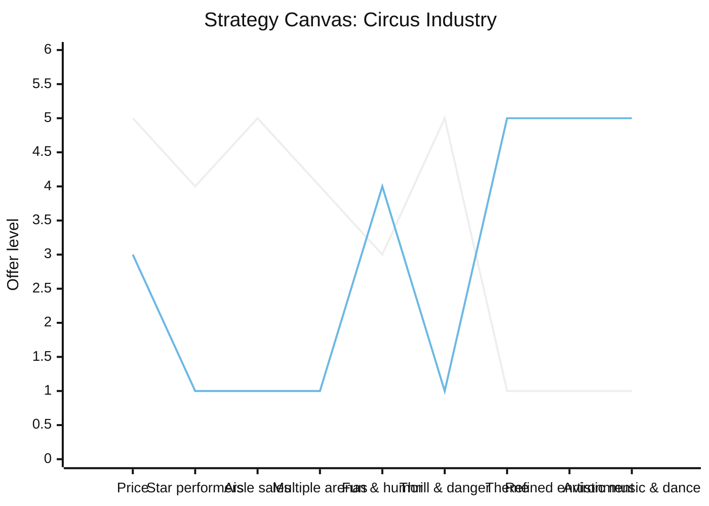

## The Red Ocean Trap

Every industry has visible boundaries. Companies know who their
competitors are, what customers want, and how value is delivered.
Competition is a zero-sum game: your gain is my loss. This is a **red
ocean**. The metaphor is deliberate — the water is shark-infested and
stained with blood. The harder you fight, the more you bleed.

Kim and Mauborgne argue that competing in red oceans is exhausting.
Supply exceeds demand in most sectors. Products become commodities
with shrinking differentiation. Price wars compress margins to near
zero. Growth slows, then stalls. Yet most companies double down: they
benchmark rivals, match features feature-for-feature, and chase the
same shrinking pool of customers. This is the structuralist view of
strategy — the assumption that industry conditions are fixed and
companies must position themselves within them.

The alternative is to create a **blue ocean** — an uncontested market
space that makes competition irrelevant. Blue oceans are not about
technology innovation or first-mover advantage. They are about **value
innovation**: a strategic move that creates a leap in value for both
the company and its buyers, opening new and uncontested demand.

The authors studied 150 strategic moves across 30 industries over 100
years. Their finding: 86% of business launches were line extensions
(incremental improvements within red oceans), yet they generated only
62% of total revenues and 39% of total profits. The remaining 14% —
blue ocean launches — generated 38% of revenues and 61% of profits.
The implication is stark: the biggest growth comes not from fighting
harder in existing markets but from creating new ones.

## Value Innovation: The Cornerstone

Value innovation is the simultaneous pursuit of differentiation and
low cost. Traditional strategy treats these as a trade-off based on
Porter's generic strategies. You can be differentiated (which implies
higher cost and higher price) or low-cost (which implies a standard
offering at a lower price). Blue ocean strategy rejects this
dichotomy as a self-imposed constraint.

The mechanism is not to benchmark competitors but to reconstruct
industry factors. Ask four questions: what can we **eliminate** that
the industry takes for granted? What can we **reduce** well below the
industry standard? What can we **raise** far above the current norm?
What can we **create** that has never been offered? This is the **Four
Actions Framework**, also called the ERRC grid. It forces a company to
challenge the strategic logic of its entire industry rather than
optimize within it.

Value innovation is not the same as value creation. You can create
value without innovating (incremental improvement). You can innovate
without creating value (technology for its own sake). Value innovation
requires both: an offering that is radically better for buyers and
radically more efficient for the company.

## The Strategy Canvas

The strategy canvas above compares the circus industry before and
after Cirque du Soleil. The horizontal axis lists the factors the
industry competed on. The vertical axis shows how much each competitor
offers on each factor. Traditional circuses invested heavily in star
performers, multiple arenas, and thrill — all high-cost factors with
diminishing returns. Cirque du Soleil eliminated star performers and
animals, reduced thrill and aisle sales, raised theme and refined
environment, and created new factors like artistic music and dance.

The result is a value curve that diverges from the pack. A strong blue
ocean strategy produces a value curve with three qualities: focus (the
company does not spread across all competitive factors), divergence
(the curve is different from rivals), and a compelling tagline that
anyone can understand. If the tagline is generic ("we offer
entertainment"), the strategy is not a blue ocean.

## The Six Paths Framework

Kim and Mauborgne offer six ways to reconstruct market boundaries:

1. **Across alternative industries** — look at substitutes beyond your
   industry's boundaries, not just direct competitors. Southwest
   Airlines looked at cars and buses, not just other airlines.
2. **Across strategic groups** — examine what both the low end and the
   high end of your industry do. Can you combine the best of both?
3. **Across buyer groups** — question who the buyer really is. The
   buyer, the user, and the influencer are often different people.
   Nintendo Wii targeted non-gamers: the elderly, parents, and young
   children whom Sony and Microsoft ignored.
4. **Across complementary offerings** — think about what happens
   before, during, and after your product is used. Solve the full
   experience, not just the product.
5. **Across functional-emotional orientation** — if your industry
   competes on price and function, add an emotional dimension. If it
   competes on feel and image, strip to function.
6. **Across time** — anticipate trends that are observable today but
   not yet exploited. Ask what your market will look like in five
   years if those trends play out.

Each path challenges the assumption that an industry's boundaries are
fixed by nature. Applied systematically, they reveal blue ocean
opportunities that head-to-head competition hides.

## Reaching Beyond Existing Demand

Red ocean strategies focus on retaining and winning existing customers
from rivals. Blue ocean strategies grow the market by tapping
non-customers. The book identifies three tiers of non-customers:

- **First tier** — people on the edge of your market who buy the
  minimum necessary and are ready to leave at any moment. They have no
  loyalty. Understand their reasons for leaving and design them out.
- **Second tier** — people who consciously choose not to use your
  industry's offering. They see your product as something that does
  not meet their needs or is too expensive, complex, or intimidating.
- **Third tier** — people in untouched markets who have never even
  considered your offering. They are the deepest and most valuable
  pool of new demand.

By understanding why each tier stays away, a company can design an
offering that pulls them in. [Yellow Tail] wine did this by
eliminating the complexity that intimidated casual drinkers — the need
for vintage knowledge, food pairing expertise, and cellar storage.
The result was a wine anyone could enjoy, and it became the fastest-
growing brand in the history of the Australian wine industry.

## Getting the Strategic Sequence Right

Not every idea that creates new demand is commercially viable. Many
blue ocean ideas fail because they pass the creativity test but fail
the business test. Kim and Mauborgne propose four sequential tests:

1. **Buyer utility** — does the offering unlock a compelling
   experience for buyers? Map the buyer's experience cycle: purchase,
   delivery, use, supplements, maintenance, and disposal. Identify the
   pain points that your offering removes.
2. **Price** — is the price accessible to a mass of buyers? Use the
   price corridor of the mass to find the highest price most of the
   target market will pay, not the lowest price you can afford.
3. **Cost** — can you produce at the target price and still profit?
   Use target costing: start with the strategic price and subtract the
   desired profit margin to arrive at the target cost. Drive cost
   innovation across the value chain to meet that number.
4. **Adoption** — what hurdles will block adoption? Business buyers
   must overcome channel partner reluctance, regulatory barriers, and
   internal resistance. Consumer buyers need to overcome awareness,
   accessibility, and habit.

A blue ocean idea must pass all four. If it fails buyer utility,
rethink the offering. If it fails price, raise utility. If it fails
cost, innovate the business model. If it fails adoption, address the
hurdles head-on. This sequence prevents visionary ideas that never
make money from getting resources they do not deserve.

## Tipping Point Leadership and Fair Process

Most strategy books stop at formulation. This one goes further into
execution. **Tipping point leadership** recognizes that every
organization has four hurdles to strategic change:

- **Cognitive hurdle** — people do not see the need for change. They
  are complacent or blind to the strategic reality.
- **Resource hurdle** — people believe they lack the budget, time, or
  talent to implement the new strategy.
- **Motivational hurdle** — people are not inspired to act. They are
  tired, cynical, or burned out from past change efforts.
- **Political hurdle** — powerful vested interests block change.
  Internal fiefdoms and external relationships resist disruption.

The solution is to concentrate resources not on spreading efforts thin
but on the **kingpins** — the factors that have disproportionate
influence. To overcome the cognitive hurdle, put managers face-to-face
with the worst operational failure rather than showing them slides. To
overcome the resource hurdle, find the resources you already have that
are misallocated. To overcome the motivational hurdle, focus attention
on a single extreme performer who embodies the change. To overcome the
political hurdle, enlist the most respected person in the organization
as a visible champion.

**Fair process** is the behavioral foundation of execution. People
accept even painful strategic change when they experience three
things: engagement (their views are genuinely sought and considered),
explanation (the rationale behind the decision is transparent), and
expectation clarity (the new rules, consequences, and success criteria
are clearly communicated). Fair process may slow decisions initially,
but it dramatically accelerates execution because people trust the
outcome and commit to it.

The book closes with a reminder that blue ocean strategy is not a
single event. Markets evolve. Blue oceans attract competition and turn
red. The strategic challenge is not to defend a blue ocean forever but
to continually create new ones. This is the cycle of value innovation
that sustains profitable growth across economic cycles and industry
shifts.
