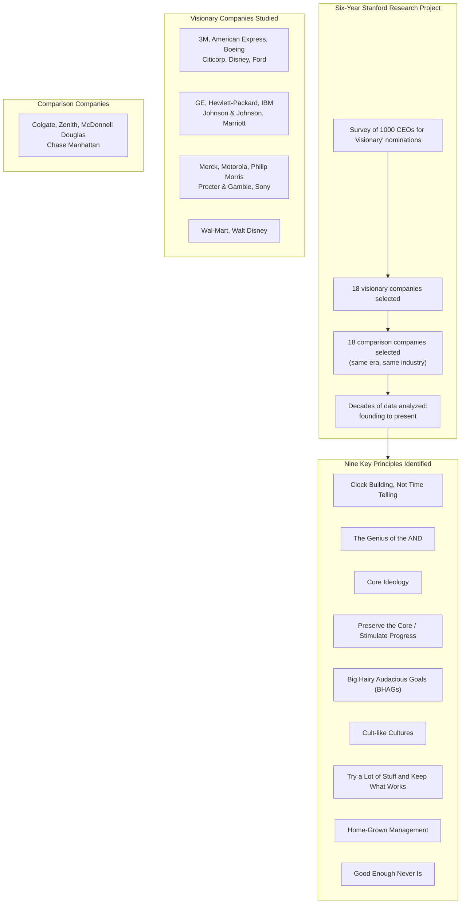

## The Research Framework

---

## Principle 1: Clock Building, Not Time Telling

The most important distinction in the book. A "time teller" has a great
idea or is a charismatic leader. A "clock builder" creates an
organization that can produce great ideas and great leadership
repeatedly, across generations.

Collins and Porras found that visionary companies were rarely founded
by charismatic visionaries. David Packard (HP) was reserved and
methodical. William Procter (P&G) was a candle maker, not a visionary.
Ken Olsen (DEC) built a culture of engineering excellence that
outlasted him.

The key is institutionalizing greatness — creating processes, culture,
and values that persist regardless of who occupies the CEO role.

---

## Principle 2: The Genius of the AND

Visionary companies reject the "Tyranny of the OR" — the belief that
you must choose between A or B. Instead, they embrace the "Genius of
the AND" — pursuing both simultaneously:

| Tyranny of the OR | Genius of the AND |
|-------------------|-------------------|
| Purpose OR profit | Purpose AND profit |
| Stability OR progress | Stability AND progress |
| Consistency OR innovation | Consistency AND innovation |
| Ideology OR adaptability | Ideology AND adaptability |
| Long-term OR short-term | Long-term AND short-term |
| Control OR autonomy | Control AND autonomy |

Example: Merck pursues groundbreaking medical research (purpose) while
consistently ranking among the most profitable companies. Johnson &
Johnson's credo prioritizes customers first and shareholders last — and
this has produced exceptional shareholder returns.

---

## Principle 3: Core Ideology

Core ideology = core values + core purpose.

- **Core values** are a small set of guiding principles (3-5) that
  require no external justification. They are intrinsically important
  to the organization.
- **Core purpose** is the organization's reason for being — its
  fundamental reason to exist beyond making money.

Examples:
- **HP:** "Trust and respect for individuals" (core value)
- **3M:** "To solve unsolved problems innovatively" (core purpose)
- **Disney:** "To make people happy" (core purpose)

Core ideology is discovered, not invented. It already exists in the
organization and must be surfaced, not created from scratch.

---

## Principle 4: Preserve the Core / Stimulate Progress

This is the central dynamic of visionary companies. They hold their core
ideology fixed while changing absolutely everything else — strategies,
structures, products, markets — to stimulate progress.

Progress is stimulated through:
- BHAGs
- Cult-like cultures
- Evolutionary experimentation
- Continuous improvement

---

## Principle 5: BHAGs (Big Hairy Audacious Goals)

A BHAG is a clear, compelling, and daring goal that:
- Has a clear finish line (you know when you've reached it)
- Requires extraordinary effort to achieve
- Stretches the organization beyond its current capability
- Takes 10-30 years to accomplish

Examples:
- **Boeing:** "Create the 707 jet — dominate commercial aviation" (1950s)
- **NASA:** "Put a man on the moon and return him safely by the end of
  the decade" (1961)
- **Wal-Mart:** "Become a $125 billion company by 2000" (1990)
- **Sony:** "Become the company most known for changing the worldwide
  image of Japanese products as being of poor quality" (1950s)

BHAGs work because they create focus, energy, and a sense of shared
purpose. They are not "stretch goals" — they are genuine leaps.

---

## Principle 6: Cult-like Cultures

Visionary companies are not merely strong cultures — they are nearly
cult-like in their intensity and alignment. This is a positive trait:
- Clear, non-negotiable values that everyone understands
- Employees either fit perfectly or leave
- Rigorous selection and socialization processes
- A sense of being part of something special

Examples:
- **Disney:** Cast members, not employees. Strict grooming standards.
  Every new hire goes through Disney University.
- **IBM:** Blue suits, white shirts, company songs. An IBM identity
  that transcended the workplace.
- **Procter & Gamble:** Brand management system as a cultural identity.
  P&G alumni are disproportionately successful elsewhere.

The key: cult-like does not mean cult. Membership is voluntary and
aligned with autonomy of thought within a framework of shared values.

---

## Principle 7: Try a Lot of Stuff and Keep What Works

Visionary companies make their luck through experimentation. They are
not necessarily better at strategic planning — they are better at
evolutionary progress:

| Company | Experiment | Result |
|---------|------------|--------|
| 3M | Weak glue that didn't bond well | Post-it Notes |
| Sony | Failed tape-based video recorder | Walkman (miniaturization lessons) |
| HP | Oscillators, calculators, printers | Diversified electronics giant |
| Johnson & Johnson | Baby powder as surgical supply | Consumer health division |

The mechanism: **variation + selection + retention.** Try many things,
keep what works, amplify the successes.

---

## Principle 8: Home-Grown Management

Visionary companies promote from within at dramatically higher rates
than comparison companies. In 170 years of combined history at 3M, GE,
HP, P&G, and Sony — only four CEOs came from outside.

Benefits:
- Preserves core ideology across leadership transitions
- Creates deep bench of culturally-aligned talent
- Rewards long-term contribution and institutional knowledge
- Avoids the disruption of external cultural resets

Comparison companies, by contrast, were more likely to hire external
CEOs who changed strategy and culture, often destabilizing the
organization.

---

## Principle 9: Good Enough Never Is

Continuous improvement is institutionalized. Visionary companies have
no finish line — they treat "good enough" as an oxymoron.

This manifests as:
- Relentless process improvement (kaizen)
- Long-term investment in capabilities
- Self-imposed discomfort that prevents complacency
- Setting higher standards as existing ones are met

The comparison: Wal-Mart's "sundown rule" (answer inquiries by sunset)
and "10-foot rule" (greet anyone within 10 feet) — seemingly small
standards that compound into cultural excellence.

---

## Key Lessons

- Build the clock, don't tell the time
- Discover your core ideology — it already exists
- Core values are fixed; everything else is fluid
- Set BHAGs that stretch the organization
- Create intense cultural alignment around shared values
- Experiment relentlessly and amplify successes
- Develop leaders from within
- Never be satisfied
- Embrace paradox: purpose AND profit, stability AND change
- Great companies were not founded by great visionaries

---

## Practical Applications

### For CEOs

- Lead a process to discover (not create) your company's core ideology
- Set a BHAG with a clear finish line and 10-30 year horizon
- Audit your promotion practices — are you developing home-grown
  leaders?
- Create mechanisms for evolutionary experimentation (like 3M's 15%
  rule)

### For Entrepreneurs

- Focus on building the institution, not the product
- Define core values before the team grows beyond 10 people
- Don't worry about a scarcity of great ideas — build a system that
  generates them

### For Managers

- Ask: does this decision preserve our core or compromise it?
- Create alignment through shared values, not rules
- Cultivate dissatisfaction with "good enough" in your team

---

## Action Plan

1. **Assemble a core ideology team** — Include people who remember the
   early days of the organization
2. **Discover core values** — Ask: "What values would we hold even if
   they became a competitive disadvantage?"
3. **Define core purpose** — Ask: "Why do we really exist beyond making
   money?"
4. **Set a BHAG** — One audacious goal that will take 10-30 years
5. **Audit your culture** — Is it aligned with your core ideology, or
   is there drift?
6. **Increase internal promotions** — Develop leadership pipelines
7. **Create experimentation mechanisms** — 3M 15% time, innovation
   funds, skunkworks
8. **Embrace the AND** — Identify where you have been choosing between
   trade-offs and find ways to pursue both
9. **Never declare victory** — Continuous improvement is permanent
