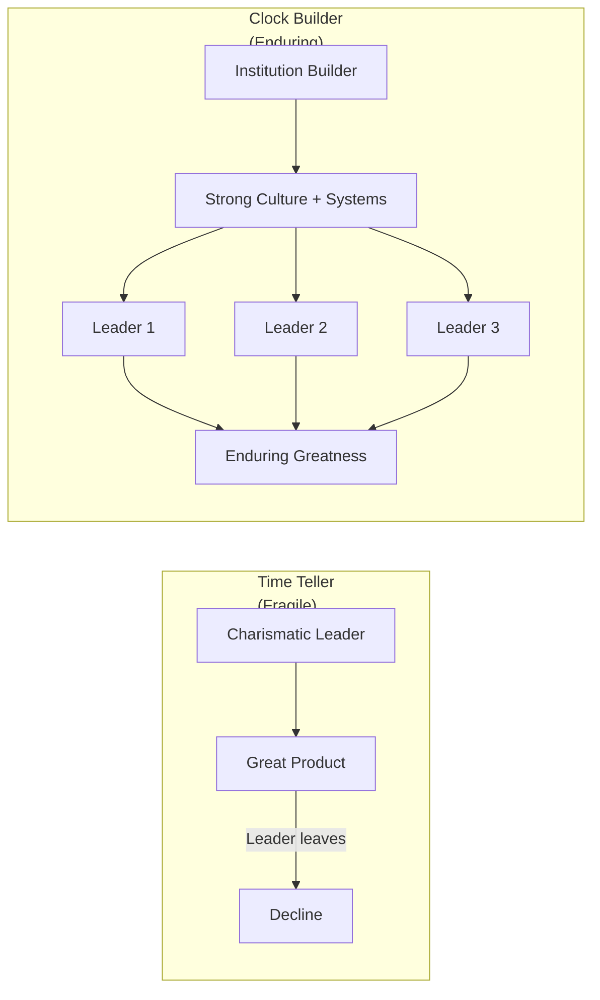

## Introduction

Welcome to BookAtlas. Today: *Built to Last: Successful Habits of
Visionary Companies* by Jim Collins and Jerry Porras. Published 1994,
HarperBusiness. 368 pages.

This is the book that launched Jim Collins's career as the preeminent
researcher of organizational greatness. It was followed by *Good to
Great*, *How the Mighty Fall*, and *Great by Choice*. Together, they
form the most influential research program in modern management.

But here's the uncomfortable question: if these companies are "built to
last," why have so many of them struggled? Motorola. Boeing. HP. Merck.
Does the framework still hold?

Let's settle this with two voices. A CEO who built their company's
strategy around Collins's principles. And a skeptic who thinks the
survivorship bias makes the whole enterprise suspect.

---

## The Myth of the Visionary Leader

The book's most famous debunk: visionary companies were not founded by
visionary leaders. They were built by people who focused on the
institution, not their own charisma.

**CEO:** This finding changed how I lead. My job is not to be the hero.
My job is to build systems, culture, and values that outlast me. The
"clock building, not time telling" distinction reframed my entire
purpose as a CEO.

**Skeptic:** That's a powerful reframe. But let's look at the data:
Jack Welch at GE, Sam Walton at Wal-Mart, Walt Disney at Disney. These
ARE charismatic visionaries. Collins says the companies succeeded
despite that, not because of it. I'm not sure the data supports that
distinction.

---

## Core Ideology and BHAGs

**CEO:** Core ideology — discovering what we stand for — was the most
valuable exercise we ever did. It took us six months. We surfaced that
we genuinely valued craftsmanship and long-term relationships. Those
became filters for every strategic decision.

**Skeptic:** But here's the problem: every company eventually discovers
"integrity" and "customer focus" as core values. If everyone has the
same core values, they don't differentiate. Collins's response is that
core values must be genuinely held, not just stated — but in practice,
most company values statements are interchangeable.

**CEO:** I disagree. The differentiation isn't in the words — it's in
which values you're willing to sacrifice for. Would you hold a value
even if it became a competitive disadvantage? That's the real test.

---

## BHAGs: The Good and The Bad

**CEO:** BHAGs are genuinely powerful. We set one: "Become the
reference platform in our industry by 2030." It changed our hiring,
our R&D investment, and our partnership strategy. Before the BHAG, we
were drifting. After, we had direction.

**Skeptic:** Boeing also had a BHAG. It led them to prioritize
production speed over quality, with catastrophic results. BHAGs can
create a dangerous "ends justify the means" mentality. The book doesn't
address how to set BHAGs that stretch without breaking the
organization.

---

## Cult-Like Cultures

**CEO:** The cult-like culture chapter gets unfairly criticized. Collins
doesn't advocate for mind control — he advocates for having the courage
to say "this is who we are, and if you don't fit, you won't be happy
here." That's honest, not oppressive.

**Skeptic:** The problem is that cult-like cultures tend to select for
conformity and suppress dissent. Collins celebrates Disney's grooming
standards and IBM's dress code. Today we'd call that exclusionary and
rigid. The companies that adapted best — like IBM's pivot to services
under Gerstner — succeeded because they BROKE the cult-like culture.

---

## The Verdict: Still Relevant?

**CEO:** Absolutely. The principles are not guarantees — they are
probability enhancers. A company with strong core ideology, ambitious
goals, and aligned culture is more likely to endure than one without.
The fact that some visionary companies have fallen doesn't invalidate
the framework. It proves that you must practice the principles
continuously.

**Skeptic:** I think the book's value is more modest than its
reputation. It's a useful corrective to the "cult of the CEO" and the
"great idea" myths. But the core framework — discover your values, set
big goals, build strong culture — is now standard advice. It was
revolutionary in 1994. Today, it's table stakes.

**CEO:** That's exactly why it's a classic. The ideas have been so
thoroughly absorbed that we forget they came from this book.

---

## Final Thoughts

*Built to Last* changed how business leaders think about their
organizations. Its core insight — that building an institution is more
important than having a great product or being a charismatic leader —
remains as important today as it was in 1994.

The survivorship bias critique is real and limits the strength of the
conclusions. But the matched-pair research design and the persistence
of the principles across Collins's later work suggest the findings are
more than retrospective rationalization.

Whether "built to last" is possible for any company in an era of
disruptive change is an open question. But trying to build a clock is
surely better than just telling the time.

This has been a BookAtlas narration of Built to Last by Jim Collins and
Jerry Porras. Thanks for listening.
