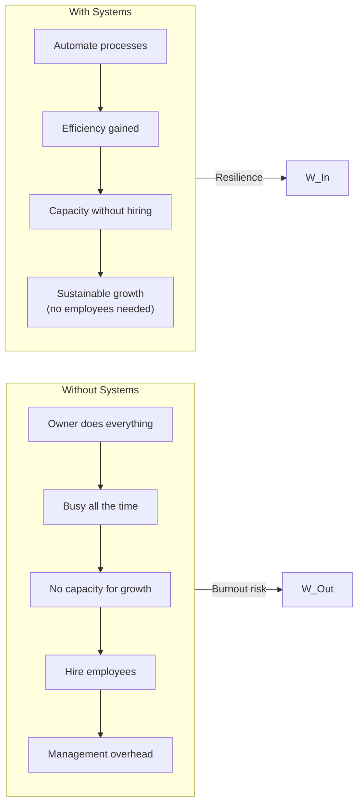

## The Company of One Mindset

```mermaid
flowchart TB
    subgraph Traditional["Traditional Startup Mindset"]
        GR["Grow at all costs"] --> VC["Raise venture capital"]
        VC --> UR["User acquisition > revenue"]
        UR --> US["Unprofitable scale"]
        US --> E["Exit or burnout"]
    end

    subgraph CompanyOfOne["Company of One Mindset"]
        P["Profitability first"] --> SS["Sustainable scale"]
        SS --> C["Control & freedom"]
        C --> RE["Resilience & adaptability"]
        RE --> F["Work serves life"]
    end
```



The fundamental shift: from "how big can we get?" to "how good can we
make this while staying small?"

---

## Part 1: The Mindset

### Growth is Not the Default

Most business advice assumes growth is the goal. Jarvis questions this
assumption. Growth has costs: complexity, stress, management overhead,
loss of control, loss of the ability to do your best work.

The right question: **Does growth serve your goals, or do you serve
growth's goals?**

### Profitability is Freedom

A profitable business gives you choices:
- You can fire a bad client
- You can turn down work that does not interest you
- You can take time off
- You can invest in quality over volume
- You can say no to investors

An unprofitable business takes choices away. You take any client, any
project, any terms — because you have to.

---

## Part 2: The Strategy

### Saying No

The most important skill in a Company of One is knowing what to reject:

| Say No To | Say Yes To |
|-----------|------------|
| Clients who do not value your work | Clients who value expertise and pay for it |
| Projects outside your expertise | Projects that leverage your strengths |
| Growth for growth's sake | Growth that improves profitability |
| Meetings without agendas | Asynchronous communication |
| Feature creep | Simplicity and focus |

### Systems Replace Employees



Key systems:
- **Invoicing and accounting** — automate recurring billing
- **Customer onboarding** — templates and checklists
- **Content marketing** — scheduled, repurposed, systematic
- **Sales** — standard proposals, automated follow-ups
- **Project delivery** — repeatable processes

---

## Part 3: The Execution

### Pricing for Value

Most small businesses underprice. Jarvis's formula:

```
Price = Value of the outcome to the customer, not the cost of your time
```

| Bad Pricing | Good Pricing |
|-------------|--------------|
| $200/hour for consulting | $5,000 for a strategy that saves the client $50,000 |
| Cost-plus (materials + markup) | Value-based (what is the result worth?) |
| Matching competitor rates | Unique expertise premium |

### Direct Customer Relationships

A Company of One controls the customer relationship directly. This is
a moat:
- No platform can cut you off from your customers
- You own the mailing list
- You build trust directly
- You get unfiltered feedback

---

## Part 4: The Life

### Work as Part of Life

The goal is not work-life balance (which assumes work and life are
separate and adversarial). The goal is **integration** — work that fits
around your life.

This means:
- Setting boundaries (no 24/7 availability)
- Working fewer hours but more focused hours
- Taking time off without guilt
- Choosing projects that energize rather than drain

### Resilience Through Adaptability

A Company of One adapts faster than any large organization. When the
market shifts, you pivot immediately — no board meetings, no
consensus-building, no change management.

The risk: you are the entire business. If you stop working, the
business stops. The mitigation: systems that run without you,
emergency funds, and diversified revenue streams.

---

## Key Lessons

- Growth is optional — profitability is the only goal
- Saying no protects your ability to deliver excellence
- Systems and automation replace the need for employees
- Price for value, not for time
- Direct customer relationships are your competitive advantage
- Simplicity in everything reduces stress and increases quality
- Work should serve your life, not consume it
- Resilience comes from adaptability, not size
- Bootstrapping gives you control; VC takes it away
- You can build a great business without ever scaling

---

## Practical Applications

### For Freelancers

- Raise your prices — you are probably undercharging
- Fire your worst client — the freed time is worth more than the
  revenue
- Build one system this week (automate invoicing or onboarding)

### For Solopreneurs

- Audit your offerings — can you simplify your product line?
- Question whether you need to hire or just need better systems
- Build an emergency fund — 6 months of expenses

### For Aspiring Entrepreneurs

- Start with a service business (lower risk, faster cash flow)
- Bootstrap before seeking investment
- Focus on profitability from day one

---

## Action Plan

1. **Define your ideal lifestyle.** How much do you need to earn? How
   many hours do you want to work? What kind of work do you enjoy?
2. **Audit your current situation.** Are you working toward your own
   goals or someone else's?
3. **Simplify your offerings.** Cut products or services that do not
   meet your profitability threshold
4. **Build one system.** Pick the most repetitive task in your
   business and automate it
5. **Say no to one bad opportunity this week**
6. **Raise prices for your next client**
7. **Read one case study** from the book and implement one insight
