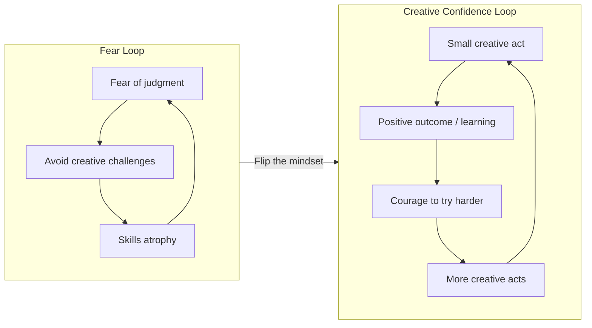
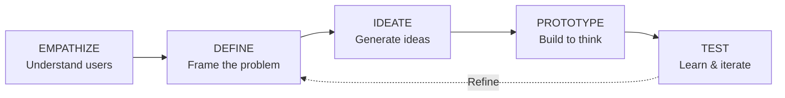

## The Creative Confidence Loop

The core of the book: creative confidence is built through a virtuous
cycle. Each small creative success gives you the courage to attempt
larger challenges. The starting point is not skill — it is permission
to try.

---

## Design Thinking Process

### Stage 1: Empathize
The foundation of human-centered design. Go beyond what people say to
understand what they do, think, and feel. Techniques: observation,
interviews, immersion, shadowing.

### Stage 2: Define
Synthesize empathy findings into a clear problem statement. A good
problem statement is human-centered, actionable, and specific enough
to guide ideation without being so narrow as to constrain it.

### Stage 3: Ideate
Generate a large quantity of ideas without judgment. Techniques:
brainstorming, bodystorming, worst possible idea, SCAMPER. The goal
is divergent thinking — defer judgment, build on others' ideas.

### Stage 4: Prototype
Turn ideas into tangible artifacts. A prototype can be a sketch, a
storyboard, a role-play, a foam model, or a wireframe. The key is
speed and low fidelity — prototype to learn, not to validate.

### Stage 5: Test
Put prototypes in front of real users. Observe how they interact.
Learn what works and what doesn't. Then iterate — refine the problem
definition, generate new ideas, build new prototypes.

---

## The Seven Creative Strategies

| Strategy | Description |
|----------|-------------|
| Flip | Change your mindset from "I'm not creative" to "I can grow" |
| Dive | Immerse yourself in real human experiences |
| Spark | Connect unrelated ideas to generate novel concepts |
| Leap | Jump from insight to action without over-analysis |
| Seek | Actively look for feedback and learning opportunities |
| Courage | Push through fear, rejection, and self-doubt |
| Recharge | Protect your creative energy; boredom is part of the process |

---

## Key Lessons

- **Creativity is a practice, not a personality trait.** You don't need
  to be born creative. You need to practice creative habits.
- **The inner critic is not your friend.** Self-censorship is the most
  common reason good ideas never see the light of day.
- **Quantity leads to quality.** The best ideas emerge after you have
  exhausted the obvious ones.
- **Action cures fear.** The fastest way to overcome creative anxiety is
  to make something — anything — and put it in front of someone.
- **Iteration is the engine of improvement.** No first draft is a
  masterpiece. Creative confidence means trusting the revision process.

---

## Practical Applications

### For Individuals
- Start a daily creative practice: write 500 words, sketch for 15
  minutes, take one photo
- Use "Yes, and..." thinking in meetings instead of "Yes, but..."
- Keep an idea journal; capture everything, judge nothing

### For Teams
- Run brainstorming sessions with strict ground rules: defer judgment,
  go for quantity, build on others, one conversation at a time
- Prototype before you debate — build a rough mockup instead of arguing
  about specs
- Celebrate failure: hold "failure parties" to share lessons from
  experiments that did not work

### For Organizations
- Give people permission to experiment: allocate 10-20% of time to
  creative projects
- Hire for cognitive diversity: different backgrounds produce richer
  ideas
- Design physical spaces that encourage collaboration and spontaneous
  encounters
