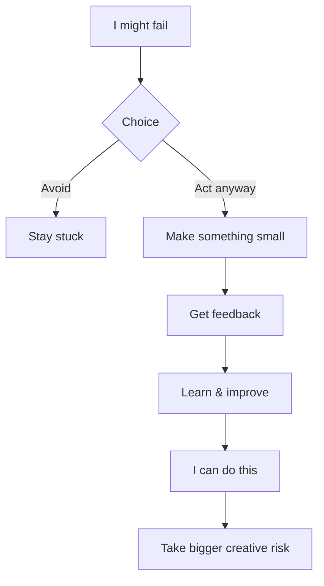

## Introduction

Welcome to BookAtlas. Today: *Creative Confidence* by Tom and David
Kelley. Published 2013. The book that says: you are creative. You just
forgot.

The Kellley brothers are the founders of IDEO and the Stanford d.school.
They have spent decades watching people freeze up when asked to be
creative. This book is their diagnosis and prescription.

---

## The Myth of the Creative Type

**Coach:** The single most destructive belief in our culture is the idea
that some people are "creative" and others are not. We tag artists and
designers as creative, while engineers, accountants, and lawyers are
seen as analytical. This is nonsense.

**Skeptic:** But surely there are real differences in creative ability?
Some people are better at generating novel ideas than others.

**Coach:** Of course. Just like some people are better at math. But could
you learn math? Yes. Creativity is the same. It's a skill that can be
developed with practice. The problem is that most people stopped
practicing in elementary school — when a teacher told them their drawing
was wrong or their idea was silly — and never started again.

---

## Design Thinking: Creativity's Operating System

**Coach:** The Kelley brothers didn't invent design thinking, but they
popularized it better than anyone. The five-stage process —
empathize, define, ideate, prototype, test — is a systematic way to
generate and refine creative ideas.

**Skeptic:** But isn't design thinking just a buzzword? I've seen
corporate workshops where people put Post-its on walls and call it
innovation.

**Coach:** That's bad design thinking. Real design thinking starts with
empathy — not Post-its. You must understand the user deeply. The
Post-its come later. And they must lead to prototypes, not just more
Post-its.

---

## From Fear to Action

**Coach:** The secret is to start small. Not "I'm going to design a
revolutionary product." But "I'm going to sketch three ways to improve
this form." Each small creative act builds the muscles for the next
one.

**Skeptic:** That works for people who have the luxury of time and
psychological safety. In a high-pressure corporate environment, people
don't have permission to fail small.

**Coach:** Then the problem is organizational, not personal. And the
book does address this — leaders must create the conditions for
creativity to flourish. But ultimately, the first step is individual.
Someone has to decide to try.

---

## The Verdict

**Coach:** Creative Confidence is the book I give to people who say "I'm
just not creative." It opens a door. It does not contain everything you
need — but it gives you permission to start looking.

**Skeptic:** It's a good pep talk. But pep talks are not training
programs. For real creative skill development, you need practice,
feedback, and time — things no book can give you.

**Coach:** Agreed. But the pep talk is the first step. And this is a
very good pep talk.

---

## Final Thoughts

Creative Confidence is not a deep book. It does not advance the theory
of creativity. But it achieves something harder: it makes people believe
they can be creative. For the millions of people who abandoned their
creative selves in childhood, that belief is the foundation everything
else builds on.

This has been a BookAtlas narration of Creative Confidence by Tom and
David Kelley. Thanks for listening.
