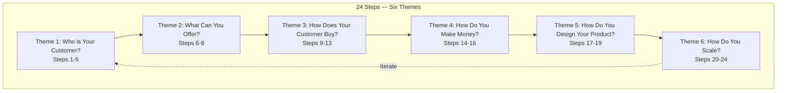
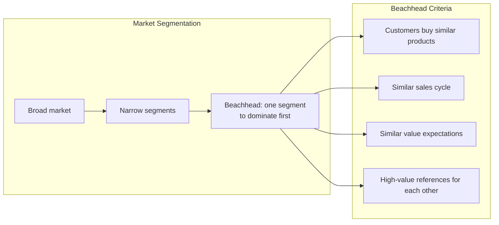
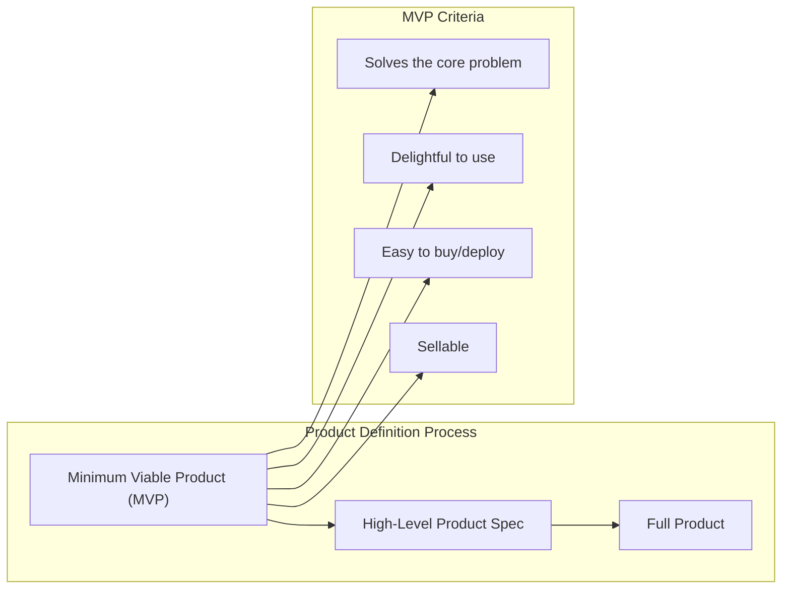

## The 24 Steps Overview

Aulet's framework progresses through six themes:

---

## Beachhead Market

The most important concept in the book. A beachhead market is a
narrow, specific market segment that you can dominate before
expanding.

Criteria for selecting a beachhead:
- Customers are well-funded and ready to buy
- Customers can easily refer other customers
- The market is large enough for a sustainable business
- You have a compelling offering for this specific segment

---

## End-User Profile

Create a detailed persona of your target customer:

| Attribute | Example |
|-----------|---------|
| Job title | VP of Engineering |
| Age range | 35-50 |
| Responsibilities | Platform architecture, team management |
| Pain points | Slow deployment, reliability issues |
| Budget authority | Approves purchases up to $100K |
| Goals for the year | Reduce downtime by 50% |

This profile guides every subsequent decision — product features,
pricing, sales channels, messaging.

---

## Product Definition

---

## Key Lessons

- **Your customer is the most important person in your business.**
  Everything else follows from understanding them.
- **Narrow your focus to win.** A beachhead market is counter-
  intuitive — you want to go after everyone — but it works.
- **Talk to customers.** Primary research is not optional. Surveys
  and data are useful, but conversations reveal what matters.
- **Iterate on the process.** The 24 steps are not a one-time
  checklist but a cyclical framework.
- **Quantify everything.** From market size to customer acquisition
  cost to unit economics — measure what matters.

---

## Action Plan

1. **Segment your market.** Start broad, narrow to a specific
   beachhead that meets the five criteria.

2. **Build an end-user profile.** Interview at least 10 potential
   customers. Document their day, pains, and goals.

3. **Define your MVP.** What is the smallest product that solves
   the core problem and is sellable?

4. **Map the buying process.** Who decides, who influences, who
   pays? Your sales strategy depends on this.

5. **Calculate unit economics.** Know your customer acquisition cost
   (CAC) and lifetime value (LTV) before building.
