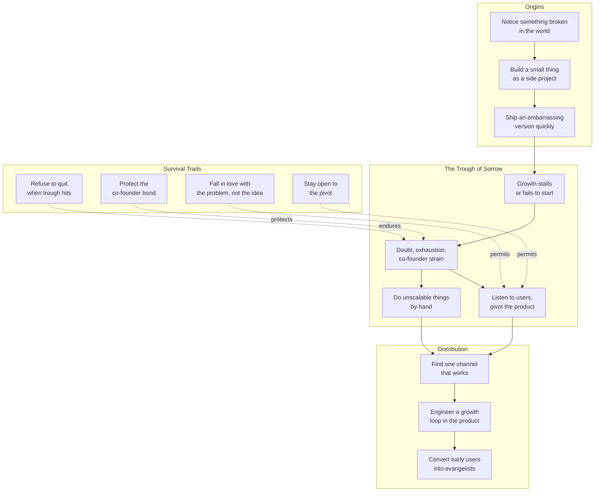

# Core Concepts

The book has no single thesis. Instead, it surfaces a set of patterns
that emerge across interviews. These are the ones that show up most
consistently, drawn from the founders' own words.

---

## 1. The Trough of Sorrow

The single most universal pattern. Nearly every founder in the book
describes a period — usually six to eighteen months after launch —
when:

- The product is not growing as fast as projected.
- Investors are skeptical.
- Friends and family are quietly worried.
- The founder is sleeping poorly.

Steve Wozniak describes the slow early days of Apple, when the Apple
II was selling but the company was burning through cash. Max Levchin
recounts the moment PayPal's fraud rate briefly spiked to alarming
levels, threatening the entire business. Caterina Fake talks about
the months after Flickr's launch when usage stalled.

Livingston's insight, which she later helped Graham turn into a Y
Combinator talk, is that the trough is not a sign the company is
failing. It is a sign the founder has not yet found product-market
fit. Most companies that survive it describe the same moment: an
unexpected use case, a small group of power users, or a feature that
finally clicked.

> "There's a moment where you don't know what's going to happen. You
> have to just keep going. The ones who make it are the ones who
> didn't quit." — Jessica Livingston, introduction

The book is in some ways a long meditation on what makes someone
keep going during that trough.

---

## 2. Do Things That Don't Scale

The phrase has since been overused, but the principle is one of the
clearest themes in the book. Paul Graham's chapter is the most
explicit, but almost every founder describes a period of doing
embarrassingly manual work.

- **Hotmail**: Bhatia and Jack Smith personally emailed early users to
  ask what they thought. They would respond within hours.
- **Stripe**: Patrick and John Collison integrated their first
  merchants by hand, writing custom code, sitting on calls, flying
  to meet customers.
- **Apple**: Woz delivered Apple I computers to the Byte Shop in
  person. He had to drive them there to demonstrate they worked.
- **Flickr**: Fake and Stewart Butterfield personally replied to
  early user emails and photos.

The pattern is consistent. The unscalable thing — the hand-rolled
onboarding call, the personal email, the handwritten thank-you note —
is the thing that gives the founder the information they need to
build something users actually want. It is also the thing that no
sensible business school professor would recommend, which is partly
why it works. Most competitors are not willing to do it.

---

## 3. Find Something Broken, Then Fix It

Most founders in the book did not start with a clever idea. They
started with frustration. They saw a system that was stupid, slow, or
inconvenient, and they could not stop thinking about how to fix it.

- **Sabeer Bhatia** wanted to read his email from any computer,
  because he was tired of being chained to his desk at work. The
  internet existed. The products did not. Hotmail was the fix.
- **Mike Lazaridis** wanted a device that would page executives with
  urgency, not just notify them. BlackBerry was the fix.
- **Evan Williams** wanted a way to publish online without knowing
  HTML. Blogger was the fix.
- **Caterina Fake and Stewart Butterfield** wanted a way to share
  photos with the small group of people in their lives who would
  actually care. Flickr was the fix.

The book rarely features founders who started with a "what if"
whiteboarding session. Almost all of them start with "I was angry
that this was bad."

---

## 4. Co-Founder Fit Is Destiny

A surprising number of chapters include a paragraph about
co-founder conflict. The topic is rarely the headline, but it
comes up:

- **Max Levchin and Peter Thiel** (PayPal) — survived the famous
  clash over whether PayPal should even exist. The company almost
  didn't.
- **Sabeer Bhatia and Jack Smith** (Hotmail) — Smith left within two
  years, just as the company was hitting scale. Bhatia has spoken
  about how hard that was.
- **Patrick and John Collison** (Stripe) — explicitly say in their
  interview that the relationship with each other is the most
  important thing they have, and that they have worked to keep it
  that way.
- **Evan Williams and Meg Hourihan** (Blogger) — Hourihan left the
  company. Williams has since said the dynamics of that period
  contributed to the stress that led to his later burnout.

Livingston returns to the topic repeatedly because it is one of the
few things every founder agrees on: the relationship with your
co-founder is the most important relationship in the company. The
idea matters less.

---

## 5. Speed Beats Polish

Nearly every company in the book launched small. Often the launched
version was almost embarrassing in its simplicity.

- **Apple I** was a bare circuit board. The first version did not
  even have a case.
- **PayPal** was called Confinity and was a Palm Pilot app for
  encrypting money transfers. The web product came later.
- **Flickr** was a side feature of a multiplayer game that nobody
  was playing.
- **Stripe** launched as a single-page developer tool with a tight
  focus on a small set of API primitives.

The pattern: ship the smallest possible thing that could possibly
work, watch what users do with it, and only then build more. This
anticipates Eric Ries's *Lean Startup* by several years, but
Livingston's version is more honest. The early versions were not
"minimum viable products" by any methodology. They were desperate
attempts to learn something, fast.

---

## 6. Persistence Is the Only Common Trait

Livingston's longest section in her introduction makes a simple
argument: if you line up all the founders in the book and ask what
they have in common, the only thing that survives the filter is
stubbornness.

The founders do not share intelligence, education, family
background, age, or even industry. They do not all have brilliant
co-founders. They do not all start with capital. They do not all
have original ideas. What they all have, without exception, is the
ability to keep going when the trough of sorrow would have justified
quitting.

This is not a popular conclusion. It does not feel actionable. But it
is the most consistent pattern in the book, and Livingston is careful
not to overstate it. She does not say persistence is sufficient. She
says it is necessary.

---

## 7. The Myth of the Original Idea

Almost no founder in the book built the company they originally
imagined. The pivots are staggering in their consistency:

- **Flickr** was a feature in a failed multiplayer game.
- **Twitter** was a side project at Odeo. It survived the company's
  failure.
- **PayPal** was originally an encryption company. The payments
  product was an accident.
- **Hotmail** was originally called *HoTMaiL* and positioned
  differently at every stage.
- **Viaweb** started as a generic "store builder" and only later
  focused on the small-business segment that made it work.
- **Blogger** was a personal project Williams built to scratch his
  own itch.

Livingston's quiet lesson: ideas matter less than the founder's
ability to recognize when the world is telling them something. The
best founders in the book did not fall in love with their idea. They
fell in love with the *problem* and let the solution change as they
learned.

---

## 8. Distribution Often Beats Product

A subtle but recurring theme: by the time most of these companies
became famous, the product was good but not dramatically better than
alternatives. What made them win was distribution.

- **Hotmail** grew from 0 to millions of users mostly because every
  free email ended with "Get your private, free email at
  http://www.hotmail.com." It was a growth hack years before the
  term existed.
- **Flickr** grew because of a famous integration with a popular
  blogging platform. The integration mattered more than the product.
- **BlackBerry** won enterprises not because the device was
  technically superior but because Lazaridis spent years building
  relationships with corporate IT departments.

The lesson is uncomfortable for product people. Most successful
companies were not just the best product. They were the best product
*at a moment when they also figured out distribution.* Livingston
does not editorialize on this, but the pattern is consistent enough
to deserve attention.

---

## 9. Living Through the Loneliness

Several founders describe the experience of founding in surprisingly
similar terms: a kind of loneliness that has no good analogy in
regular life. You cannot fully explain the problem to friends, family,
or even employees, because they are not carrying the same weight.

Wozniak describes the period after Apple started succeeding but
before the IPO. Levchin describes the months when PayPal was
hemorrhaging money and he was the only one who could write the code
to fix it. Williams describes the burnout that came after Blogger
was acquired by Google.

Livingston's decision to include these stories in full is what
distinguishes the book from a standard startup narrative. Most
business books end at the IPO. This one is more interested in the
years before it, when the founder had no one to talk to and the
company was not yet a sure thing.

---

---

## 10. The Founders Who Are Not in the Book

Livingston's selection is not random. She deliberately includes a mix
of household names (Apple, PayPal, Twitter) and lesser-known stories
that surprised her (Half.com, Cygnus Solutions, the early days of
Pixar, the founding of Macromedia). The balance is the point. The
book is not a victory lap over famous founders. It is a survey of
what early-stage building looks like across a representative sample.

Notable absences are themselves instructive. There are no founders
from companies that failed. There are no founders from outside the
US. There are no founders from outside tech. The book is honest about
its scope, but its lessons travel further than its sample suggests —
which is both a strength and a limitation.
