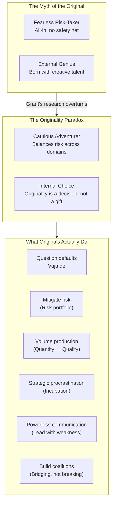
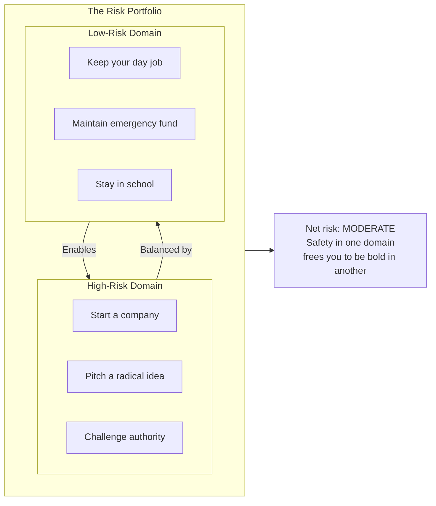
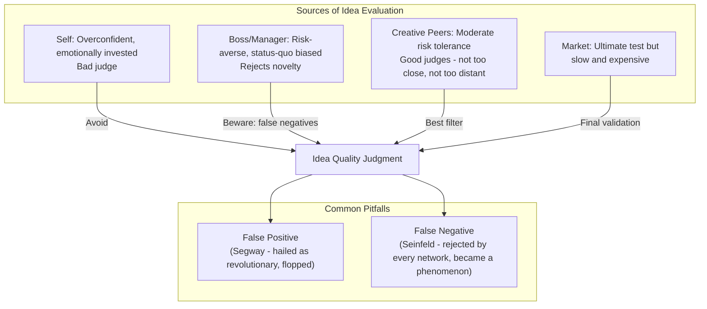
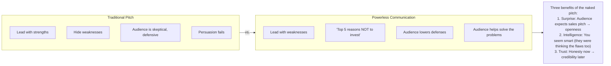
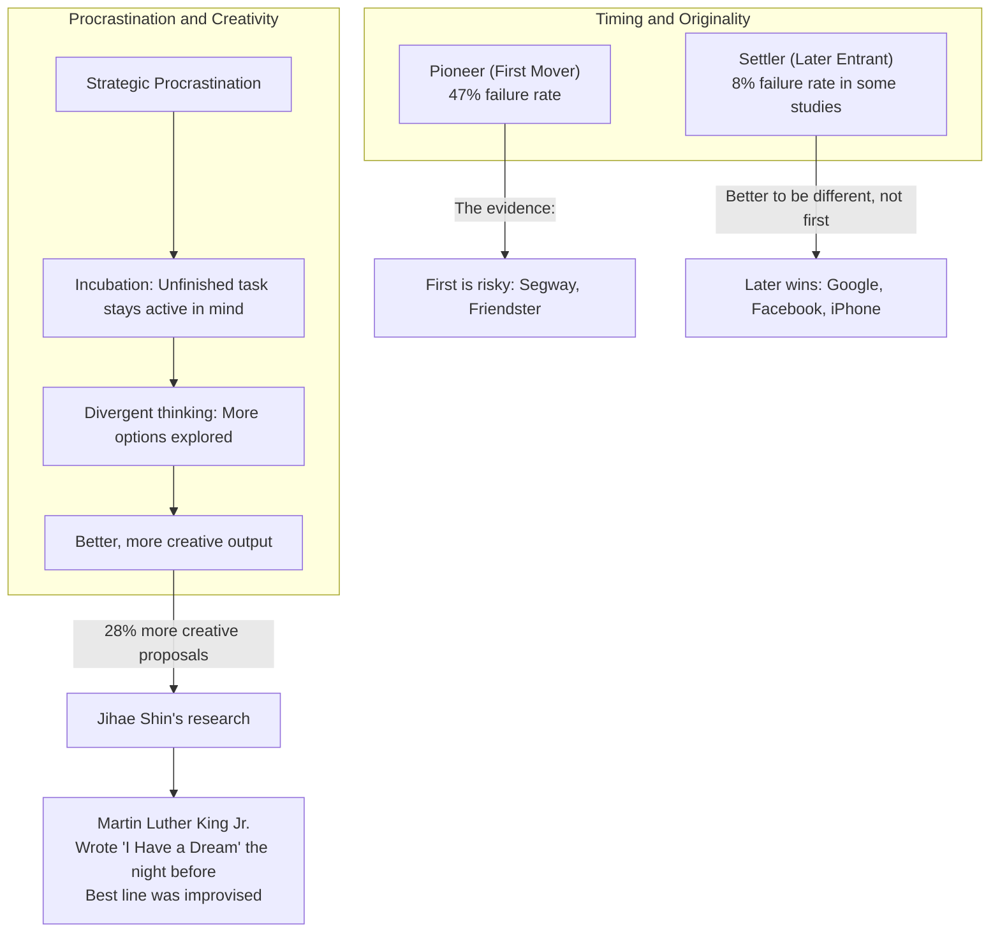
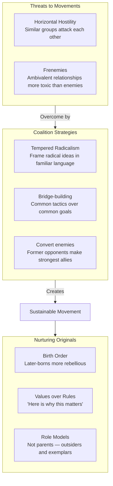
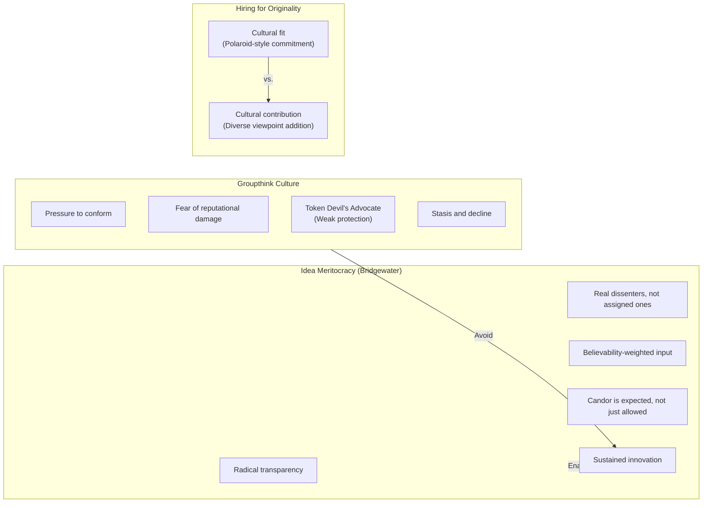
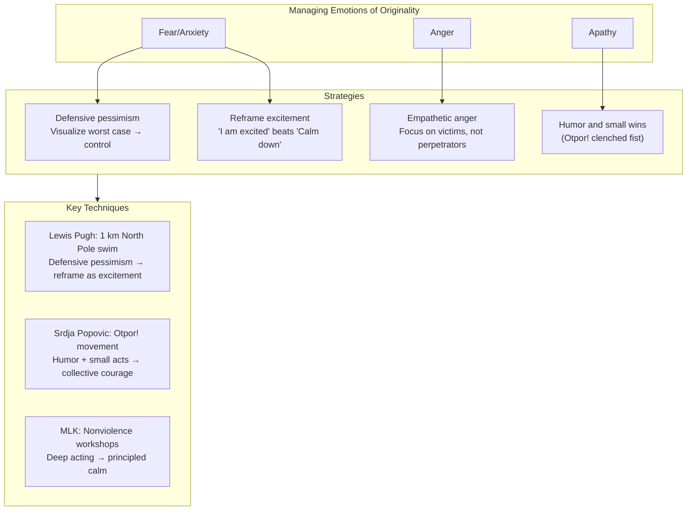

## The Originality Paradox

Grant opens with a confession: he passed on investing in Warby Parker
because the founders stayed in school and kept backup jobs. He assumed
they lacked conviction. In fact, that caution was the reason they
succeeded. This sets up the defining tension of the book:

The paradox: originals feel the same fear and doubt as everyone else.
They are not born with thicker skin. What distinguishes them is the
choice to act despite the fear, supported by structures that limit
downside.

---

## Risk Portfolio Theory

Grant's most innovative concept borrows from finance: just as a wise
investor balances high-risk assets with safe ones, originals balance
their overall risk profile by playing it safe in some domains so they
can gamble in others.

Grant cites research: entrepreneurs who kept their day jobs had a 33%
lower failure rate than those who quit everything to launch. The
conventional wisdom — that success requires betting the farm — is
backwards. Having a safety net makes you bolder, not more cautious,
because it removes the existential terror of failure.

---

## The Idea Lifecycle

The book follows the journey of an original idea from conception to
institutionalization:

```mermaid
flowchart LR
    subgraph Phase1["Phase 1: See"]
        Q["Question defaults<br/>Vuja de"]
        G["Generate many ideas"]
    end

    subgraph Phase2["Phase 2: Select"]
        E["Evaluate through peers<br/>(not bosses, not self)"]
        C["Choose the right idea<br/>(avoid false positives)"]
    end

    subgraph Phase3["Phase 3: Pitch"]
        PW["Powerless communication<br/>(lead with weakness)"]
        T["Right timing"]
        SP2["Strategic procrastination"]
    end

    subgraph Phase4["Phase 4: Scale"]
        CO["Build coalitions"]
        TR["Tempered radicalism"]
        DI["Institutionalize dissent"]
    end

    Phase1 --> Phase2 --> Phase3 --> Phase4
```

---

## Vuja De: Seeing the Familiar as Strange

The comedian George Carlin described deja vu as seeing something new
and feeling like you have seen it before. Grant's concept of vuja de
inverts this: seeing something familiar and perceiving it as though
for the first time.

Originals practice vuja de by questioning defaults — the settings,
norms, and assumptions everyone else accepts. Examples from the book:

- **Default browser**: Employees who installed a different browser on
  their work computer were more innovative across the board. The small
  act of questioning a default signaled a mindset.
- **Eyewear pricing**: Warby Parker questioned why glasses cost
  hundreds of dollars. The default was "that is what glasses cost."
  Their vuja de moment led to a billion-dollar company.
- **CIA information sharing**: Carmen Medina questioned the default
  assumption that intelligence must be classified. Her vuja de built
  the CIA's first online platform for open-source analysis.

---

## Blind Inventors and One-Eyed Investors

Chapter 2 tackles a problem every creator faces: how do you know which
of your ideas is actually good? Grant argues that creators are terrible
judges of their own work — too close, too emotionally invested.

The Segway and Seinfeld illustrate the problem. The Segway was
universally predicted to be a world-changing invention — it was not.
Seinfeld was rejected by every network as "too Jewish, too New York"
and became one of the most successful sitcoms in history. Our ability
to spot originals is deeply flawed.

Grant's solution: **volume**. Dean Simonton's research shows that
creative geniuses produce a staggering amount of work, most of which
is mediocre. The masterpieces emerge from the volume. Shakespeare wrote
37 plays, most forgettable. Picasso created over 50,000 works. The hit
rate is what matters, and hit rates improve with more at-bats.

---

## Powerless Communication (The Naked Pitch)

Chapter 3 is Grant's most actionable contribution. Most people pitch
by leading with strengths. Grant suggests the opposite:

Grant profiles Rufus Griscom, who pitched Babble by showing a slide
called "Top 5 Reasons Not to Invest in Babble." The gambit worked:
investors engaged constructively, helping him address the risks rather
than dismissing him. Babble raised $3.3 million and sold to Disney for
$40 million.

The mechanism is rooted in research: when someone acknowledges
weaknesses, listeners rate them as more intelligent, more trustworthy,
and more persuasive. The defensive walls come down, and the audience
shifts from adversary to collaborator.

---

## Strategic Procrastination and First-Mover Disadvantage

Chapter 4 challenges two deeply held assumptions: that procrastination
is always bad and that being first is always an advantage.

Grant's advice: procrastination is the enemy of productivity but a
resource for creativity. By delaying closure, you keep the problem
active in your subconscious, allowing better solutions to surface.
The key is to start early, then *delay finishing* — not to delay starting.

On first-mover advantage: research shows pioneers fail 47% of the time
while settlers fail just 8% in certain markets. Being original does not
require being first. It requires being different and better.

---

## Tempered Radicalism and Coalition Building

Chapters 5-6 address how originals build the alliances necessary to
scale their ideas:

Key insight on horizontal hostility: moderate feminists and conservative
women fighting each other rather than the patriarchy. Lincoln recruiting
rival politicians into his cabinet. The most effective movements bridge
factions by finding common tactics even when goals differ.

On nurture: later-born children are more likely to be original (they
are raised by siblings as much as parents). Parents who explain *why*
(values) rather than just *what* (rules) raise children who internalize
principles and can apply them flexibly — the hallmark of original
thinking.

---

## Institutionalizing Dissent

Chapter 7 addresses how organizations can sustain originality:

Grant contrasts Polaroid (founder Edwin Land's commitment culture that
rejected digital photography, leading to bankruptcy) with Bridgewater
Associates (Ray Dalio's radical transparency that institutionalizes
dissent). The lesson: cohesive cultures do not fail because of
cohesion — they fail because cohesion + overconfidence + fear of
speaking up = groupthink.

---

## Rocking the Boat and Keeping It Steady

Chapter 8 closes with emotional regulation — how originals manage the
fear, anger, apathy, and ambivalence that accompany challenging the
status quo:

Grant synthesizes research on defensive pessimism vs. strategic
optimism, the power of reframing anxiety as excitement, and the
techniques movements use to turn apathy into action. The chapter's core
message: originality is an emotional marathon, not a sprint. Managing
your emotional state is as important as managing your ideas.

---

## Chapter-by-Chapter Map

| Chapter | Title | Core Case Study | Central Concept |
|---------|-------|----------------|-----------------|
| 1 | Creative Destruction | Warby Parker, Carmen Medina (CIA) | Risk portfolios, vuja de, questioning defaults |
| 2 | Blind Inventors and One-Eyed Investors | Segway, Seinfeld, Shakespeare | Idea evaluation, volume over quality, false positives/negatives |
| 3 | Out on a Limb | Donna Dubinsky (Apple), Rufus Griscom (Babble) | Powerless communication, idiosyncrasy credits, speaking truth to power |
| 4 | Fools Rush In | MLK's "I Have a Dream", Warby Parker timing | Strategic procrastination, first-mover disadvantage |
| 5 | Goldilocks and the Trojan Horse | Lucy Stone (suffragist), Lincoln | Horizontal hostility, tempered radicalism, coalitions |
| 6 | Rebel with a Cause | Birth order research, Holocaust rescuers | Sibling effects, values vs. rules, role models |
| 7 | Rethinking Groupthink | Polaroid vs. Bridgewater | Idea meritocracy, genuine dissent, cultural contribution |
| 8 | Rocking the Boat | Lewis Pugh, Otpor!, MLK | Defensive pessimism, emotional regulation, humor |
