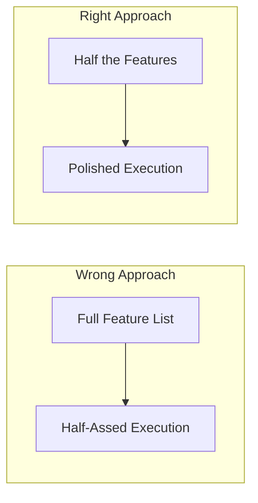
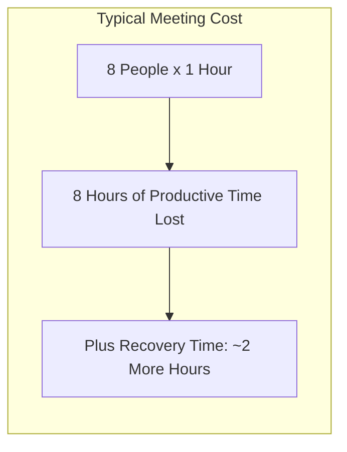

## Section 1: First

The authors open by declaring that the old rules of business are dead.
Technology has made starting a company cheaper and easier than ever. You
don't need an office, a big budget, a legal team, or venture capital. The
only real barrier is the decision to start.

The book is for anyone who wants to build something — not just the MBA
crowd. It rejects the idea that you need to follow a prescribed path.
You can build a business while keeping your sanity.

---

## Section 2: Takedowns

A series of chapters debunking conventional business wisdom:

**Ignore the Real World**
When people say "that won't work in the real world," they're making an
excuse. The "real world" is not a monolithic force — it's whatever people
make it. Every successful business that defied convention proved the "real
world" wrong.

**Learning from Mistakes Is Overrated**
Failure teaches you what doesn't work, but success teaches you what does.
You can learn far more from studying what went right than from dwelling on
what went wrong. Don't romanticize failure.

**Planning Is Guessing**
Long-term plans are guesses dressed up in spreadsheets. The future is too
uncertain for detailed five-year plans. Short-term decisions, constant
adaptation, and responsive action beat rigid planning every time.

**Why Grow?**
Growth is not an obligation. Small companies are more agile, more focused,
and more profitable per person. "Great" doesn't mean "big."

**Workaholism**
Working 80-hour weeks is not a badge of honor — it's a sign of
inefficiency. Workaholics don't accomplish more; they burn themselves and
their teams out. The real hero is the person who goes home at 5 because
they figured out a faster way.

**Enough with "Entrepreneurs"**
The term is overused and meaningless. You don't need a fancy title to
build something. Just start.

---

## Section 3: Go

Action-oriented chapters on getting started:

**Make a Dent in the Universe**
Build something that matters. If your product doesn't make a meaningful
difference, why bother? Passion follows from doing important work.

**Scratch Your Own Itch**
Build products you would want to use. You'll understand the problem
intimately and care about the quality. Basecamp was built because the
authors needed a better project management tool.

**Start Making Something**
Ideas are cheap. Execution is everything. Until you start building, your
brilliant idea is just a hallucination.

**No Time Is No Excuse**
Everyone has the same 24 hours. If you care enough, you'll find the time.
Most people find time for things they truly prioritize.

**Draw a Line in the Sand**
Stand for something. Your beliefs will attract like-minded customers and
repel those who don't fit. A strong point of view is a competitive
advantage.

**Mission Statement Impossible**
Corporate mission statements are typically meaningless. Don't write one.
If you have to write it down, you don't truly believe it.

**Outside Money Is Plan Z**
Venture capital is not a shortcut to success. It comes with strings:
investors expect growth, exits, and control. Bootstrap if you can.
Profitability is freedom.

**You Need Less Than You Think**
Starting a business requires fewer resources than you imagine. Cheap
tools, cloud infrastructure, and open-source software have made it
possible to launch with almost nothing.

**Start a Business, Not a Startup**
A startup that burns cash and has no revenue is not a business. It's a
hobby. The goal should be profitability, not valuation.

**Building to Flip Is Building to Flop**
If you build a company intending to sell it, you'll make short-sighted
decisions. Build something durable instead.

**Less Mass**
The more people, process, and overhead you have, the harder it is to
change direction. Keep your company lightweight.

---

## Section 4: Progress

Chapters on building and iterating:

**Embrace Constraints**
Scarcity is not a disadvantage — it's a creative force. Limited resources
force better decisions. Don't wait for the perfect conditions.

**Build Half a Product, Not a Half-Assed Product**
Cut your vision in half, but execute the remaining half beautifully. A
small, polished product beats a large, buggy one. Start with the core.

**Start at the Epicenter**
Build the core of your product first. Everything else is secondary. If the
core is strong, you can expand later. If the core is weak, nothing else
matters.

**Ignore the Details Early On**
Details matter, but not at the start. Getting the big picture right first
prevents you from polishing something nobody wants.

**Making the Call Is Making Progress**
Indecision is a decision to stall. Make small decisions quickly. They can
be reversed. Big, slow decisions create paralysis.

**Be a Curator**
Editing is as important as creating. Cut features, options, and complexity.
A great product is defined by what it leaves out.

**Throw Less at the Problem**
When facing a challenge, the instinct is to throw more resources at it.
Instead, try removing constraints. Often the best solution is simpler than
you think.

**Focus on What Won't Change**
Build your strategy around durable human needs. People will always want
things that are fast, cheap, reliable, and easy to use. These don't change
with technology.

**Tone Is in Your Fingers**
Your personal touch is your moat. You can't be copied if you make yourself
part of the product. Your voice, taste, and philosophy are unique.

**Sell Your By-Products**
Every process produces something else you can sell. Open-source your
tools. Write books about your approach. The sawdust is valuable.

**Launch Now**
Stop waiting for perfect. Launching teaches you things planning never
will. Real feedback comes from real customers.

---

## Section 5: Productivity

Chapters on working effectively:

**Illusions of Agreement**
Meetings create the illusion of consensus. People nod along but walk away
with different understandings. Use concrete artifacts instead.

**Reasons to Quit**
Know when to walk away. If you're on the wrong path, the best time to
quit was yesterday. The second-best time is now. Sunk cost is not a reason
to continue.

**Interruption Is the Enemy of Productivity**
Deep work requires uninterrupted blocks of time. Every interruption costs
15-20 minutes of recovery. Protect focus ruthlessly.

**Meetings Are Toxic**
Meetings waste time, spread vague agreement, and destroy momentum. Default
to no. If you must meet, keep it tiny and timeboxed.

**Good Enough Is Fine**
Perfect is the enemy of done. Good enough and shipped beats perfect and
stalled. Judo solutions — maximum efficiency with minimum effort — win.

**Quick Wins**
Short-term progress creates momentum. Break big projects into small,
completable chunks. Each finish fuels the next.

**Don't Be a Hero**
Don't pull all-nighters. Don't sacrifice sleep. A burnt-out hero delivers
worse work than a rested non-hero. Consistency beats heroics.

**Go to Sleep**
Sleep deprivation destroys creativity, morale, and decision-making.
Getting enough sleep is a productivity strategy, not a luxury.

**Your Estimates Suck**
Humans are terrible at estimating complex work. Accept that. Plan in small
chunks. Use real data from past work to inform future estimates.

**Long Lists Don't Get Done**
Long to-do lists are overwhelming and demoralizing. Keep them short. Only
prioritize one thing at a time.

**Make Tiny Decisions**
Small decisions are reversible and fast. Big decisions create fear and
delay. Default to small.

---

## Section 6: Competitors

**Don't Copy**
If you copy a competitor, you'll always be behind. By the time you ship
your copy, they've already moved forward. Find your own approach.

**Decommoditize Your Product**
Make your product uncopyable by embedding your philosophy, personality,
and service into it. If you can be easily replaced, you will be.

**Pick a Fight**
Positioning yourself against something is a powerful way to define your
identity. Being anti- something clarifies what you stand for.

**Underdo Your Competition**
Instead of trying to beat competitors on features, do less — but do it
better. A simpler, more focused product beats a complex, mediocre one.

**Who Cares What They're Doing?**
Focus on your own business. Competitor obsession is a distraction. The
energy spent watching rivals is better spent on customers.

---

## Section 7: Evolution

**Say No by Default**
Saying yes is easy. Saying no requires discipline and clarity. Every
feature, request, and opportunity you accept comes at the expense of
something else. Be selective.

**Let Your Customers Outgrow You**
It's okay to lose customers. Not everyone needs to stay forever. If some
customers outgrow you, that means your product has a clear identity.

**Don't Confuse Enthusiasm with Priority**
New ideas feel urgent. Most aren't. Let enthusiasm cool before committing
resources. The ideas that still matter in a week are the ones worth doing.

**Be At-Home Good**
If you wouldn't use your own product at home, it's not good enough. Hold
yourself to a standard that would make you a paying customer.

**Don't Write It Down**
If you need to write down a policy, it probably means your process is
unnatural and bureaucratic. Good systems are obvious without documentation.

---

## Section 8: Promotion

**Welcome Obscurity**
Being unknown is an advantage. You can experiment, fail, and iterate
without the pressure of a spotlight. Obsess over quality, not publicity.

**Build an Audience**
Create a following by sharing valuable knowledge. A loyal audience is a
distribution channel no one can take from you. Teach what you know.

**Out-Teach Your Competition**
Marketing is education. The best way to sell is to teach. Share your
expertise freely and customers will find you.

**Emulate Chefs**
Chefs share their recipes freely. Yet people still eat their food. Why?
Because the experience can't be copied. Share your secrets — execution
still matters.

**Go Behind the Scenes**
Show people how you work. Transparency builds trust and creates a
connection that competitors can't replicate.

**Nobody Likes Plastic Flowers**
Don't fake it. Authenticity is magnetic. Customers can smell insincerity.

**Press Releases Are Spam**
Journalists are inundated with press releases. Most are ignored. Build
relationships instead. Create something newsworthy rather than writing
about something boring.

**Forget About the Wall Street Journal**
You don't need mainstream media coverage. Your niche audience is more
valuable than mass-market exposure. Focus on reaching the right people.

**Drug Dealers Get It Right**
Drug dealers give away samples because they know first-hand experience
drives repeat business. Give away a piece of your product for free.

**Marketing Is Not a Department**
Everyone in the company is in marketing. Every interaction — support
ticket, product decision, blog post — shapes how people perceive you.

**The Myth of the Overnight Sensation**
Overnight success is a myth. Every "sudden" success story had years of
invisible work behind it. Keep building.

---

## Section 9: Hiring

**Do It Yourself First**
Before hiring for a role, do the job yourself. You'll understand the work
well enough to know what you actually need.

**Hire When It Hurts**
Don't hire preemptively. Only bring someone on when the lack of help is
genuinely painful and affecting quality.

**Pass on Great People**
If you don't have the work for them, don't hire them — no matter how
impressive they are. A talented person with nothing meaningful to do is a
liability.

**Strangers at a Cocktail Party**
Rapidly hiring many people at once creates a culture where no one knows
anyone well enough to be honest. Bad ideas survive because nobody feels
safe challenging them.

**Résumés Are Ridiculous**
Résumés are self-serving fiction. They list responsibilities, not
accomplishments. Focus on actual work. Evaluate what someone has made, not
where they've worked.

**Years of Irrelevance**
Ten years of experience is not the same as one year repeated ten times.
Judge candidates by ability, not tenure.

**Forget About Formal Education**
Degrees don't predict performance. Hire for aptitude, attitude, and
portfolio — not pedigree.

**Everybody Works**
A startup has no room for people who "manage" others without doing real
work. Everyone should contribute directly.

**Hire Managers of One**
Look for people who don't need to be managed. They set their own
priorities, manage their own time, and figure things out independently.

**Hire Great Writers**
Clear writing is a sign of clear thinking. Good writers communicate
effectively, make things easy to understand, and know what to omit. These
qualities matter in any role.

**The Best Are Everywhere**
Great talent is not concentrated in Silicon Valley or New York. Hire
remotely. The best person for the job might live anywhere.

**Test-Drive Employees**
Use trial projects before committing to full-time hires. A real work
sample tells you more than a dozen interviews.

---

## Section 10: Damage Control

**Own Your Bad News**
If something goes wrong, announce it yourself before someone else does.
Bad news doesn't destroy trust — hiding it does. Control the narrative.

**Speed Changes Everything**
Respond to problems fast. Most customer anger is not about the issue
itself but about feeling ignored. A fast response defuses most situations.

**How to Say You're Sorry**
A real apology is personal and specific. No corporate jargon. "We messed
up. Here's what happened. Here's what we're doing about it." That's it.

**Put Everyone on the Front Lines**
Every employee should spend time dealing with customers. Support
experiences keep you grounded in what matters.

**Take a Deep Breath**
Before reacting to a crisis, pause. Most problems are less urgent than
they seem. A calm response is better than a panicked one.

---

## Section 11: Culture

**You Don't Create a Culture**
Culture is not a set of values you write on a wall. It's the accumulated
behavior of the people in the company. It emerges naturally from actions.

**Decisions Are Temporary**
Nothing you decide today is permanent. If circumstances change, change
your decisions. Temporary decisions encourage experimentation.

**Skip the Rock Stars**
Don't hire for star power. Hire for substance. Rock stars expect special
treatment. What you need is solid, consistent contributors.

**They're Not Thirteen**
Treat employees like adults. Don't impose strict rules because of the
actions of a few. Trust people to manage themselves.

**Send People Home at 5**
Pushing people to work late creates a culture of presenteeism, not
productivity. Forcing people to leave on time respects their life outside
work.

**Don't Scar on the First Cut**
A single mistake shouldn't spawn a new policy. Companies that add rules
for every incident become bureaucratic. Let small problems stay small.

**Sound Like You**
Don't use corporate speak. Write and talk like a human being. Your voice
is your personality. Embrace it.

**Four-Letter Words**
Authenticity sometimes means using language your customers can relate to.
Be true to your voice, not to a sanitized corporate image.

**ASAP Is Poison**
Saying "ASAP" to everything makes everything seem urgent. Nothing is
truly urgent. Reserve urgency for genuine emergencies.

---

## Section 12: Conclusion

**Inspiration Is Perishable**
Inspiration has an expiration date. When you feel a spark of motivation,
act immediately. Don't wait for Monday, for the right conditions, or for
permission. Inspiration is a productivity multiplier — ride the wave.

There is no perfect time to start. The perfect moment is a fiction that
keeps people from building. Start now, with what you have, where you are.
Make the call. Ship the product. Rethink the way you work.
