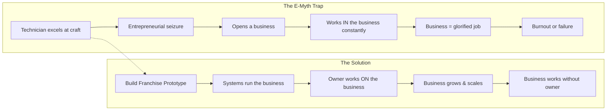
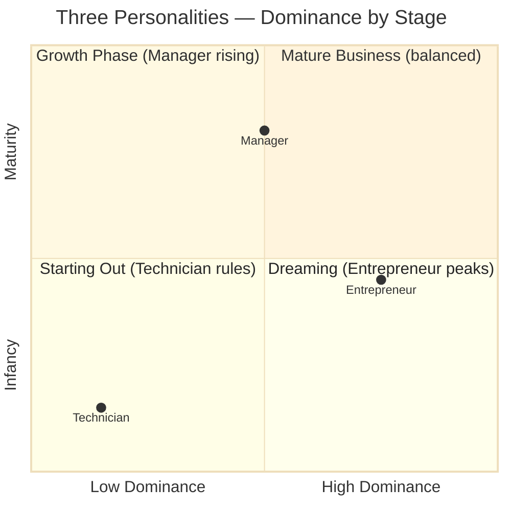
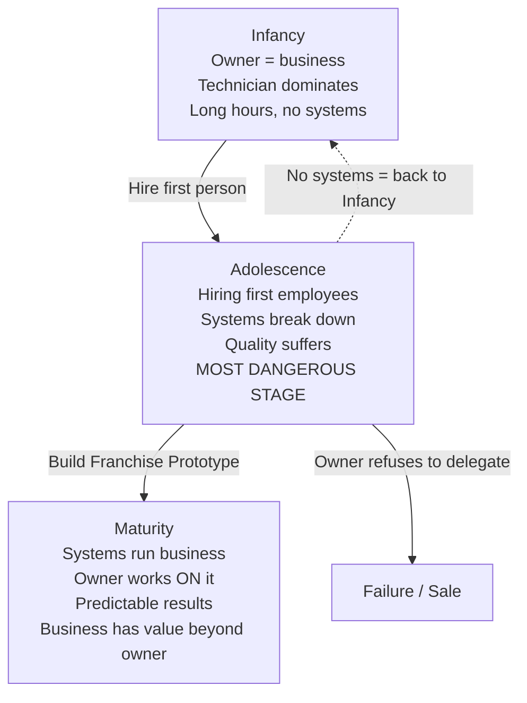
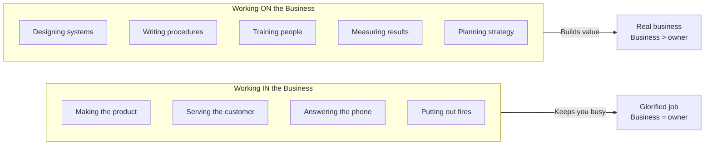
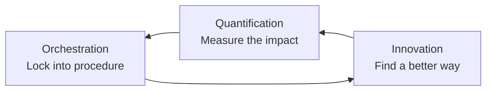

## The Entrepreneurial Myth

Gerber opens with the story of Sarah, a pie baker who makes the best
pies in town. Friends and family tell her she should open a bakery. She
quits her job, leases a space, buys ovens — and within two years is
exhausted, broke, and wondering what went wrong.

Sarah's problem is not her pies. Her pies are excellent. Her problem is
that she confuses being a great baker with knowing how to run a baking
business. She suffers from the **Entrepreneurial Myth**: the assumption
that technical expertise in a craft equals business competence.



**Fatal Assumption**: "If you understand the technical work of a
business, you understand a business that does that technical work."
Gerber's entire book is an argument that this is false.

---

## The Three Personalities

Every business owner contains three separate personalities that compete
for dominance:

| | Entrepreneur | Manager | Technician |
|---|---|---|---|
| **Time orientation** | Future | Present | Past |
| **Asks** | "What if?" | "How?" | "When?" |
| **Loves** | Vision, change, possibility | Order, predictability, systems | Craft, execution, results |
| **Fears** | Boredom, stagnation | Chaos, surprise | Being told what to do |
| **Needs** | The Manager to ground ideas | The Entrepreneur for direction | The Manager for structure |



The goal is not to eliminate any personality but to **balance** them and
assign each to its proper role. The Entrepreneur dreams. The Manager
plans. The Technician executes. The owner's job is to design the
organization so all three can thrive without any one dominating.

---

## The Business Life Cycle

Gerber describes three predictable stages:



**Infancy**: The owner does everything — sells, services, cleans, orders.
The business IS the owner. If the owner stops working, the business
stops. Most businesses never leave this stage.

**Adolescence**: The owner hires help. This is the most dangerous
transition. The owner cannot let go. Quality drops. The technician in
the owner resists delegation. Most businesses die here.

**Maturity**: The business has systems, documented processes, clear
roles. It can operate without the owner. This is the goal.

---

## The Franchise Prototype

Gerber's central solution: build your business as if you intend to
franchise it 5,000 times. This forces you to design for:

### Five Principles of the Franchise Prototype

| Principle | Meaning |
|---|---|
| Consistency | Every customer gets the same experience |
| Predictability | Results are reliable and repeatable |
| Documentation | Every process is written down |
| Simplicity | Systems must be easy to learn and execute |
| Scalability | The model works at any size |

### What the Franchise Prototype Serves

> "To the Entrepreneur, the Franchise Prototype is the medium through
> which his vision takes form in the real world. To the Manager, the
> Franchise Prototype provides the order, the predictability, the
> system so important to his life. To the Technician, the Prototype is
> a place in which he is free to do the things he loves to do —
> technical work."

---

## Working ON vs IN the Business

This is Gerber's most quoted distinction:



**Working IN**: doing the technical work of the business. It feels
productive. It generates immediate results. But it creates a business
that cannot function without you.

**Working ON**: building the systems, processes, and structure that let
the business run. It feels unproductive. It generates no immediate
revenue. But it creates a business that has value beyond your labor.

---

## The Business Development Process

Three ongoing activities that drive continuous improvement:

### Innovation
Constantly ask: "Is there a better way to do this?" Treat every process
as a prototype. Experiment. Test. The goal is not to find the perfect
way but to keep finding better ways.

### Quantification
Measure everything that matters. Without numbers, you cannot know
whether an innovation is actually better. Gerber is blunt: if you are
not measuring it, you are not managing it.

### Orchestration
Lock in what works. Write it down. Create a procedure. Train to it.
Now it is a system — not dependent on any individual's memory or
mood.



This cycle never stops. A mature business is always in beta.

---

## The Business Development Program: Seven Steps

### Step 1: Your Primary Aim
Start with the life you want. What kind of life do you want to live?
What do you want to be free to do? The business is a vehicle for your
life, not the other way around.

Questions to answer:
- What do I value most?
- What kind of life do I want to create?
- What would I do if I knew I could not fail?
- What would I do with my time if the business ran without me?

### Step 2: Your Strategic Objective
Translate your Primary Aim into concrete business targets:

| Standard | Requirement |
|---|---|
| Financial | Revenue, profit margin, personal income targets |
| Market | Market share, customer segments, geographic reach |
| Timeline | When will the Prototype be complete? |

Be specific: "I will build a business with $2M in revenue, 20% net
margin, operating in three cities, by year five."

### Step 3: Your Organizational Strategy
Build the org chart **before** you hire the people. Define every
position by its accountabilities, results, and standards. This is a
**position contract** — a written agreement that separates the person
from the role.

```
┌─────────────────────────┐
│      Shareholders        │
└──────────┬──────────────┘
           │
┌──────────▼──────────────┐
│      Board of Directors  │
└──────────┬──────────────┘
           │
┌──────────▼──────────────┐
│   President / CEO        │
└──────────┬──────────────┘
           │
┌──────────▼──────────────┐
│   General Manager        │
└──────────┬──────────────┘
           │
┌──────────▼──────────────┐
│   Functional Managers    │
├────────────┬─────────────┤
│ Marketing  │  Operations │
│ Sales      │  Finance    │
│ HR         │  Technology │
└────────────┴─────────────┘
```

### Step 4: Your Management Strategy
Create the systems that make management consistent and predictable:
- Standard Operating Procedures (SOPs)
- Operations manual
- Training protocols
- Performance standards
- Review cycles

### Step 5: Your People Strategy
Design how you attract, hire, train, and retain people.

| Element | Key Principle |
|---|---|
| Hiring | Hire for system-fit, not just technical skill |
| Training | Documented, repeatable onboarding |
| Culture | Values and standards embedded in systems |
| Compensation | Rewards tied to system adherence and results |
| Growth | Clear career paths within the franchise prototype |

### Step 6: Your Marketing Strategy
Gerber breaks marketing into three components:

1. **Demographics** — who are your customers? (age, income, location)
2. **Psychographics** — what do they feel? (desires, fears, values)
3. **The Promise** — what do you guarantee? (the core value proposition)

Your marketing system must be documented and repeatable — not dependent
on one charismatic salesperson.

### Step 7: Your Systems Strategy
Three categories of systems:

| Type | Examples |
|---|---|
| **Hard Systems** | Equipment, tools, store layout, technology stack |
| **Soft Systems** | Hiring, training, culture, communication, values |
| **Information Systems** | Metrics, dashboards, feedback loops, customer data |

A complete systems strategy integrates all three into one coherent
operating model.

---

## Position Contracts

Gerber's most practical tool. For every position, write a contract that
defines:

- **Accountabilities**: what results must this position produce?
- **Authority**: what decisions can this person make independently?
- **Standards**: what does "good" look like?
- **Relationship**: who does this position report to and collaborate
  with?

The position contract allows you to hire anyone who can learn the
system. You are not looking for a "great person" — you are looking for
someone who can follow the position contract.

---

## Key Lessons

1. Technical skill is not business skill. The two are unrelated.
2. Your business will never grow beyond your ability to delegate.
3. Systems are freedom — a business that depends on you is a prison.
4. Build your org chart before you hire your people.
5. Write down everything. If it is not documented, it does not exist.
6. Measure what matters. Without quantification, innovation is guesswork.
7. Your Primary Aim comes first. The business serves your life.
8. Ordinary people with great systems outperform great people with no
   systems.
9. The Franchise Prototype is never finished. You are always iterating.
10. The goal is not to work less — it is to work on the right things.

---

## Action Plan

| Phase | Action | Timeframe |
|---|---|---|
| Week 1 | Identify which personality dominates (Entrepreneur, Manager, Technician) | 30 min |
| Week 2 | Write your Primary Aim — the life you want | 2 hours |
| Week 3 | Define your Strategic Objective (financial + market targets) | 1 hour |
| Week 4 | Draft your org chart for the mature business | 2 hours |
| Week 5 | Write one position contract for your own role | 1 hour |
| Month 2 | Document your top 5 most critical processes | 10 hours |
| Month 3 | Create a metrics dashboard for your business | 5 hours |
| Month 4 | Build a training manual for one key position | 8 hours |
| Ongoing | Run Innovation → Quantification → Orchestration cycles monthly | 2 hours/month |
