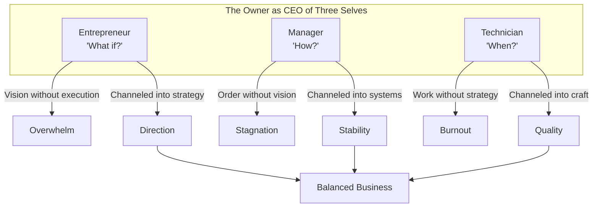

**Maya**: Welcome back to Book Dialogue. I'm Maya.

**Dan**: I'm Dan. Today: *The E-Myth Revisited* by Michael Gerber.
Maya, this book was recommended to me by three different people in
the last month. I finally read it. I have feelings.

**Maya**: That's the standard reaction. The book seems to hit everyone
who has ever started a business like a personal attack. What did you
feel?

**Dan**: Honestly? Called out. I started my coffee roasting business
because I make incredible coffee. I won local tastings. People told me
I should sell it. So I did. And now I'm working 80-hour weeks, doing
everything — roasting, bagging, shipping, accounting, social media,
cleaning the bathroom — and I'm making less than I did as a barista.
Gerber basically wrote a book about me.

**Maya**: That's the **E-Myth**. The Entrepreneurial Myth. You're a
great technician — a great coffee roaster. But you assumed that being
good at roasting meant you'd be good at running a roasting business.
Those are two completely different skills.

---

**Dan**: He tells this story about Sarah, the pie baker. I felt
personally attacked by a fictional pie baker.

**Maya**: Everyone does. Sarah is every technician who ever started a
business. The book's whole first section is just explaining why you
are exhausted and broke even though your product is great.

**Dan**: But then he says the answer is — what? 'Work on your business,
not in it.' I've heard that phrase a hundred times. What does it
actually mean?

**Maya**: It means your job is not roasting coffee. Your job is
building a company that roasts coffee. Your job is designing the
system. Right now, you are the system. If you stop roasting, the
business stops. A business that depends on you is not a business —
it's a job with better branding.

**Dan**: Okay, fine. But I can't afford to hire anyone. So how do I
work ON the business when all the work IN the business is screaming
at me to do it?

**Maya**: Gerber's answer is the **Franchise Prototype**. Imagine you
are going to franchise your coffee business 5,000 times. You need
every process documented. Every interaction standardized. Every
result predictable. Now, write down the first three things you would
document. That's where you start.

**Dan**: Roasting profiles. Packaging procedure. Shipping checklist.

**Maya**: Perfect. Now write those down. That's working ON the
business. It takes time away from roasting, but it creates the
foundation for eventually not having to roast at all.

---

**Dan**: The **three personalities** framework — Entrepreneur,
Manager, Technician. He says we have all three inside us. I definitely
feel my Technician dominating. But how do I develop the others?

**Maya**: You can't develop them overnight. You start by recognizing
when each one is active. The Entrepreneur gets a wild idea for a new
blend — capture it, but don't act on it immediately. The Technician
wants to obsess over roast curves — schedule that time. The Manager
wants to organize the inventory — let them.

**Dan**: He makes it sound like three different people living in my
head.

**Maya**: Because they are. And your job as the business owner is to
be the CEO of those three personalities. Give each one time. Don't let
any one dominate.

---

**Dan**: Let's talk about the **Adolescence** stage. Gerber says most
businesses die in Adolescence — when you hire your first person. I'm
terrified of hiring. What if they mess up my coffee?

**Maya**: That's the Technician talking. The fear is real. But here's
Gerber's insight: if one person can mess up your quality just by doing
their job, you don't have quality standards. You have a reliance on
your own personal skill. And that doesn't scale.

**Dan**: So I should write down exactly how to roast each bean,
exactly what temperature, exactly how long to rest?

**Maya**: Yes. Down to the second. That's your **position contract**
for the roaster role. Now anyone who can follow instructions can do
it. Not at your level at first. But they can do it. And you can
train them up.

**Dan**: But my roasts are also intuition. I feel when the beans are
ready.

**Maya**: Then your job is to figure out what you are feeling and turn
it into a measurable standard. That's the **Quantification** step.
Measure everything. Then you can teach it.

---

**Dan**: He talks about the **Primary Aim** — starting with the life
you want, not the business. That part actually made me uncomfortable.

**Maya**: Why?

**Dan**: Because I never asked myself what life I wanted. I just
started roasting and assumed the business would give me the life. Now
I'm working more and enjoying less.

**Maya**: That's exactly why he puts it as step one. Most entrepreneurs
start with the business and end up with a life that serves the
business. He says reverse it. Define the life. Then build a business
that produces that life. Your coffee business should serve your life,
not consume it.

**Dan**: That sounds almost radical. In startup culture, you're
supposed to sacrifice everything for the business.

**Maya**: And Gerber is arguing that's exactly wrong. The business is
a vehicle. If the vehicle is consuming the driver, what's the point?

---

**Dan**: Let's be honest about the book's weaknesses. It's repetitive.
I felt like I read the same chapter four times.

**Maya**: It's extremely repetitive. Gerber's writing style is
pedagogical bordering on circular. He tells Sarah's story in every
chapter. You could skip chapters 3-6 and miss almost nothing.

**Dan**: And it's light on details. He says 'create systems' but never
says what systems. He says 'write a position contract' but never shows
one. It's all philosophy, no templates.

**Maya**: That's the biggest critique. The book is brilliant at
diagnosis and motivational at prescription, but terrible at
implementation. You need supplementary resources — *Traction*, *The
Great CEO Within*, even just Google Sheets templates — to actually
build the systems he talks about.

**Dan**: So is it worth reading?

**Maya**: For the diagnosis alone, yes. If you are a technician who
started a business and feels trapped, this book will name your
problem. That alone is valuable. But treat it as a beginning, not an
end. Read it, absorb the ON vs IN distinction, understand the three
personalities, and then put it down and go build your systems.

**Dan**: That's fair. I think the Franchise Prototype idea is worth
the price of admission. Even if I never franchise, imagining that I
will forces me to think differently about every process.

**Maya**: Exactly. The thought experiment is more valuable than any
template. Ask yourself: if someone had to buy this business and run
it successfully next week, what would need to exist? That question
alone will tell you what to build.

---

**Dan**: Final verdict?

**Maya**: 7 out of 10. Essential reading, but insufficient on its own.

**Dan**: I'd give it a 6. Important message, poor delivery. Worth
reading for chapter 1 and chapter 9. The rest is padding.

**Maya**: That's fair. But I'll say this: six months from now, if
you've built one system and documented one process, this book will
have been worth every repetitive page.

**Dan**: I'll hold you to that.

**Maya**: You should. Now go write down your roasting profiles.

**Dan**: Already thinking about it.

---

This has been a BookAtlas narration of *The E-Myth Revisited* by
Michael E. Gerber. Thanks for listening.
