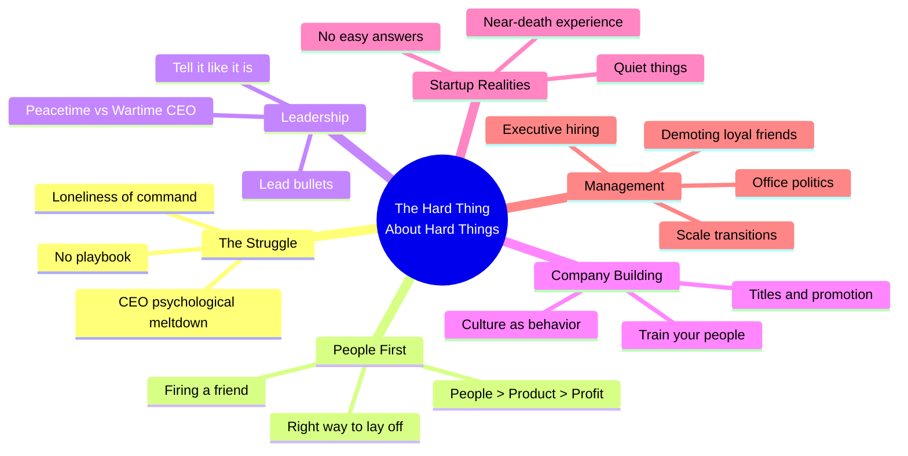

# The Hard Thing About Hard Things: Building a Business When There Are No Easy Answers

**Ben Horowitz** · HarperBusiness · 2014 · 304 pp · ISBN 9780062273208

> "The Struggle is when you wonder why you started the company in the first place."

This is not a book about success — it is a book about survival. Ben Horowitz,
co-founder of the venture firm Andreessen Horowitz (a16z) and former CEO of
Loudcloud/Opsware, writes the anti-startup-manifesto. Where other business
books promise formulas, Horowitz delivers raw accounts of near-bankruptcy,
firing friends, psychological breakdowns, and the grinding loneliness of
running a company. Drawing on his journey from Netscape product manager to
billion-dollar exit, he distills the hard-won tactics for navigating the
moments when there are truly no easy answers.

---

## Table of Contents

| # | Chapter | Topic |
|---|---------|-------|
| Introduction | — | The premise: no easy answers |
| 1 | From Communist to Venture Capitalist | Horowitz's unlikely path |
| 2 | "I Will Survive" | Founding Loudcloud in the dot-com crash |
| 3 | This Time with Feeling | The near-death experience |
| 4 | When Things Fall Apart | The Struggle, laying people off, firing executives, demoting friends |
| 5 | Take Care of the People, the Products, and the Profits—in That Order | People-first management, training, hiring |
| 6 | Concerning the Going Concern | Managing at scale, culture traps |
| 7 | How to Lead Even When You Don't Know Where You Are Going | Wartime CEO vs peacetime CEO |
| 8 | First Rule of Entrepreneurship: There Are No Rules | The quiet thing, executive management |
| 9 | The End of the Beginning | Reflections on building a lasting company |

---

## Key Concepts

---

## Author

**Ben Horowitz** (b. January 13, 1966, London, England) is an American
businessman, investor, and author. He earned a BA in computer science from
Columbia University and an MS from UCLA. He joined Marc Andreessen at
Netscape in 1995 as a product manager. In 1999 he co-founded Loudcloud (later
Opsware), taking it public in 2001 at $6/share; the stock sank to $0.35 before
he pivoted the company and sold it to Hewlett-Packard for $1.6 billion in
2007. In 2009 he co-founded Andreessen Horowitz (a16z), which grew into one
of Silicon Valley's most influential venture firms with over $46 billion in
assets under management. He is also the author of *What You Do Is Who You Are*
(2019) and an influential blogger whose "Ben's Blog" was the seed for this
book.
