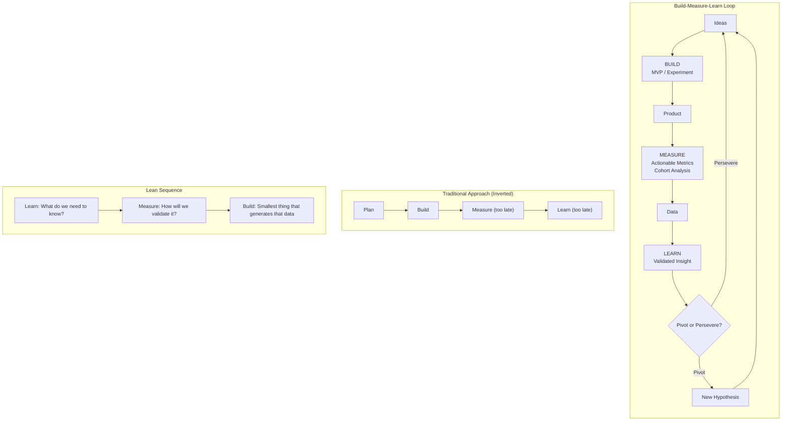
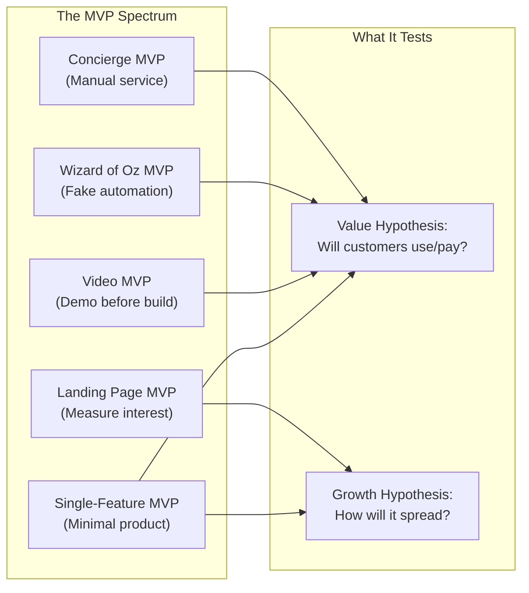
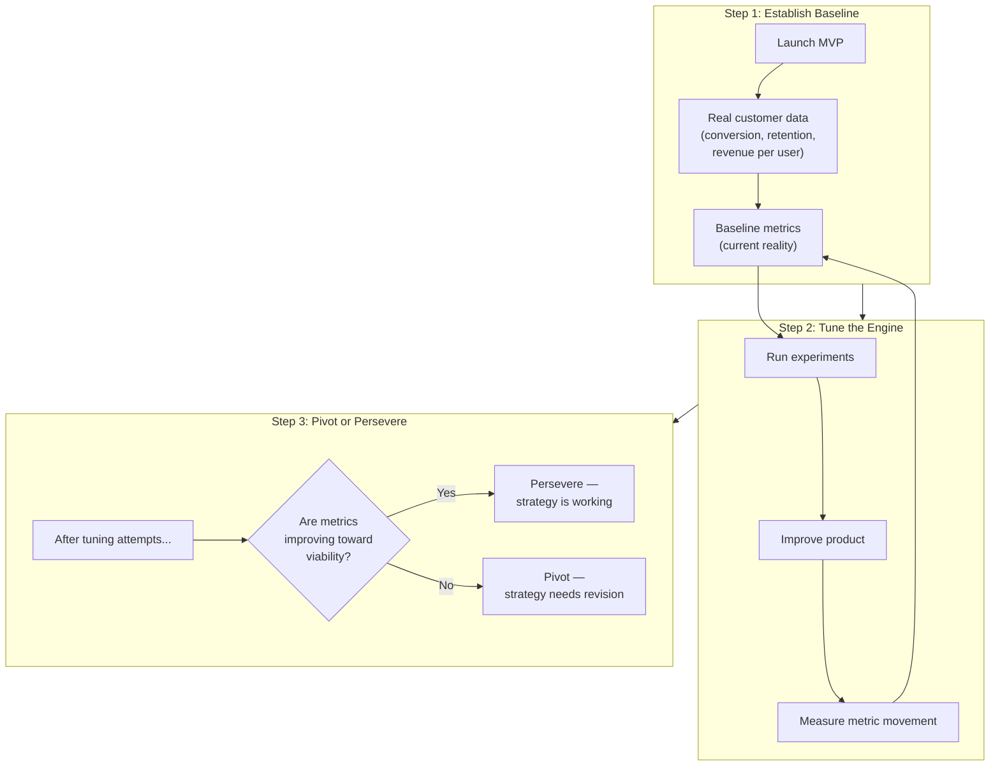
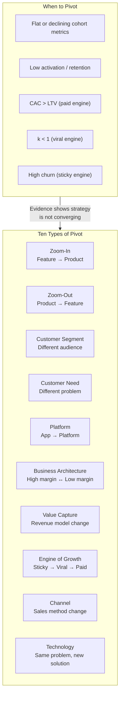
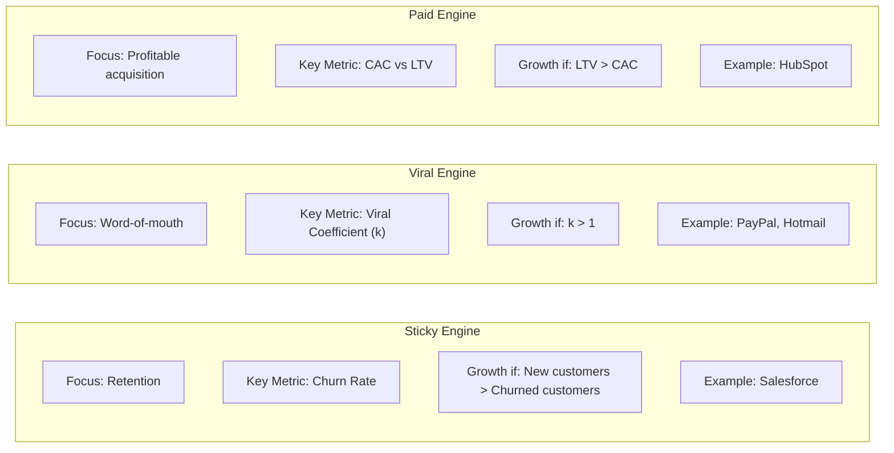
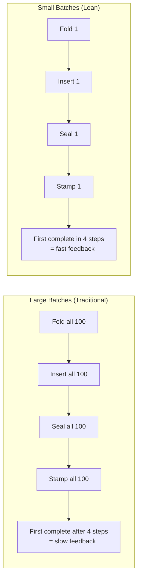
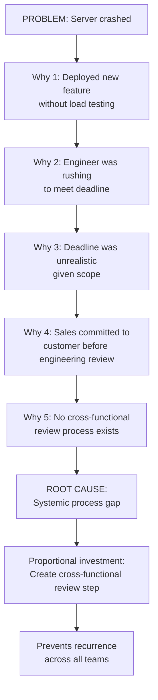

## The Build-Measure-Learn Feedback Loop

The central operating system of the Lean Startup. Unlike traditional
development (plan, build, measure, learn), Ries inverts the order: start with
what you need to learn, work backward to what measurement would validate it,
then build the smallest thing that generates that measurement.

The loop should operate as fast as possible. The goal is not to build the
perfect product — it is to cycle through learning loops quickly, each one
reducing uncertainty and moving toward product-market fit.

---

## Minimum Viable Product (MVP)

The most widely adopted and most widely misunderstood concept in the book.
An MVP is not a buggy, incomplete product shipped to hit a deadline. It is
the **smallest experiment** that can test a specific leap-of-faith assumption.

### MVP Examples from the Book

| Example | Type | Hypothesis Tested |
|---------|------|-------------------|
| Zappos founder buys shoes at retail, sells online | Concierge | Will customers buy shoes without trying them on? |
| Dropbox demo video showing sync feature | Video | Do users want seamless file sync? |
| IMVU's first 3D avatar IM add-on | Single-Feature | Will users pay for avatar-enhanced IM? |
| Food on the Table founder shops for each user | Concierge | Will families pay for meal planning? |
| Aardvark's fake routing page | Wizard of Oz | Can social Q&A be algorithmically routed? |

---

## Innovation Accounting

Traditional accounting is useless for a startup with no revenue and no
historical baseline. Ries proposes a three-step measurement framework:

### Vanity vs Actionable Metrics

| Vanity Metrics | Actionable Metrics |
|----------------|-------------------|
| Total registered users | Activation rate (cohort) |
| Total page views | Retention rate (cohort) |
| Total downloads | Revenue per user |
| Gross revenue (unsegmented) | Customer acquisition cost |
| Press mentions | Lifetime value |
| Cumulative signups | Viral coefficient (k) |

The key practice: **cohort analysis**. Instead of aggregating all users
together, break them into cohorts by signup date and track each cohort's
behavior independently. This reveals whether the business is genuinely
improving over time or whether aggregate numbers are hiding stagnation.

---

## Pivot or Persevere

The decision gate at the end of each Build-Measure-Learn cycle. After
running experiments and analyzing data, the startup must honestly evaluate:
is the current strategy converging on a viable business model?

A pivot is a **structured course correction** — it preserves everything
learned from the previous strategy while testing a new fundamental hypothesis.
It is not a restart. It is not failure. It is the mechanism by which a
startup adapts to evidence.

---

## Engines of Growth

Every sustainable business runs on exactly one primary engine of growth.
Ries identifies three:

| Engine | Growth Mechanism | Key Metric | How to Tune |
|--------|-----------------|------------|-------------|
| Sticky | Low churn, high retention | Churn rate | Improve product stickiness |
| Viral | Existing users recruit new users | Viral coefficient (k) | Increase sharing/invites per user |
| Paid | Advertising and sales | LTV / CAC ratio | Increase LTV or decrease CAC |

A startup should focus on tuning **one** primary engine until it is
optimized, not spread efforts across all three.

---

## Small Batches

Borrowed from the Toyota Production System. Ries demonstrates through the
analogy of stuffing envelopes: completing one envelope end-to-end (fold,
insert, seal, stamp) is faster overall than batching all folding, then all
inserting, then all sealing.

Small batches reveal defects faster, reduce rework, and shorten the
feedback loop. In software, this means deploying code continuously in small
increments rather than large releases.

---

## The Five Whys

A root-cause analysis technique adapted from Toyota's Taiichi Ohno. When a
problem occurs, ask "why" five times to drill past symptoms to the
underlying systemic failure.

The Five Whys turn every problem into an investment in process improvement.
The key is **proportional investment** — don't over-engineer the solution,
but don't ignore the root cause either. The technique also helps teams avoid
the "blame game" by revealing that most problems are systemic, not personal.

---

## Leap-of-Faith Assumptions

Every startup plan rests on two critical hypotheses that must be tested
first:

| Hypothesis | Question | How to Test |
|------------|----------|-------------|
| Value Hypothesis | Does the product deliver value to customers? Will they use it? Pay for it? | MVP with real purchase/conversion data |
| Growth Hypothesis | How will new customers discover the product? Can the model scale? | Measure acquisition channels, viral coefficient |

Ries emphasizes that founders must identify these leap-of-faith assumptions
before building — because these are the beliefs that, if wrong, sink the
entire venture. Every other assumption is secondary.

---

## Key Lessons

- **The goal of a startup is not to build a product — it is to find a
  sustainable business model.** Product development serves learning, not
  the other way around.
- **Minimize the cycle time of the Build-Measure-Learn loop.** Speed of
  learning is the only sustainable competitive advantage for a startup.
- **Vanity metrics are the enemy; cohort analysis is the antidote.** If your
  metrics don't tell you cause and effect, they are not actionable.
- **Pivoting is strategic, not a sign of failure.** The worst outcome is not
  a pivot — it is perseverance on a failing strategy because no one ran the
  experiment.
- **Process is not the enemy of speed — it is the enabler of it.** The Five
  Whys, small batches, and continuous deployment are not bureaucracy; they
  are the tools that let you go faster.
- **Startups need innovation accounting because traditional accounting breaks
  under uncertainty.** You cannot manage what you cannot measure, and you
  cannot measure a startup with GAAP.

---

## Practical Applications

### For a First-Time Founder
- Write down your leap-of-faith assumptions (value and growth hypotheses)
- Design the smallest possible experiment to test each
- Launch an MVP before writing another line of code you don't need
- Define three actionable metrics upfront — before you have data to bias them
- Commit to a pivot-or-persevere decision date in advance

### For a Product Manager
- Replace feature requests with hypotheses: "We believe [X] will cause [Y]"
- Use cohort analysis instead of aggregate dashboards
- Run split-tests (A/B tests) before committing to full builds
- Reduce batch size: deploy small changes frequently, not big releases
- Apply the Five Whys to every production incident

### For a Corporate Innovation Team
- Form autonomous teams with secure, independent resources
- Give teams authority to develop without committee approval
- Establish an innovation accounting system separate from GAAP reporting
- Protect teams from quarterly earnings pressure during the search phase
- Use the startup way as a management discipline, not just a product tool

### For Breaking Bad Startup Habits
- Stop tracking vanity metrics — remove them from your dashboard
- Stop building features no customer asked for — test the hypothesis first
- Stop treating pivots as failures — schedule them as deliberate reviews
- Stop planning in annual cycles — plan in experiment cycles
- Stop blaming individuals for systemic failures — use the Five Whys
