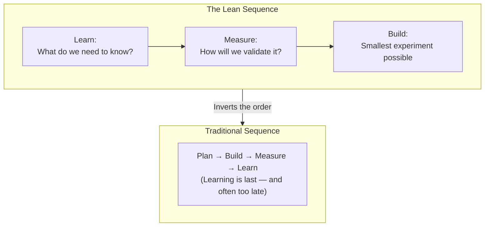
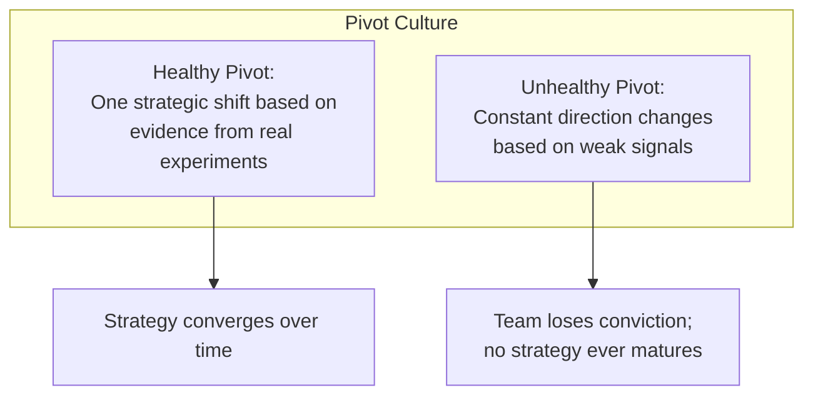
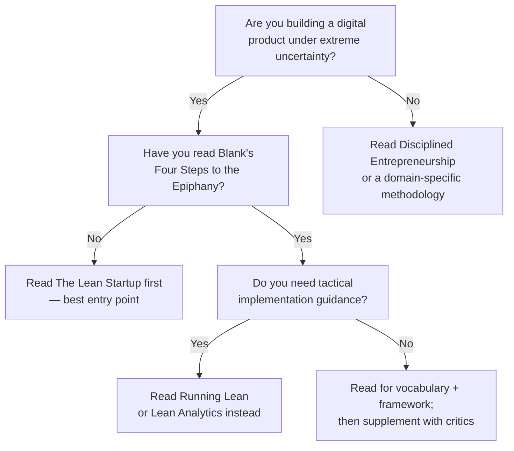

## Introduction

Welcome to BookAtlas. Today: *The Lean Startup: How Today's Entrepreneurs
Use Continuous Innovation to Create Radically Successful Businesses* by
Eric Ries. Published 2011, Crown Business. 336 pages. Over 1 million copies
sold. The most influential startup book of the 21st century.

This book changed how the world builds products. It introduced terms —
Minimum Viable Product, pivot, Build-Measure-Learn — that are now
inescapable in any tech company. But is it as good as its reputation
suggests? We're going to settle that with two voices. On one side, a
startup founder who treats the Lean Startup as their operating system. On
the other, a critic who thinks the methodology has done as much harm as good.

Let's get into it.

---

## The Core Idea: Startups Are Experiments

Ries opens with a provocative claim: most startups fail not because the
product is bad, but because they spent months or years building something
nobody wants. His solution is radical — treat your startup as a scientific
experiment.

Every business plan rests on leap-of-faith assumptions — beliefs that, if
wrong, sink the venture. The job of the founder is to identify those
assumptions and test them with the smallest possible experiment, as quickly
as possible.

**Founder:** This was the insight that changed everything for me. Before
reading this book, I was building features based on my own guesses. After,
I was running experiments. The shift from "what should I build?" to "what
do I need to learn?" is transformative.

**Critic:** It's an appealing analogy, but treating a startup like a science
experiment has limits. In science, you control variables. In a startup, you
can't. And the "scientific" framing gives founders a false sense of rigor
while making bad decisions that feel like good experiments.

---

## The Build-Measure-Learn Loop

At the heart of the book is the Build-Measure-Learn feedback loop. Most
development processes go: plan, build, measure, learn. Ries argues this is
backward. You should start with what you need to learn, work backward to
what measurement would answer that question, then build the smallest thing
that generates that measurement.

**Founder:** This inversion alone was worth the price of the book. Most
startups default to "let's build this feature and see what happens." The
lean approach forces discipline: what specific question are we answering?
What data would prove or disprove it? It saves months of wasted effort.

**Critic:** It sounds great in theory, but in practice, many teams spend
more time arguing about what to measure than actually building things.
And the "learn" step is often ambiguous — what counts as validated? A 5%
conversion lift? A 10%? The methodology gives you a process but rarely tells
you what bar to clear.

---

## The MVP: Most Valuable Idea or Most Dangerous Concept?

The Minimum Viable Product is the book's most famous — and most
controversial — concept.

**Founder:** The MVP is not a bad product. It is the *minimum* product that
allows you to start learning. Ries is very clear about this. Dropbox's first
MVP was a three-minute video. Zappos' first MVP was buying shoes at retail
and reselling them online. These weren't products — they were experiments.
The misunderstanding is not Ries's fault; it's the fault of people who
didn't read carefully.

**Critic:** Come on. You can't blame the readers when an entire generation
of founders interpreted "minimum viable product" as "ship something barely
functional and call it done." The term invites that interpretation.
"Minimum" is in the name. VCs ask for MVPs. Founders deliver half-baked
products. The term has done real damage — burned users, destroyed trust,
and trained a generation to ship before they're ready.

**Founder:** But that's a misuse problem, not a framework problem. The same
criticism could apply to any popular methodology. The real value of the MVP
concept is that it forces you to ask: what is the absolute simplest thing
that could test my hypothesis? That question alone prevents months of
overbuilding.

---

## Innovation Accounting: Moving Beyond Vanity

Ries introduces innovation accounting because, as he points out, traditional
accounting (GAAP) is useless for a startup with zero revenue. His system has
three steps:

1. Establish the baseline with an MVP
2. Tune the engine by iterating
3. Decide to pivot or persevere

The key practice is **cohort analysis** — tracking groups of users by signup
date rather than looking at aggregate numbers.

**Founder:** The vanity-versus-actionable metrics distinction should be
taught in every business school. Before this book, I was proudly tracking
"total registered users." It went up every month. I thought the business was
working. It wasn't. When I switched to cohort retention, I saw that each new
cohort was actually less engaged than the last. The aggregate numbers were
hiding a dying business.

**Critic:** I'll concede this point. The vanity metrics critique is the
book's strongest contribution. Far too many startups raise money on
growing-but-meaningless numbers. Cohort analysis is genuinely useful.

**Founder:** But you have a "but" coming, I can feel it.

**Critic:** Of course. Innovation accounting assumes you can measure
everything that matters. What about brand perception? Emotional connection?
Customer trust? These things are real and they don't show up in cohort
retention. The lean framework can lead you to optimize what's measurable
at the expense of what's valuable.

---

## The Pivot: Course Correction or Crutch?

Ries identifies ten types of pivots — from zoom-in (a feature becomes the
whole product) to customer segment (same product, different audience) to
value capture (change the revenue model).

**Founder:** The pivot framework gives you a vocabulary for strategic
change. Instead of "we failed," you say "we're pivoting." Instead of
starting over, you preserve what you learned. This is psychologically
healthier and strategically clearer.

**Critic:** Or it's a euphemism that prevents honest reckoning. I've seen
startups pivot five, six, seven times — always with a new "strategic
hypothesis" — and never once stop to ask whether the core team or idea was
the problem. The pivot becomes a crutch that lets founders avoid the hard
question: maybe this just isn't going to work.

**Founder:** That's a failure of execution, not of the framework. The book
explicitly says you should pivot based on *evidence*, not hope. If teams
pivot without evidence, they're not following lean methodology — they're
throwing darts blindfolded.

**Critic:** But here's the problem: what counts as evidence? A/B tests with
100 users? A survey with a 5% response rate? The framework is precise about
the *process* but vague about the *threshold*. That vagueness is what allows
founders to rationalize anything.

---

## The Engines of Growth: Sticky, Viral, Paid

Ries argues that every sustainable business runs on one of three engines of
growth:

| Engine | How It Works | Key Metric |
|--------|-------------|------------|
| Sticky | Retain users; grow when new > churned | Churn rate |
| Viral | Users recruit users as a side effect | Viral coefficient k > 1 |
| Paid | Spend money to acquire customers | LTV > CAC |

**Founder:** This triage helps founders focus. Instead of trying to grow
every way at once, you pick your engine and tune it. Are you a sticky
business or a viral one? The answer determines your entire strategy.

**Critic:** The three-engine model is useful as a diagnostic. I'll grant
that. But it's also reductive — most successful businesses use a mix of all
three. And the model assumes you can cleanly categorize your business, which
is rarely true. Is Slack sticky, viral, or paid? Yes. All of them.

---

## The Five Whys: Root Cause or Root Canal?

Borrowed from Toyota: when something breaks, ask "why" five times to uncover
the systemic root cause rather than blaming the individual.

**Founder:** The Five Whys is the most underappreciated tool in the book.
It transforms every incident from a blame exercise into a process
improvement. The server crashed? Don't fire the engineer. Ask why five times
and discover there's no deployment testing process. Fix the process, and the
same bug doesn't happen again.

**Critic:** The Five Whys assumes there's always a systemic cause. Sometimes
things just go wrong. And in practice, the technique can become a
finger-pointing exercise that happens to be five questions long instead of
one. If your culture is already toxic, the Five Whys just gives toxicity a
framework.

---

## The Biggest Criticisms: A Fair Hearing

Let's be honest about the book's limitations:

1. **It is software-centric.** The method assumes you can test, build, and
   deploy in hours or days. For biotech, hardware, or deep science — where
   a single experiment costs thousands and takes months — the lean approach
   often breaks down. Ries acknowledges this briefly but does not address it.

2. **It overweights quantitative data.** The book's scientific framing
   privileges what can be counted. Qualitative insight — ethnographic
   research, longitudinal interviews, emotional response — is treated as
   less valid. This can lead to products that are optimized in spreadsheets
   and hollow in practice.

3. **MVP is a double-edged sword.** In theory, it is a learning vehicle. In
   practice, it is often an excuse to ship incomplete products. The
   terminology itself invites misuse. Many companies have burned user trust
   by treating users as beta testers without consent.

4. **It does not address founder psychology.** The book assumes founders are
   rational information processors. In reality, repeated pivots are
   demoralizing. Weak launches erode confidence. The method can create a
   cycle of low morale disguised as rigorous experimentation.

5. **Diminishing returns of validation.** Academic research (Ladd, 2016)
   shows that beyond a certain point, more hypothesis testing does not
   improve outcomes. The method does not tell you when to stop
   experimenting and start scaling.

**Founder:** These are real limitations. But no methodology is perfect.
The question is whether the Lean Startup is better than the alternatives.
And the alternatives — build-in-a-vacuum-for-two-years or fly-by-the-seat-
of-your-pants — are clearly worse.

**Critic:** I disagree. There are better alternatives. Steve Blank's
customer development is more rigorous. Ash Maurya's Running Lean is more
tactical. And neither comes with the baggage of "move fast and break things"
that lean startup culture has accidentally encouraged.

---

## The Verdict: Do You Need This Book?

**Founder:** For a first-time founder building a digital product, this is
still the best starting point. Read it. Apply it. But also read the critics
so you understand where it falls short.

**Critic:** If you're in software, read it for the vocabulary — you need to
know the terms. But don't treat it as gospel. Read Steve Blank for depth.
Read Ben Horowitz for the human side. Read the academic critiques for
balance. The Lean Startup is a starting line, not a finish line.

**Founder:** I agree with that. It's not the whole answer. But for what it
sets out to do — give founders a systematic way to build under uncertainty —
it's still the best single book on the subject.

**Critic:** And I'll agree with this: it sold over a million copies for a
reason. It solved a real problem. My concern is that its influence has gone
unquestioned for too long. Every founder should read it. And then every
founder should read the books that tell you what it missed.

---

## Final Thoughts

The Lean Startup is a book about learning faster than your competition. The
irony is that the startup ecosystem has now learned enough to see where the
methodology itself falls short.

Its legacy is secure: it gave a generation of founders a shared vocabulary,
a systematic process, and permission to treat failure as data. Its
limitations are equally real: it is software-centric, quantitative-heavy,
and silent on the human psychology of founding a company.

The best way to use this book is the way Ries would want you to use it —
as a starting hypothesis, to be validated, iterated on, and maybe pivoted
away from when the evidence demands it.

This has been a BookAtlas narration of The Lean Startup by Eric Ries. Thanks
for listening.
