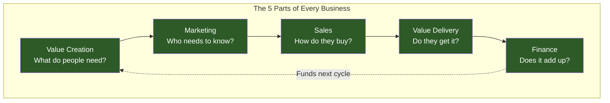
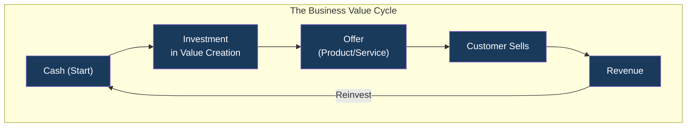
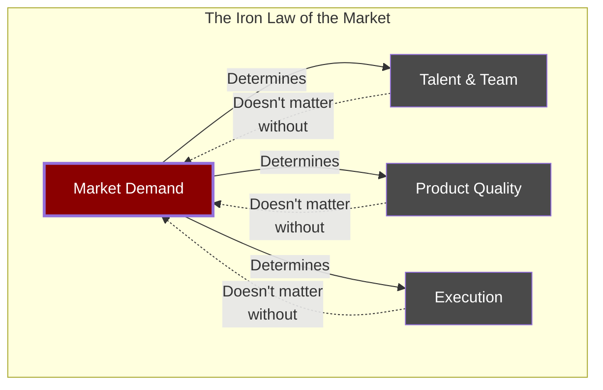
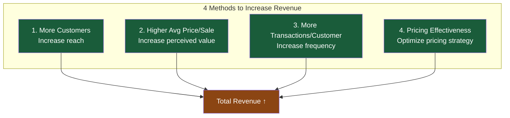
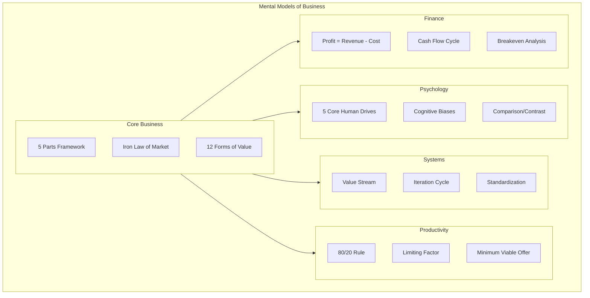

## The 5 Parts of Every Business

Kaufman's central framework: every business, regardless of size,
industry, or complexity, can be reduced to five interdependent
processes. If any one fails, the whole system breaks.

The 5 Parts map to a simple question: can you create something
valuable, get attention for it, persuade someone to buy, deliver what
you promised, and keep enough money to continue? Answer yes to all
five and you have a business.

---

## The Business Value Cycle

Money flows through a business in a repeating cycle. Understanding
this cycle reveals why timing and cash reserves matter as much as
profit.

Key insight: cash leaves the business (to create value) before it
returns (through sales). The longer this cycle takes, the more cash
you need to survive. Businesses fail during the gap between
investment and return.

---

## The 12 Forms of Value

Most people think of value as "a product" or "a service." Kaufman
identifies 12 distinct forms — and the most successful businesses
combine several.

| # | Form | Description | Example |
|---|------|-------------|---------|
| 1 | **Product** | A tangible item you own | iPhone, shoes |
| 2 | **Service** | Help doing something | Plumber, consulting |
| 3 | **Shared Resource** | Access to something scarce | Airbnb, Zipcar |
| 4 | **Subscription** | Recurring access to value | Netflix, SaaS |
| 5 | **Resale** | Buying and selling at a margin | Amazon, thrift shop |
| 6 | **Lease** | Temporary use for a fee | Car rental, apartment |
| 7 | **Agency** | Representing a seller | Real estate agent |
| 8 | **Audience Aggregation** | Attention of a group | Advertising, podcast |
| 9 | **Loan** | Capital repaid with interest | Bank, credit card |
| 10 | **Option** | Right to buy/sell at set price | Stock options, tickets |
| 11 | **Insurance** | Protection against loss | Health, auto insurance |
| 12 | **Capital** | Ownership in an enterprise | Stocks, equity |

The more forms of value you combine, the harder you are to compete
with. Amazon combines resale, subscription (Prime), shared resource
(AWS), audience aggregation (ads), and more.

---

## The Iron Law of the Market

Kaufman calls this the most important principle in business.

The Iron Law: if you don't have a market of people who want what you
offer, your business will fail — no matter how good your product is or
how talented your team. The market always wins.

Kaufman provides 10 criteria for evaluating a market:
urgency, market size, pricing potential, cost of customer
acquisition, cost of value delivery, uniqueness, speed to market,
upfront investment, upsell potential, and ongoing potential.

---

## The 4 Methods to Increase Revenue

There are exactly four levers. Every growth strategy in existence is
a variation of one or more of these.

Most businesses focus on method 1 (more customers). The biggest
opportunities usually lie in methods 2-4, which don't require new
customer acquisition.

---

## Mental Models Map

The book organizes 90+ mental models across a dozen domains. Here is
the major structure:

Each domain contains 5-15 specific models. The power is in combining
them: a marketing problem analyzed through the 5 Parts lens points to
a specific model, which suggests an action.

---

## Deep Dive: Value Creation

Value Creation is the foundation. Without something to offer, you
have nothing to market, sell, or deliver.

**The Product/Service Matrix:** Kaufman distinguishes between
products (tangible, standardized, scalable) and services
(intangible, customized, relationship-driven). Most businesses
fall on a spectrum between pure product and pure service.

**Scarcity and Utility:** Value arises from the intersection of
scarcity (limited availability) and utility (ability to satisfy a
need). Diamonds are valuable because they are scarce AND useful
for adornment/industry. Water is useful but not scarce, so it is
cheap.

**The 5 Core Human Drives** that underlie all purchasing:
- **Acquire** — Gather possessions, status, power
- **Bond** — Connect with others, love, belong
- **Learn** — Satisfy curiosity, master skills
- **Defend** — Protect family, property, beliefs
- **Feel** — Experience pleasure, avoid pain

The more drives your offer connects to, the more compelling it is.

---

## Deep Dive: Marketing

Marketing is not advertising. It is the entire process of attracting
attention and building demand. Kaufman's 5 Parts of Marketing:

1. **Attention** — Get noticed by the right people
2. **Interest** — Make them curious about your offer
3. **Desire** — Connect to their core drives
4. **Action** — Motivate them to take the next step
5. **Nurture** — Stay in touch after the sale

**Positioning** is how your offer occupies a unique space in the
prospect's mind. Effective positioning answers: what makes you
different, why should I care, and why should I trust you?

Kaufman stresses that marketing must target "probable purchasers" —
not everyone. Trying to sell to everyone is selling to no one.

---

## Deep Dive: Sales

Sales turns attention into transaction. Kaufman rejects manipulative
sales tactics in favor of **Value-Based Selling**: understand what
your offer is worth to the prospect, then reinforce that value.

**The Sales Process:**
1. **Identify** a qualified prospect
2. **Understand** their needs and wants
3. **Present** your offer as the solution
4. **Handle** objections by showing value
5. **Close** by asking for the commitment

**Barriers to Purchase** are the enemy of sales. Common barriers:
indecision, distrust, lack of urgency, cost perception, complexity.
Reducing friction — easier checkout, money-back guarantees,
trial periods — increases conversion.

**The 3 Universal Currencies** in any negotiation: resources (money),
time, and flexibility. The best deals trade what you have in surplus
for what you need.

---

## Deep Dive: Value Delivery

Value Delivery is the bridge between promise and experience. If you
sell what you cannot deliver, you damage trust and future sales.

**The Value Stream** is the entire chain of activities from raw
material to delivered product. Map it, measure each step, and
eliminate waste. This directly foreshadows lean manufacturing and
the Toyota Production System.

**The Core Human Drives of Delivery:**
- Consistency: customers expect the same experience every time
- Speed: faster delivery increases perceived value
- Quality: delivering more than promised creates delight

Kaufman emphasizes **over-delivering** — not by going over budget,
but by finding low-cost ways to exceed expectations (a handwritten
note, faster shipping, bonus content).

---

## Deep Dive: Finance

Finance is the scoreboard. Kaufman covers the essentials without
spreadsheet overload.

**The 5 Accounting Components:**
1. **Assets** — What the business owns
2. **Liabilities** — What the business owes
3. **Equity** — Assets minus liabilities (owner's stake)
4. **Revenue** — Money coming in
5. **Expenses** — Money going out

**Profit** = Revenue - Expenses. Simple in concept, hard in
execution. **Gross Margin** = Revenue - Cost of Goods Sold. The
higher your margin, the more room you have to spend on marketing,
R&D, and growth.

**Cash Flow** is the timing of money in vs. money out. You can be
profitable on paper and bankrupt in your bank account if you sell
on credit and pay your suppliers immediately.

**Breakeven Analysis:** How much do you need to sell to cover your
fixed costs? Fixed Cost / (Price - Variable Cost per Unit) =
Breakeven Quantity. Below this: you lose money. Above it: you
make money.

**The 4 Ways to Improve Profitability:**
1. Increase revenue (the 4 methods above)
2. Decrease cost (without reducing perceived value)
3. Increase price (if perceived value supports it)
4. Do more with the same resources (productivity)
