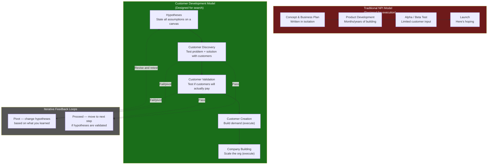
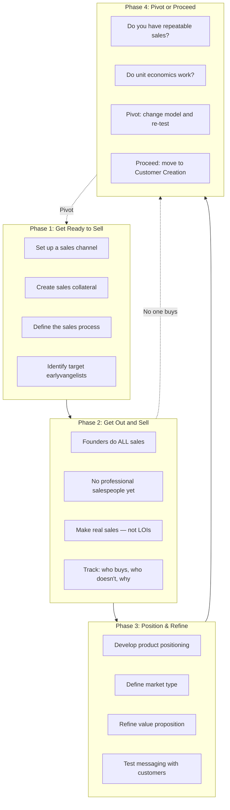
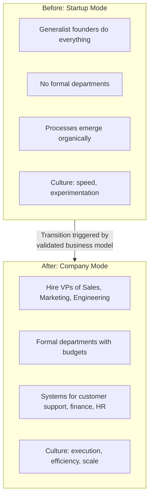
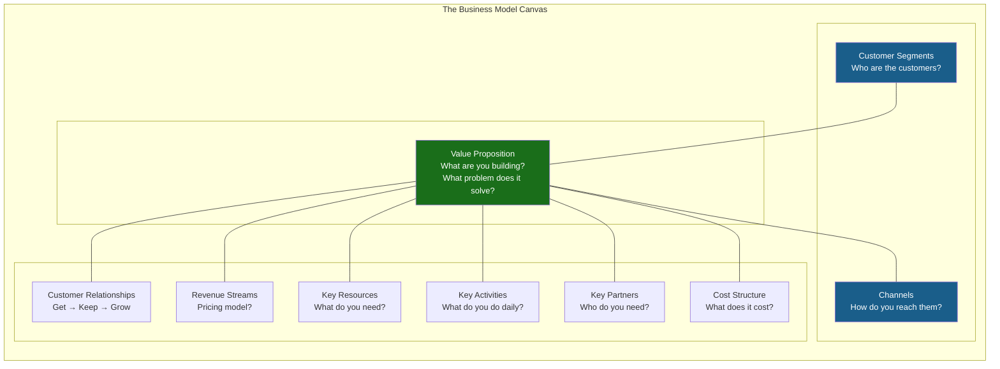
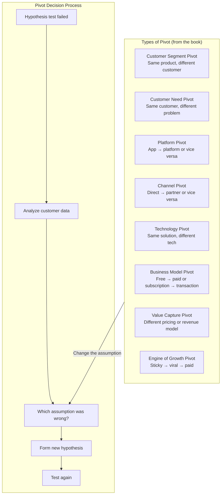

## The Central Insight: Search vs. Execute

The book's foundational premise: a startup is not a small version of a big
company. A startup is a **temporary organization in search of a repeatable and
scalable business model**. Large companies *execute* known models. Startups
*search* for unknown ones. The traditional New Product Introduction model
assumes execution from day one — which is why 90% of startups fail.

---

## The Customer Development Manifesto

The book distills its philosophy into 14 principles — the Customer Development
Manifesto. These rules guide every decision a startup founder makes.

| # | Rule | What It Means |
|---|------|---------------|
| 1 | There Are No Facts Inside Your Building | Customer input is the only valid data. Founder opinions are hypotheses, not facts. |
| 2 | Pair Customer Development with Agile Development | Customer feedback shapes the product iteratively. Build in short cycles, test with real users. |
| 3 | Failure Is an Integral Part of the Search | The goal is learning, not executing a plan. "Failure" that teaches you something is progress. |
| 4 | Iterate and Pivot Continuously | Every customer interaction should inform a decision: continue, change course, or kill the idea. |
| 5 | No Business Plan Survives First Contact with Customers | Your plan is a set of guesses. Customers will prove most of them wrong. Adapt. |
| 6 | Design Experiments to Test Hypotheses | Treat each assumption as a falsifiable hypothesis. Run cheap experiments to validate or invalidate. |
| 7 | The Business Model Canvas Replaces the Business Plan | A business plan is a static document. A canvas is a living map of your assumptions — update it weekly. |
| 8 | Startup Metrics Are Different | Vanity metrics (total users, hits) are for the press. Actionable metrics (conversion, retention, referral) drive decisions. |
| 9 | Fast Iteration, Customer Feedback, and Getting It Right | Speed of learning beats speed of building. Build -> measure -> learn. |
| 10 | The Only Valid Market Is One Where Earlyvangelists Exist | If no one is desperate for your solution, you haven't found a real problem. |
| 11 | Sell to Earlyvangelists, Not the Mass Market | Early adopters are patient, forgiving, and give feedback. The mass market demands polish. |
| 12 | Pivots Are Strategic Shifts, Not Give-Ups | Changing customer segment, problem, solution, or channel is not failure — it's wisdom. |
| 13 | Customer Validation Proves You Have a Repeatable Sales Model | One sale is a data point. Ten sales to the same customer type is a pattern. |
| 14 | Premature Scaling Kills Startups | Don't hire salespeople, build a marketing team, or rent office space until you have validated the model. |

---

## The Four Steps of Customer Development

### Step 1: Customer Discovery — "Do People Care?"

Customer Discovery tests whether you have identified a real problem that
people want solved. It has four phases:

```mermaid
flowchart LR
    subgraph Phase1["Phase 1: State Hypotheses"]
        P1a["Business Model Canvas"]
        P1b["8-10 key hypotheses"]
        P1c["Value proposition"]
        P1d["Customer segments"]
    end

    subgraph Phase2["Phase 2: Test the Problem"]
        P2a["Get out of the building"]
        P2b["Customer interviews"]
        P2c["Does the problem exist?"]
        P2d["Do they care enough to act?"]
    end

    subgraph Phase3["Phase 3: Test the Solution"]
        P3a["Build a low-fidelity MVP"]
        P3b["Show to earlyvangelists"]
        P3c["Does the solution work?"]
        P3d["Will they use/pay for it?"]
    end

    subgraph Phase4["Phase 4: Pivot or Proceed"]
        P4a["Review all evidence"]
        P4b["Did you validate the model?"]
        P4c["Pivot: change canvas"]
        P4d["Proceed: move to Validation"]
    end

    Phase1 --> Phase2 --> Phase3 --> Phase4
```

**Key output**: A validated problem-solution fit. You know who has the
problem, they know they have it, and your proposed solution resonates.

---

### Step 2: Customer Validation — "Will They Pay?"

Customer Validation tests whether you can build a repeatable, scalable sales
process. This is the most difficult step — and the one most startups skip.

**Key output**: Validated product-market fit with a repeatable sales model.
You know who buys, why they buy, and how to reach them.

---

### Step 3: Customer Creation — "Build Demand"

Once validation is complete, Customer Creation is about generating end-user
demand and scaling the customer base. This is an **execution** phase — the
search is over; now you scale what works.

| Activity | Physical Channel | Web/Mobile Channel |
|----------|-----------------|-------------------|
| Demand generation | PR, trade shows, channel partnerships | SEO, SEM, content marketing, social |
| Marketing spend | Modest — test before scaling | Modest — test CAC before scaling |
| Sales team | First sales hires, territory planning | Not needed — self-serve funnel |
| Key metric | Sales cycle length, conversion rate | CAC, LTV, activation rate |

---

### Step 4: Company Building — "Transition to a Company"

The final step transitions the startup from a search-oriented organization to
a structured company designed for execution.

**Key output**: A scalable company with professional management, defined
processes, and a culture that balances execution with continued innovation.

---

## The Business Model Canvas

The book adopts Alexander Osterwalder's Business Model Canvas as the
organizing framework for startup hypotheses. Every assumption your startup
makes fits into one of nine boxes.

Each of the nine boxes represents a hypothesis that must be tested with
customers. The canvas is updated continuously as you learn — it is a living
document, not a static plan.

---

## The Nine Deadly Sins

Blank and Dorf identify nine mistakes that doom startups:

| # | Sin | Why It Kills |
|---|-----|-------------|
| 1 | Assuming you know what customers want | You don't. Get out of the building. |
| 2 | The "I know what features to build" fallacy | Features are guesses. Test them with an MVP. |
| 3 | Focus on a fixed launch date | Launching on time with the wrong product is worse than late with the right one. |
| 4 | Emphasizing execution over learning | Execution of a bad plan is a fast path to failure. |
| 5 | Writing a rigid business plan | Plans are obsolete the day they hit a customer. |
| 6 | Hiring "right" people for the wrong stage | Sales VPs before validation = burned cash. |
| 7 | Sticking to initial marketing/sales strategy | The first strategy is almost always wrong. |
| 8 | Assuming success and scaling prematurely | The #1 killer of funded startups. |
| 9 | Operating in crisis mode | Firefighting instead of learning = death spiral. |

---

## The Pivot: Strategic Course Correction

A pivot is a structured change in one or more components of the business model
based on validated learning. It is not failure — it is course correction.

---

## Earlyvangelists

The book's term for the ideal first customer: an **earlyvangelist** is someone
who:

1. **Has the problem** — they experience it daily
2. **Knows they have it** — they can articulate it without being prompted
3. **Is actively seeking a solution** — they have tried workarounds
4. **Can articulate the value proposition** — they understand what your
   solution does for them
5. **Has a budget or authority to buy** — they can pay or approve payment

If you cannot find earlyvangelists for your idea, you do not yet have a viable
business model. The book is blunt: no earlyvangelists = no market.

---

## The "Get, Keep, Grow" Framework

A lifecycle framework for thinking about customers across every stage:

| Stage | Physical Channel | Web/Mobile Channel |
|-------|-----------------|-------------------|
| **Get** | Create awareness → generate interest → drive consideration → close purchase | Acquire traffic → activate users on first visit |
| **Keep** | Customer support, loyalty programs, account management | Email campaigns, push notifications, onboarding sequences, support |
| **Grow** | Upsells, cross-sells, referrals, renewals | Referral programs, network effects, upgrades, expanding usage |

---

## Key Lessons

- **A startup is a search, not an execution.** Until you have validated a
  repeatable business model, every dollar spent on scaling is a dollar wasted.
- **There are no facts inside the building.** The only valid data comes from
  talking to real customers who have the problem and are actively seeking a
  solution.
- **Customer Discovery and Validation are the "search" phase.** You are not
  allowed to scale until you have proven product-market fit and a repeatable
  sales process.
- **Customer Creation and Company Building are the "execute" phase.** Once
  validated, shift from learning to scaling — but not before.
- **The Business Model Canvas is your living document.** Update it every week
  as you learn. If it is static, you are not learning.
- **Pivoting is not failure.** Refusing to pivot when the data says change is
  failure. Pivots are evidence of learning.
- **Premature scaling is the #1 killer.** The book's most urgent warning: do
  not hire salespeople, rent office space, or run ads until you have validated
  that customers will pay.
- **Earlyvangelists are your only early customers.** If no one is desperate
  for your solution, you are solving the wrong problem.
- **Founders must do customer discovery personally.** Staff, consultants, and
  agencies cannot replace the founder's passion and ability to pivot on the
  fly.
- **Metrics must be actionable, accessible, and auditable.** Vanity metrics
  (total registrations, page views) are useless. Cohort retention, conversion
  rates, and referral rates tell you what to do next.
