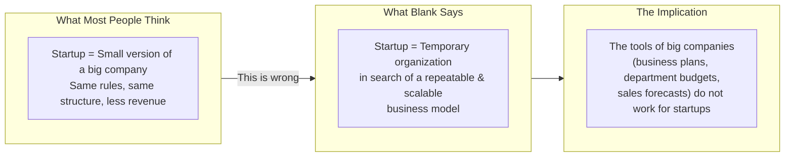
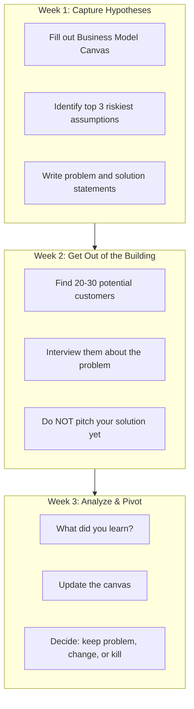
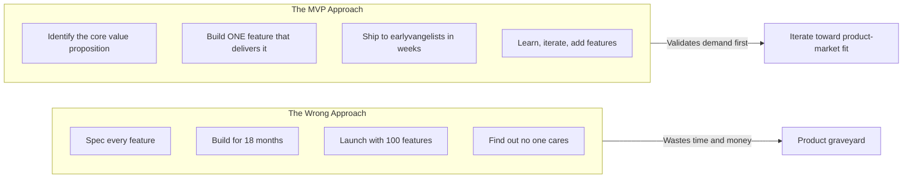
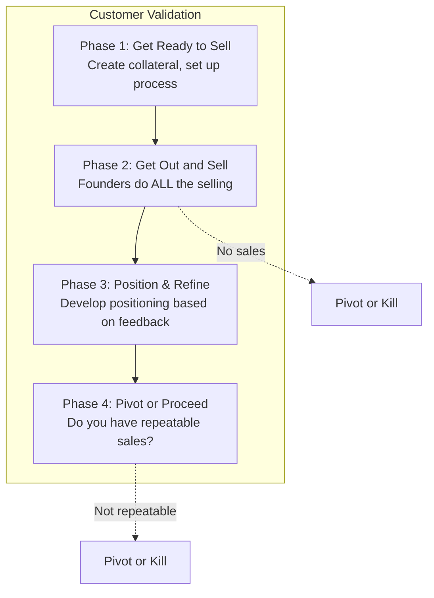
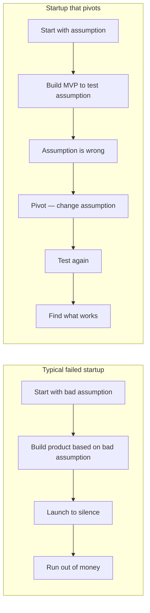
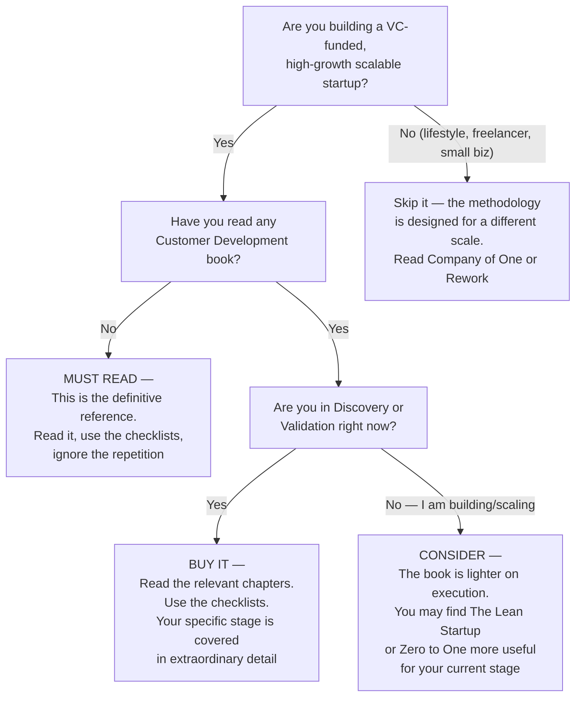

## Introduction

Welcome to BookAtlas. Today: *The Startup Owner's Manual: The Step-by-Step
Guide for Building a Great Company* by Steve Blank and Bob Dorf. K&S Ranch,
2012. 608 pages. One hundred charts. Seventy-seven checklists. Two parallel
tracks. Fourteen manifesto rules. And one phrase that has become the motto of
the global startup movement: "Get out of the building."

This is a behemoth of a book. It is also, arguably, the most important
practical book ever written on how to build a startup. But is it a timeless
manual or a time capsule? Does it give founders a genuine edge, or does it
just make them feel like they have one?

We are settling this with two voices. On one side, a first-time founder who
has read this book cover to cover and uses it as a desk reference. On the
other, a serial entrepreneur who has been through the cycle four times and
thinks Customer Development is useful but overhyped.

Let us get into it.

---

## The Core Idea: Startups Search, Companies Execute

The book opens with a provocative claim: the traditional way of building a
company — write a business plan, raise money, build product, launch — is not
just suboptimal for startups. It is *toxic*.

**Founder:** This single insight changed how I think about everything. Before
reading this book, I was writing a 50-page business plan. I had revenue
projections for year five. I was trying to be a mini-CEO of a company that
did not exist yet. The book made me realize: I am not a CEO. I am a
scientist. My job is to run experiments and find a business model, not to
execute a plan.

**Operator:** I have heard this from a lot of first-time founders. And it is
a useful mindset shift — for the first three months. But I think the book
overstates the dichotomy. Even in "search mode," you need to execute
competently. Customer Development is not an excuse for sloppy operations.
Some of the best startups I have been involved with succeeded because they
executed well during the search phase — they shipped fast, they fixed bugs,
they treated early customers well.

**Founder:** The book does not say you should be sloppy. It says you should
not scale your *organization* until you have validated the model. You still
need to execute on product development.

**Operator:** It says that. But the framing — "search vs. execute" — creates
a false binary. In reality, you are doing both at the same time. The ratio
shifts over time, but it is never 100% search or 100% execute.

---

## The Customer Development Manifesto

The book's 14 rules are meant to be a constitution for startup behavior. The
most famous: "There Are No Facts Inside Your Building."

**Founder:** That rule — number one — is worth the price of the book. Every
time I catch myself arguing with my co-founder about what customers want, I
remember: we are both wrong. The only way to know is to ask. It has saved me
from so many stupid arguments.

**Operator:** I agree with the principle. But I think it is oversimplified.
There *are* facts inside the building — your burn rate is a fact. Your
technical constraints are facts. Your team's capabilities are facts. The rule
should be: "there are no facts about your customers inside your building."

**Founder:** That is what it means. You are being pedantic.

**Operator:** Maybe. But precision matters when you are building a company.
I have seen founders use "get out of the building" as an excuse to avoid
making hard decisions. They keep running customer interviews forever because
it feels productive and avoids the risk of committing to a path. The book
does not warn about that enough.

---

## Customer Discovery: It Starts with Hypotheses

The first step in Customer Development is writing down every assumption your
startup is making — and testing them with real humans.

**Founder:** The most uncomfortable part of the book is the instruction not to
pitch your solution during customer interviews. I remember my first few
interviews — it was agonizing. Someone tells you they have a problem, you
have a solution that could help them, and you cannot tell them about it? But
the book is right. If you pitch, they will tell you what you want to hear.
You get false positives. The whole methodology depends on listening first.

**Operator:** This is genuinely good advice. But I want to push back on the
number. The book says 20-30 interviews. I have done hundreds. The real number
depends on what you are building. For a B2B enterprise product with a very
specific buyer profile, 10 good interviews can be enough. For a consumer
product, you might need 50. The book gives a number, but the right answer is:
"keep going until you stop hearing new things."

**Founder:** That is literally what the book says in the detailed section.
Customer Discovery is not a checkbox exercise — it is about learning velocity.

**Operator:** The book says it. But the checklist format encourages
checkbox thinking. That is my concern with the manual approach overall.

---

## The Minimum Viable Product

One of the book's most influential concepts: build the smallest thing that
test whether customers will pay.

**Founder:** The MVP concept saved me from spending six months building
something nobody wanted. I shipped my first version — a barely working
prototype — in three weeks. Five customers paid for it. That was all the
validation I needed.

**Operator:** And how many of those first five customers are still with you?

**Founder:** Two.

**Operator:** That is actually good. The book says earlyvangelists are
patient — they will use a rough product because they have the problem. But
the book understates the risk of building a product so minimal that it
creates a bad first impression. I have seen startups ship an MVP so rough
that earlyvangelists walked away and never came back. The book's advice is
"ship the minimum." I would add: "ship the minimum that still solves the
problem in a way that feels like progress."

**Founder:** That is a fair refinement. But the core insight — do not build
features you have not validated — is still right.

---

## Customer Validation: The Hardest Step

Customer Validation is where startups die. It is one thing to get someone to
say "I would buy that." It is another to actually get their credit card.

**Founder:** The book's rule that founders must do all the selling during
Customer Validation is one of its most important and most ignored pieces of
advice. I see so many startups that raise a seed round and immediately hire a
VP of Sales. But if the founders cannot sell it, no VP of Sales can either.
The founders learn more in one sales call than in a month of market research.

**Operator:** I agree with the principle. But I think it is incomplete. Some
founders are not natural salespeople. And some products have sales cycles
that are 6-12 months long. If the founder is also the only engineer, spending
six months on sales calls instead of building the product can kill the
company. The book should acknowledge that the "founders sell" rule has
exceptions.

**Founder:** It does. It says to hire a salesperson *after* you have validated
the model. Not before.

**Operator:** It says that. But it does not fully address the time problem.
In a B2B enterprise startup with a 9-month sales cycle, "founders sell" for
a year can mean zero product development for a year. That is a real tension
the book glosses over.

---

## The Pivot: Strategic Course Correction

The book's pivot framework is one of its most widely adopted concepts. A
pivot is not failure — it is learning translated into action.

**Founder:** The pivot framework gave me permission to change my mind. Before
reading this book, I thought changing direction meant admitting defeat. The
book showed me that Airbnb, PayPal, Twitter, Instagram — all of them pivoted.
Pivoting is what successful startups do. It is the stubborn ones that die.

**Operator:** I love the pivot concept. But I hate how it has been cheapened
by the broader startup culture. Every minor feature change is now called a
"pivot." The book defines it carefully: a pivot changes one of the nine
building blocks of your business model. Adding a dark mode to your app is not
a pivot. Real pivots are painful, costly, and often involve letting people go
or scrapping months of work. The book is honest about this, but the term has
been diluted.

**Founder:** That is a problem with the culture, not the book.

**Operator:** True. But the book's popularity contributed to the dilution.
When a concept enters the mainstream, it loses precision.

---

## The Biggest Criticisms: A Fair Hearing

Let us be honest about the book's limitations:

1. **It is 608 dense pages.** The "don't read too much at a time" warning is
   charming on page vii and frustrating by page 300. The book desperately
   needed a tighter edit. Key concepts are repeated across chapters. The
   channel-separate structure forces redundancy. A well-edited 350-page
   version would be a better book.

2. **It assumes VC-scale ambition.** The book is written for founders who
   want to build a billion-dollar company. The methodology is overkill — or
   actively wrong — for lifestyle businesses, freelancers, or small
   businesses. The book acknowledges this in the introduction, then proceeds
   to ignore it for the next 600 pages.

3. **Light on execution, heavy on search.** The title promises "building a
   great company." The book delivers an exhaustive guide to the *search* for
   a business model. But Customer Creation and Company Building — the actual
   *building* part — get relatively thin treatment. The book is really "The
   Startup Founder's Manual for the First 18 Months."

4. **No digital companion.** Published in 2012, the book has no online
   tools, no downloadable checklists, no video tutorials. For a book that is
   a *manual*, the lack of a digital component feels increasingly dated.

5. **The science claim is overstated.** Blank presents Customer Development
   as the "scientific method" for startups. But real science requires control
   groups, randomization, and statistical significance — none of which a
   startup can achieve. The methodology is more like engineering prototyping
   than actual science. Framing it as "scientific" gives false confidence.

**Founder:** Those are real limitations. But they do not change the fact that
this book saved me from making at least three catastrophic mistakes in my
first year. I talked to customers instead of building in isolation. I shipped
an MVP instead of a polished product. I waited to validate before hiring.
The book's advice, applied selectively, works.

**Operator:** I think the book is best treated as a starting point. Read it.
Use the checklists. But also read *The Mom Test* for better customer
interviewing. Read *Running Lean* for a more software-specific take. Read
*Zero to One* for a dose of contrarian thinking about monopoly and market
structure. The *Startup Owner's Manual* is a foundation — not the complete
architecture.

---

## The Verdict: Is This an Operating Manual or a Fossil?

**Founder:** Every first-time founder should read this book. Not because it is
a perfect book — it is not. But because it is the *only* book that tells you,
step by step, what to do. Not inspiration. Not theory. Not memoir. A manual.
Pick your current phase, read those chapters, do the work. Get out of the
building. Talk to customers. Ship an MVP. Pivot if the data says pivot. Scale
only when you have proof.

**Operator:** I agree that first-time founders should read it. But I want them
to read it as one input among many. The book's greatest strength — its
prescriptive, step-by-step approach — is also its greatest risk. It can make
founders believe that following the process guarantees success. It does not.
Startups are still chaos. The market is still irrational. Luck still matters.

**Founder:** The book never claims to eliminate luck. It claims to reduce the
amount of luck you need.

**Operator:** And that is a fair claim. The book does reduce the luck you
need. But the difference between "reducing luck" and "eliminating it" is the
difference between failing and succeeding. Too many founders read the book
and think they have a guarantee. They do not.

---

## Final Thoughts

*The Startup Owner's Manual* is a flawed masterpiece. It is too long, too
repetitive, too scoped to VC-scale startups, and too light on the execution
side. But it is also the most comprehensive, practical, actionable guide to
the early stages of building a startup ever written.

Its central insight — that startups search while companies execute, and that
the tools of management are toxic in the search phase — has changed how an
entire generation builds companies. The Lean Startup movement, the NSF I-Corps
program, the Stanford Lean LaunchPad class — all trace their lineage to this
book and Blank's earlier work.

The book's legacy will be debated. Did Customer Development reduce the startup
failure rate? The data is inconclusive. Did it give founders a shared language
and a systematic method for reducing risk? Unquestionably.

The final verdict: read it. Use the checklists. Ignore the repetition.
Supplement with books that cover the gaps. And above all: get out of the
building.

This has been a BookAtlas narration of *The Startup Owner's Manual: The
Step-by-Step Guide for Building a Great Company* by Steve Blank and Bob Dorf.
Thanks for listening.
