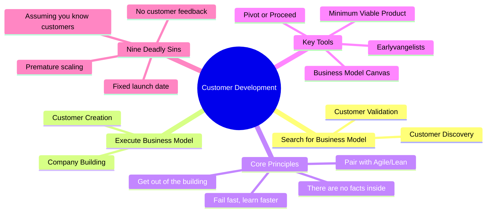

# The Startup Owner's Manual: The Step-by-Step Guide for Building a Great Company

**Steve Blank & Bob Dorf** · K&S Ranch · 2012 · 608 pp · ISBN 9780984999309

> "There are no facts inside your building, so get the hell out."

This is the battle cry of the Customer Development revolution — a methodology
that replaced the old "build it and they will come" model with a rigorous,
hypothesis-driven approach to building startups. The *Startup Owner's Manual*
is the definitive reference: 608 pages of step-by-step instructions, 100+
charts, 77 checklists, and two parallel tracks (web/mobile and physical
channels). It is the book that turned Steve Blank's earlier *The Four Steps to
the Epiphany* from a brilliant essay into an actionable playbook — and it
became the operating manual for the global Lean Startup movement.

---

## Overview

The book is organized around a radical premise: **startups are not smaller
versions of large companies**. Large companies execute known business models.
Startups search for unknown ones. The traditional New Product Introduction
(NPI) model — conceive, build, launch, pray — is designed for execution, not
search. It assumes you know your customers, their problems, and your solution.
Startups know none of these things. The Customer Development model replaces
NPI with a four-step iterative process that tests assumptions before building
anything at scale.

The book covers both "search" steps (Customer Discovery and Customer
Validation) in exhaustive detail, with lighter treatment of "execute" steps
(Customer Creation and Company Building). It provides separate guidance for
two sales channel types — physical (retail, wholesale, direct sales) and
web/mobile (SaaS, e-commerce, marketplace) — recognizing that their customer
dynamics are fundamentally different.

---

## Table of Contents

| Part | Chapter Range | Content |
|------|--------------|---------|
| Getting Started | 1–2 | Why startups fail (the 9 deadly sins) and the Customer Development alternative |
| The Customer Development Manifesto | — | 14 guiding principles that underpin the methodology |
| Step One: Customer Discovery | 3–7 | State hypotheses → test the problem → test the solution → verify or pivot |
| Step Two: Customer Validation | 8–12 | Get ready to sell → get out and sell → position → pivot or proceed |
| Appendices | A–C | 77 checklists, glossary, web startup overview |

---

## Key Concepts

---

## Author: Steve Blank

Steve Blank (b. 1953, New York City) is a serial entrepreneur, educator, and
the creator of the Customer Development methodology that spawned the Lean
Startup movement. After 21 years and eight startups — including Epiphany
(IPO), Rocket Science Games, and SuperMac — Blank became an adjunct professor
at Stanford, UC Berkeley, and Columbia. His 2005 book *The Four Steps to the
Epiphany* was the original articulation of Customer Development; *The Startup
Owner's Manual* (2012) is the expanded, practical playbook. In 2011, Blank
created the Lean LaunchPad class, adopted by the National Science Foundation
as its I-Corps curriculum. His blog (steveblank.com) is required reading for
entrepreneurs worldwide.

## Author: Bob Dorf

Bob Dorf is a serial entrepreneur who founded his first success at 22 and
went on to start seven companies. He is often called the "midwife of Customer
Development" — he critiqued early drafts of *The Four Steps to the Epiphany*
and co-authored *The Startup Owner's Manual* with Blank. Dorf teaches
"Introduction to Venturing" at Columbia Business School and runs K&S Ranch
Consulting with Blank.
