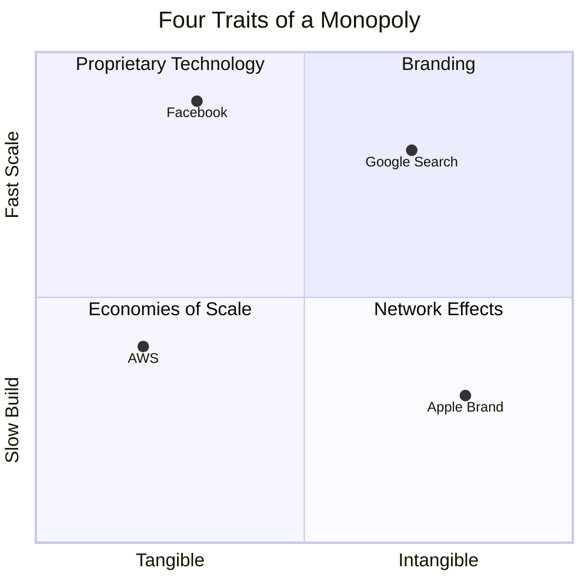
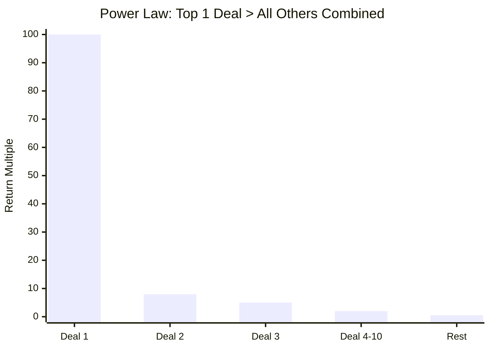

## Preface: Zero to One

The book opens with Thiel's famous contrarian question: *"What important truth
do very few people agree with you on?"* His own answer: that progress comes in
two forms — horizontal (1 to n, copying what works) and vertical (0 to 1,
doing new things). The next Bill Gates will not build an operating system.

---

## Chapter 1: The Challenge of the Future

The future will be different. Progress requires technology (vertical) over
globalization (horizontal). A startup is the largest group of people you can
convince of a plan to build a different future.

- **Horizontal progress (1 to n):** copying things that work — globalization
- **Vertical progress (0 to 1):** doing new things — technology
- Without new technology, globalization leads to resource conflict

---

## Chapter 2: Party Like It's 1999

The dot-com crash taught four wrong lessons:

| Wrong Lesson | Thiel's Counter |
|---|---|
| Make incremental advances | Take bold risks |
| Stay lean and flexible | A bad plan is better than no plan |
| Improve on the competition | Competitive markets destroy profits |
| Focus on product, not sales | Sales matters as much as product |

"The most contrarian thing of all is not to oppose the crowd but to think for
yourself."

---

## Chapter 3: All Happy Companies Are Different

Business is opposite to Tolstoy's families. Happy companies are monopolies
solving unique problems. Failed companies all fail to escape competition.

- Perfect competition drives profits to zero
- Capitalism and competition are opposites
- Monopoly is the condition of every successful business

Economists favor competition because it's easy to model, but real value
requires escaping it.

---

## Chapter 4: The Ideology of Competition

Competition is an ideology, not just an economic concept. Our education system
trains us to compete, narrowing our vision. Thiel describes his own path:
Stanford → Stanford Law → Supreme Court clerkship pursuit → failure →
realization competition was a trap.

"Competition makes us better at whatever we're competing on, but at the
tremendous price of stopping us from asking what's truly important."

---

## Chapter 5: Last Mover Advantage

The goal is not first-mover but **last-mover advantage** — making the last
great development in a market and enjoying years of monopoly profits.

Four characteristics of a durable monopoly:

1. **Proprietary Technology** — 10x better than the closest substitute
2. **Network Effects** — more valuable as more people use it
3. **Economies of Scale** — software scales with near-zero marginal cost
4. **Branding** — a monopoly brand built on substance, not just marketing

Strategy: start small, monopolize a niche, then scale to adjacent markets.

---

## Chapter 6: You Are Not a Lottery Ticket

Success is not random. Thiel maps four attitudes toward the future:

| | Optimistic | Pessimistic |
|---|---|---|
| **Definite** | Build the future (1950s US) | Plan for collapse (China) |
| **Indefinite** | Hope without plan (modern US) | Expect decline (Europe) |

Definite optimism built the modern world. Indefinite optimism is a bubble.
"You are not a lottery ticket."

---

## Chapter 7: Follow the Money

Venture capital returns follow a **power law**: the best investment in a fund
outperforms all others combined.

For VCs: only invest in companies that can return the entire fund. For
founders: focus on one thing that matters most.

---

## Chapter 8: Secrets

Every great company is built on a **secret** — an important truth that few
people agree with you on.

- Why people stop looking for secrets: incrementalism, risk aversion,
  complacency, flatness
- Secrets exist in nature (science) and about people (what they want)
- "A great company is a conspiracy to change the world"

---

## Chapter 9: Foundations

Early decisions define a startup's trajectory:

- Right co-founders are critical
- Equity splits must be fair
- Board size: small is better
- Full-time, on-site only
- Cash compensation should be low; equity drives alignment

---

## Chapter 10: The Mechanics of Mafia

Company culture is not about perks. It's about shared mission and intense
loyalty. The "PayPal Mafia" succeeded because of a unified culture — everyone
was radically committed to the same mission.

- Hire people who are passionate about the mission
- Everyone should own equity
- Keep the team small and tight-knit

---

## Chapter 11: If You Build It, Will They Come?

Silicon Valley underestimates sales and distribution. Even a great product
needs a distribution strategy.

- **Complex sales** (>$1M): CEO-driven, high-touch
- **Personal sales** ($10K-$100K): sales team
- **Marketing/advertising** (mass market): low CAC, high volume
- **Viral distribution**: product spreads by itself

Sales matters as much as product. "People overestimate the relative
difficulty of science and engineering."

---

## Chapter 12: Man and Machine

Computers complement humans, not replace them. Thiel argues:
- Humans are good at conscious reasoning, computers at processing data
- The most valuable combinations use both (e.g. Palantir)
- AI fear is overblown; the real risk is technological stagnation

---

## Chapter 13: Seeing Green

Cleantech failed because it couldn't answer Thiel's seven questions. Most
companies had zero good answers and were hoping for a miracle.

**Tesla succeeded** where cleantech failed by nailing all seven:

1. **Engineering** — breakthrough electric powertrain
2. **Timing** — rising oil prices, environmental concern
3. **Monopoly** — started with high-end Roadster niche
4. **People** — Elon Musk's vision and team
5. **Distribution** — company-owned stores, vertical integration
6. **Durability** — battery tech moat, Supercharger network
7. **Secret** — EVs could be better, not just greener

---

## Chapter 14: The Founder's Paradox

Founders are strange, extreme characters. Their very oddness enables them to
see things others don't. But they risk becoming tyrants or burning out.

"You either die a hero or live long enough to become the villain."

---

## Conclusion: Stagnation or Singularity?

Four possible futures:

1. **Recurrent collapse** — boom and bust cycles
2. **Plateau** — stable but stagnant
3. **Extinction** — civilization-ending disaster
4. **Takeoff** — accelerating progress (the Singularity)

Only the fourth requires going from 0 to 1. Thiel's call: "There is no reason
to settle for anything less. The future is yours to build."

---

## The Seven Questions Every Business Must Answer

1. **The Engineering Question** — Can you create breakthrough technology
   (10x better)?
2. **The Timing Question** — Is now the right time?
3. **The Monopoly Question** — Are you starting with a big share of a small
   market?
4. **The People Question** — Do you have the right team?
5. **The Distribution Question** — Do you have a way to deliver your product?
6. **The Durability Question** — Can you defend your market position for
   10-20 years?
7. **The Secret Question** — Have you identified a unique opportunity others
   don't see?
