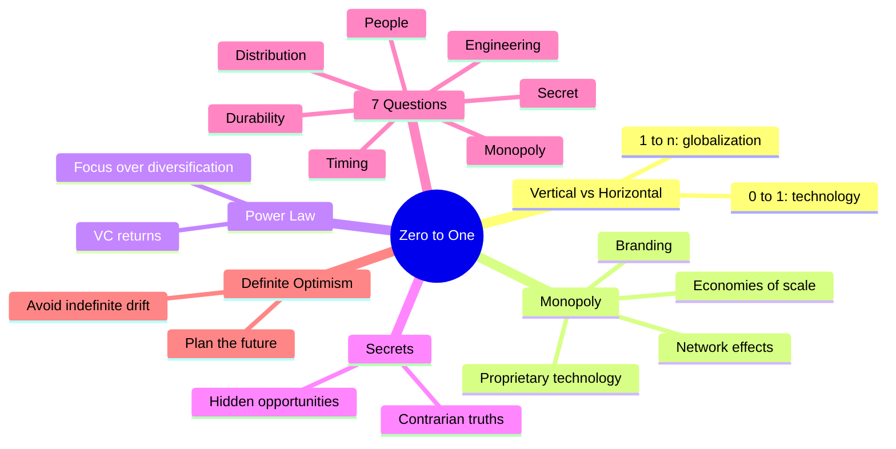

# Zero to One: Notes on Startups, or How to Build the Future

**Peter Thiel with Blake Masters** · Crown Business · 2014 · 224 pp · ISBN 9780804139298

> "What important truth do very few people agree with you on?"

This is the contrarian question at the heart of Peter Thiel's manifesto on
innovation. The book argues that true progress comes not from copying what
works (going from 1 to n) but from creating something entirely new (going
from 0 to 1). Drawing on his experience as co-founder of PayPal and Palantir
and the first outside investor in Facebook, Thiel distills a Stanford course
into a provocative blueprint for building the future.

---

## Table of Contents

| # | Chapter | Topic |
|---|---------|-------|
| Preface | Zero to One | The contrarian question |
| 1 | The Challenge of the Future | Vertical vs horizontal progress |
| 2 | Party Like It's 1999 | Lessons from the dot-com crash |
| 3 | All Happy Companies Are Different | Monopoly vs competition |
| 4 | The Ideology of Competition | Why we compete — and why it hurts |
| 5 | Last Mover Advantage | Building a durable monopoly |
| 6 | You Are Not a Lottery Ticket | Definite vs indefinite optimism |
| 7 | Follow the Money | The power law of venture capital |
| 8 | Secrets | The importance of contrarian truths |
| 9 | Foundations | Getting the startup basics right |
| 10 | The Mechanics of Mafia | Company culture as cult |
| 11 | If You Build It, Will They Come? | The hidden importance of sales |
| 12 | Man and Machine | Humans complement computers |
| 13 | Seeing Green | Why cleantech failed, Tesla succeeded |
| 14 | The Founder's Paradox | The strange character of founders |
| Conclusion | Stagnation or Singularity? | Four futures |

---

## Key Concepts

---

## Author

**Peter Thiel** (b. 1967, Frankfurt, West Germany) is an entrepreneur, venture
capitalist, and political activist. He co-founded PayPal (sold to eBay for
$1.5B), Palantir Technologies (big data analytics), and Founders Fund. He was
the first outside investor in Facebook, turning $500K into billions. A
Stanford Law graduate, Thiel is known for contrarian views on technology,
competition, and the future.

**Blake Masters** was a Stanford law student who took notes on Thiel's CS183
class — those notes became the book.
