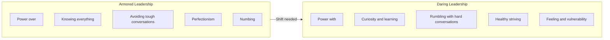
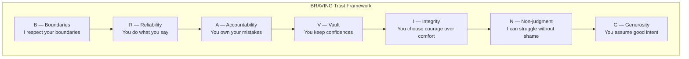
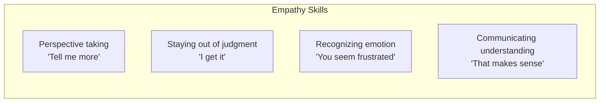

## Armored vs Daring Leadership

---

## The Four Courage Skills

### 1. Rumbling with Vulnerability
A "rumble" is a discussion where people show up with their whole hearts
and real talk. Rumbles are not safe — they are courageous.

Key rumble tools:
- **The Sandbox**: define the problem specifically; what is in and out?
- **Stories are just stories**: check your interpretations before acting
- **The 10x rule**: solutions should match the scale of the problem

### 2. Living into Our Values
Most organizations have values on a wall poster but do not live them.
To operationalize values:
1. **Name 2-3 core values** that truly drive behavior
2. **Define them operationally**: what does courage look like in
   a meeting? What does empathy sound like in a performance review?
3. **Practice them daily**: use values as decision-making filters

### 3. BRAVING Trust

Trust is not built in grand gestures. It is built in small moments —
keeping a confidence, showing up on time, admitting a mistake. Each
small act is a marble in the trust jar.

### 4. Learning to Rise
The process of getting back up after failure:
1. **The Reckoning**: recognize when you are emotionally hooked
2. **The Rumble**: get curious about the story you are telling yourself
3. **The Revolution**: write a new ending based on what you learned

---

## The Empathy Armor

Empathy is not fixing, advising, or one-upping. It is connecting to the
emotion someone is feeling. The most empathic response: "I hear you."

---

## Key Lessons

- **Clear is kind. Unclear is unkind.** Not giving honest feedback
  is not kindness — it is cowardice that deprives someone of the
  information they need to grow.
- **Perfectionism is not the path to excellence.** Perfectionism is
  the belief that if we do everything perfectly, we can avoid shame.
  The result is not excellence — it is anxiety and burnout.
- **Vulnerability is the birthplace of innovation.** No one feels safe
  to propose a radical new idea in an environment where failure is
  punished.
- **You cannot give what you do not have.** Self-compassion is a
  prerequisite for leading others with compassion.
- **Shame cannot survive being spoken.** When you share your shame
  story with someone who responds with empathy, shame loses its power.

---

## Practical Applications

### For Leaders
- Start meetings with a check-in: "What are you bringing into this
  room today?"
- Use the BRAVING framework to diagnose trust breakdowns: which
  element is missing?
- Practice "The Sandbox": define the specific problem before
  discussing solutions

### For Teams
- Co-create operational definitions of your values
- Build "trust marbles" intentionally: small acts of reliability,
  accountability, and generosity
- Create a culture where people can say "I am struggling" without
  judgment

### For Individuals
- Write down your top 2-3 values and audit how you are living them
- When you feel shamed, reach out to one trusted person and share
  your story
- Practice empathy when someone shares a struggle — just listen,
  do not fix
