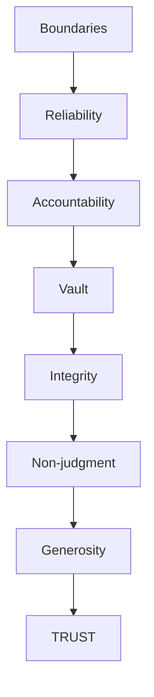

## Introduction

Welcome to BookAtlas. Today: *Dare to Lead* by Brené Brown.
Published 2018. Over 2 million copies sold. The book that brought
vulnerability from the therapy room to the boardroom.

Brown spent 20 years researching vulnerability, shame, and courage.
In Dare to Lead, she asks: what would organizations look like if
leaders had the courage to be vulnerable?

---

## The Vulnerability Question

**Proponent:** Brown's central claim is that vulnerability is not
weakness. It is the birthplace of innovation, creativity, and change.
Leaders who armor up — who pretend to know everything, avoid tough
conversations, and demand perfection — create cultures of fear. Daring
leaders, by contrast, create cultures where people feel safe enough to
take risks.

**Skeptic:** This sounds great in theory. But in practice, the people
who get promoted are the ones who project certainty and confidence.
Vulnerable leaders get eaten alive.

**Proponent:** That is the old model. Research shows that psychological
safety — the belief that you can take risks without being punished — is
the #1 predictor of team performance. Google's Project Aristotle
confirmed this. Vulnerability is not weakness. It is strategic.

---

## BRAVING Trust

**Proponent:** This is the most useful part of the book. Brown breaks
trust into seven specific behaviors. When trust is broken, you can ask:
was it a boundary violation? A reliability failure? A breach of
confidence? The answer tells you exactly what to repair.

**Skeptic:** Seven elements feels like over-complication. Trust is
simple: do you do what you say?

**Proponent:** That is Reliability — one of seven. What about
confidentiality? That is Vault. What about taking responsibility for
mistakes? That is Accountability. The framework makes trust specific
enough to work on.

---

## Clear Is Kind

**Proponent:** Brown's most quotable line: "Clear is kind. Unclear is
unkind." If you are not giving honest feedback because you are afraid
of hurting someone's feelings, you are actually being unkind. You are
denying them the opportunity to improve.

**Skeptic:** That works when the feedback is constructive. But sometimes
"clear" is just cruel. There is a difference between directness and
brutality.

**Proponent:** Brown would agree. The distinction is intent. Clear
feedback delivered with empathy is kind. Brutal feedback delivered to
discharge your own frustration is not. The key is to rumble with
vulnerability: "I want to share something that might be hard to hear.
I am sharing it because I believe in you."

---

## The Verdict

**Proponent:** Dare to Lead is the most important leadership book of
the last decade. It gives leaders permission to be human and provides
a concrete framework for doing the hard work of building trust and
courage.

**Skeptic:** It is a good book, but its impact is limited by the
personality of the reader. Leaders who are already empathetic will
find it affirming. Leaders who need it most — command-and-control
types — will dismiss it as soft.

**Proponent:** That does not make the book wrong. It makes it a
challenge. And challenging people to grow is what leadership books
are supposed to do.

---

## Final Thoughts

Dare to Lead is Brené Brown at her most practical. The BRAVING
framework, the rumble skills, and the case for vulnerability as courage
rather than weakness are valuable contributions to the leadership
literature. It is not a complete leadership playbook — it is about one
specific dimension of leadership that has been historically neglected.
But that dimension — courage — may be the most important one.

This has been a BookAtlas narration of Dare to Lead by Brené Brown.
Thanks for listening.
