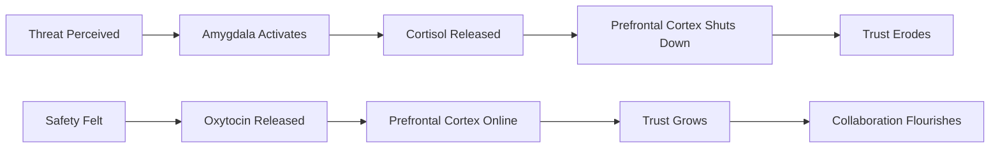
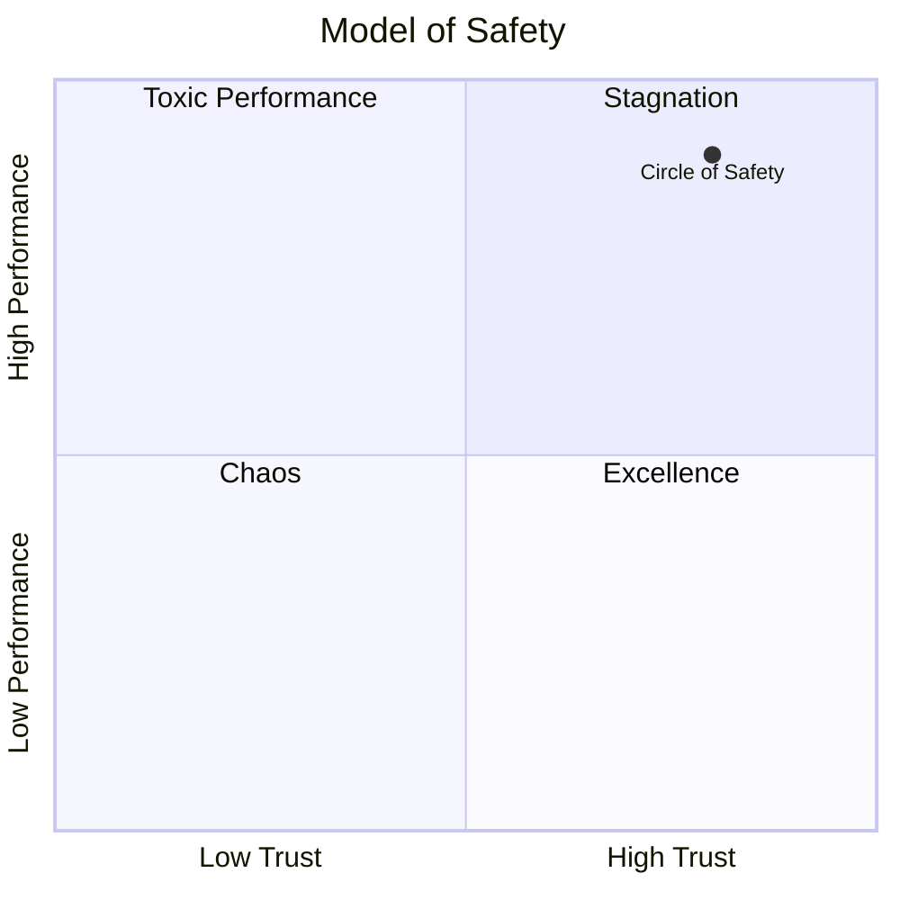
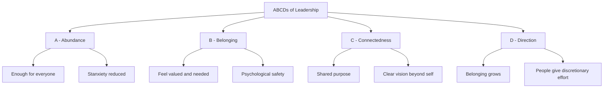

## Preface: The Evolutionary Puzzle

The book begins with a question that cuts to the heart of human cooperation:
*Why would a human being work harder for someone who is willing to sacrifice
for them?*

Sinek points to the biochemistry of our primate ancestors. In times of
danger, the group functioned best when everyone looked out for each other.
The leader who ate first also took the most risk. The biological wiring is
still present today — but modern organizations have largely forgotten it.

A Marine general told Sinek: *"You're not paid to be smart. You're paid to
be good. If you are good, your people will be smart."*
This inversion — good before smart — is the core inversion of leader-before-team.

---

## Part I: Our Natural Environment

### Chapter 1: Would It Have to Be?

The chapter erases the Hollywood image of the Alpha wolf — a lone, violent
bully. Real wolf packs are family units. The alpha pair leads because others
choose to follow, not because they dominate through fear. The same biology
applies to human beings: our brains reward cooperation with chemicals of
safety (oxytocin) and punish chronic threat with cortisol.

The chapter asks: if your organization were attacked, would your people take
a bullet for you? If not, why not?

---

### Chapter 2: The World Is a Dangerous Place

Humans evolved in small bands surrounded by predators, scarcity, and hostile
neighbors. The amygdala — our threat detector — served us well. But the same
system misfires in modern workplaces: a rude email from a boss triggers the
same cortisol cascade as a saber-tooth on the savanna.

**Key insight:** Cortisol makes us selfish and short-sighted. In organizations
where people feel threatened daily, they revert to individual survival mode.
No amount of incentives can override this biology for long.

The chapter introduces the external threat environment that organizations
always face: competitors, economic pressure, market changes. The **Circle of
Safety** exists precisely so people can focus on these external threats
instead of infighting.

---

### Chapter 3: Belonging to Safety

This chapter traces the evolution of belonging. From primates to humans, the
group that trusted each other outcompeted groups that didn't. Oxytocin — the
"cuddle hormone" — is the biochemical basis for this trust.

**The Circle of Safety** is Sinek's central metaphor: a group boundary within
which members feel protected by the leader and by each other. When the circle
holds, people feel safe enough to:

- Take risks
- Experiment and innovate
- Admit mistakes
- Help colleagues
- Surrender self-interest to the group

Outside the circle, the default human response is fear-driven: hoard
information, blame others, protect oneself. The leader's job is to draw and
defend the circle.

---

### Chapter 4: The Larger Ecosystem

Organizations do not exist in isolation. They sit inside a larger ecosystem
of customers, suppliers, regulators, and competitors. The circle of safety
creates a stable base from which to engage this dangerous outside world.

Drawing on Abraham Maslow — whose hierarchy of needs never had the bottom
(r Physiological needs) replaced by "real danger" response — Sinek argues
that **belonging is a prerequisite for performance**. No one performs well
in chronic fear.

The chapter also applies the model to scale: Google, the U.S. Marines, and
Southwest Airlines all share a deep commitment to keeping their circles wide.

---

### Chapter 5: Eclipse of Thought

Pharmaceutical substitutes for human connection. This chapter is the most
rigorous and controversial in the book. Sinek argues that financial
incentives, performance bonuses, gamified rewards, and even ping-pong tables
are increasingly **pharmacological substitutes** — cheap imitations of the
chemicals we get naturally from real human connection.

- **Dopamine** from bonus = inferior to oxytocin from trust
- Perks and stock options can feel manipulative when people don't feel seen
- When organizations rely on carrots and sticks instead of genuine
  belonging, the damage to culture is slow but irreversible

> "When we reduce human beings to numbers, we strip them of their humanity.
> And when people feel less than human, they act less than human."

---

## Part II: The Modern Problem

### Chapter 6: A Series of Bad Decisions

This chapter tracks how good organizations go bad through a series of small,
logical-sounding decisions that accumulate into cultural decay. The pattern:

1. Something works — culture is strong
2. New executive arrives with "best practices"
3. "We need to tighten controls"
4. Metrics replace trust
5. People stop volunteering information
6. Mistakes are hidden until crisis

Sinek calls this the **dehumanization of work**. At its endpoint, employees
are "human resources" — assets to be optimized and replaced.

---

### Chapter 7: The Dopamine Follies

A focused look at **gamification gone wrong**. Sinek isn't against dopamine
as a motivator — it's the chemical of achievement, progress, and goal-
reaching. The problem is synthetic dopamine: ranking systems, leaderboards,
and bonus structures that create competition *within* the team, destroying
the circle.

The chapter also introduces the **Ruth Downs Error**: confusing correlation
with causation. People who receive rewards *after* good performance often
mistakenly believe the reward *caused* the good performance. Leaders make
this same error at scale.

```mermaid
gantt
  title The Reward Substitution Cycle
  dateFormat  X
  section Time in Org
  Real trust and belonging :0, 4
  Performance is good       :1, 5
  Leader introduces bonuses   :3, 6
  People work for bonus     :4, 8
  Trust erodes              :6, 10
  Performance declines      :9, 12
  Leader adds more bonuses   :11, 12
```

---

### Chapter 8: Running from Emergency

The modern "always-on" workplace is a cortisol factory. Email at midnight,
Slack expectations at weekends, the constant pressure to be visibly
productive — this creates a permanent low-level emergency state in employees'
bodies.

**Chronic cortisol effects on teams:**

- Shrinks the prefrontal cortex → worse decision-making
- Increases selfishness → hoarding of information and resources
- Weakens immune system → more sick days, lower long-term engagement
- Suppresses oxytocin → trust collapses

The chapter profiles organizations — notably the marine corps under General
Jim Mattis — that deliberately cycle stress and recovery to keep teams
functioning at peak.

---

### Chapter 9: The Unhappy Medium

Organizations that chase quarterly numbers while claiming to value people
produce the worst of both worlds. People feel lied to: the organization says
it cares, but every decision in favor of short-term shareholder value
confirms otherwise.

Sinek calls this **the unhappy medium**: not quite abusive enough to rebel
against, not quite supportive enough to trust. It produces cynicism, quiet
quitting, and managers who mirror each other without questioning the system.

The chapter points to the 2008 financial crisis as a case study. The way
investment banks treated their own people — laying off tens of thousands
while executive bonuses stayed intact — was not a betrayal of free market
values. It was free market values working exactly as designed.

---

### Chapter 10: Imbalance of Power

When the circle breaks, the leader becomes a liability. Whistleblowers are
not traitors — they are people who still believe in the organization's
stated values and feel betrayed when those values are violated.

This chapter profiles real organizations where the circle has shattered:

- Wells Fargo fake accounts scandal
- Volkswagen emissions cheating
- U.S. Veterans Affairs wait-time falsification

In each case, the root cause was not "a few bad apples." It was a
leadership culture that rewarded results without protecting people who tried
to do the right thing. The organization became a **Circle of Distrust**.

---

## Part III: Let Them Feel So They Can Think

### Chapter 11: Infinite Vision

Sinek's follow-up to *Start with Why*: even a strong WHY can be undermined
by short-term thinking. A company with a compelling purpose fails if its
leaders betray that purpose to hit quarterly targets.

Leaders must communicate **direction** — the D in ABCDs — in a way that
transcends the immediate. Making money is an outcome; it is not a purpose.
People need to know **what the organization stands for, not just what it
sells**.

> "If you give people a cause, a purpose, they will move mountains. If you
> give them targets, they will game the system."

---

### Chapter 12: The Courage to Detach

Putting people before numbers requires practical courage. Sinek calls it
**self-sacrifice**: the willingness to take a short-term hit so your team
can thrive long-term.

Practical behaviors that signal the circle is maintained:

- Celebrate publicly, criticize privately
- Ask for help rather than pretending to have all answers
- Share credit, take blame
- Eat last (the book's namesake moment: in the military, leaders eat after
  their people)
- Protect people from arbitrary demands from above

The chapter uses Bob Chapman (Barry-Wehmiller), who during the 2008 financial
crisis introduced furloughs not layoffs — every employee, including the CEO,
took four weeks of unpaid leave. The response: people felt protected, morale
held, and the company recovered stronger.

---

### Chapter 13: The Problem is Us

The book challenges the reader not to wait for a better boss, but to see
leadership as available to anyone, anywhere — regardless of title. You can
lead from the middle by choosing to extend the circle to your own team.

"Each one of us, regardless of our role, has the power to make the people
around us feel safer or less safe."

Personal accountability for collective safety is the ultimate thesis of the
book.

---

## Conclusion: To Dance as One

The military metaphor of leadership is not about domination. It is about the
deepest form of service. The leader's job is not to be the smartest, the
fastest, or the most talented. It is to create conditions where everyone
else can be their best.

> "Leadership is a choice. It is the choice to put the safety and well-being
> of those we lead ahead of our own safety and comfort."

The biological obligation of leadership is not optional. It is wired into our
evolution. Organizations that honor this obligation build endurance, loyalty,
and excellence. Organizations that violate it burn out their best people and
survive on fear.

---

## The ABCDs of Leadership

| Element | What It Means | Biological Signal |
|---------|--------------|-------------------|
| **A — Abundance** | Enough for everyone; scarcity is a myth leaders impose | Low cortisol |
| **B — Belonging** | People feel valued, needed, and safe | Oxytocin |
| **C — Connectedness** | Team as an identity, not just a tool | Serotonin |
| **D — Direction** | Clear purpose beyond individual goals | Dopamine (aligned, not gamified) |
