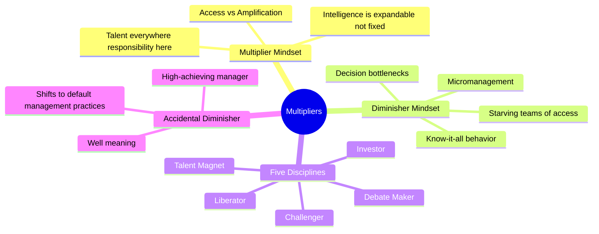

# Multipliers: How the Best Leaders Make Everyone Smarter

**Liz Wiseman with Greg McKeown** · Harper Business · 2010 (reprint 2017) · 336 pp · ISBN 9780061781348

> "Some managers seem to walk through a door and extinguish the brightest lights. Others seem to walk through and turn them on."

The central insight is uncomfortable: the kind of leader you are determines how intelligent your organization becomes. After two years of research — 140 leadership interviews, data on 5,000+ leader profiles, and case studies from Silicon Valley to GE to Google — Wiseman and McKeown identified two archetypes that explain vastly different organizational outcomes.

**Multipliers** get nearly twice the capability from their organizations. They don't extract effort — they amplify intelligence. They create environments where people don't just work harder but actually *think* differently, solve harder problems, and perform at levels they didn't know they were capable of.

**Diminishers** drain intelligence and capacity. Not through malice — most Diminishers are smart, ambitious, and well-intentioned — but through a set of default behaviors that strip people of their autonomy, confidence, and creative energy.

The book's structure: understanding the distinction (where Multipliers and Diminishers diverge), the five disciplines of Multipliers, the Accidental Diminisher phenomenon, and how to make the shift from diminishing to multiplying leadership.

---

## Table of Contents

| # | Part / Section | Topic |
|---|----------------|-------|
| Preface | The Multiplier Experiment | What the research found: two CEO types |
| 1 | The Multiplier Effect | How Multipliers get 2x capability from their teams |
| 2 | The Diminisher | How even good managers drain intelligence |
| 3 | The Talent Magnet | How Multipliers attract and unleash the best people |
| 4 | The Liberator | Creating psychological safety for high performance |
| 5 | The Challenger | Using stretch questions to expand what teams think possible |
| 6 | The Debate Maker | Fostering rigorous, engaging, collective decisions |
| 7 | The Investor | Letting people own outcomes and learn from outcomes |
| 8 | Being a Multiplier | How you can consciously transition from Diminisher to Multiplier |
| — | Appendix | Accidental Diminisher assessment |
| — | Notes & Methodology | Research design, leadership profiles studied |

---

## Key Concepts

---

## Author

**Liz Wiseman** is a researcher, executive advisor, and speaker who teaches executive and managerial leadership at Stanford University's Graduate School of Business. She was a former Vice President of Oracle University and global leader for Human Resource Development at Oracle. At Oracle, she led the creation of numerous thought-leadership initiatives and led major learning and development efforts globally. Wiseman has degrees in Business Administration and Organizational Behavior.

**Greg McKeown** is a strategy and staff effectiveness expert, co-founder of the leadership development firm McKeown/Company, and author of *Essentialism: The Disciplined Pursuit of Less*. He was previously a researcher at the Stanford University Center for Professional Development.
