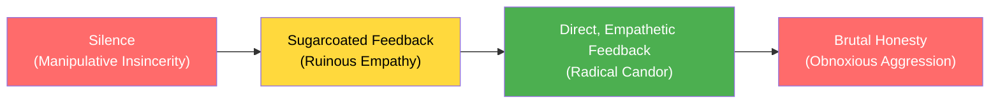
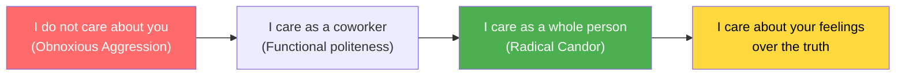
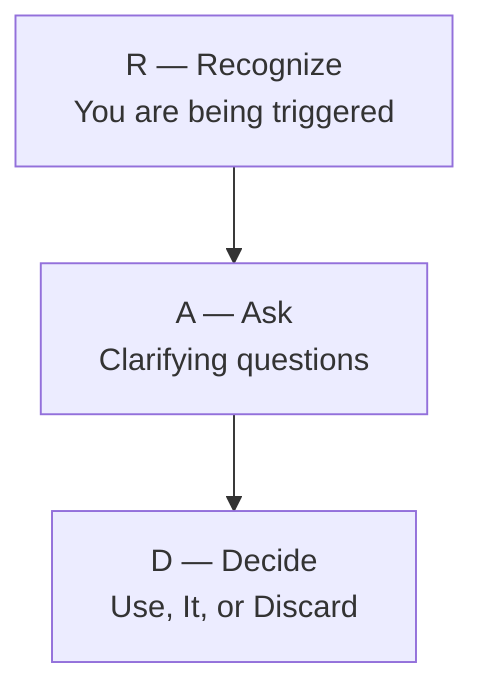
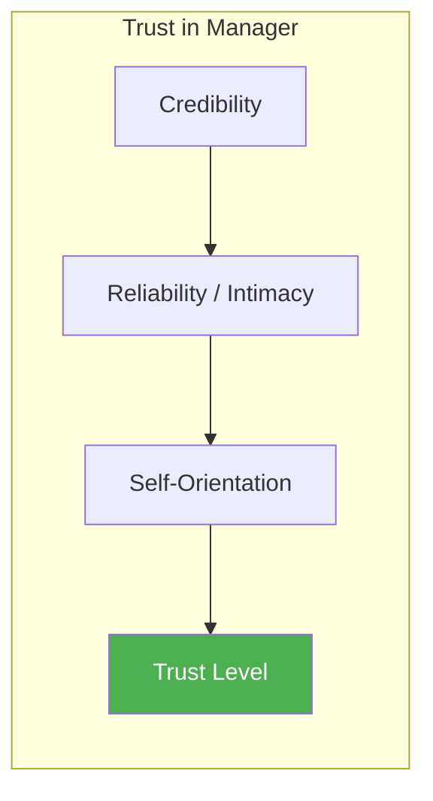

## The Four Quadrants

### 1. Radical Candor
**Challenge directly + Care personally** — The goal.

You say what you genuinely believe, without sugarcoating, while
demonstrating that you care about the person as a human being. The key
insight: the *care personally* part is not optional. It is the vehicle
that makes *challenge directly* possible.

Signs you are in Radical Candor:
- Your team members come to you for honest feedback
- People know where they stand with you
- Feedback conversations end with clarity, not anxiety
- People grow faster because they know exactly what to improve

---

### 2. Ruinous Empathy
**Low challenge + High care** — The trap of nice.

This is the most common quadrant. Managers avoid tough conversations
because they do not want to hurt feelings. They confuse *being nice*
with *being kind*.

The harm:
- Underperformers never improve — they get fired without warning
- High performers do not know what to keep doing
- Team morale erodes because inequity goes unaddressed
- You are actually being selfish — prioritizing your comfort over
  their growth

**The reframe:** Silence is not kind. Silence is selfish.

---

### 3. Obnoxious Aggression
**High challenge + Low care** — The trap of busy.

Blunt, abrasive, "tell it like it is" without regard for how it lands.
This is the manager who says "I am just being honest" as an excuse for
being a jerk.

Why it happens:
- Ego: you want to feel smart or dominant
- Time pressure: you think being "direct" means skipping the
  relationship part
- Confusing honesty with brutality

Why it fails:
- People perform out of fear, not commitment
- High performers leave for cultures where they feel respected
- You miss nuance — what sounds confident may be wrong
- Feedback is rejected because it feels like an attack

---

### 4. Manipulative Insincerity
**Low challenge + Low care** — The trap of politics.

Backbiting, gossiping, passive-aggression. This manager says one thing
to your face, another behind your back. They avoid direct feedback
entirely and let resentment build.

Signs:
- You never know where you stand
- Feedback comes from others, not your manager
- Meetings are friendly but follow-ups reveal hidden frustration
- Trust is evaporating

---

## Core Framework Components

### The Challenge Directly Ladder

The ladder is a spectrum, not four discrete buckets. Your goal is to
squeeze out the sugarcoating while keeping the empathy.

---

### The Care Personally Ladder

"Care personally" means seeing people as humans, not production units.
It is not about being best friends. It is about genuine human regard.

---

## Feedback Framework

### The RAD Model for Receiving Feedback

**Recognize:** Your lizard brain is activated. Pause before reacting.

**Ask:** "Can you give me a specific example of what you mean?" 75
percent of feedback problems are communication problems. Ask until it
makes sense.

**Decide:** Not all feedback is accurate. Use what is useful, and
discard the rest without guilt.

---

### Giving Feedback: What, Why, How

**What:** Specific, behavior-based observations. Not personality
judgments.

- "In the presentation, you jumped to conclusions without showing the
  data" (What)
- "You are being dismissive" (Who — avoid this)

**Why:** Explain the impact. This grounds feedback in outcomes, not
opinions.

- "When we do not see the data, the team loses confidence in the
  recommendation"

**How:** Offer concrete steps forward.

- "Next time, lead with the supporting numbers before the conclusion"

---

### Receiving Feedback: What to Say

| Situation | Response |
|-----------|----------|
| Feedback you agree with | "Thank you. I will work on that." |
| Feedback you are not sure about | "Can you be more specific? Give me an example." |
| Feedback that feels off | "That does not match my intention. Can you tell me more?" |
| You disagree completely | "I hear you. Here is what I was trying to achieve..." |

---

## The Trust Equation

Trust is the *enabler* of Radical Candor. Without trust, feedback —
even delivered perfectly — lands as manipulation or hostility.

---

## Key Lessons

- **Radical Candor is not a personality trait.** It is a skill. Anyone
  can learn it.
- **Most bad feedback fails because of the *how*, not the *what*.** The
  message is less important than the delivery.
- **Do not confuse honesty with candor.** Honesty without empathy is
  brutality. Candor without empathy is noise.
- **1:1 meetings are the primary delivery mechanism.** Regular, private
  conversations are where candor lives.
- **Feedback should be frequent, not occasional.** Waiting until
  quarterly reviews to say hard things is a failure of management.
- **Your direct reports' success is your success.** Challenging them
  directly is an act of loyalty, not disloyalty.
- **Cultural norms are contagious.** One manager practicing Radical
  Candor can shift an entire team. The reverse is also true.
