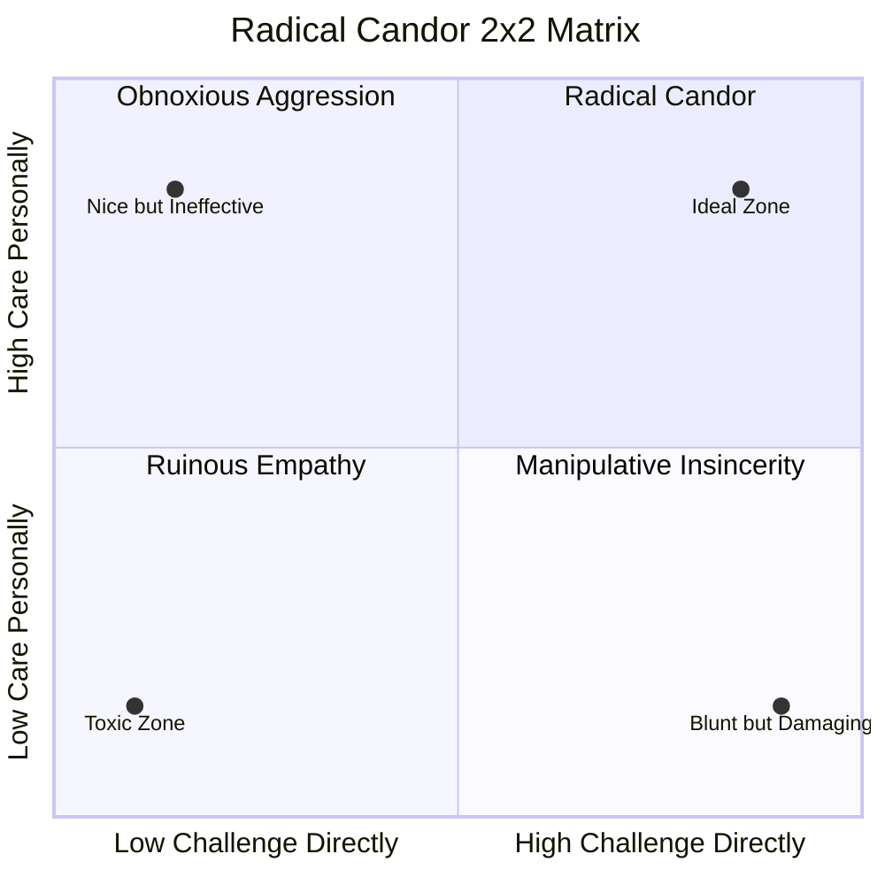

## Introduction

Welcome to BookAtlas. Today: *Radical Candor* by Kim Malone Scott.
Published 2017, revised edition 2019. Over 2 million copies sold. The
book that redefined what it means to be a good manager.

Scott ran operations at Google, Apple, and Twitter — three of the most
demanding work environments on earth. In Radical Candor, she asks a
simple question: why do so many good managers fail? Her answer: they
are either too nice to speak the truth, or too blunt to keep people
around. The sweet spot — and the book's central argument — lies
somewhere in between.

---

## The Quadrant Setup

**Proponent:** This framework works because it is memorable and
symmetrical. Two axes, four buckets. Once you learn it, you start
seeing it everywhere — in meetings, in performance reviews, in Slack
messages.

**Skeptic:** Anyone can make a 2x2 matrix. That does not mean it
reflects reality. Is human behavioral complexity really that tidy?

**Proponent:** Scott would agree it is a simplification. But the
framework's job is not to capture every nuance — it is to give you a
mental model that changes behavior. If you walk into a feedback
conversation and ask "which quadrant am I in?", you are already doing
something most managers never do.

---

## Ruinous Empathy

**Proponent:** This is the most important quadrant in the book. Ruinous
Empathy — caring a lot but saying very little — is the most common
management failure. Scott's claim is bold: *silence is not kindness*.
When a manager avoids a tough conversation to protect someone's
feelings, they are actually prioritizing their own comfort over the
other person's growth.

**Skeptic:** That is a harsh way to frame it. Many managers avoid tough
feedback because they genuinely believe it will hurt. The person might
be fragile, or the timing might be bad.

**Proponent:** Scott agrees with the timing concern. The issue is not
*when* to give feedback — it is *whether* you ever give it at all.
Long-term silence is more damaging than a poorly timed honest
conversation. Underperformers who are never told they are
underperforming are being set up to fail.

**Skeptic:** What if the feedback is wrong? What if you are projecting
your own anxiety onto someone who is actually doing fine?

**Proponent:** That is the listening problem. Scott says 75 percent of
effective feedback is listening, not speaking. Ask first: "Can I share
something that might be hard to hear?" Then listen to what they say.
Feedback is a dialogue, not a monologue.

---

## Obnoxious Aggression

**Skeptic:** Let us talk about the other extreme. The manager who says
"I am just being direct" and calls it candor. The harsh critic, the
micromanager, the one who treats feedback as a weapon.

**Proponent:** This is Obnoxious Aggression — high challenge, low care.
Scott is clear: this is not Radical Candor. The challenge is real, but
the care is missing. The impact is predictable: people stop trying,
high performers leave, and only the most compliant remain.

**Skeptic:** Some workplaces *reward* obnoxious aggression. The
aggressive manager gets results. The empathetic one gets ignored.

**Proponent:** Short-term results, maybe. Long-term, the obnoxious
aggressor builds a culture of fear. Fear produces compliance, not
commitment. The moment a better opportunity opens, the best people
leave. This is why turnover at aggressively managed teams is almost
always higher.

---

## Manipulative Insincerity

**Skeptic:** And the remaining quadrant — low challenge, low care.
Gossiping, passive-aggression, backstabbing.

**Proponent:** This is the political quadrant. The manager who says
everything is fine to your face, then complains about you in the
hallway. The problem is not just that feedback is missing — it is that
trust is actively being destroyed. People learn not to trust anything
the manager says.

**Skeptic:** This is the most toxic quadrant, but it is also the
hardest to fix. How do you change a culture of politeness that hides
hostility?

**Proponent:** Start with yourself. If you are a manager, stop
participating. When someone says something negative about an absent
person, ask: "Would you say that to their face?" More broadly, make
feedback a normal, expected part of your team's rhythm — not something
that only happens when things go wrong.

---

## The Listening Problem

**Proponent:** Scott's most underappreciated point: feedback is mostly
about listening. Most managers think giving feedback means talking.
Scott flips this: the best feedback conversations are 75 percent
listening. Ask questions. Let them explain their thinking. Meet them
where they are.

**Skeptic:** That is harder than it sounds. Most managers go into
feedback conversations with a script. They want to say their piece and
be done.

**Proponent:** And that is exactly why feedback fails. If the person on
the receiving end does not feel heard, they do not absorb anything you
say. The RAD model from content — Recognize, Ask, Decide — is designed
to prevent that. Pause when triggered. Ask clarifying questions. Then
decide whether to use, pass on, or discard the feedback.

---

## Trust as Prerequisite

**Skeptic:** Here is the circular problem: you need trust to give
feedback, but how do you build trust before you can give feedback?

**Proponent:** Trust is built in small, consistent actions. Show up on
time. Keep confidences. Admit your own mistakes. Follow through on
what you say. Over time, these accumulate into enough relational
capital that the challenging moments land differently.

**Skeptic:** That sounds slow. What if you are inheriting a troubled
team and need rapid trust?

**Proponent:** The fastest way is personal vulnerability. Admit what
you do not know. Ask for help. Say "I messed up" publicly. Scott's
claim is that people respond to authenticity faster than to authority.

---

## The Verdict

**Proponent:** Radical Candor is one of the most practically useful
management books ever written. The quadrant framework is instantly
learnable and immediately applicable. It gives a vocabulary to a
problem — bad feedback culture — that most organizations do not even
know how to name.

**Skeptic:** The quadrant is a simplification. Not every feedback
conversation maps cleanly onto it. And some of the advice — especially
around high-pressure situations — requires a level of safety that many
teams simply do not have.

**Proponent:** Scott acknowledges both of those limits. The book is not
a universal manual. It is a starting point. A North Star. Practice,
iterate, and calibrate to your team and your culture.

---

## Final Thoughts

Radical Candor succeeds because it takes a genuinely hard problem —
how to tell people hard things without destroying the relationship —
and gives it a framework that is simple enough to remember and
specific enough to act on.

The core insight endures: caring and challenging are not opposites.
The best managers do both simultaneously. That is the Radical Candor
promise. Whether you have the discipline to deliver on it is the real
test.

This has been a BookAtlas narration of Radical Candor by Kim Malone
Scott. Thanks for listening.
