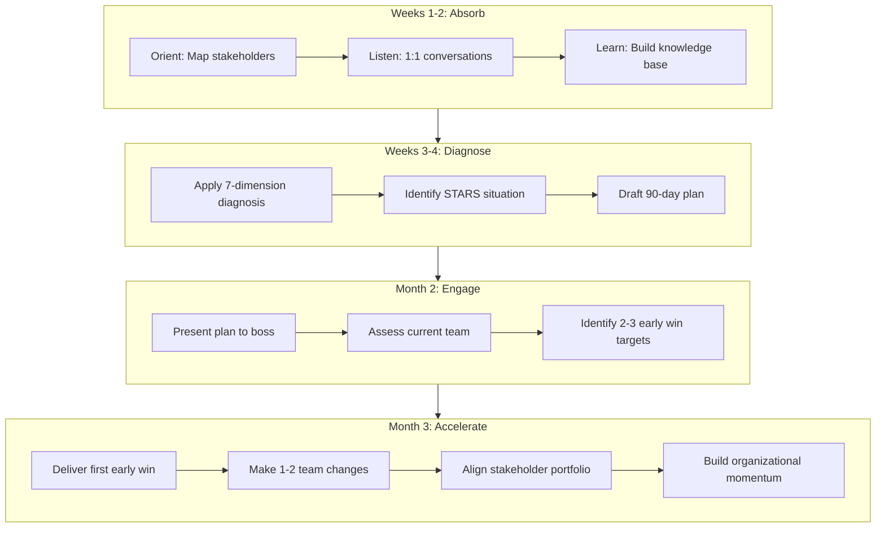

# Core Concepts

## The Transition Framework Overview

Watkins structures the book into **three overarching phases** that map to the 90-day timeline:

1. **Phase 1: Prepare** (before day one) — clarify expectations, build relationships with your new boss, complete due diligence on what you are walking into.
2. **Phase 2: Manage** (days 1–30) — absorb the culture, diagnose the situation, build credibility, establish your learning agenda.
3. **Phase 3: Accelerate** (days 31–90) — secure early wins, build your team, align stakeholders, and shift from learning to executing at full pace.

Each phase has distinct goals, risks, and success criteria. Watkins warns against collapsing them: too many new leaders rush into execution mode before they have genuinely understood the situation they inherit.

---

## STARS: The Five Situation Types

The single most important diagnostic tool is the **STARS model**. Before you act, you must identify which of five fundamental business situations you are entering. Each demands a different strategy.

| Type | What It Means | Typical Mindset Needed |
|------|---------------|----------------------|
| **S** — Startup | Building something new; little history, uncertain future | Vision, speed, experimentation |
| **T** — Turnaround | Deep trouble; performance crisis, costs out of control | Stabilization, tough decisions, credibility building |
| **A** — Accelerated Growth | Rapid expansion; scaling is the core challenge | Systems, delegation, process building |
| **R** — Realignment | Legacy operations drifting; changing course requires culture shift | Political skill, coalition building, resetting expectations |
| **S** — Sustaining Success | High-performing unit; the challenge is continued excellence | Renewal, preventing complacency, deepening relationships |

Most leaders hit one and ignore the others. But Watkins's central insight: **you must diagnose first, then act.** A turnaround strategy applied to a startup will kill it. A sustaining-success strategy applied to a turnaround will let the organization die.

### Why STARS Matters

STARS is not just diagnostic — it determines your **90-day plan**. A new leader inheriting a turnaround needs to move fast, restore confidence, and address cash-flow reality. A new leader inheriting a startup needs to articulate a vision and build momentum without burning out the team.

Watkins proposes a simple exercise: **for each major unit or initiative you are responsible for, write down which STARS type applies.** If the answer is different for different parts of your portfolio, map a blended strategy — the most common scenario in complex organizations.

---

## The Three Phases in Detail

### Phase 1: Prepare (Before Day One)

The most leveraged phase is often the one that does not happen. Watkins advocates for a thorough **pre-boarding preparation** that answers these questions:

- What does my boss *really* expect from me in the first 90 days?
- Who are the stakeholders who can make or break my success?
- What is the real performance state of the organization I am entering?
- What are the political dynamics I am walking into?
- What sources of learning do I have access to before I start?
- What personal brand do I want to establish on day one?

The deliverable of Phase 1 is a **written transition plan** — a 90-day roadmap that you share with your boss at your first one-on-one. This plan is the mechanism for *negotiating success*.

---

### Phase 2: Manage (Days 1–30)

The goal of the first month is not to make big changes. The goal is to **understand before you are understood**.

Watkins identifies three overlapping tracks during this phase:

**Learning Track:** Absorb what you can through conversation, observation, and data. The acceleration of learning is itself a competitive advantage. Most new leaders learn too slowly because they feel pressure to appear decisive. Resist that pressure.

**Relationship Track:** Map the stakeholder landscape. Who are the formal and informal power players? Who are the supporters, the resisters, and the swing votes? Begin one-on-one conversations within the first two weeks.

**Credibility Track:** Communicate early and often. In the first 30 days, you are forming perceptions that will be hard to undo. Be organized, be present, be curious, and demonstrate that you care about people and results.

Watkins introduces the **FAST credibility model**:

- **F**irst impressions matter, but they can be repaired — act professionally from day one regardless of circumstance.
- **A**lign your words and actions — promise less, deliver more.
- **S**tructure early conversations to build relationships.
- **T**houghtful communication that demonstrates you have listened and absorbed.

---

### Phase 3: Accelerate (Days 31–90)

Now you shift from learning to execution. Watkins frames this as a five-step process:

1. **Secure early wins** — visible, meaningful results that build your credibility capital.
2. **Build your team** — assess whether the right people are in the right roles, and move decisively on that assessment within 6-8 weeks of starting.
3. **Create alignment** — align stakeholders, resources, and incentives around your strategic priorities.
4. **Generate momentum** — build organizational belief that change is possible and that your leadership is making a difference.
5. **Pivot to sustained performance** — transition from the 90-day sprint to a steady-state rhythm of continuous improvement.

---

## Negotiating Success: The First Boss Conversation

Watkins argues that the most important relationship in any new role is with your **direct boss** — and the first conversation you have with her should be a *negotiation*, not a status report.

He proposes a **five-part conversation framework**:

1. **Situation** — "What is the real state of the business/team I am taking over?"
2. **Expectations** — "What do you expect me to accomplish in the next 30, 60, 90 days?"
3. **Style** — "How do you prefer to communicate? How often? What level of detail?"
4. **Support** — "What resources do I have? What constraints? Where will you advocate for me?"
5. **Sensors** — "How will you and I know whether I am succeeding? What are the early indicators?"

The deliverable of this conversation is a **mutual learning agenda** — written, shared, and revisited at regular intervals. This conversation also surfaces the "hidden agenda" — what your boss really wants that she is not saying. Surfacing it deliberately is one of the highest-leverage actions you can take in the first two weeks.

> "The single most important conversation you will have in your first 90 days is the one with your new boss." — Michael D. Watkins

---

## Diagnosing the Business: Seven Dimensions

Before making any significant decision, Watkins recommends systematic diagnosis across **seven dimensions** of organizational health:

1. **Strategy** — Is there a clear, coherent strategy? Is it being executed?
2. **Customers** — Who are the key customers? Are we delighting or losing them?
3. **Competitors** — Who are the real competitors? Are we winning on the right dimensions?
4. **Technology** — Is our technology stack a strength or a liability?
5. **Finances** — Where does money come from and go? Is cash being generated or consumed?
6. **Culture** — What behaviors are rewarded? What is said versus what is done?
7. **Organization** — Is the structure supporting or inhibiting strategy execution?

Each dimension should be assessed through three sources: **interviews with key insiders, data and metrics, and direct observation.** Quick assessments are better than no assessments, but avoid drawing strong conclusions until you have triangulated across all three sources.

---

## Self-Orientation vs. Task-Orientation

One of Watkins's most psychologically insightful frameworks: every new leader is assessed along two dimensions.

- **Task-orientation** — Do you deliver results? Are you competent, organized, and effective?
- **Self-orientation** — Do people perceive you as ego-driven, self-interested, or willing to sacrifice others for your own advancement?

**The rule:** task-orientation opens the door. Self-orientation closes it.

Watkins observes that most transition failures are not caused by incompetence. They are caused by self-orientation — behaviors that signal you are looking out for yourself rather than for the organization and its people. The irony is that the more capable a leader is, the more self-orientation risk they carry: competence without humility reads as arrogance.

**Self-orientation triggers include:**

- Taking credit for your team's accomplishments
- Micro-managing or showing impatience with people's learning curves
- Making decisions that look smart in your resume but hurt the organization
- Prioritizing visible but low-impact projects over the hard foundational work
- Failing to listen before advocating

Watkins recommends an explicit self-diagnosis: **ask your new team in the first 30 days: "What can I do to be most useful to you?"** The question itself signals low self-orientation and generates intelligence simultaneously.

---

## Building Your Team

Watkins frames the first team-building decision as a **high-stakes hiring or reassessment decision** — the team you inherit shapes what you can accomplish more than any other single factor.

He proposes a **five-step team assessment process** in the first 6-8 weeks:

1. **Map the current team** — roles, strengths, weaknesses, and performance.
2. **Gather external perspectives** — what do stakeholders say about each team member?
3. **Conduct direct conversations** — use structured one-on-ones to calibrate your own assessment.
4. **Make tactical moves** — identify one or two priority changes and execute them decisively.
5. **Set expectations and follow through** — communicate new standards and model them yourself.

Watkins shares the **"A, B, C" team** framework:

- **A players** — proven performers; keep them, involve them, challenge them rapidly.
- **B players** — solid contributors with potential; invest in their development.
- **C players** — consistently underperforming no matter what support is given; move them off the team with speed and respect.

The biggest mistake new leaders make is **moving too slowly** on underperformers. In a transition, your tolerance for poor performance is highest in month 1 and should not decrease over time.

---

## Securing Early Wins

Early wins are not vanity metrics or empty gestures. Watkins defines a **proper early win** as something that:

- **Aligns with what stakeholders truly value** — not just what you find interesting
- **Is achievable within 60-90 days** — credibility compounds with evidence
- **Is visible to those who matter** — if stakeholders don't observe it, it doesn't build your credibility
- **Creates momentum** — opens doors for bigger, longer-horizon initiatives

He identifies three types of early win:

| Type | Description | Example |
|------|-------------|---------|
| **Quick wins** | Low-effort, high-visibility results that build immediate credibility | Fixing a known broken process, launching a victimless initiative |
| **Strategic wins** | Actions that demonstrate you understand the real strategic priorities | A pilot project that validates a larger hypothesis |
| **Capacity-building wins** | Infrastructure investments that enable future success | Recruiting a key hire, stabilizing a broken system |

---

## Accelerating Your Learning

Watkins devotes an entire chapter to learning speed — not because learning is an end in itself, but because **a new leader who learns faster than her peers builds a compounding advantage in every subsequent decision.**

He recommends a formal **Learning Plan** with four components:

1. **Direct learning** — conversations with customers, frontline staff, industry experts, and competitors.
2. **Indirect learning** — reading internal reports, financial data, market research, competitor analysis.
3. **Reflective learning** — journaling, pattern-finding, identifying what fits and what does not in your new context.
4. **Social learning** — finding mentors or peers who have navigated similar transitions.

The learning plan should be **written** and **shared with your boss**. Doing so signals discipline, creates mutual accountability, and often surfaces resources — reports, access, introductions — that your boss can provide immediately.

> The learning plan should answer: *What do I need to know to be effective in this role? Who can teach me? By when?*

Watkins also introduces the concept of **learning velocity** — the rate at which a leader converts new information into better organizational decisions. In the first 90 days, learning velocity must be intentionally accelerated. Once the basis is established, it settles into a lower, sustainable cadence.

---

## The 10 Chapter Framework Summary

The transition framework runs across 10 chapters. Here is the canonical sequence:

| Chapter | Chapter Title | Core Action |
|---------|--------------|-------------|
| 1 | Transition and Learning Cycles | Understand what a transition *is* and what goes wrong |
| 2 | The New Boss | Manage up: negotiate success in the first conversation |
| 3 | Let's Make a Deal | Frame the new role strategically — avoid traps |
| 4 | The Learning Cycle | Accelerate learning before you act |
| 5 | The Learning Plan | Build and deploy a structured learning agenda |
| 6 | Diagnosing the Business | Assess the seven dimensions systematically |
| 7 | The STARS Model | Identify your situation type and build a STARS-appropriate strategy |
| 8 | Securing Early Wins | Design and execute strategically timed early results |
| 9 | Building Your Team | Assess, restructure, and galvanize your new team |
| 10 | Aligning Stakeholders | Map, engage, and coordinate the people who make or break your agenda |
