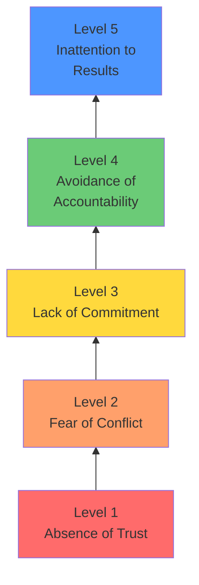
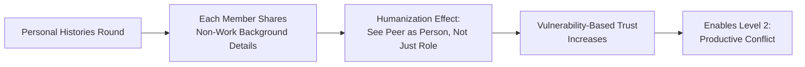
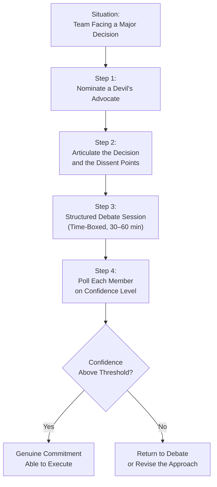
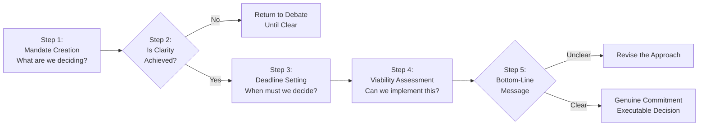
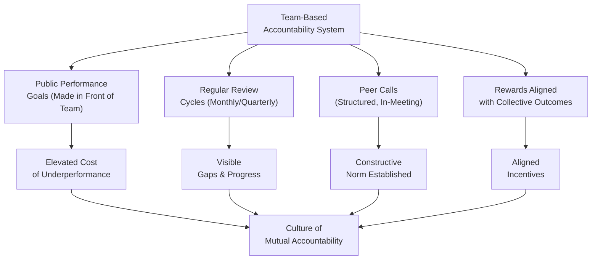
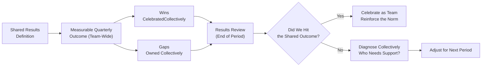
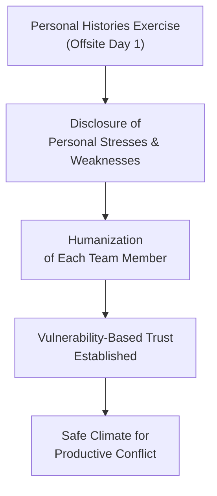
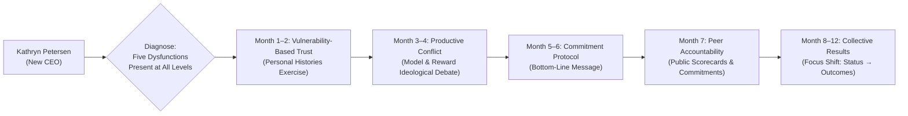
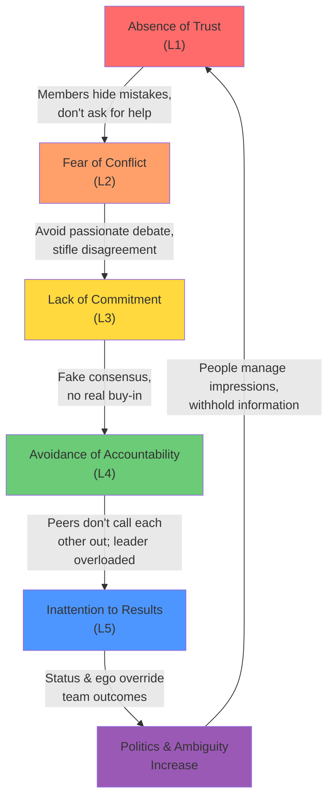

## The Five Dysfunctions Pyramid

The entire Lencioni model is structured as an inverted pyramid of five interrelated dysfunctions. Each level is a *cause* of the level above it and an *effect* of the level below it. The causal direction runs upward: you cannot fix level 4 without first fixing level 1.

The color gradient moves from red (dysfunctional) at the base through yellow (warning) to green and blue (most visible but damaging apex). The visual is designed to communicate that the *most visible* symptom — a team pursuing individual agendas — is actually the *least fundamental* cause. Teams that try to fix level 5 by demanding "focus on results" without addressing levels 1–4 will produce compliance, not genuine performance.

---

## Level 1 — Absence of Trust: The Foundation

### Vulnerability-Based Trust vs. Credential-Based Trust

Lencioni distinguishes between two kinds of trust:

| Type | Definition | Example |
|---|---|---|
| **Credential-based trust** | "I trust you because of your track record, title, or expertise" | Trusting a surgeon because of their credentials |
| **Vulnerability-based trust** | "I trust you because I have seen you be imperfect, admit mistakes, and ask for help" | A peer saying "I genuinely don't know the answer to that. What do you think?" |

Vulnerability-based trust is what makes teams actually function. When team members feel safe enough to admit "I made a mistake on the Q3 forecast" or "I need help defining the product roadmap," information flows freely, mistakes surface early, and collective intelligence is actually deployed.

### The Trust-Building Behaviors

Lencioni identifies four specific behaviors that signal genuine vulnerability-based trust:

1. **Admitting mistakes and weaknesses** — Not apologizing in a performative way; genuinely acknowledging what went wrong and what you contributed to it
2. **Asking for help** — Reaching out to teammates with no pretense of self-sufficiency
3. ** Volunteering for hard or unglamorous work** — Willingness to do the work no one wants, without announcement or applause
4. **Giving feedback without intending to wound** — Constructive criticism aimed at the person's growth, not your status

### The Personal Histories Exercise

The most direct tool for building vulnerability-based trust in an existing team. Each member answers personal questions designed to humanize them beyond the professional role:

- Where did you grow up?
- How many siblings do you have? What was your birth order?
- What was your first job?
- What are the hobbies you are most passionate about?
- What is a unique or interesting fact about you that most people do not know?

---

## Level 2 — Fear of Conflict: Productive Ideological Conflict

### Conflict Avoidance as Dysfunction

The most common pattern Lencioni observes: teams that appear harmonious on the surface are actually dysfunctional underneath. They avoid passionate debate about ideas because they fear damaging relationships. The result: **artificial harmony** — agreement that looks like consensus but reflects genuine divergence that went unspoken.

The cost of avoided conflict is enormous:
- Bad decisions persist unchallenged
- Resources are committed to half-hearted ideas
- Resentment builds in team members who secretly opposed the decision
- Real commitment to implementation is impossible when the decision itself was never sincerely debated

### Productive Conflict vs. Destructive Conflict

Lencioni distinguishes carefully:

| Productive Conflict | Destructive Conflict |
|---|---|
| Focused on ideas, not personalities | Attacking the person, not the problem |
| Passionate but respectful | Dismissive, sarcastic, or hostile |
| Aims to surface the best approach | Aims to win or dominate |
| Followed by genuine commitment | Followed by resentment and disengagement |

The key difference: **topic**. Arguments about the *idea* are productive; arguments about the *person* are destructive. Teams that have vulnerability-based trust can argue fiercely about strategy without taking it personally — because they trust each other's intentions.

### The Conflict Excavation Exercise

A structured tool for surfacing disagreements that the team has been avoiding:

---

## Level 3 — Lack of Commitment: The Commitment Protocol

### Artificial Harmony Produces No Commitment

The classic pattern: a team debates, half the room disagrees but stays quiet (because they don't trust the environment for real debate), the leader makes a call, everyone nods, and the decision is later half-heartedly implemented or actively undermined.

Commitment requires **clarity** and **buy-in**, in that order. Buy-in without clarity is useless; clarity without buy-in is also weak. The solution is not consensus (everyone gets what they want) — it is the feeling that "I was heard, the debate was real, and now I can support the decision even if it is not my first choice."

### The Commitment Protocol

A structured five-step process for every significant team decision:

**Bottom-line message**: every team member must be able to articulate the decision in their own words. If you ask five members "what did we decide?" and get five different answers, the decision was not clear — regardless of how much nodding occurred in the meeting.

---

## Level 4 — Avoidance of Accountability: Peer Scorecards

### The Peer Accountability Problem

Most teams rely on the leader to hold people accountable. This creates two problems: the leader becomes a bottleneck, and accountability feels like a disciplinary tool wielded from above rather than a norm the team enforces together.

Peer accountability is qualitatively different: when a teammate says "I noticed you have been missing the last three project updates — is there something I can help with?" it carries more persuasive weight than the same observation from a supervisor. The mechanism is social, not hierarchical. But social accountability only works when levels 1–3 are in place.

### Team-Based Accountability Mechanisms

Lencioni recommends four concrete tools:

1. **Public performance goals** — When commitments are made in front of the team, the psychological cost of missing them rises significantly
2. **Regular progress reviews** — Team-level scorecards reviewed monthly or quarterly; failures are visible to everyone
3. **Peer praise and callouts** — Explicitly recognizing contributions and calling out gaps in a structured format
4. **Rewards tied to team outcomes** — Performance incentives structured around collective results, not individual departmental wins

---

## Level 5 — Inattention to Results: Collective Outcome Focus

### The Status and Ego Problem

The dysfunction at level 5 is straightforward in description but insidious in practice: team members put their own status, departmental success, or individual ego ahead of the team's shared outcomes.

Typical manifestations:
- A VP leads their department to strong quarterly results while the overall company underperforms
- Team members compete internally for resources, headcount, or visibility rather than optimizing for the whole
- Meeting agendas prioritize departmental updates over cross-functional progress
- Performance reviews reward individual achievement, undermining the team result

### The Results-Focused Scorecard

The corrective tool is a single, shared definition of what the team *collectively* is trying to achieve:

---

## The Decisionogan Case Study: A Walkthrough

### The Setting

Decisionogan (Decision Making Incorporated) is a mid-sized, respected consulting firm based in Silicon Valley. The company has built a strong reputation for building effective executive teams for its clients — irony that becomes central to the narrative. The board, concerned about stagnant growth and growing internal politics, has brought in Kathryn Petersen, a seasoned CEO with a track record of turning around organizations, as the new leader. Kathryn's mandate: diagnose the dysfunction on her own executive team and rebuild it from the base up.

### The Five Team Members and Their Dysfunctions

| Member | Role | Primary Dysfunction Manifestation |
|---|---|---|
| **Jeff** | CEO / Co-founder | Status-driven; publicly aligns with whoever seems most powerful; inattention to results |
| **Michele** | Head of Sales | Blames others for missed targets; avoids accountability for her own underperforming leads |
| **Martin** | Head of Technology | Brilliant but socially destructive; attacks others personally; conflicts never resolved |
| **Carlos** | Head of Customer Service | Avoids conflict at all costs; stays quiet even when he disagrees; lacks commitment |
| **Nick** | Chief Financial Officer | Political; carefully positions himself as indispensable; avoids accountability by staying out of the fray |

Kathryn tracks their behaviors through the pyramid, noting how each dysfunction amplifies the others. Martin attacks Michele in meetings (destructive conflict, level 2); Michele withdraws from real debate (level 2); Carlos, seeing the dysfunction, stops speaking up (level 3); Martin and Carlos both avoid holding Jeff accountable for missed strategic commitments (level 4); and the team collectively misses its growth targets while individual political positioning continues (level 5).

### The Intervention Sequence

Kathryn does not address levels 1–5 simultaneously. She builds trust first.

**Month 1–2: Building Vulnerability-Based Trust (Level 1)**

Kathryn begins with the personal histories exercise in her first offsite. Each member shares a genuine, unguarded story from their life outside the office. Martin reveals he has been hiding a family crisis that has been sapping his energy; Michele admits her marriage is struggling; Jeff acknowledges he does not actually understand the technology build and has been afraid to say so. The exercise is emotionally difficult — Carlos cries when he describes growing up in a family where conflict was unsafe. But by the end of the session, the climate of the room has shifted fundamentally.

**Month 3–4: Enabling Productive Conflict (Level 2)**

With trust established, Kathryn now models and rewards ideological debate. In her weekly staff meetings, she explicitly invites disagreement, naming the kinds of debate she wants to see and the kind (personal attacks, sarcastic deflection) she will not tolerate. Martin is moderated but not silenced — channeled into debating the *ideas* rather than the *people*. The first time the team really dives into the product strategy question, the meeting runs over by ninety minutes. When it concludes, everyone is physically exhausted but genuinely energized — for the first time, they have made a decision they all understand deeply and can defend.

**Month 5–6: Securing Commitment to Decisions (Level 3)**

Kathryn institutes the commitment protocol: the bottom-line message. After every key decision, she asks each member in turn to explain the decision in their own words. The first time, there are three different versions of what "we decided" about the product roadmap. Kathryn stops the meeting and says, "We cannot leave this room aligned if we cannot agree on what we decided." The team revisits, clarifies, and re-tests until all five members can articulate the same core decision.

**Month 7: Peer Accountability Scores**

Kathryn introduces a personal accountability commitment: each member makes one public commitment to the team about a specific, measurable outcome they will deliver in the next 30 days. The commitment is written on a whiteboard in the meeting room. At the next offsite, two weeks later, she reviews each commitment publicly. One member, Carlos, has missed his. He has no excuse. The team — now calibrated by trust and real commitments — holds him gently but firmly accountable. The tone is not punitive; the group collectively owns the gap.

**Month 8–12: Results Focus Becomes Natural**

By month twelve, the team's quarterly results turnaround is measurable. But more importantly, the *process* of the meetings has changed: arguments happen in real time, commitments are tested in public, accountability is gentle and mutual, and the analytic energy that was previously spent on internal positioning is now directed toward the actual competitive landscape.

---

## How Behaviors Cascade Through the Pyramid

The cascade is not linear in a simple one-way sense — it is self-reinforcing. Absence of trust produces conflict avoidance, which produces artificial agreement, which produces no accountability, which produces ego-driven behavior, which deepens distrust.

The feedback loop from Level 5 politics back down to Level 1 means that once a team has been dysfunctional for a sustained period, the entropy is real. The way out is *sequential* intervention: rebuild trust at the base, then open up conflict, then secure commitment, then build accountability, and then — only then — focus on collective results.

---

## Overcoming Politics and Ambiguity

### What Lencioni Means by "Politics"

Lencioni defines team politics as **"when people put their own interests ahead of the interests of the team."** This is not the normal human condition — it is a dys*function* produced by the five-level cascade. When trust is absent, information asymmetry becomes a source of power. When conflict is absent, bad ideas survive unchallenged. When commitment is absent, people pursue their own agendas as cover. When accountability is absent, nobody corrects course.

The antidote: sequential pyramid remediation removes the structural conditions that make political behavior rational. Once the team operates with trust, healthy conflict, real commitment, mutual accountability, and results focus, politics loses its utility.

### Disambiguation as a Leadership Practice

Ambiguity is the fuel of politics. Where outcomes, responsibilities, and expectations are unclear, people fill the vacuum with their own interpretation — usually one that advantages them. Lencioni recommends three practices for reducing ambiguity:

1. **Define the single most important thing the team is trying to accomplish** — in one sentence, agreed by all members
2. **Make roles and responsibilities explicit** — no overlap, no gaps; a RACI-style clarity at minimum
3. **Review decision-making protocols** — which decisions belong to the team, which belong to the leader, which belong to functional leads, and how escalations work

---

## The Five Practical Team Exercises

Each dysfunction has a corresponding team exercise designed for half-day or full-day offsites:

| Dysfunction | Exercise | Time Needed | Desired Outcome |
|---|---|---|---|
| Level 1 — Trust | Personal Histories | 60–90 min | Members see each other as humans, not roles |
| Level 1 — Trust | Personal Profiles (DISC or similar) | 30–45 min | Shared vocabulary for behavioral understanding |
| Level 2 — Conflict | Conflict Norming Discussion | 45 min | Team agrees on what productive conflict sounds like |
| Level 3 — Commitment | Commitment Protocol (Bottom-Line Message) | 20 min per decision | Every decision tested by: "Can everyone state it in their own words?" |
| Level 4 — Accountability | Team Effectiveness Exercise (Peer Feedback) | 45 min per person | Anonymous but direct peer input on key contributions |
| Level 5 — Results | Public Team Goals & Scorecards | 30 min per quarter | Visible, shared metric; reviewed in every meeting |