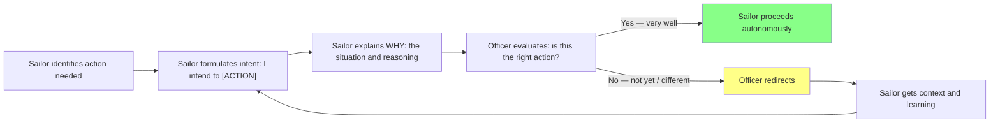
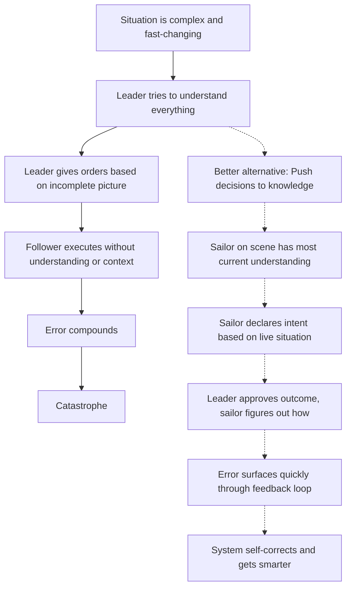

## The Problem: Leader-Follower in a Nuclear Submarine

When David Marquet took command of USS Santa Fe, he immediately encountered
the paradox of traditional Navy command. In nuclear submarine operations:

- The commanding officer is supposed to know more than every subordinate
- Orders flow top-down
- Errors are punished
- Compliance is the only acceptable response

But nuclear submarines are the ultimate complex system. The technology is
impossibly complex, the environment is hostile, and the margin for error is
zero. No single person — not even the captain — can understand the full
system well enough to make good operational decisions under pressure.

Marquet began with a fateful order: "Take the submarine to 400 feet departure
from periscope depth." He had no idea how the engineering officer and crew
would figure out how to do it. They improvised it — and pulled it off. But
the risk of compliance-based failure was real. On a submarine, doing what you
are told without understanding *why* can mean the death of everyone onboard.

The core catastrophe of the leader-follower model: **the leader is the
single point of failure**. When the leader cannot see everything, understanding
everything fast enough — and when the team cannot think beyond executing
orders — errors compound until the system collapses.

---

## The Mechanism: Intent-Based Leadership

Marquet's reframe was radical: **push decision-making to the lowest competent
level in the organization.** On Santa Fe, that meant every sailor who could
understand the situation could decide what to do. The mechanism to get there:
**Intent-Based Leadership**.

```mermaid
flowchart TD
    subgraph Traditional["Leader-Follower Model"]
        L["LEADER has knowledge and authority"] --> O["Gives ORDER"]
        O --> F["FOLLOWER has no knowledge or authority"]
        F --> E["Executes"]
        E --> C["LEADER is bottleneck and single point of failure"]
    end

    subgraph LeaderLeader["Leader-Leader Model"]
        D["DECISION-MAKER at lowest level of knowledge"] --> I["Declares INTENT: I intend to..."]
        I --> L2["LEADER gives OK or redirects"]
        L2 --> A["Action proceeds autonomously"]
        A --> R["Result: many decision points, resilient system"]
    end

    style C fill:#f88
    style R fill:#8f8
```

The mechanism in action: instead of the captain or officer of the deck saying
"come left 15 degrees," the helmsman stands up and says to the officer: **"I
intend to come left 15 degrees to maintain the track."** The officer — who
now has the *context* to evaluate — says either "very well" (proceed) or
"not yet" (redirect). The decision logic moves to where the knowledge already
exists.

---

## The "I Intend to..." Protocol — Step by Step

This single protocol shifted the entire culture of Santa Fe. Here is how it
works:

### The "I Intend To..." Breakdown

1. **Sailor must have the knowledge to declare intent.** This forces the
organization to push information downward — and push competence upward. You
cannot declare intent if you don't know the situation.

2. **The sailor must say the *outcome* they intend, not the steps.** "I intend
to..." is an intention, not a procedure. The officer (or supervisor) needs to
judge the outcome, not micromanage the method.

3. **The leader's job is to evaluate the intent and approve or redirect.**
This takes less mental load than figuring out the entire plan yourself — you
only need to check whether the outcome is correct.

4. **Verbalization exposes thinking.** When the sailor has to explain "I am
going to do X because Y," gaps in their reasoning surface automatically. The
officer catches errors they would never have found in a reactive compliance
model.

---

## The twelve Leader-Leader Mechanisms

Marquet formalized the Santa Fe transformation into twelve practical
mechanisms. These are not abstract philosophy — they are operational
techniques deployed on a submarine:

### 1. Find Leaders, Don't Make Followers

Don't select people who will comply. Select people who can think. When the
Navy sent Santa Fe officers who were used to obeying orders, Marquet had to
un-train them first. The default is followerhood; the leader's job is to
*bring out* the leader in each person.

### 2. Take Control by Giving Control

The deepest paradox of command: taking more *command* means giving up
*control*. The leader who holds every decision tight creates dependency, which
makes the team helpless when the leader is wrong or absent. Push decision-
making down. Authority emerges from demonstrated competence, not assigned rank.

### 3. Shorten the Feedback Loop

The most powerful leadership tool is not an order — it's a conversation.
Short feedback loops mean errors get caught early, before they compound.
Long feedback loops (annual reviews, quarterly OKRs) are for compliance, not
for thinking.

### 4. Communicate Intent, Not Instructions

Instead of "go left 15 degrees," say "hold track 060." The *what* matters.
The *how* belongs to the person closest to the situation.

### 5. Build Trust but Verify — with Time

Marquet says: trust is the default assumption. But verify at the speed of
learning. Early conversations are deep and frequent. As competence develops,
verification thins out. This is the trajectory from oversight to empowerment.

### 6. Organize for Dubitability

Names the Navy's safety reporting system. The key idea: it is the *system*that
discovers errors, not individual vigilance. Design systems that surface
anomalies automatically. Do not rely on people being heroic.

### 7. Use the "We" Language

Leaders communicate — and think — in plurals. "We need to..." not "I need
you to..." The language of "we" signals shared ownership. The language of "I"
signals domination and passivity.

### 8. Use Uncertain Language to Promote Thinking

Instead of "This is what we're going to do," say "This is what we're going
to do — unless you have a better idea." The phrase "unless you have a better
idea" opens the door for dissent without weakening the leader's position. It
is a linguistic trick with enormous practical power.

### 9. Use the "I Don't Know" Command

Marquet says one of the most powerful phrases a leader can use is "I don't
know — what do you think?" When a newcomer is told a leader doesn't know, it
signals that thinking is valued. It invites contribution instead of demanding
compliance.

### 10. Instill Excellence

Don't complain about performance. Define what excellence looks like — then
teach the team to hold *each other* accountable. Peer accountability is far
more powerful than leader accountability because it is immediate, contextual,
and social.

### 11. Take Immediate Action

When something goes wrong, address it immediately. Don't let problems fester.
A culture that tolerates small failures becomes a culture that generates large
ones. The Santa Fe practiced structured debriefs after every event positive or
negative.

### 12. Build Improvement by Being Different

Don't compete on the Navy's terms. Santa Fe became the best submarine in the
Navy — by rejecting the Navy's approach to leadership, not by doubling down
on it. Excellence comes from challenging the default model, not perfecting it.

---

## The Santa Fe Transformation: Metrics

The results on USS Santa Fe speak louder than any story:

| Metric | Before Marquet | After Marquet |
|--------|--------------|--------------|
| Navy-wide performance ranking | Last | First (#1 of 18 submarines) |
| Retention rate | Below average | 3x Navy average |
| Advancement rate (promotions) | ~25% | Over 60% |
| Operational awards | Infrequent | Most decorated submarine in recent history |
| Inspection scores | Below standard | Highest in Pacific Fleet |
| Re-enlistment offers accepted | ~30% of crew | ~90% of crew |

The numbers validate the mechanism: when people are trusted and given real
authority, they produce more than anyone expected — not because they work
harder, but because they *think*.

---

## Cognitive Overload: Why the Traditional Model Fails

Marquet's diagnosis of the leader-follower model is rooted in cognitive
science, even if he doesn't use neuroscience terminology:

On Santa Fe, the operations officer would sometimes receive a complex
operative order from fleet command at 3 AM and would task Marquet with
preparing an implementation plan before the ship was fully awake. Marquet
realized: he was the bottleneck. The people who actually understood the
submarine's capabilities were the sailors on the deck, not the captain in the
wardroom.

The solution was not "get smarter faster." It was "get others thinking."

---

## Beyond the Submarine: How the Mechanisms Translate

Marquet insists these mechanisms are universal — they apply to engineering
teams, hospital units, manufacturing floors, and software organizations. The
mapping is almost direct:

| Navy Mechanism | Software/Engineering Equivalent |
|---------------|---------------------------------|
| "I intend to..." | Pull request description + owner proposal, team reviews and approves |
| Push decisions to lowest level | Engineers own their services; teams decide tech, not CTO |
| Short feedback loops | Code review within hours, not days; fast deploy cycles |
| Communication intent, not instructions | Engineering spec: what needs to happen and why, not how |
| Use "we" language | "What are we going to build?" not "Here's what I built |
| "I don't know — what do you think?" | Engineering leadership asking teams before dictating |
| Build peer accountability | Code review culture, blameless post-mortems |
| Immediate action on problems | Incident response within minutes, not post-mortems a week later |

---

## Key Lessons

- **Taking control means letting go.** The leader who releases authority
demonstrates more command, not less. Dependency is the enemy of performance.

- **Language shapes reality.** "I intend to..." is not verbal hygiene. It is
a structural protocol that physically moves decision-making authority to the
knowledge center.

- **Cognitive overload is an organizational design problem, not an individual
discipline problem.** If your leaders are overwhelmed, don't train them to
handle more. Restructure so they handle less.

- **Most organizations are leader-follower by default.** Marquet didn't invent
leader-leader — he recognized that it was already the right structure and
built the discipline to maintain it.

- **Peer accountability outranks leader accountability.** A crew that holds
each other to standards produces better results than one that only meets
standards when supervised.

- **"I don't know" is a leadership tool.** The strongest leaders are not those
with the most answers. They are the ones who genuinely want the team's
thinking.

---

## Practical Applications

### For Engineering Teams
- Replace "build thing X" with "I intend to solve problem Y with approach Z"
replace "because I said so" with "because of requirements A, B, C"
- Push technology decisions to the squads closest to the problem
- Hold team design reviews where engineers declare intent before building

### For Organizational Leadership
- Audit your direct reports: how many decisions are flowing *up* to you that
should flow *down* or *laterally*?
- Start each 1:1 with "what do you think?" before giving your own view
- Create structured venues for dissent: "tell me what's wrong with this
plan — I need you to find the holes"

### For High-Stakes Environments (Healthcare, Aviation)
- Study the Santa Fe debrief protocols — the Navy's after-action review culture
directly produced the HRO (High-Reliability Organization) model used in
aviation and healthcare today
- Implement "I intend to..." style pre-commitments in handoffs between shifts
- Replace compliance audits with peer-review cultures

### For Personal Development
- In your next difficult conversation, say "I intend to..." before explaining
what you want others to do. Others will listen differently when they see the
outcome you care about
- In your team, ask "what do you intend to do?" rather than "what should you
do?" The question moves people from follower mode to leader mode

---

## Action Plan

1. **Audit your decision flow** — Identify 10 decisions that flow to you that
should not. List who could make those decisions if they had context. Give them
that context this week.

2. **Introduce "I intend to..."** — In your next team meeting, ask each team
member to frame their planned work as "I intend to..." rather than "my task
is". Watch how the language changes the thinking.

3. **Replace your "what do you think?" with "what do you think would happen
if...?"** — Force thinking by asking for consequences, not just opinions.

4. **Practice saying "I don't know — what do you think?"** — This is the
hardest phrase for most leaders. Use it once today. Notice the quality of
responses you get compared to when you gave the answer yourself.

5. **Build a 5-minute debrief habit** — At the end of every meeting or sprint,
ask: what worked? What didn't? What will we do differently — not in three
months, but next time?

6. **Shorten your feedback loops** — If you give feedback more than 48 hours
after the behavior, it is too late to be relevant. Find a way to give feedback
closer to real-time.

7. **Stop giving orders in areas you don't understand** — This is the Marquet
Rule. If you don't have the knowledge to give a good order, don't. Ask for
intent instead.

8. **Create an explicit leader-leader contract with your team** — Write down
what decisions they can make without asking you, what decisions they need to
consult you on, and what decisions you'll make together. Make it public.

9. **Measure team outcomes, not compliance** — Stop tracking "did they follow
my direction?" Start tracking "did the outcome improve?"

10. **Read the book with a team** — Marquet's mechanisms are simple enough to
understand in a weekend and deep enough to practice for years. Assign chapters
and debrief as a group.
