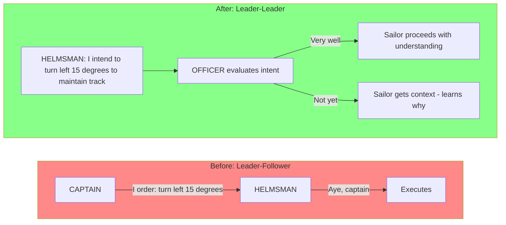
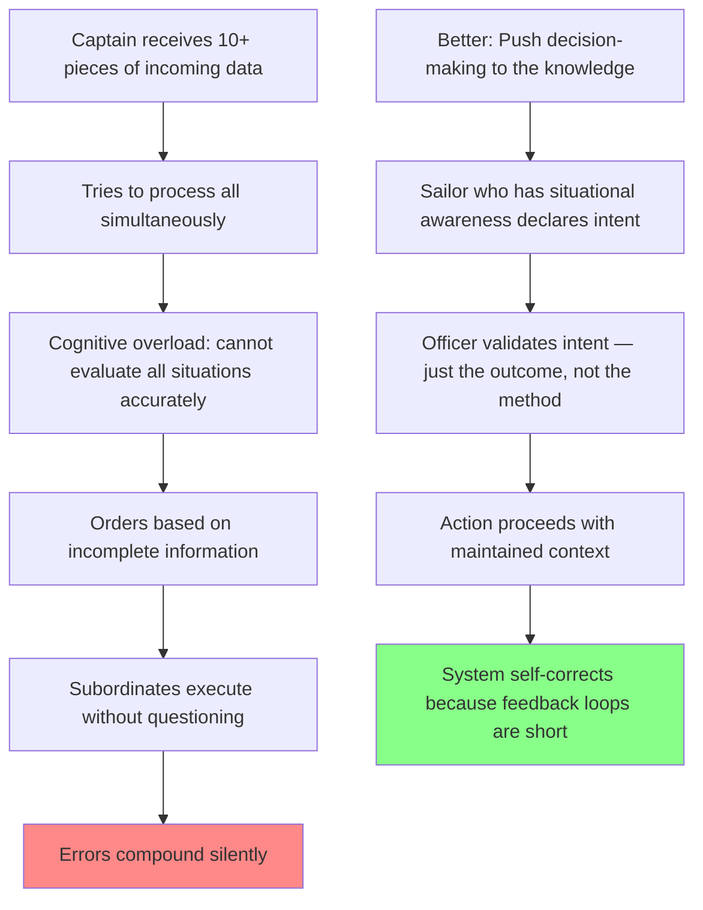
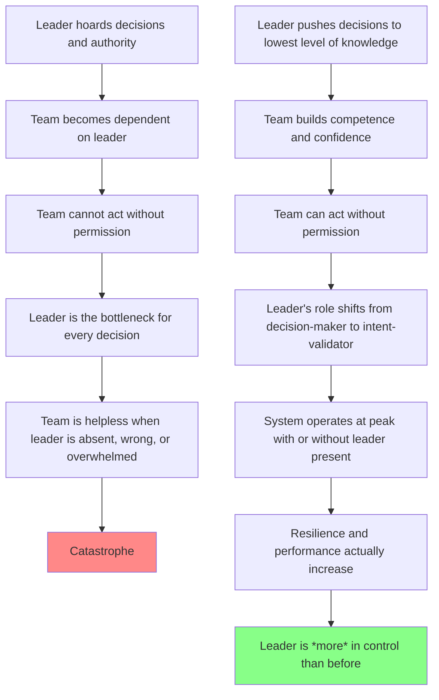
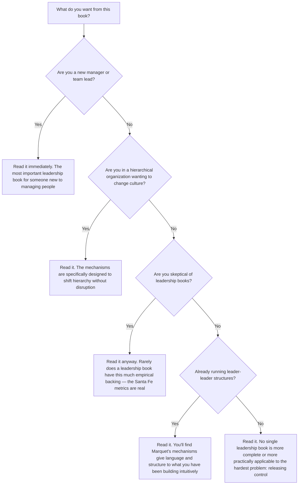

## Introduction

Welcome to BookAtlas. Today: *Turn the Ship Around!: A True Story of Turning
Followers into Leaders* by L. David Marquet. Published 2012, Portfolio
Penguin. 240 pages. One of the most widely taught leadership books in
existence — required reading at West Point, the Naval Academy, and the Naval
War College.

Marquet was a US Navy captain who took command of the USS Santa Fe, a nuclear
attack submarine ranked dead last in the fleet. Within 18 months, the Santa Fe
was ranked first. Retention tripled. Promotion rates went from 25% percent to
over 60%. The sub became the most decorated in its class.

The question: is this a replicable system — or is it just a great captain's
talent and charisma applied to a small crew?

We have two listeners with us today. The first is a former Navy officer who
served on submarines and is watching this transformation with deep skepticism.

The second is a CEO who read the book, applied it to his 800-person software
company, and says it changed everything.

Let's get into it.

---

## The Setup: How Do You Get a Captain to Stop Giving Orders?

Marquet began by doing exactly the wrong thing — by the Navy's standards.
When he took over the Santa Fe, it was already a low-performing boat. His
instinct was to tighten command, give more specific orders, monitor compliance
more closely.

Then something happened that changed everything.

Marquet gave an order to dive to periscope depth. The crew executed it
flawlessly — but on the way back up, something clicked. Marquet realized:
*I have no idea how they did that.* He was giving orders in a system he didn't
fully understand.

**Skeptic:** That's the moment that leads to disaster, not enlightenment. A
submarine commander who doesn't know how his crew operates is like a pilot who
doesn't know how his plane flies. He should be reading the technical manuals,
not running seminars on empowerment.

**CEO:** Wait - he's exactly right to be alarmed. The insight isn't "I don't
need to know." It's "I can't know everything I need to know fast enough to
give good orders." That's a fundamentally different problem to solve. And on
a nuclear submarine running silent, there isn't time to ask the captain every
question. Decisions have to happen *now*.

**Skeptic:** So instead of improving the captain's knowledge, he gave up the
captain. That's not a bold leadership move — that's abdication dressed up as
philosophy.

**CEO:** Let's see how that plays out.

---

## "I Intend To..." — The Protocol That Changed Everything

The heart of Marquet's system was a single phrase: **"I intend to..."**

Instead of the helmsman saying "coming left 15 degrees" on command, the
helmsman now stands up and says: **"I intend to come left 15 degrees to
maintain track."**

The officer evaluates the *intent*, not the method. Is coming left 15 degrees
the right outcome in this situation? Yes. "Very well." Done.

The sailor didn't just execute an order — they reasoned about the situation,
formulated an outcome, explained the logic, and received approval. They were
now *thinking* about what they were doing.

**CEO:** This is the most practical idea in the book. "I intend to..." is not
just a phrase — it's a *structural protocol*. It forces the sailor to think,
forces the officer to listen, and forces the captain to stop being the
bottleneck. Every single participant is now engaged in the decision.

**Skeptic:** On a boat with 130 people where lives are on the line every
minute. How does this work when someone is actually in danger? Is there a
moment on a submarine when "I don't have enough information to give orders"
is actually a disqualifying condition for command?

**CEO:** That's the beauty of it. On a nuclear sub, the captain *doesn't* have
time to have enough information. The situation is changing too fast. The
helmsman has something the captain doesn't: eyes on the instrument panel,
hands on the wheel, direct sensory engagement with the situation. That
knowledge is more current than anything the captain can process.

**Skeptic:** I'll grant you that. But crew competence varies. Some sailors are
going to make bad calls. Without orders, how do you prevent error when the
error is someone's *thinking*, not their execution?

**CEO:** The book's answer is short feedback loops. The officer isn't absent —
they're evaluating intent, not dictating method. Errors get caught earlier,
before they compound. And when someone *does* make a mistake, it's caught at
the point of intent declaration, not after execution has gone wrong.

---

## Cognitive Overload — The Silent Killer of Command

The book's most powerful diagnosis is what Marquet calls cognitive overload:
the moment when the leader is trying to process more than any human brain can
handle.

On a nuclear submarine in wartime conditions:

- The captain is also the performer
- There are 130 people who need decisions
- New information arrives constantly
- The enemy may be updating their position
- Equipment is failing
- The environment is hostile

**Skeptic:** This diagnosis is accurate. The traditional military model is
inherently cognitively limiting. But Marquet's solution is radical. He's not
talking about distributed decision-making at the officer corps level — he's
talking about *sailors making operational decisions*. That's not leadership.
That's chaos in a pressure vessel.

**CEO:** He's not talking about *every* sailor making every decision. He's
talking about sailors at the *edge of the situation* — the people with hands
on the system — making the decisions that require the fastest response. That's
not chaos. That's distributed cognition. It's how high-reliability
organizations actually operate.

**Skeptic:** High-reliability organizations — I've read that literature. LaPorte,
Weick. The theory says HROs share five characteristics: pre-occupation with
failure, reluctance to simplify, sensitivity to operations, commitment to
resilience, deference to expertise. Marquet built all five. I'll grant you the
Santa Fe was impressive. But was it Marquet, or was it the Navy's willingness
to let him experiment?

**CEO:** That's a fair question. And the answer the book gives is: it was
Marquet, but only because the Navy was willing to let an unconventional
captain fail. And here's what's interesting — Santa Fe didn't start as a
successful experiment. By all the Navy's own metrics, Marquet was a problem
child in the first months. The transformation was real, it was measurable, and
it required genuine leadership courage.

---

## The Control Paradox: Taking Control by Letting Go

The core paradox of the book, repeated in every chapter: **taking control
means letting go.**

**Skeptic:** "Leader is more in control than before." There's a contradiction
you can't resolve. Either the leader is making the decisions or they're not.
If sailors are declaring intent and captain is rubber-stamping, the captain's
role has changed fundamentally. They're not in control in any traditional
sense.

**CEO:** That's exactly the point. The paradox. What Marquet discovered is
that when you release control *into a competent structure*, you are more
effective than when you hold it. The captain doesn't need to direct
operations. They need to ensure the system of decision-making is sound. That
is *more* control, not less.

**Skeptic:** The mental gymnastics required to say "releasing control is
actually more control" is impressive if not logically coherent.

**CEO:** It's coherent if you define control as "producing desired outcomes."
What you're describing is *command authority*. Authority over people. What
Marquet cares about is authority over *outcomes*. And those are completely
different things. You can have outcomes without authority. You cannot have
authority without outcomes being dependent on it.

---

## The Language Revolution

Marquet's most specific tool is linguistic. He describes four specific
language practices that, taken together, physically rewire the hierarchy of a
team:

### 1. Use "We" Instead of "I"
> Before: "I need you to check the sonar."
> After: "We need to ensure the sonar is checked."

The shift signals shared ownership. The leader is no longer giving commands —
they are naming what the team needs to accomplish.

### 2. Use "I Don't Know" Openly
> "I don't know — what do you think?"

This is the single most powerful phrase a leader can use. It signals that
thinking is valued, that the leader is not omniscient, and that contribution
from others is welcomed without penalty.

### 3. Ask "What Do You Think?" Before Giving Your View
> In a planning conversation, ask for the team's thinking before stating
> your own.

Leaders who always speak first set an anchor. The team's subsequent thinking
is contaminated by the leader's direction. Silence gives the team room.

### 4. Say "Very Well" Instead of "Good Job"
> "Good job" evaluates performance.
> "Very well" acknowledges the outcome without closing feedback.

"Very well" signals "the intent was appropriate; proceed." It doesn't
necessarily mean perfect performance — it means the right decision was made.
That distinction is crucial for a crew learning to think.

**Skeptic:** I'm genuinely curious — how well does this work outside the Navy?
My experience in corporate settings is that language reframing without
structural change just sounds like new management jargon. "We" when you mean
"I" is just gaslighting the team.

**CEO:** That's exactly why the structural component matters. "I intend to..."
works on Santa Fe because the sailor *can* actually proceed without the
captain's permission. On Santa Fe, the system was already redesigned. In my
company, when we introduced "what do you think?" as the standard 1:1 opener,
it failed — because nothing changed about who held budget authority. The
language was empty.

When we tied it to a budget decision — "here's your budget, you decide how to
spend it" — suddenly "what do you think?" was no longer empty. The language
and the structure had to change together.

**Skeptic:** So language alone is insufficient. You need structural backing.
That seems to match the Marquet mechanism better than the language-only
reading.

---

## The Chief: The Instrumental Figure in Leader-Leader

One figure who emerges from the book as the true engine of Santa Fe's
transformation is **Chief Steve Borzea**, the chief of the boat — the highest-
ranking enlisted sailor on the sub.

Marquet describes Chief Borzea as someone who was initially skeptical of the
new leadership model. He had risen through the traditional Navy ranks by
excelling at following orders. His instinct was to wait for direction.

Over time, under Marquet's consistent application of intent-based leadership,
Borzea became one of the strongest proponents of the system. He started
declaring intent himself. He started saying "I intend to..." to *other*
sailors. He started teaching the language to the newest crew members.

**CEO:** This is the book's most important plot line from an organizational
change perspective. You cannot sustain leader-leader structures if the highest-
ranking non-commissioned officers don't believe in it. If the chief is still
operating in leader-follower mode, the crew will too. Borzea's trajectory
proves that the mechanisms work at every level of hierarchy.

**Skeptic:** If the boss changes and replaces Borzea with someone from the old
model, does the system revert? That's my fear with any charismatic-leader
transformation story.

**CEO:** Marquet addresses this. The system on Santa Fe survived multiple
commanding officer changes after his departure. The mechanisms became
institutional — part of how the Navy now trains submarine officers. What
Borzea represents is not one man's conversion. He represents what happens when
you give competent, experienced people a better structure than compliance.

---

## The Metrics: Can You Actually Measure Leadership?

The book's strongest chapter provides hard data on Santa Fe's transformation:

| Metric | Traditional Submarines | Santa Fe, Pre-Marquet | Santa Fe, Post-Marquet |
|--------|----------------------|----------------------|------------------------|
| Retention rate (% re-enlistment offered) | ~30% | ~30% | ~90% |
| Advancement rate (promotions) | ~25% | ~22% | ~65% |
| Overall Navy performance ranking | Variable | #18 of 18 | #1 of 18 |
| Inspection scores | Variable | Below average | Highest in Pacific Fleet |
| Advancement recommendations | Standard | Low | Record-breaking |

**Skeptic:** These numbers are impressive. But I want to play devil's
advocate. Three years is a long time. How much of this is regression to the
mean? How much is a really good captain compressing effort into one
performance period? How much is the Navy's promotion system simply starting
to notice talent that was always there?

**CEO:** Regression to the mean would predict a *worse* year followed by an
average year, not a gradual then sharp improvement lasting for years. The
advancement rate improvement is real because it reflects captured potential —
sailors who were performing below their capability because the system demanded
compliance, not thinking. Remove the compliance constraint, and you see their
actual performance.

That's the Santa Fe story in one sentence: the crew was always good. The
system was making them worse.

---

## What the Book Gets Wrong

**Skeptic:** Let's balance the ledger. Three problems with Marquet's account:

**One: Attribution.** Marquet describes a driven, charismatic captain who
transformed a crew through sheer force of will. The mechanisms are real, but
the story is ultimately about *him*. For every leader who can replicate this,
how many tried and failed? The book doesn't introduce a confidence interval.

**Two: The Navy is a bounded context.** Santa Fe is a 130-person submarine
where everyone is physically co-located, shares a mission, has been through
the same training pipeline, and where the consequences of error are immediate
and severe. Most organizations don't share these properties. A 30,000-person
retail chain? A remote-first software company? A hospital system? The map may
need significant redrawing.

**Three: Retention costs.** Improved retention sounds great — until you count
the organizational cost. The Navy kept more people on Santa Fe, which means
fewer advancement slots for others elsewhere. Is that an organizational
improvement or a redistribution of opportunity?

**CEO:** One through three are fair. And here's my response:

One: Marquet is the first to say that leader-leader is not about him. The
mechanisms are designed to persist without him. The fact that Santa Fe
continued performing after his departure is evidence — not proof, but evidence.

Two: The bounded context criticism is real, but every leadership book suffers
from it. Covey's *7 Habits* was tested at his own consulting firm. Sinek's
*Start with Why* was built from case studies. Usefulness is not contingent on
universalizability.

Three: The retention point is interesting — but the Navy clearly thought it
was a benefit. And Santa Fe's crew didn't just stay longer; they were promoted
faster. If you asked those sailors whether staying was good for them, most
would say yes.

---

## Would You Recommend This Book?

**Coach:** If you have any leadership responsibility — over two people or two
thousand — read this book. The central mechanism, "I intend to...", costs
nothing to implement and takes ten minutes to rehearse with your team. Do that
this week and you'll already be ahead of where you were before.

**Skeptic:** I do recommend it — but with the caveat that it is *one*
influence, not the whole curriculum. Marquet built on the Navy's HRO culture,
which built on Weick's sociology and Reason's safety science. Read those too.
And don't mistake a captain's story for a system. Use it, test it, adapt it.
But don't evangelize it.

**Coach:** The evangelists are missing the point. Marquet isn't offering a
creed — he's offering a protocol. A protocol doesn't care if you believe in
it. It cares whether you apply it consistently.

---

## Final Thoughts

*Turn the Ship Around!* is a book about releasing control in order to actually
achieve it. Its central irony: by giving up the traditional trappings of
command — orders, compliance, hierarchy — Marquet produced the most effective
submarine in the US Navy.

That's not just a leadership lesson. That's a lesson about systems.

Most organizational problems aren't caused by bad leaders. They're caused by
leaders who believe their job is to make all the decisions themselves. When
you release that burden — not to nothing, but to your team with real
knowledge, real authority, and real accountability — you get better decisions,
faster feedback, and teams that perform at a level no amount of command
authority could ever produce.

The Santa Fe story is specific. Its mechanisms are universal.

This has been a BookAtlas narration of Turn the Ship Around! by L. David
Marquet. Thanks for listening.
