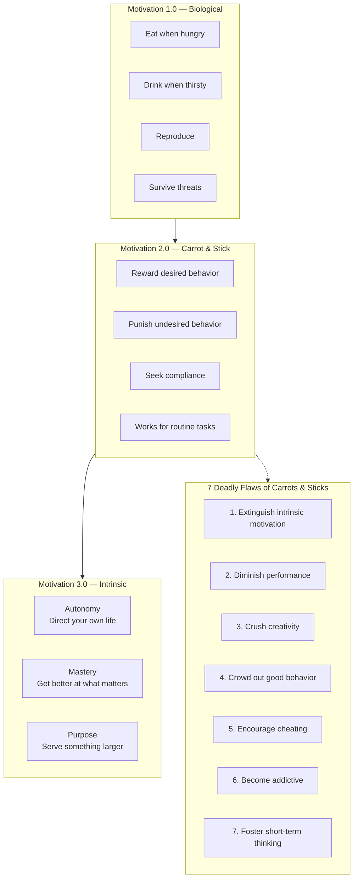
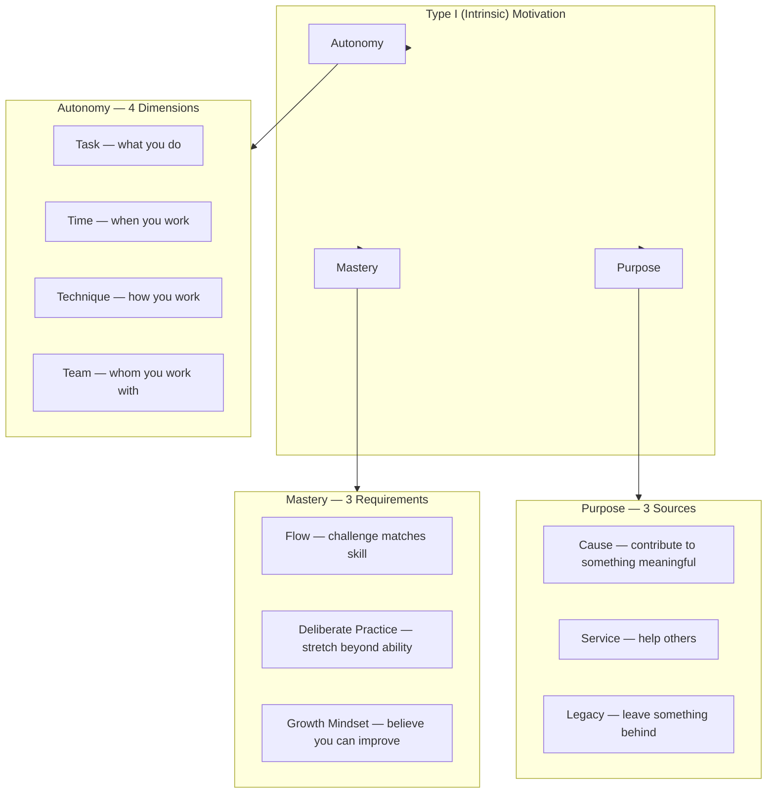

## The Candle Problem

Karl Duncker's 1945 experiment is the emblematic demonstration in *Drive*.
Participants enter a room with a candle, a box of thumbtacks, and a book of
matches. Their task: attach the candle to the wall so the wax doesn't drip
on the table.

People try thumbtacking the candle directly (fails). They try melting wax to
adhere it (fails). After 5-10 minutes, most find the solution: empty the
tack box, tack it to the wall, and use it as a platform for the candle.

The key insight: the participants suffer from **functional fixedness** — they
see the box only as a container for tacks, not as a potential platform. The
surprising finding: when Sam Glucksberg replicated the experiment in 1962,
offering a cash reward to participants who solved it *fastest*, those
offered rewards took *longer* on average (over 3 minutes more). Rewards
narrowed focus, making functional fixedness *worse*.

For simple algorithmic tasks (the same experiment with the tacks *outside*
the box, eliminating the insight step), rewards worked fine — faster
performance. But when the task required creative thinking, rewards hurt.

---

## Motivation 2.0 vs. Motivation 3.0

---

## The Autonomy-Mastery-Purpose Framework

---

## Type I vs. Type X

| Dimension | Type X (Extrinsic) | Type I (Intrinsic) |
|---|---|---|
| Primary fuel | External rewards — money, praise, status | Internal satisfaction — interest, challenge, meaning |
| Relationship to work | Means to an end | End in itself |
| Response to reward | Seeks larger rewards as motivation erodes | Rewards can even undermine existing motivation |
| Sustainability | Depleting — like coal | Renewable — like the sun |
| Performance on creative tasks | Lower (narrowed focus) | Higher (broader exploration) |
| Psychological wellbeing | Lower (contingent self-worth) | Higher (authentic, self-determined) |
| Response to autonomy | May flounder (needs structure imposed) | Thrives (self-directs) |

Pink emphasizes that Type I and Type X are not rigid categories — they
describe behaviors and orientations, not fixed personality types. Anyone
can strengthen their Type I tendencies.

---

## The Seven Deadly Flaws of Carrots and Sticks

Pink dedicates significant space to the research on why "if-then" rewards
fail for creative work:

1. **Extinguish intrinsic motivation** — The *overjustification effect*: when
   people receive rewards for doing something they already enjoy, they
   attribute their behavior to the reward, not the activity, and interest
   wanes.

2. **Diminish performance** — For tasks requiring creative problem-solving
   or heuristic thinking, rewards reliably produce worse results. The
   Glucksberg candle experiment is the canonical example.

3. **Crush creativity** — Rewards narrow focus. This is great for
   algorithmic tasks (do X to get Y), but terrible for tasks requiring
   exploration, novel connections, or insight.

4. **Crowd out good behavior** — When people focus on the metric being
   rewarded, they stop doing the unmeasured but valuable things — helping
   colleagues, taking initiative, thinking long-term.

5. **Encourage cheating** — Enron, the Wells Fargo fake accounts scandal,
   and countless other cases trace directly to aggressive incentive
   systems. When the reward is attached to a target, people find ways to
   hit the target without doing the work.

6. **Become addictive** — Rewards create a dopamine loop. Initial rewards
   feel good; eventually they feel necessary. Absent the reward, motivation
   collapses. Escalating rewards are required for the same effect.

7. **Foster short-term thinking** — "If-then" rewards are inherently
   short-term. They optimize for the next quarter, the next target, the next
   bonus — at the expense of long-term value creation.

### When Rewards DO Work

Pink is not anti-reward. He specifies the conditions where extrinsic
rewards remain effective:

- For simple, routine, algorithmic tasks
- When baseline compensation is already fair and adequate
- When the reward is unexpected (not "if-then" but "now that")
- When the reward is non-contingent (given for the work, not tied to
  specific metrics)
- When the reward provides information about competence (not control)

---

## Key Lessons

### 1. The mismatch is real and costly

Organizations continue to operate on assumptions that science has shown to
be wrong. This mismatch costs them innovation, engagement, and performance.
Accepting the evidence requires rethinking everything from compensation to
performance reviews to office design.

### 2. Autonomy is not the same as independence

Autonomy means acting with choice. Independence means doing it alone. You
can have high autonomy in a highly collaborative environment. Google's 20%
time is not about isolation — it's about choice over what to pursue.

### 3. Mastery requires discomfort

Flow requires the right challenge level — moderately above current ability.
Deliberate practice requires operating at the edge of competence, making
mistakes, and learning from feedback. Comfort is the enemy of mastery.

### 4. Purpose is profit's partner

The most successful organizations in the long run are those that pursue
purpose alongside profit. Purpose-motivated workers are more productive,
more engaged, and stay longer. The "triple bottom line" (people, planet,
profit) is not idealism — it's strategy.

### 5. You can design for Type I

Type I behavior is not a personality trait — it's a response to
environmental conditions. Individuals and organizations can actively create
conditions that foster autonomy, mastery, and purpose.

---

## Practical Applications

### For Organizations

1. **Implement ROWE** (Results-Only Work Environment) — Evaluate people
   on output, not hours. Let them choose when, where, and how they work.
2. **Create 20% time** — Dedicated time for self-directed projects (Google,
   Atlassian, 3M all do variants of this).
3. **Separate baseline from motivation** — Pay people fairly so money is not
   an issue, then focus on autonomy, mastery, and purpose for motivation.
4. **Use now-that rewards** — Unexpected recognition after the fact is more
   motivating than promised if-then rewards.
5. **Design for flow** — Structure work so challenge levels match skill
   levels. Rotate tasks to prevent boredom and encourage growth.
6. **Connect work to purpose** — Regularly communicate how the work serves
   customers, communities, or the world. Don't assume people see it.

### For Individuals

1. **Create your own 20% time** — Carve out a regular block for a
   self-directed project that interests you, even if your employer doesn't
   offer it formally.
2. **Design your day for autonomy** — Negotiate flexible hours or remote
   work. Find ways to control *technique* even if you can't control *task*.
3. **Practice deliberate practice** — Identify the edge of your ability and
   work there intentionally, seeking feedback and adjusting.
4. **Find flow daily** — Identify when you naturally experience flow and
   protect those periods. Structure your environment to minimize
   interruptions.
5. **Articulate your purpose** — Write down why your work matters beyond
   the paycheck. Revisit it when motivation flags.
6. **Run a Type I audit** — Which parts of your life feel driven by genuine
   interest vs. external pressure? What would change if you shifted the
   balance?

### For Educators and Parents

1. **Replace grades with feedback** — Specific, informative feedback on
   competence is more motivating than letter grades or gold stars.
2. **Allow choice in learning** — Even small choices (which book to read,
   which problem to solve first) increase engagement.
3. **Focus on mastery, not performance** — Praise effort and strategy, not
   talent. Encourage improvement relative to past self, not comparison with
   others.
4. **Explain the "why"** — Help learners connect their work to something
   meaningful, even if the immediate task is boring.

---

## Examples

| Example | Concept |
|---|---|
| **Google 20% time** | Autonomy — engineers spend 20% of time on self-directed projects. Produced Gmail, Google News, AdSense |
| **Best Buy ROWE** | Autonomy — employees evaluated solely on output, no fixed hours. Productivity increased 35% |
| **Atlassian FedEx Days** | Autonomy/Mastery — 24-hour hackathons where teams work on anything they want |
| **Wikipedia** | Purpose — millions of contributors with zero financial incentive |
| **Linux / Apache** | Purpose/Mastery — open source software built by intrinsically motivated contributors |
| **TOM'S Shoes** | Purpose — "one for one" model embedded meaning into the business |
| **Tom Sawyer** | Sawyer Effect — play turned to work when reward was introduced |
| **Goldilocks tasks** | Mastery — tasks at the edge of ability produce flow and growth |
