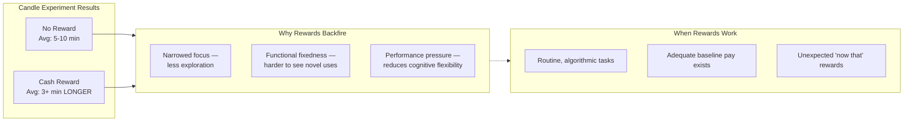

## 🎙️ Introduction

Welcome to BookAtlas. Today: *Drive: The Surprising Truth About What
Motivates Us* by Daniel H. Pink. Published 2009, Riverhead Books. 256 pages.
If you've ever wondered why bonus programs and performance incentives often
fail to produce the results they promise — or why the most creative, engaged
people you know seem driven by something deeper than money — this book was
written for you.

This isn't a standard narration. We're going to do something different.
We'll hear from two characters: Alex, a manager at a mid-size tech company,
and Jordan, a senior developer on Alex's team. They read *Drive* together
and are now arguing about whether it's right — and whether it applies to
their team.

Let's listen in.

---

## 🎙️ Session 1: The Candle Problem

**Alex:** Okay, I read the first two chapters. This candle thing is wild.
You give someone a box of tacks and a candle, tell them to attach it to the
wall — and offering a cash reward makes them *slower*?

**Jordan:** Right. The functional fixedness thing. They can't see the box as
anything but a container because the reward narrows their focus. The
experiment's been around since 1945, and the reward effect was replicated in
the 60s. It's real.

**Alex:** But that's a lab experiment. How do I know it applies to my team?

**Jordan:** You gave us a bonus last quarter for shipping the dashboard
rewrite on time. Remember what happened? People cut corners on testing.
Someone shipped a bug that took two weeks to fix. You got the feature, but
you got worse quality and longer cleanup time.

**Alex:** That's different. The candle problem is about creative insight.
Shipping a feature is execution.

**Jordan:** Is it? The bug came from someone taking a shortcut because the
reward was tied to a deadline, not to quality. That's *exactly* what Pink
describes — rewards narrow focus. People optimize for the metric, not the
outcome.

**Alex:** Alright, you've got a point. But Pink also says rewards work for
routine tasks. The dashboard *was* routine — we'd built three versions
before.

**Jordan:** Then why did we have a bug? Maybe it wasn't as routine as you
thought.

---

---

## 🎙️ Session 2: Motivation 2.0 vs. 3.0

**Alex:** I get the candle problem, but honestly, my whole career has been
built on "do good work, get a bonus." Are you telling me that's all wrong?

**Jordan:** Not *all* wrong. Pink says baseline compensation — fair salary,
reasonable benefits — is essential. Get that wrong and nothing works. But
above that baseline? The research says more money doesn't reliably produce
better performance.

**Alex:** So I should tell my team "no more bonuses"?

**Jordan:** No. Pink has a more nuanced message. The problem is *if-then*
rewards — "if you do X, then you get Y." That's what backfires for creative
work. He distinguishes between:

- **If-then rewards**: predictable, contingent on specific output. These
  work for routine tasks, backfire for creative ones.
- **Now-that rewards**: unexpected, given after the fact. "Now that you
  shipped that feature, here's recognition." These don't undermine intrinsic
  motivation.

**Alex:** That's a useful distinction. So I should stop saying "ship this by
Friday and you get a bonus" and start saying "I noticed how well you
handled the refactor — here's something."

**Jordan:** Exactly. Plus, Pink's "Seven Deadly Flaws" is worth reading
carefully. Number four is the one I see most: rewards crowd out good
behavior. When you reward one metric, people stop doing everything else.
Customer service agents stop being helpful because their bonus depends on
call handling time. Teachers teach to the test.

**Alex:** Okay, so what do I do *instead* of if-then rewards?

**Jordan:** That's the heart of the book. Three things: Autonomy, Mastery,
Purpose.

---

## 🎙️ Session 3: Autonomy

**Alex:** Autonomy sounds like anarchy. I can't just let people do whatever
they want.

**Jordan:** Pink doesn't propose that. He breaks autonomy into four
dimensions:

| Dimension | What It Means | Example |
|---|---|---|
| Task | What work you do | 20% time for passion projects |
| Time | When you work | Flexible hours, no fixed schedule |
| Technique | How you work | Choose your tools, process, approach |
| Team | Whom you work with | Self-organizing teams |

**Alex:** I can give them technique autonomy now — they already choose their
tools and approach. Time autonomy is harder because we have client meetings.
Task autonomy is almost impossible given our roadmap.

**Jordan:** That's exactly the right way to think about it. Start with what
you *can* grant. Give technique autonomy. Let them set their own schedules
as long as they make the meetings. Implement a "no-meeting Wednesday" so
people have uninterrupted time. Small autonomy wins matter more than grand
gestures.

**Alex:** Best Buy's ROWE approach — results-only work environment —
evaluated people purely on output, not hours. Productivity went up 35%.
Maybe we don't need as much structure as I think.

**Jordan:** Now you're getting it.

---

## 🎙️ Session 4: Mastery

**Alex:** Mastery seems obvious — people want to get better at their jobs.

**Jordan:** It's obvious but most companies don't design for it. Pink
identifies three conditions for mastery:

**Flow**: The Goldilocks principle — tasks must match skill level. Too hard
= anxiety. Too easy = boredom. Flow is that middle zone where time
disappears and you're fully engaged.

**Deliberate Practice**: Anders Ericsson's research. Not just doing your
job, but intentionally working at the edge of your ability. Getting
feedback. Adjusting. Repeating.

**Growth Mindset**: Carol Dweck's work. Believing ability can be developed.
If your team thinks "you either have it or you don't," they won't pursue
mastery.

**Alex:** Flow is hard to design for in a team context. People's tasks are
determined by what needs doing, not by their skill-challenge sweet spot.

**Jordan:** But you can influence it. Pair struggling people with mentors.
Give strong performers stretch assignments. Rotate roles to prevent
boreout. Replace annual reviews with frequent, specific feedback on
competence.

**Alex:** Annual reviews are worthless anyway. I've been saying that for
years.

**Jordan:** Pink would agree. He cites research showing that performance
reviews focused on evaluation (ranking, rating) actually decrease
performance. What works is feedback focused on *competence* — "here's what
you did well, here's where you can improve, here's how."

**Alex:** So more like coaching, less like grading.

**Jordan:** Bingo.

---

## 🎙️ Session 5: Purpose

**Alex:** Purpose sounds soft. We're a B2B SaaS company. We sell
inventory management software. What's the purpose?

**Jordan:** Pink would say that's the wrong question. The question isn't "do
we have a grand social mission?" It's "do our people see how their work
matters?"

Your inventory software helps warehouse workers find products faster.
That means less physical strain. Fewer mistakes. Less overtime. Your
customer support team helps store managers fix problems before they lose
sales. Your QA person catches bugs that would have caused a warehouse to
shut down for a day.

**Alex:** Nobody talks about it that way. We talk about revenue targets and
feature velocity.

**Jordan:** Exactly. Pink's argument is that purpose is the third element —
and most organizations starve it. They focus on compliance (Motivation 2.0)
and forget that people need to know *why*.

**Alex:** How would I make purpose concrete?

**Jordan:** Three things from the toolkit:

1. **Customer connections** — Let the team hear from customers. Real
   stories, real problems solved. Not filtered through sales reports.
2. **Peer recognition** — Create a space where people can say "here's how
   someone's work helped me."
3. **Mission clarity** — Every quarter, connect team output to a specific
   customer outcome. Not "we shipped 40 features" but "we saved 10
   warehouses 200 hours each."

**Alex:** I can do that. Actually, I *should* do that.

---

## 🎙️ Session 6: The Verdict

**Alex:** I think Pink is basically right, but I have two concerns. First,
his examples feel dated. Google's 20% time was amazing in 2009, but they've
pulled back on it. Best Buy's ROWE was eliminated. These stories aged
poorly.

**Jordan:** Fair. But does that invalidate the concept? 20% time at Google
*produced* Gmail, AdSense, Google News, and a generation of product
innovations. ROWE *did* increase productivity 35%. The fact that later
leadership reversed those policies doesn't mean the research is wrong —
it means management choices are complicated.

**Alex:** Second concern: does this work for everyone? Most of my
experience — and most of Pink's book — assumes creative knowledge workers.
What about our operations team? Warehouse staff? Customer support?

**Jordan:** That's the book's real weakness. Pink acknowledges it briefly —
he says autonomy over *technique* is available even in low-discretion roles
— but he doesn't develop it. The "Motivation 3.0 applies to everyone"
argument is more aspirational than proven.

**Alex:** So I should take the framework, apply it where it fits, and not
force it where it doesn't?

**Jordan:** Exactly. Grant autonomy where you can. Create mastery
opportunities for everyone, not just engineers. Connect purpose for all
roles. And don't throw out all extrinsic rewards — just be smarter about
when and how you use them.

---

## 🎙️ Final Thoughts

*Drive* is not the final word on motivation. It's a popularization of one
research tradition, shaped by a particular cultural moment and aimed at a
particular audience. It oversimplifies some things, ignores others, and its
examples have aged imperfectly.

But its core argument — that human beings are intrinsically motivated,
that autonomy mastery and purpose matter more than most organizations
acknowledge, and that the gap between what science knows and what business
does is costly — is important and largely correct.

For managers like Alex, the practical takeaways are real:

- Distinguish routine tasks (reward if-then works) from creative tasks
  (reward if-then backfires)
- Use "now-that" rewards instead of "if-then" where possible
- Grant autonomy in all four dimensions — especially technique and time
- Design for flow: match challenge to skill
- Practice deliberate feedback focused on competence, not evaluation
- Connect every role to purpose, not just the mission-driven ones

For employees like Jordan, the message is equally useful: build your own
autonomy, pursue mastery for its own sake, know your purpose, and don't let
a reward system that optimizes for the wrong metrics pull you away from
what matters.

This has been a BookAtlas narration of *Drive* by Daniel H. Pink. Thanks
for listening.
