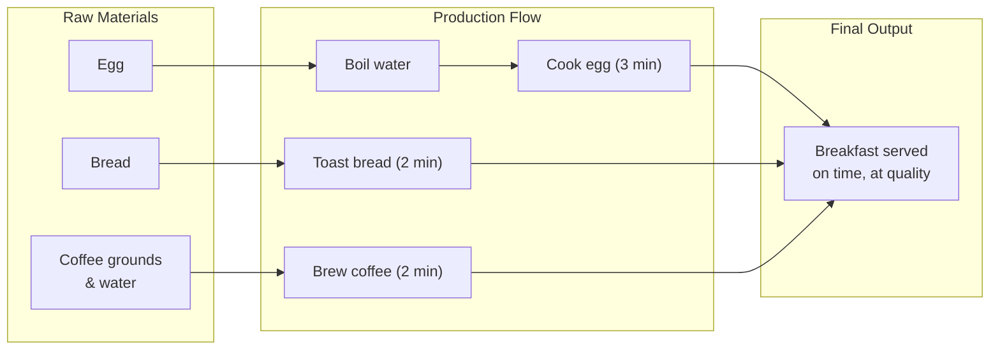
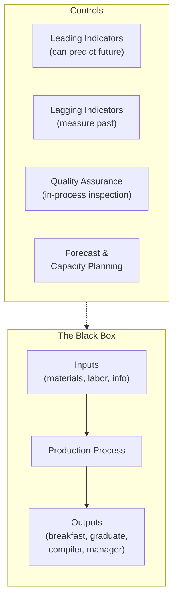
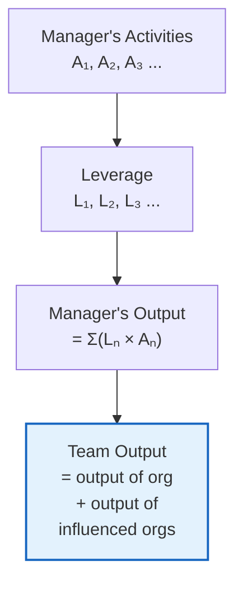
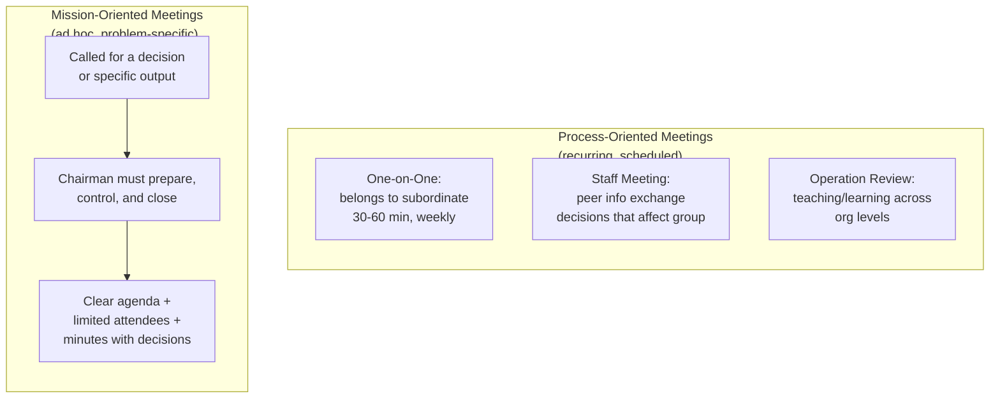
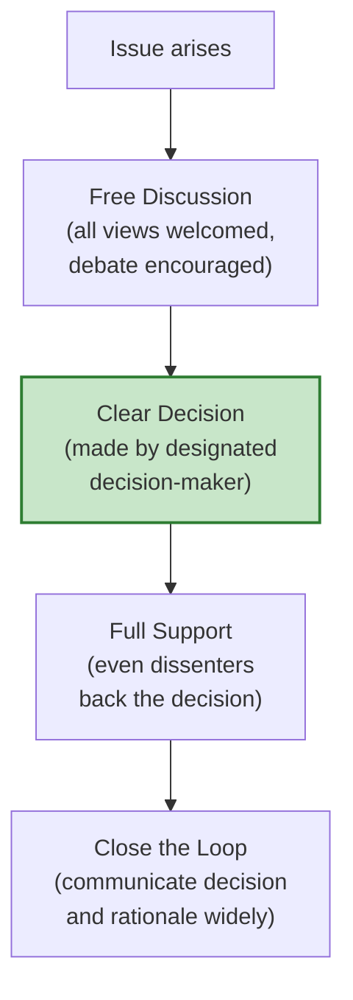
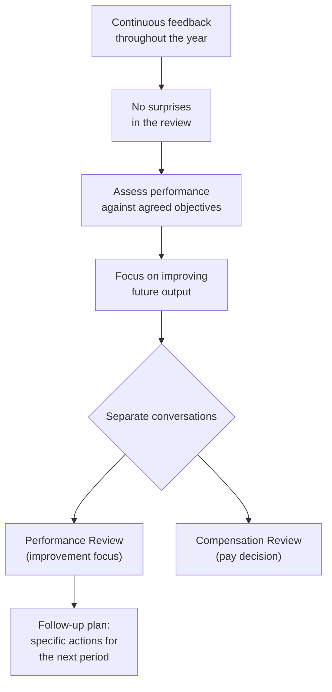

## The Breakfast Factory

Grove opens with a deceptively simple scenario: produce a three-minute egg, buttered toast, and a cup of coffee, all ready simultaneously. This breakfast is a production system. The egg is the limiting step — it takes three minutes and defines the timeline. You work backward: start the egg first, then time the toast and coffee to finish together.

The egg is the **limiting step**. Everything orbits it. Grove generalizes this to any process: recruiting college graduates, building a compiler, training a sales force. Every production flow has a bottleneck. Identify it. Design around it.

Three universal production operations:
- **Process manufacturing** — changing material (boiling the egg)
- **Assembly** — combining components (plate + egg + toast + coffee)
- **Testing** — verifying quality (is the egg runny? is the coffee hot?)

Value increases at each step. A boiled egg is worth more than a raw one. A plated breakfast is worth more than its components. Detect defects at the **lowest-value stage** — inspect the water temperature before you drop the egg in.

### Managing the Breakfast Factory

**Indicators** are a manager's gauges. Grove distinguishes two types:
- **Leading indicators** — predict future output. For a sales team: number of quality calls this week, not last quarter's revenue.
- **Lagging indicators** — measure past results. Revenue, shipped units, completed projects.

Grove's rule: live by leading indicators. They are the levers you can pull.

**Controlling future output** works through two modes: build to order (make what's sold) or build to forecast (anticipate demand). Forecasts must be explicit and flexible. **Quality assurance** uses three inspection stages: incoming, in-process, final. Inspect at the lowest value stage to minimize cost of rework.

**Productivity** = output / labor. To improve it: automate repetitive steps, simplify the work process, or change the nature of the work itself. Grove claims work simplification alone yields 30-50% improvement on first pass.

---

## Managerial Leverage

This is the book's conceptual spine. Grove defines:

> A manager's output = The output of their organization + The output of neighboring organizations under their influence.

A manager is not paid for individual work. They are paid for the multiplication effect they have on everyone around them.

**High-leverage activities:**
- Training — affects every trainee for their whole career
- Setting direction and communicating strategy — affects every decision the team makes
- Performance reviews — affect the recipient's trajectory for years
- Hiring — every person you add reshapes team capability
- One-on-ones — the recurring highest-leverage tool

**Low-leverage activities:**
- Doing work a subordinate could do
- Attending meetings with no decision role and no learning
- Producing outputs that affect no one's decisions

**Negative leverage:**
- Arriving unprepared to a meeting wastes everyone's time
- Waffling on a decision freezes the entire team
- Displays of depression or indecision radiate downward

Delegation without follow-through is abdication. You remain responsible. Monitor at the lowest-value stage — review outlines before full drafts, not finished documents.

**Span of control**: 6-8 direct reports is ideal. Fewer than 4 is too few (micro-management risk). More than 10 is too many (insufficient attention per person).

---

## Meetings — The Medium of Managerial Work

Grove's most contrarian argument: meetings are not interruptions. They are the medium through which managerial work is performed. Information gathering, information giving, decision making, nudging, and role modeling all happen in face-to-face encounters.

**Process-oriented meetings** are the heartbeat of an organization. The most important is the **one-on-one**: 30-60 minutes weekly, owned by the subordinate, focused on problems the report brings. The manager listens, asks questions, transfers context, and helps unblock.

**Staff meetings** coordinate peers working toward shared goals. **Operation reviews** bridge org levels — a senior manager reviews a subordinate team's work, with other peers attending to learn.

**Mission-oriented meetings** are called to produce a specific output: a decision, a plan, a resolution. The chairman does most of the work *before* the meeting: sets the agenda, invites the right people, defines the decision criteria. Each additional attendee dilutes discussion quality and increases coordination cost. Minutes must record what was decided and what follow-up is expected.

---

## Decisions, Decisions

Grove's decision-making framework has four stages:
1. **Free discussion** — surface all opinions vigorously. The most junior person should feel safe contradicting the CEO.
2. **Clear decision** — someone makes the call. Ambiguity is worse than a wrong decision because it paralyzes action.
3. **Full support** — once the decision is made, everyone commits to it. Even those who argued the other side.
4. **Close the loop** — communicate the decision and its rationale to everyone affected.

The decision-maker should be the **lowest competent level** — the person closest to the work who has enough knowledge to decide. This pushes ownership down and speeds up the organization.

---

## Planning: Today's Actions for Tomorrow's Output

Planning is not a separate function. It is a core managerial activity with enormous leverage.

Grove's three-step planning process:
1. **Establish demand** — what will your environment require?
2. **Establish present status** — where will you be if you do nothing different?
3. **Reconcile** — what must you do now to close the gap?

The output of planning is not a document — it is a set of decisions about what to do now. Grove was an early influence on John Doerr's OKR system. The core MBO question: "Where do I want to go? How will I know I'm getting there?"

---

## Task-Relevant Maturity

Grove's most cited leadership model. The right management style depends on the employee's experience with a *specific task*, not their overall seniority.

```mermaid
flowchart LR
    subgraph LowTRM["Low Task-Relevant Maturity\n(New to the task)"]
        S1["Management Style:\nHighly Directive"]
        S1A["Tell them what, when,\nand how"]
        S1B["Frequent check-ins"]
        S1C["Structured instructions"]
    end

    subgraph MedTRM["Medium Task-Relevant Maturity\n(Some experience)"]
        S2["Management Style:\nCoaching & Support"]
        S2A["Ask questions,\ngive guidance"]
        S2B["Collaborative problem\nsolving"]
        S2C["Two-way communication"]
    end

    subgraph HighTRM["High Task-Relevant Maturity\n(Expert)"]
        S3["Management Style:\nDelegative"]
        S3A["Agree on objectives"]
        S3B["Provide context"]
        S3C["Get out of the way"]
    end

    LowTRM --> MedTRM --> HighTRM
```

This is not micromanagement vs. hands-off — it is **calibration**. A star engineer learning a new domain needs structure. A junior person who has mastered a specific process deserves autonomy within it. The manager's job is to assess TRM for each person on each task and adjust accordingly.

---

## Performance Reviews

Grove treats performance reviews as one of the highest-leverage activities a manager does. A well-done review affects the recipient's performance for years.

**Rules:**
- No surprises — feedback is continuous, the review is a summary
- Be direct and honest — anything less is a disservice
- Separate performance from compensation — have two conversations on different days
- Assess what was actually accomplished, not effort or intent
- End with a clear plan for improvement

---

## The Three Levers of Production

Grove identifies three variables a manager can adjust to meet demand:
1. **Capacity** — people, equipment, space
2. **Manpower** — staffing levels, skill mix
3. **Inventory** — work-in-process, finished goods (or their knowledge-work equivalent: pipeline, backlog)

The art is balancing these against each other. Increasing capacity costs money. Increasing inventory ties up capital. Increasing manpower may reduce quality. The trade-offs are inescapable — make them deliberately.

---

## Key Lessons

1. **Managerial output = team output.** Stop counting your own tasks. Count what your team produces.
2. **Identify the limiting step** — in any process, one step constrains everything else. Fix that first.
3. **Use leading indicators** — they are predictive. Lagging indicators only tell you what already happened.
4. **Your calendar is a production planning tool** — schedule proactively, batch similar tasks, build slack.
5. **The one-on-one is the subordinate's meeting** — if you're driving the agenda, you're doing it wrong.
6. **Meetings produce output** — if no decision or action comes out, it was not a meeting.
7. **Push decisions to the lowest competent level** — speed and ownership improve together.
8. **Adapt your style to task-relevant maturity** — no single approach works for everyone on everything.
9. **Performance reviews improve performance** — be honest, be specific, separate from pay.
10. **Train your team yourself** — no one else knows the context. It is the highest-leverage investment you can make.

---

## Action Plan

| Week | Action | Time |
|---|---|---|
| 1 | Conduct one-on-ones as subordinate-owned meetings | 1 hr/week per report |
| 2 | Audit your calendar: classify activities by leverage | 1 hr |
| 3 | Identify the limiting step in your team's primary process | 30 min |
| 4 | Define 3-5 leading indicators for your team | 45 min |
| 5 | Assess task-relevant maturity for each direct report on each major task | 1 hr |
| 6 | Redesign your next staff meeting for output, not status updates | 30 min |
| 7 | Push one decision to the lowest competent person | 15 min |
| 8 | Prepare performance reviews as improvement tools | 2 hr each |
