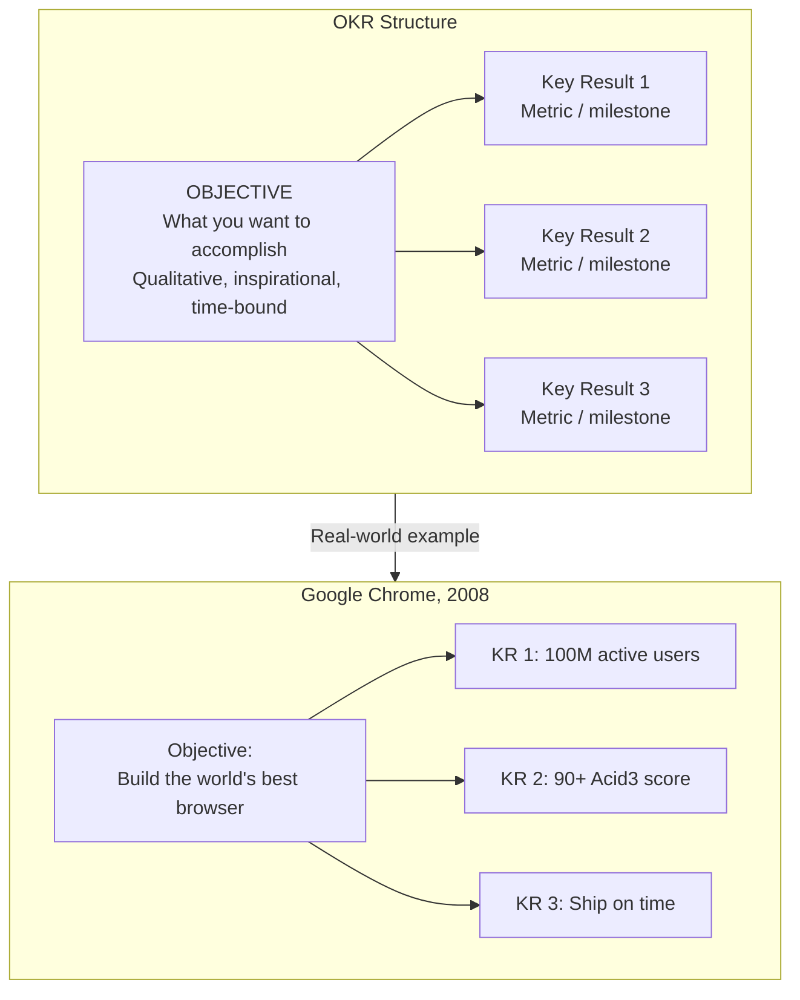
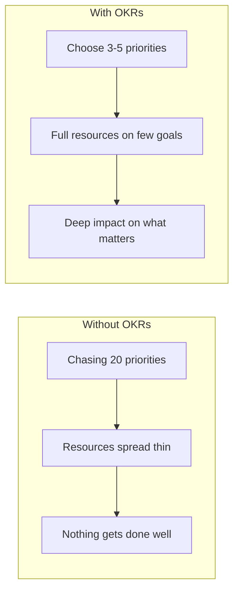
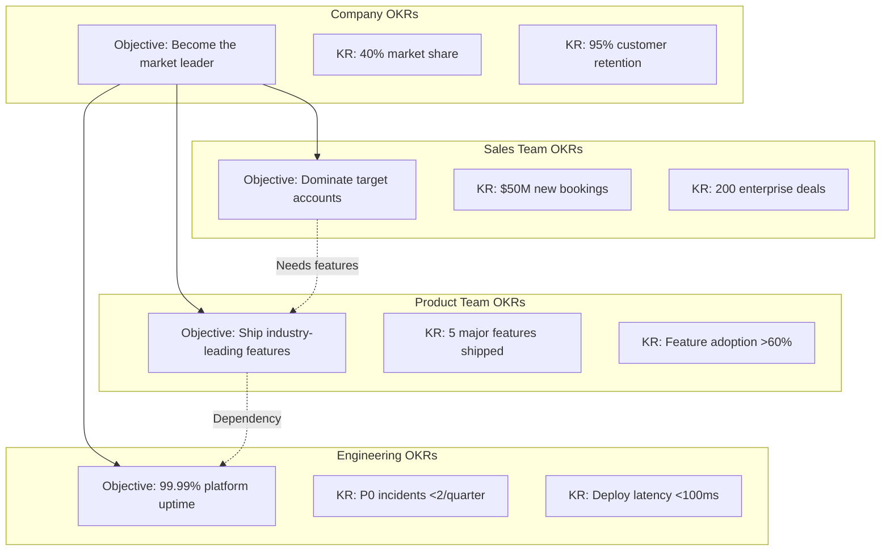
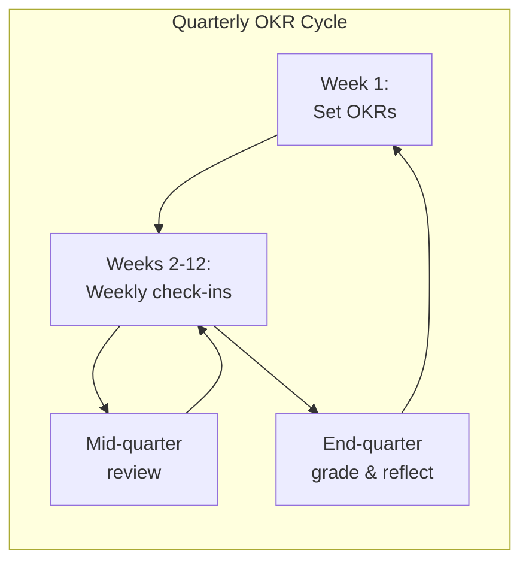
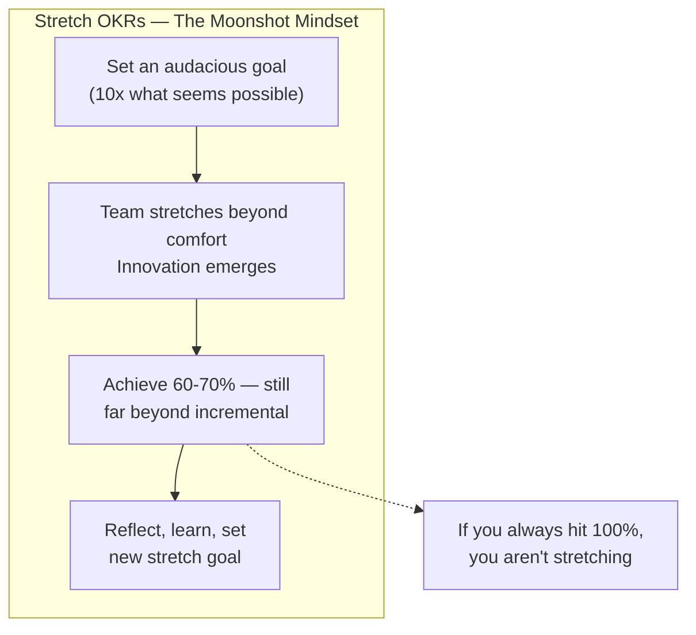
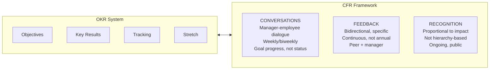
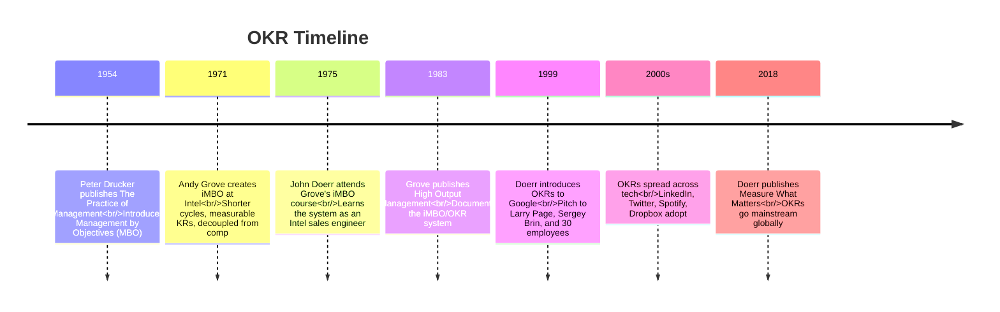

## The Anatomy of an OKR

An OKR is a goal-setting pair. Every quarter (or year), an organization,
team, or individual defines 3-5 Objectives, each with 3-5 measurable
Key Results.

### Objective

The **what**. A qualitative statement of intent. Good objectives are:

- **Significant** — they matter to the organization's mission
- **Concrete** — specific enough to guide decisions
- **Action-oriented** — inspire action, not passive observation
- **Inspirational** — people should feel energized reading them

### Key Results

The **how**. Quantitative benchmarks that measure progress toward the
objective. Good key results are:

- **Measurable** — unambiguous. A KR either hits or it doesn't
- **Time-bound** — clear end date (typically quarterly)
- **Aggressive** — pushes the team beyond comfort
- **Verifiable** — "Launch feature X" is a task; "Feature X has 100K users"
  is a KR

---

## The Four OKR Superpowers

Doerr organizes the OKR system around four superpowers. Each addresses a
fundamental organizational failure.

### Superpower 1: Focus and Commit

Most organizations fail because they try to do too many things. OKRs force
prioritization through constraint: no more than 3-5 objectives per quarter.

Grove's rule: "If we prioritize everything equally, we prioritize nothing."
The objective must be the *most important* thing — not the *only* thing,
but the thing that, if achieved, makes everything else easier or irrelevant.

**Committed vs. Aspirational OKRs:**

| Type | Definition | Expected Score | Example |
|---|---|---|---|
| **Committed** | Must achieve 100%. Resources allocated. | 1.0 | "Ship v3.0 by June 30" |
| **Aspirational** | Stretch goal ("moonshot"). May not fully achieve. | 0.6-0.7 | "Double revenue" |

Aspirational OKRs are the source of innovation. If a team consistently
scores 1.0, they are not stretching enough.

---

### Superpower 2: Align and Connect

Transparent OKRs create organizational alignment. When everyone can see
everyone's goals — from CEO to intern — silos dissolve.

**Cascading principles:**

- OKRs flow from company → team → individual
- **Bottom-up ownership**: ~60% of OKRs should originate from teams, not
  top-down mandate. People commit to goals they helped shape.
- **Horizontal alignment**: teams link OKRs cross-functionally to surface
  dependencies and prevent duplicated effort
- **All public by default**: transparency creates accountability and
  serendipitous collaboration

Doerr's "Google's Playbook" (the book's appendix) specifies: each OKR
should have a single owner. Shared ownership = no ownership.

---

### Superpower 3: Track for Accountability

OKRs are worthless without regular check-ins. Doerr recommends:

- **Weekly check-ins** — 15-30 minutes. Review progress against KRs.
  Identify blockers. Adjust tactics.
- **Mid-quarter review** — formal progress assessment. Are KRs on track?
  Should the objective change?
- **End-quarter grading** — score each KR on 0.0-1.0 scale. Publicly.

**Grading scale:**

| Score | Meaning | Signal |
|---|---|---|
| 0.0-0.3 | Missed | Wrong objective? Wrong KRs? Poor execution? |
| 0.4-0.6 | Significant progress | On track; may or may not fully hit |
| 0.7-0.9 | Near complete | Close to fully achieving |
| 1.0 | Fully achieved | Aspirational: stretch more next time |

**Sweet spot for aspirational OKRs: 0.6-0.7.** Consistently scoring 1.0
means the team isn't stretching. Consistently scoring 0.3 means the KRs
were poorly set or the objective was wrong.

**The "Traffic Light" system for check-ins:**
- **Red**: Off track. Blocker identified.
- **Yellow**: Progress but at risk. Needs attention.
- **Green**: On track.

---

### Superpower 4: Stretch for Amazing

The most counterintuitive superpower: set goals that seem impossible.

Doerr uses Kennedy's 1961 moon landing as the archetypal stretch goal:
"Land a man on the moon and return him safely to Earth" — achieved eight
years later, against all odds.

**The critical distinction:** aspirational OKRs are not committed OKRs.
A team should never be penalized for missing an aspirational goal. The
purpose is to unlock creativity and ambition. If Google had set an
incremental goal, they would never have built Chrome, Android, or
self-driving cars.

---

## CFRs: Conversations, Feedback, Recognition

OKRs provide the structural framework. CFRs provide the human operating
system. Doerr argues that OKRs alone create a mechanical, quarterly
ritual. CFRs bring them to life.

### Conversations

The manager's primary job is not to evaluate — it is to enable. Weekly or
biweekly one-on-ones focused on: where are you against your OKRs? What
blockers can I remove? What adjustments should we make?

Doerr distinguishes these from status updates. Status says "what happened."
A conversation asks "what should happen next — and what do you need from
me to make it happen?"

### Feedback

Continuous, specific, bidirectional feedback replaces the annual
performance review. Doerr advocates for:

- **Real-time** — given close to the event, not stored up
- **Specific** — anchored to a behavior, not a personality trait
- **Bidirectional** — managers receive feedback from reports, not just
  give it
- **Actionable** — the recipient can actually do something with it

### Recognition

Peer-to-peer recognition, proportional to impact. Doerr recommends
systems (shout-outs, kudos, spot bonuses) that let anyone recognize
anyone, regardless of hierarchy. The key: recognition should be
**frequent** and **public**, while feedback can be private.

---

## The Andy Grove Origin Story

The book's deepest debt is to Andrew Grove, Intel's legendary CEO. Doerr
first encountered OKRs (then called iMBOs — Intel Management by
Objectives) in 1975, as a young sales engineer at Intel.

Grove adapted Drucker's MBO by making three critical innovations:

1. **Quarterly cycles** instead of annual — faster feedback, more
   adaptive
2. **Measurable key results** — not just objectives, but objective
   metrics to track them
3. **Decoupled from compensation** — goals were for direction and
   motivation, not bonus calculations

Doerr describes Grove as "the greatest manager of his or any era" and
dedicates the book to him.

---

## Google's OKR Playbook

The book's appendix contains "Google's Playbook" — the closest thing to
an implementation manual in the book.

### Rules of the Road

- OKRs are not a to-do list — they should be measurable outcomes
- Limit to 3-5 objectives per quarter
- Each objective needs 3-5 key results
- Each key result is graded 0.0-1.0
- OKRs are public to the entire organization
- The "sweet spot" grade is 0.6-0.7
- Low grades are data, not failure
- OKRs are not synonymous with performance evaluation
- Bottom-up and top-down OKRs coexist

### Common Mistakes

| Mistake | Why It Fails |
|---|---|
| Too many OKRs | Dilutes focus. Maximum 5 objectives per quarter. |
| KRs are tasks, not outcomes | "Launch feature X" is a task. "100K users on feature X" is an outcome. |
| OKRs tied to compensation | Encourages sandbagging. People set easy goals. |
| No weekly check-ins | OKRs become "set and forget." Weekly rhythm is essential. |
| OKRs are secret | Transparency creates alignment. Hidden OKRs = hidden priorities. |
| Setting only committed OKRs | No stretch = no innovation. Every quarter needs at least one aspirational OKR. |
| Not grading publicly | Public grading creates accountability and learning. Private grades hide failure. |

---

## Key Lessons

- **Ideas are easy; execution is everything.** OKRs are an execution
  discipline, not a planning exercise.
- **Fewer priorities = more impact.** Choosing what not to do is more
  important than choosing what to do.
- **Transparency builds trust.** Open goals eliminate politics and
  duplicate work.
- **Stretch goals unlock 10x thinking.** Incremental goals produce
  incremental results. Moonshots produce breakthroughs.
- **CFRs make OKRs human.** Without continuous conversation, feedback,
  and recognition, OKRs become a bureaucratic checkbox.
- **Grades are information, not judgment.** A 0.4 tells you to adjust;
  it does not tell you to punish.
- **Bottom-up ownership drives engagement.** People commit to what they
  helped create.
- **Andy Grove invented OKRs. John Doerr spread them.** The book is a
  testament to the power of giving credit and propagating an idea.

---

## Practical Applications

### For Startups
- Use OKRs from day one — they scale with you. The investment at 10 people
  prevents chaos at 100 people.
- Keep it simple: one company objective per quarter. Three KRs. No more.
- Make aspirational OKRs a habit before they feel comfortable.

### For Mid-Size Companies
- Cascade from company → department → team. Not every individual needs
  OKRs; every team does.
- Invest in CFR training for managers. The system breaks without good
  feedback culture.
- Publicly grade company OKRs at all-hands meetings.

### For Large Enterprises
- Use OKRs to break down silos — cross-functional OKRs force teams to
  collaborate on shared outcomes.
- Separate innovation OKRs (aspirational) from business-as-usual OKRs
  (committed).
- Expect 3-4 quarters of learning before the system clicks.

### For Nonprofits and Public Sector
- OKRs work because they measure impact, not profit. Gates Foundation
  uses them to track malaria reduction, vaccine delivery, HIV prevention.
- The Bono/ONE Campaign case study shows how advocacy goals (policy
  changes, funding commitments) can be KRed.

---

## Action Plan

1. **Read the book** — focus on Parts I (OKR superpowers) and III (CFRs)
2. **Define one company OKR** — one objective, three KRs. Make it
   aspirational.
3. **Share it publicly** — email it to the whole company. Open a
   doc. No secrets.
4. **Set a weekly check-in** — 15 minutes on Monday morning. Grade
   your KRs.
5. **Train managers on CFRs** — conversations, feedback, recognition.
   Start with conversations.
6. **Grade publicly at quarter end** — share scores. Celebrate 0.6s.
   Learn from 0.3s.
7. **Cascade in quarter 2** — ask each team to set OKRs that connect
   to the company objective.
8. **Add one aspirational OKR per team** — no incremental goals in
   the stretch slot.
9. **Decouple from compensation** — explicitly tell everyone: OKR
   scores do not determine bonuses or raises.
10. **Reflect and iterate** — after four quarters, audit your OKR
    process. What worked? What became bureaucratic? Adjust.
