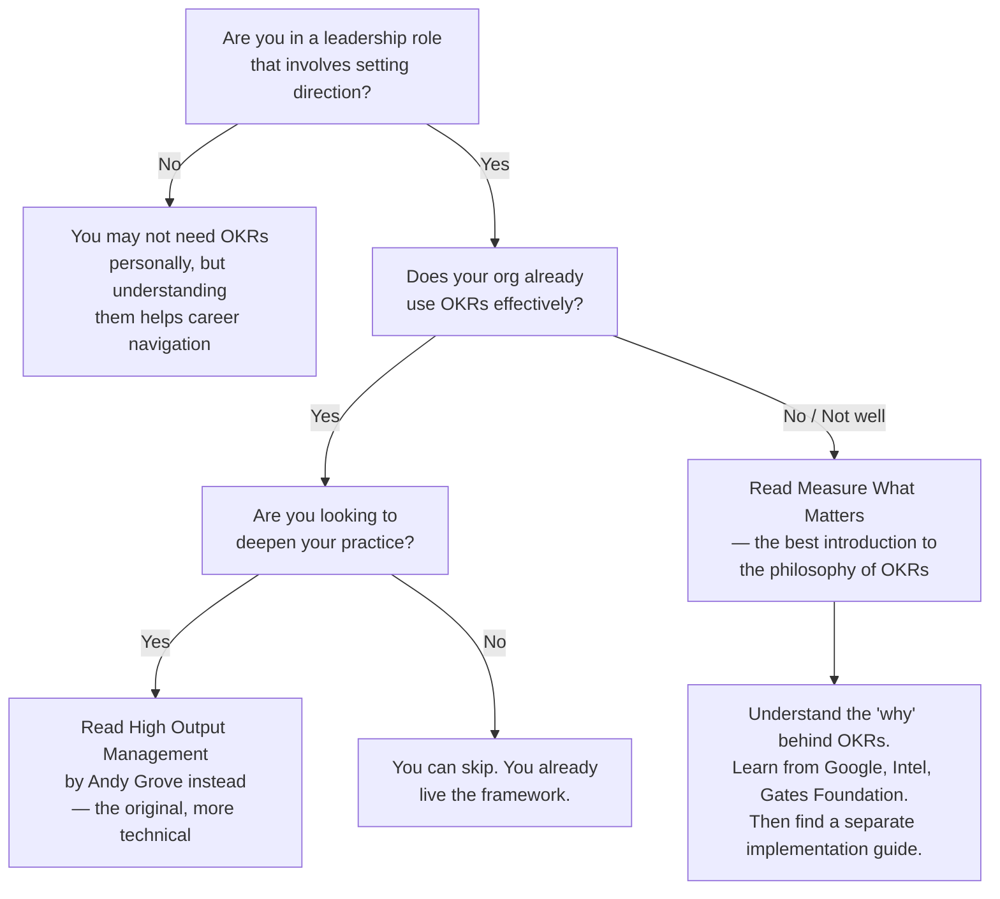

## Introduction

Welcome to BookAtlas. Today: *Measure What Matters: How Google, Bono, and
the Gates Foundation Rock the World with OKRs* by John Doerr. Published
2018, Portfolio (Penguin Random House). 320 pages. #1 New York Times
bestseller. The book that taught the world what an OKR is.

John Doerr is not your average business author. He is the chairman of
Kleiner Perkins, one of Silicon Valley's most storied venture capital
firms. He was the first institutional investor in Google — that $12.5
million check in 1999. He was also an early investor in Amazon, Netscape,
and Symantec. Before venture capital, he was an engineer at Intel,
reporting to Andy Grove.

This is a book about a goal-setting system. But it is also a book about
execution — about how good ideas die without the discipline to make them
real.

Let's get into it.

---

## The Setup: What Is an OKR?

OKR stands for **Objectives and Key Results**. It is a paired goal-setting
framework: an Objective is the qualitative *what* — where you want to go.
Key Results are the quantitative *how* — the measurable milestones that
tell you you're getting there.

**Believer:** The genius is in the pairing. A goal without a metric is a
wish. A metric without a goal is a number. Together, they become a
direction and a dashboard. Doerr gives us the Google Chrome example from
2008: Objective: "Build the world's best browser." Key Results: 100
million active users, 90+ on the Acid3 standards test, ship on time.
Three metrics. One objective. Every Chrome engineer knew what success
looked like.

**Skeptic:** That example works because it's Google, in 2008, with
Sundar Pichai leading. Does it work for your average B2B SaaS startup
with 15 people and no product-market fit? The book never really answers
that. All the case studies are from organizations that were already
successful when they adopted OKRs.

**Believer:** But that's why the case studies work — they prove the
system at scale. The Gates Foundation used OKRs to track polio
eradication. The U.S. government used them to coordinate the Ebola
response. If OKRs work for the Gates Foundation and the federal
government, they can work for a 15-person startup.

**Skeptic:** Or those organizations would have succeeded anyway, and
OKRs were just their way of writing down what they were already doing.

---

## Andy Grove: The Forgotten Genius

The most important person in this book is not John Doerr. It is Andy
Grove — Intel's legendary CEO, Holocaust survivor, Time's Man of the
Year, and the creator of OKRs.

**Believer:** Doerr is extremely generous with credit. He tells the
story of joining Intel in 1974, a 23-year-old engineer from Missouri,
and attending Grove's internal management course. Grove had taken Peter
Drucker's Management by Objectives and transformed it: shorter cycles
(quarterly instead of annual), measurable key results, and — this is
critical — completely decoupled from compensation. Grove called them
iMBOs — Intel Management by Objectives.

**Skeptic:** Eventually we'll have to admit that OKRs are just
Drucker's MBO with better marketing. Drucker said in 1954: "Objectives
are needed in every area where performance and results directly affect
the survival and prosperity of the business." The core idea is 70 years
old.

**Believer:** But Grove made three specific changes that matter. Annual
MBOs are too slow for a company like Intel that ships new chips every
quarter. And MBOs didn't have measurable key results — you could say
"improve quality" without specifying what that meant. Most importantly,
tieing MBOs to compensation created sandbagging: managers set easy
goals to guarantee their bonuses. Grove broke that link. Those three
changes — quarterly cycles, measurable KRs, decoupled from comp — turn
a bureaucratic ritual into an operating system.

```mermaid
flowchart LR
  subgraph Drucker["Drucker MBO (1954)"]
    D1["Annual cycle"]
    D2["No measurable KRs"]
    D3["Tied to compensation"]
    D4["Top-down only"]
  end

  subgraph Grove["Grove iMBO / OKR (1971)"]
    G1["Quarterly cycle"]
    G2["3-5 measurable KRs per objective"]
    G3["Separated from compensation"]
    G4["Bottom-up + top-down"]
  end

  subgraph Doerr["Doerr OKR + CFR (2018)"]
    R1["Same as Grove +"]
    R2["CFRs: Conversations<br/>Feedback, Recognition"]
    R3["Google's Playbook<br/>(rules, mistakes, examples)"]
  end

  Drucker -->|"Adapted by"| Grove -->|"Spread by"| Doerr
```

---

## The Four Superpowers: A Critical Look

Let's walk through each superpower and ask: is this genuinely useful, or
is it repackaged common sense?

### Superpower 1: Focus and Commit

**Believer:** This is the most valuable discipline. Most organizations try
to do 20 things and accomplish none. OKRs say: pick 3-5. If you can't
say no to a good idea, you don't have a strategy — you have a wishlist.

**Skeptic:** Grove's line — "If we prioritize everything equally, we
prioritize nothing" — is one of the best quotes in the book. But it's
also a platitude. Every leader knows they should focus. The hard part
is *how* — how do you decide which 3-5 objectives? The book doesn't
give you a framework for that decision. It just tells you to make it.

### Superpower 2: Align and Connect

**Believer:** Transparency is the killer feature. At Google, every
employee can see every other employee's OKRs. That's radical. It means
you can't hide your priorities. It means junior engineers can see what
the CEO is working on and connect their work to the mission.

**Skeptic:** Radical transparency sounds great in a Flat White at a
Palo Alto coffee shop. Try it at a company where people fear for their
jobs, or in a culture where saving face matters. The book treats
transparency as a universal good, but it's a Silicon Valley value, not
a universal one.

### Superpower 3: Track for Accountability

**Believer:** Weekly check-ins are the discipline that makes OKRs real.
Without them, OKRs are a quarterly paperwork exercise. With them, they
become a rhythm of reflection and adjustment.

**Skeptic:** This creates a metawork problem. Now you need meetings
*about* your goal-setting system, on top of the work itself. For a
company that already has too many meetings, adding weekly OKR check-ins
is adding process to process.

### Superpower 4: Stretch for Amazing

**Believer:** The moonshot concept — set goals you will probably miss —
is the system's most important idea. It pushes teams to think beyond
incremental improvement. Kennedy didn't say "improve our rocket
capability by 10%." He said "land a man on the moon by the end of the
decade." That's a stretch goal.

**Skeptic:** The stretch goal concept is also the most dangerous. If
you tell a team "we expect 60-70% achievement" but your culture
rewards 100% achievement, you create a perverse incentive: set
impossible goals and then blame the team for missing them. This happens
all the time in real organizations. The book acknowledges the risk but
doesn't tell you how to guard against it.

---

## CFRs: The Unfinished Half of the Book

**Believer:** Doerr's most original contribution is the CFR framework —
Conversations, Feedback, Recognition. He recognized that OKRs alone
create a mechanical process. CFRs add the human element. Weekly
conversations between managers and reports about goal progress.
Continuous, bidirectional feedback. Peer recognition that's proportional
to impact, not hierarchy.

**Skeptic:** CFRs get about 30 pages in a 300-page book. Doerr calls
them equally important but gives them one-tenth the treatment. The
chapter on CFRs reads like a teaser for another book that hasn't been
written yet. It's the weakest part of *Measure What Matters* by a wide
margin.

**Believer:** Maybe — but it opened a door. Before this book, the
annual performance review was the standard. CFRs gave organizations
permission to experiment with continuous feedback systems. The fact
that CFRs are underdeveloped doesn't mean they're wrong. It means the
idea needed development, and the industry has spent the last eight
years developing it.

---

## The Biggest Criticisms: A Fair Hearing

Let's be honest about the book's limitations:

1. **Survivorship bias.** Every case study is from a wildly successful
   organization — Google, Intel, the Gates Foundation. We never see the
   companies that adopted OKRs and went bankrupt anyway. We never see
   the teams where OKRs became a bureaucratic nightmare.

2. **Light on implementation.** The book tells you what OKRs are and
   why they matter. It mostly does not tell you how to write them,
   how to coach teams through the first quarter, or how to handle the
   inevitable resistance. The appendix ("Google's Playbook") is the
   most useful section, and it's 20 pages.

3. **Evangelistic, not critical.** There is no chapter titled "When OKRs
   Don't Work." Doerr is a true believer, and the book reads like a
   sermon. For a balanced view, you need to supplement with critical
   sources.

4. **The CFR section is underdeveloped.** Conversations, Feedback,
   Recognition get the short end of the book. If CFRs are truly the
   cultural complement to OKRs, they deserve as much space as the
   superpowers.

5. **OKRs can become rigid.** In practice, organizations often treat
   quarterly OKRs as fixed contracts. A team that discovers in week 2
   that their KRs are wrong feels locked in. The system works against
   itself.

**Believer:** All fair. But here's the thing: the book's job is not to
be a manual. Its job is to make the case. Doerr wrote a missionary
text, not a technical specification. And it worked — OKR adoption
exploded globally after this book. That wouldn't have happened with a
balanced, hedged, Harvard-Business-Review-style treatment.

---

## The Verdict: Do You Need This Book?

**Believer:** If you are in any kind of leadership role — CEO, GM, head
of product, engineering director — and your organization does not use
OKRs, read this book. You will understand the philosophy, see what it
looks like in practice, and be equipped to make the case to your team.

**Skeptic:** If your organization already uses OKRs effectively, you
don't need this book. The most valuable content — Grove's story, the
Chrome example, the separation of goals from compensation — you already
know. Your time is better spent on *High Output Management* (the
source) or on books about strategy (*Good Strategy Bad Strategy* by
Richard Rumelt) that complement the execution focus of OKRs.

**Believer:** One more thing. This book matters because it normalized
structured goal-setting. Before 2018, most people who heard "OKR"
thought it was some obscure Google thing. After this book, it became a
mainstream business practice. That is a genuine achievement. Ideas are
easy. Execution is everything. And the execution of spreading an idea —
that is what Doerr did best.

---

## Final Thoughts

*Measure What Matters* is a book about a system for setting and achieving
goals. But it is also a book about something deeper: the idea that good
intentions are not enough. That clarity, transparency, and discipline
matter more than inspiration. That you can *design* an organization to
execute effectively, just as you can design a product.

Doerr learned this from Andy Grove. Grove learned it from Peter Drucker.
Drucker learned it from decades of observing what actually works. The
chain of transmission is the book's greatest strength and its greatest
weakness — it is derivative by design, but derivative of excellent
sources.

If you come to this book looking for a complete implementation manual,
you will be disappointed. If you come looking for a compelling argument
that structured goal-setting is the highest-leverage management practice
you can adopt, you will find it. And if you leave convinced, the book
has done its job.

This has been a BookAtlas narration of *Measure What Matters* by John
Doerr. Thanks for listening.
