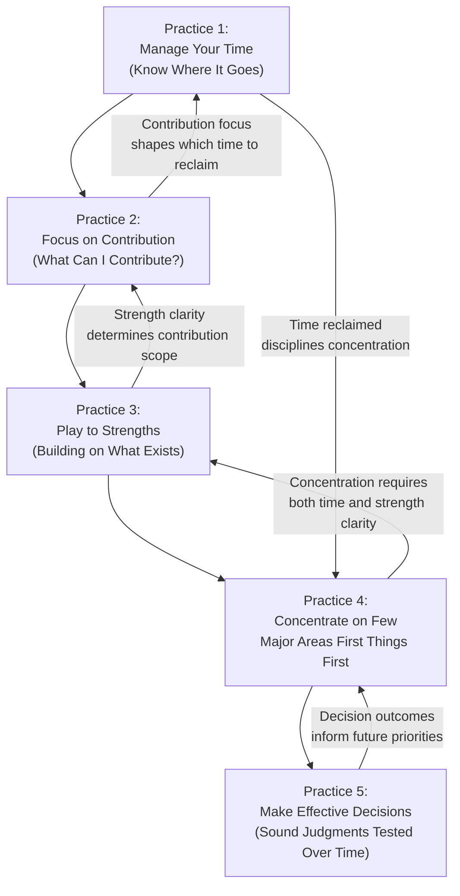
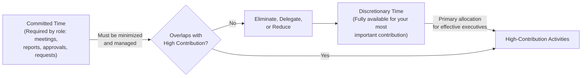
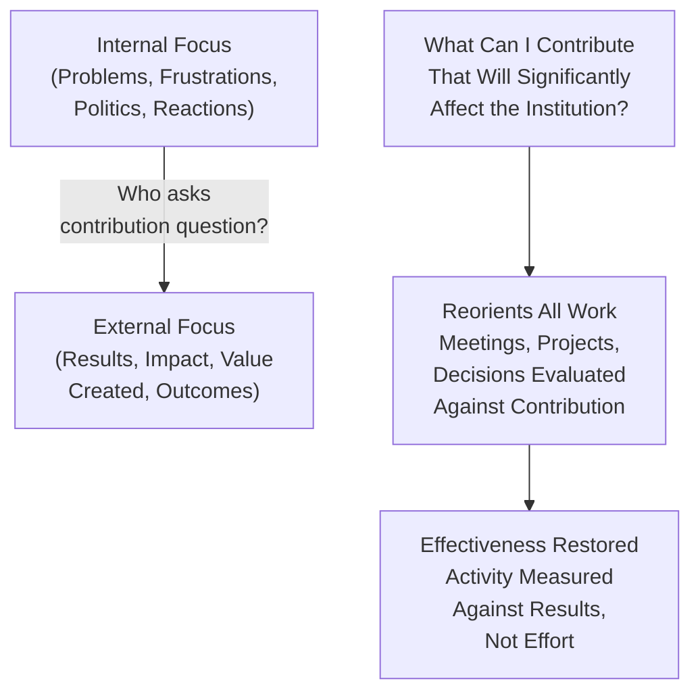
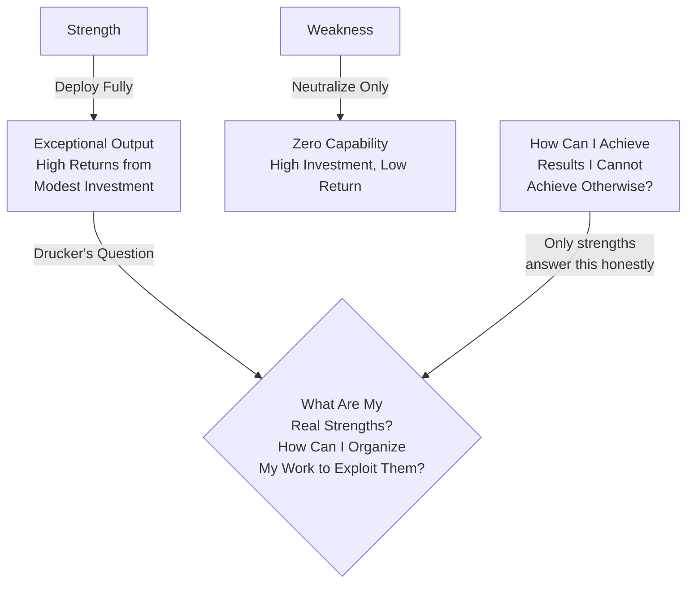
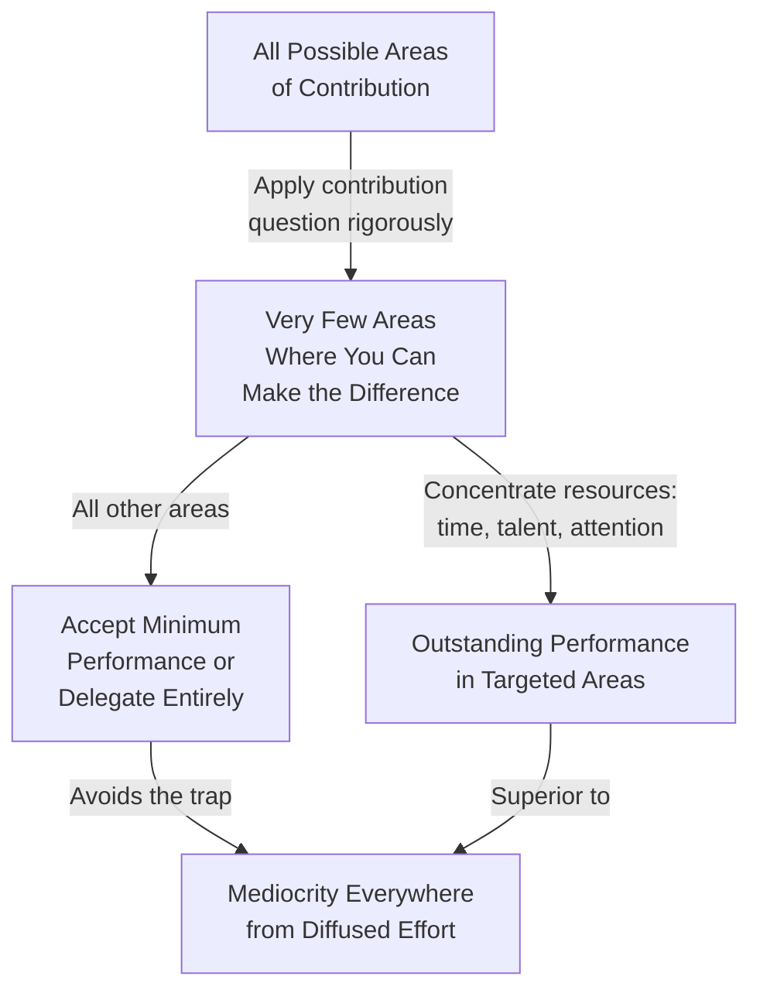
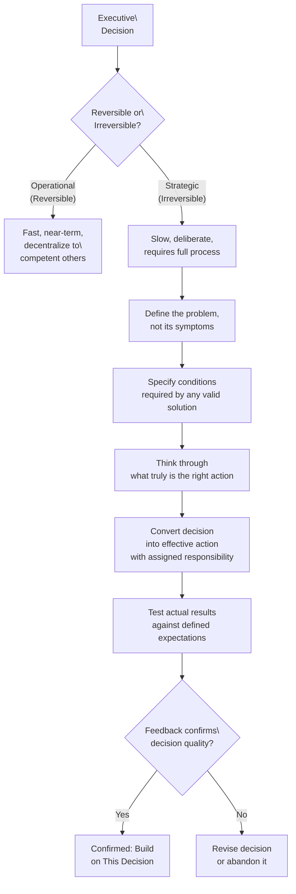

## The Five Practices Framework

Drucker's central contribution is the identification and systematic description of five practices that transform competent managers into effective executives. These are not sequential steps — they are interlocking habits that reinforce one another. An executive who manages time poorly cannot focus on contribution regardless of organizational ability. An executive who cannot concentrate will dissipate the benefits of time management across too many fronts. The practices form a reinforcing system, not a checklist.

All five practices share a common root: **deliberateness over reactivity**. The reactive executive answers whatever the day brings. The effective executive shapes the day to serve a predetermined purpose.

---

## Practice 1 — Manage Your Time

### Time Logging

Drucker's prescription for time management begins with measurement. You cannot manage what you have not measured honestly. The executive must log time for a defined period — Drucker recommends at least several major time units, typically three to four weeks.

| Step | Action | Purpose |
|---|---|---|
| 1 | Record every time expenditure in real time | Create an accurate picture of actual allocation |
| 2 | Categorize activities by contribution value | Distinguish time that produces results from time that does not |
| 3 | Identify and eliminate or delegate low-value time耗费 | Reclaim time for high-contribution activity |
| 4 | Consolidate discretionary time into larger blocks | Fragmented time cannot serve complex or creative work |
| 5 | Re-verify the new allocation periodically | Time creep returns when not monitored |

### The Problem of the Unmanageable Day

Most executives face a day that belongs to other people before it belongs to them. Meetings — organized by others, on topics chosen by others, with time availability determined by others — can consume an entire workday. Drucker's argument is not against meetings. He is against *unnecessary* meetings: those with no purpose definition, no agenda, no decision at the end, no follow-up responsibility assigned.

He distinguishes between two types of time:

### Time Consolidation

Fragmented time — fifteen minutes here, thirty minutes there, interrupted by emails and questions — cannot support cognitively demanding work. Drucker recommends protecting large blocks of uninterrupted time for the activities that genuinely matter. A day with two uninterrupted three-hour blocks produces more than a day of ten fragmented ninety-minute sessions. The executive's responsibility is to protect what Drucker calls "the big chunk" — a substantial period where only the most important work happens.

---

## Practice 2 — Focus on Contribution

### The Contribution Question

This is Drucker's most original and most frequently misunderstood practice. It sounds simple: "What can I contribute?" But Drucker is not asking about effort. He is asking about *effect*.

| Contribution Misunderstanding | Correct Contribution Question |
|---|---|
| "What can I give?" (effort-oriented) | "What results can I produce?" |
| "What am I assigned to do?" | "What will significantly affect the institution?" |
| "How hard will I work?" | "What difference will this make, compared to if I were not here?" |
| "What does my boss want?" | "What does the organization need from this role?" |

### Contribution and Organizational Results

Drucker insists that contribution must be defined in terms of external results, not internal activities. A marketing executive's contribution is not "writing marketing copy" — it is the measurable effect of that copy on the market: acquisition rates, brand position, customer conversion. An HR executive's contribution is not "conducting hiring interviews" — it is the quality of talent in the organization measured three years later.

When contribution is defined internally, it produces busyness measured in completed activities. When it is defined externally, it produces outcomes measured in changed reality. Drucker argues that most organizations fail because they measure the former and need the latter.

### Contribution and Upward Relationships

Drucker gently challenges the assumption that contribution is defined by your boss. He argues that the executive who asks *"what can I contribute?"* instead of *"what does my boss want?"* is not being insubordinate — they are being responsible. A boss who wants you to do work that does not contribute significantly to the institution is asking you to waste institutional resources. The contribution question is, in Drucker's framing, a loyalty to the institution that transcends loyalty to any individual manager's momentary preferences.

---

## Practice 3 — Play to Strengths

### Strengths Are the Key to Exceptional Output

Drucker's argument about strengths is both simple and challenging. A weakness neutralized is still zero. A strength deployed at its full potential is exponential. Organizing work around strengths therefore produces higher returns than any equivalent investment in remediating weaknesses.

### Know Your Strengths Honestly

Drucker recommends a simple feedback mechanism: write down what you believe your strengths to be, then ask people who work with you honestly — not to flatter you — whether they see those same strengths. Do this with several people. Compare the lists. The convergence or divergence is informative regardless of the outcome.

He also recommends an approach to discovering strengths through the lens of a self-written "feedback analysis":

1. For every major decision or action you take, write down what results you expect.
2. Nine to twelve months later, compare actual results to expected results.
3. Identify the patterns: where did your judgment about your own contributions prove accurate? Where did it miss? The pattern reveals your genuine strengths — the things you can predict accurately and execute well — and your genuine gaps.

### Strengths in Others

The strength principle applies to the organization, not just the individual. The executive who builds a team that covers a range of genuine strengths — analytical thinking, communication, operations, relationship management, strategic vision — creates an organization where the whole produces more than the sum of its individual parts. Drucker's advice on staffing: hire for demonstrated strength in the specific domain needed, then organize the role to exploit that strength. Do not hire for absence of weakness.

---

## Practice 4 — Concentrate on the Few Major Areas

### First Things First

The phrase "first things first" is simple. Drucker's application is harder. First things are not the things that arrive first in your inbox. They are not the things your boss raises in the next meeting. First things are the few areas where your contribution can be genuinely decisive — where doing the right thing produces results that doing anything else would not.

### The Courage to Say No

The concentration practice requires saying no to many things that are legitimate, interesting, and well-intentioned. Drucker is direct: the executive who says yes to everything is not a team player. They are an ineffective executive who is mistaking activity for contribution.

Saying no is not ungrateful. It is the discipline that makes excellence possible. Every yes to a secondary commitment is a no to a primary one, whether or not you have articulated the primary commitment explicitly.

| Type of Commitment | Drucker's Prescription |
|---|---|
| Urgent and high value | Accept with clear commitment and timeline |
| Urgent but low value | Delegate; if not delegable, do it and exit quickly |
| Not urgent but high value | Block time and protect it — this is where contribution happens |
| Not urgent and low value | Decline with brief explanation; do not negotiate |

### Yesterday's Decisions vs. Today's Reality

A subtle but important point Drucker makes: yesterday's priority decisions that were correct at the time may no longer be serving the organization effectively. Markets change, opportunities shift, organizational needs evolve. The executive who concentrates on first things does so with a disciplined process of re-evaluation. "This was our priority last year" is not a sufficient argument for continuing to invest in it this year.

---

## Practice 5 — Make Effective Decisions

### Decisions Are the Product of Executive Work

Drucker argues that decisions are the only significant product of the executive. Meetings, reports, conversations, analysis — all of these serve the decision. A decision that is not acted on is not a decision; it is an expression of preference.

The contrast he draws is with operational decisions — the daily, recurring, routine decisions that any competent employee can make. Effective executives distinguish sharply between operational and strategic decisions:

### The Decision Method

Drucker's five-step decision method for strategic decisions:

**Step 1: Define the real problem, not its symptoms.** This step is harder than it appears. Most executives mistake the symptom — declining sales, employee turnover — for the root problem — misfit between product and market, management culture. Drucker insists on asking "why is this happening?" until the root cause is identified.

**Step 2: Specify the boundary conditions.** What conditions must a valid solution satisfy? This step prevents the search from drifting toward solutions that are popular, politically convenient, or familiar but actually fail to meet the real constraints of the problem.

**Step 3: Think through what is truly the right course.** Drucker counsels starting from what is right, not from what is acceptable. Begin with the ideal solution that fully satisfies the boundary conditions and the problem definition. Then ask: what would make this unacceptable to stakeholders? Those are the constraints. Working from the ideal produces better compromises than starting from the least objectionable option.

**Step 4: Convert the decision into action.** A decision not converted into specific accountable action is not a decision. Every action derived from a decision must have: a clear statement of what will be done, who is responsible, by when, with what resources, and what the measurable commitment is.

**Step 5: Get feedback — the test of a decision.** Drucker is unambiguous: a decision not tested against results is not a decision. It is an opinion. Feedback must be organized, regular, and built into the system for following up. Most organizations have excellent front-end decision processes and almost no back-end feedback systems. Drucker uses the phrase "the test of a decision is not its brilliance at the time it is made. It is its congruence with realized results."

### Common Decision Errors

| Error | Description | Drucker's Antidote |
|---|---|---|
| Mistaking symptoms for causes | Treating what is visible as the problem rather than asking why | Define the real problem before seeking solutions |
| Seeking consensus over correctness | Adjusting the decision to satisfy everyone rather than finding the right solution | Start from what is right, then negotiate constraints |
| Deciding under pressure | Forcing a decision before the problem is understood | Accept "not yet decided" as a legitimate state |
| Confusing the urgent with the important | Operational urgency crowding out strategic clarity | Separate operational and strategic discussions explicitly |
| Failing to specify a decision deadline | Indefinite deliberation that exhausts participants | Set a decision deadline and work backward |
| Ignoring feedback | Treating the decision as complete when it is only complete on paper | Build feedback into the decision's action protocol |

---

## The Practices as an Integrated System

The five practices are not independent. Time management creates the capacity for contribution thinking. Contribution thinking determines where time should be allocated. Strength knowledge determines how contribution is best produced. Concentration on first things determines which strengths are deployed and which are set aside. Effective decisions are the actions that move any of these practices forward.

An executive who has mastered one practice but neglects the others is partially effective. Drucker's thesis: full effectiveness requires attention across all five. And the good news — the message that has sustained this book through five decades — is that all five are learnable. They do not require a special personality, organizational authority, or favorable conditions. They require honestly tracking your time, honestly asking what you can contribute, honestly knowing your strengths and weaknesses, honestly concentrating on what matters most, and honestly testing your decisions against reality.

That last item — honest testing — may be the most demanding of all, because it requires admitting when you are wrong. Effectiveness, in Drucker's framing, is not the absence of mistakes. It is the presence of a system that ensures mistakes are identified quickly and corrected before they compound. That is what makes the five practices a discipline rather than a talent.
