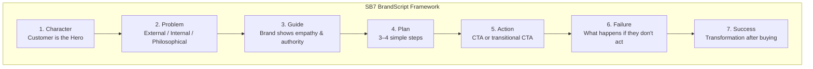

#### Part I · The Problem with Most Marketing (Ch. 1–2)

Miller opens with a counter-intuitive observation: most companies don't fail because their product is bad — they fail because nobody understands what they sell or why it matters. The culprit is self-centered messaging. Companies talk about themselves ("we're the best," "we've been in business 50 years") at precisely the moment the customer is asking, "What's in it for me?"

The author reframes marketing as **clarity work**, not creativity. The goal is not to win awards; it's to help the customer "grunt" your value proposition — i.e., understand it within three seconds of landing on your website.

---

#### Part II · The Character, The Problem, The Guide (Ch. 3–4)

> **"Customers don't buy products. They buy better versions of themselves."**

In a well-told story, the customer is the hero. Miller argues that the single biggest mistake in marketing is making the brand the hero. Aspirational imagery, company heritage, founder stories — none of these resonate unless tied to a transformation the customer desires.

**Three layers of the customer's problem:**

| Layer | Description | Marketing insight |
|-------|-------------|-------------------|
| External | A tangible obstacle | The villain is named |
| Internal | A frustration or fear | Empathy is expressed |
| Philosophical | An injustice or wrong | The brand takes a stand |

---

#### Part III · The SB7 Framework (Ch. 5–12)

The seven-element SB7 BrandScript is the book's central deliverable:

**Element 1 · A Character**
Define the customer as a specific hero with a clear desire. Miller gives the example of a landscaping company whose hero isn't "homeowners" generically, but specifically "busy suburban parents who want their home to look cared-for without becoming experts in lawn care."

**Element 2 · Who Has a Problem**
Name the external enemy (e.g., "unreliable contractors"), validate the internal frustration ("the stress of not knowing if your yard will look good for the barbecue"), and articulate the philosophical stakes ("everyone deserves a yard that feels like a sanctuary, not a chore list").

**Element 3 · And Meets a Guide**
The brand steps in as the wise, empathetic guide. Miller borrows from Joseph Campbell and screenwriting: the guide must demonstrate both **empathy** ("we understand your frustration") and **authority** ("here's why we can fix it"). Testimonials, credentials, years in business, and social proof serve authority.

**Element 4 · Who Gives Them a Plan**
Humans avoid action when they perceive a large, ambiguous risk. A simple 3–4 step plan reduces anxiety:

1. Free consultation — "We come to your property"
2. Custom design — "You approve before we break ground"
3. Seamless install — "We handle everything, you don't lift a finger"

**Element 5 · That Calls Them to Action**
Two types of CTA are distinguished:

- **Direct CTA** — the primary purchasing action ("Request a quote today")
- **Transitional CTA** — a low-commitment step that builds trust ("Download our free lawn seasonal guide before you hire anyone")

Transitional CTAs are especially powerful for expensive or high-risk purchases because they let the hero warm up to the guide before committing.

**Element 6 · That Helps Them Avoid Failure**
The customer must feel what's at stake. Miller warns that brands who skip this step leave money on the table. If your lawn ends up looking worse than when you started:

- You waste money reseeding
- You lose the pride of being the house on the block
- Your neighbors (the ones whose opinion matters to you) notice

This is **loss aversion** in narrative form.

**Element 7 · And Enables Them to Win**
Paint a vivid picture of the post-purchase world. This isn't a feature list — it's the emotional payoff: easy weekend mornings, a yard your guests compliment, the quiet confidence of a home that reflects your values.

---

#### Part IV · Positioning & Implementation (Ch. 9–12)

Miller offers practical systems for putting SB7 into continuous use:

- **Brandscript template** — a fill-in-the-blank worksheet teams complete together
- **One-Liner** — compress your SB7 into a single sentence for verbal networking
- **Positioning** — identify your competitive differentiator and communicate it using the framework
- **Automation** — automate email sequences and landing pages that follow the SB7 story arc
- **The 7-part checklist** — audit every piece of customer-facing copy against the seven elements

The book closes with a call to repeat the BrandScript exercise every quarter, since markets, competitors, and customer psychologies shift over time.
